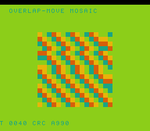

# #93 — SNES Overlap-Move Mosaic: in-place overlapping memmove under +mos-xy16

<p align="center"></p>

**Status:** ✅ **DONE + PUBLISHED** ([/snes/ovmove/](https://biohack.net/snes/ovmove/)), gate CRC `0xA990`,
5-way green + `-verify` clean. Demo **#93** — **Round 6 (harden-the-fixes), Cluster A**, first-picks
intersection. **Result: the #23/`0002` +mos-xy16 in-place-memmove fix HOLDS under escalation (>256-byte
buffer, both overlap directions) — clean positive, no regression.**

## Context

Round 6 re-stresses fixed bugs. This one hits the intersection of two:
- **#23 lsystem / patch `0002` `MOSInsertREPSEP::placeIntraBlock`** — a real **+mos-xy16 silent
  miscompile**: a `sep #$10` placed between an `ldx` (writes 16-bit X) and an `lda abs,X16` (reads it)
  zeroed X's high byte, corrupting an in-place `memmove`/`memcpy` over a 16-bit-indexed buffer. The fix
  reloads the X-writer after the `rep #$10`.
- **#79 mvscrl** — `G_MEMMOVE`'s Descending (dst>src) and Ascending (dst<src) overlap sub-paths
  (`MOSLegalizerInfo.cpp:422` `.custom()`).

**Escalation** past where those demos ran: the buffer is `OV_N = 16×24 = 384` bytes (**> 256**), so every
memmove count (368 / 383 / 382) forces the SDK memmove to index with a **16-bit X** — the exact width-flag
boundary the #23 bug lived at — and **both** overlap directions fire, repeatedly, under **+mos-xy16**. #23
lsystem used one incidental non-overlapping grow; #79 mvscrl used <256-byte bands (8-bit index only). A
dropped index high-byte (the #23 signature) both streaks the mosaic and diverges the byte-CRC.

Silent-miscompile-class fix → highest bug-yield in the round's first-picks after #101.

## Algorithm

`ovmove_gate_crc()` — `GATE_N=16` steps over a 384-byte mosaic. Each step alternates a descending pair
(odd) or ascending pair (even) of overlapping in-place memmoves, then folds all 384 bytes:

```
ov_init: cell[r][c] = (r*3 + c*5) & 3            // 16×24 seed
per step (dir = step parity):
  if dir odd  (DESCENDING, dst>src):
    memmove(&cell[1][0], &cell[0][0], 23*16=368)  // scroll down; inject top row
    memmove(flat+1, flat, 384-1=383)              // scroll right 1B; inject flat[0]
  else        (ASCENDING, dst<src):
    memmove(&cell[0][0], &cell[1][0], 368)        // scroll up; inject bottom row
    memmove(flat, flat+2, 384-2=382)              // scroll left 2B; inject flat[N-1..N-2]
  fold all 384 bytes (rotate-ADD, step-biased — period-4 data cancels under pure XOR)
```

Maps to: SDK `memmove` calls (both overlap directions), 16-bit index addressing (count>256), `rep`/`sep`
under +mos-a16/+mos-xy16.

## Screen layout / display

32×28 tile grid; BG3 2bpp. A 16×16 tile window of the mosaic (top 16 of 24 rows) rendered as solid-colour
tiles via `cell_fill` (reused from mvscrl), updated in 4-row bands. `TextLayer` HUD (T=tick, CRC),
`TitleLayer` intro. Palette: indigo / teal / orange / gold. The four overlapping memmoves shear the window
down-right (descending steps) / up-left (ascending steps). DMA: 256-tile canvas over bands, HUD, CGRAM —
within budget.

## Files

| File | Purpose |
|---|---|
| `examples/65816/ovmove.h` | portable logic: `ovmove_gate_crc()` + `ov_step` (4 overlapping memmoves) |
| `examples/snes/corpus/ovmove_sim.c` | HAL-free corpus slice (5-way) |
| `tools/ovmove-sim.c` | host oracle |
| `examples/snes/ovmove.c` | SNES ROM (mosaic window + HUD + title) |
| `dev/ovmove.sh`, `dev/ovmove.lua` | gate + MAME assert |
| `Taskfile.yml` | `ovmove` / `ovmove-play` |

## Differential gate

- `corpus_result = ovmove_gate_crc()`, `GATE_N=16`. `EXPECT` = **TBD**.
- **5-way bar** (no far pointers): host == default == +mos-a16 == +mos-xy16 on MAME + bsnes-jg, `-verify`
  clean. **The +mos-xy16 leg is load-bearing** — that is where the #23 bug crashed/miscompiled.
- Disasm probes (+mos-a16 corpus object): `memmove ≥ 1`, `rep/sep ≥ 1`, **and the +mos-xy16 corpus object
  compiles clean** (an explicit gate check — #23 was an xy16 defect).

## Compiler-correctness watch

- **+mos-xy16 build crash / miscompile, or differential divergence between xy16 and the rest** →
  a **regression of the #23/`0002` fix** (the REP/SEP index-width placement). Isolate → minimal repro →
  diagnose in `vendor/llvm-mos` (`MOSInsertREPSEP`) → fix → regen patch → queue upstream. **STOP + surface.**
- **Passes but suspicious** (e.g. a stray `sep`/`rep` around the memmove index in the disasm) → document the
  disasm sequence + diagnosis in this plan and continue.

## Publication

`/snes-rom-page` — `--rom build/ovmove.sfc --slug ovmove --site ~/SRC/biohack.net
--title "Overlap-Move Mosaic" --preview build/ovmove-jg.png
--selfcheck "0x<VMA> 2 0x<EXPECT> 500 ovmove overlapping-memmove gate CRC host==bsnes-jg"`, category
`algorithms`.

## Verification steps

1. Host oracle compiles + prints a plausible CRC.
2. ROM builds clean (+mos-a16); checksum OK.
3. Corpus slice host-compiles; runs.
4. `dev/run.sh ovmove` — host + disasm (incl. xy16 compile) + bsnes-jg + MAME all PASS (or a bug surfaces).
5. `dev/run.sh _demo5 ovmove` — full 5-way (default==a16==xy16==host) + `-verify` clean.
6. Title card visible; `build/ovmove-jg.png` shows the mosaic.
7. Plan title card copied to `docs/plans/screenshots/ovmove.png`.
8. `/snes-rom-page` publishes; page serves.
9. `task md` renders this plan cleanly.

## Verification results (2026-07-02) — PASS, clean positive

**`dev/run.sh ovmove`:**
```
==> host oracle: ovmove gate hash = 0xA990
==> built build/ovmove.sfc (+mos-a16); corpus_result @ WRAM 0x67
==> disasm gate (G_MEMMOVE -> memmove call; rep/sep for a16; xy16 compile clean)
    PASS  memmove-refs=4  rep/sep=20  xy16-compile=OK  (both overlap dirs, 16-bit index)
==> bsnes-jg: SMOKE: PASS off=0x67 got=0xA990
==> MAME (Xvfb): SHOT: PASS corpus=0xA990 (frame 500)
RESULT: PASS
```

**`dev/run.sh _demo5 ovmove` (full 5-way + verify):**
```
== -verify-machineinstrs ==   +mos-a16: verify OK   +mos-xy16: verify OK
RESULT: PASS — host==default==a16==xy16==0xA990 on bsnes-jg
```

**PASS.** `memmove-refs=4` = both overlap directions (down/right descending, up/left ascending) call the SDK
memmove over 368/383/382-byte counts (>256 → 16-bit index). The **+mos-xy16 leg is bit-exact** with default
and +mos-a16, and `-verify` clean — the exact mode/path the #23 bug corrupted. Preview (frame 500) shows the
mosaic shearing diagonally under the memmoves, CRC=A990 in the HUD.

## Compiler-correctness diagnosis — NO miscompile, fix holds

**No compiler bug.** The #23/`0002` `MOSInsertREPSEP::placeIntraBlock` fix (reload the 16-bit X-writer after
`rep #$10`) is **confirmed correct under escalation**: a >256-byte in-place overlapping memmove in both
directions, under +mos-xy16, produces a byte-exact result identical to default 8-bit — no dropped index
high byte, no streaking. `-verify` clean in both 16-bit modes. This demo is now a permanent regression guard
for that fix (and for #79's both-direction `G_MEMMOVE`). Fast gate (GATE_N=16) → no display-timing issue;
preview rendered at the standard frame 500.

Published to [/snes/ovmove/](https://biohack.net/snes/ovmove/), selfcheck `0x67 2 0xA990 500`, category
**Algorithms & Data**.
