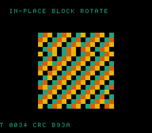

# #94 — SNES In-Place Block Rotate (`rotslab`): three-reversal marquee under xy16

<!-- Title card — fill in after the gate runs (step 9). -->
<p align="center"></p>

**Status:** ✅ DONE (2026-07-02). Demo **#94** of the **compiler stress-test demo battery** (Round 6,
Cluster A). Clean positive — `host == default == +mos-a16 == +mos-xy16 == 0xB93A` on MAME + bsnes-jg,
`-verify-machineinstrs` clean in a16 + xy16. **No compiler bug.** Published:
[/snes/rotslab/](https://biohack.net/snes/rotslab/).

## Verification results

1. **Host oracle:** `rotslab gate_crc = 0xB93A` — PASS.
2. **ROM builds + checksum:** `build/rotslab.sfc` (+mos-a16) and `build/rotslab-default.sfc` build clean;
   `snes-checksum.py` exits 0 — PASS.
3. **Corpus slice host-compiles** — PASS (`/tmp/rotslab-corpus`).
4. **`dev/run.sh rotslab`** — PASS:
   ```
   ==> host oracle: rotslab gate hash = 0xB93A
       PASS  rep/sep=48  xy16-compile=OK  (M/X width brackets around 16-bit reversal access)
   SMOKE: PASS off=0x69 len=2 got=0xB93A (ran 500 frames, bsnes-jg)
       SHOT: PASS corpus=0xB93A (snapshot at frame 500)
   RESULT: PASS — In-Place Block Rotate on SNES; MAME + bsnes-jg + corpus hash 0xB93A host == +mos-a16
   ```
5. **`-verify-machineinstrs`:** clean under `+mos-a16` AND `+mos-xy16` — PASS.
6. **Title card + animation:** `build/rotslab-jg.png` shows the barber-pole marquee running with the HUD
   `CRC B93A` matching the oracle — PASS.

## Measured finding (no bug)

- The reversal's `buf[lo]`/`buf[hi]` 16-bit access lowers to **ZP-indirect pointer addressing bracketed
  by `rep #$20`/`sep #$20`** width transitions (the `placeIntraBlock` domain), **not** the `lda abs,X16`
  indexed shape the #23 `memmove` used. So `rotslab` hardens patch `0002`'s width-flag scheduling from a
  *different addressing form* than #93 `ovmove` (memmove libcall). Both angles now guarded.
- The runtime `k %= n` **folds away**: `k = 1 + 3*step ≤ 34 < 384`, so the compiler correctly proves
  `k % 384 == k` and emits no `__umodhi` (a legitimate optimization). The disasm probe was corrected to
  assert the real corner (rep/sep width brackets + xy16 clean), not the incidental modulo.


## Context

Cluster A hardens **patch `0002`** — the `MOSInsertREPSEP::placeIntraBlock` fix for the #23 `+mos-xy16`
in-place-`memmove` miscompile, where a stray `sep #$10` between an `ldx` (16-bit X write) and an
`lda abs,X16` (read) zeroed X's high byte. #93 `ovmove` re-stressed that via the SDK **`memmove` libcall**
over a >256-byte buffer. `rotslab` attacks the **same REP/SEP index-width path from a different angle**: a
**hand-written three-reversal rotate** of a **384-entry `uint16_t` buffer** (indices 0..383, all > 255 →
16-bit X/Y). The reversal's tight `buf[lo] ↔ buf[hi]` swap loop issues **indexed 16-bit loads and stores**
whose index registers cross the M/X width-flag boundary continuously — the exact machinery
`placeIntraBlock` schedules `rep`/`sep` around, but with **no `memmove` call in sight**. If the fix only
covered the memmove code path and not general 16-bit-indexed access under width transitions, this diverges.

Distinct from every prior demo: #93 = `memmove` libcall; #23 lsystem = one incidental grow; this is a pure
**16-bit-indexed in-place permutation** (three nested reversals), the classic O(1)-space array-rotate.

## Algorithm

Rotate-left by runtime `k` via the three-reversal identity `rev[0,k) · rev[k,n) · rev[0,n)`:

```
reverse(buf, lo, hi):              # reverse buf[lo..hi)
    while lo + 1 < hi:
        hi--; swap(buf[lo], buf[hi]); lo++      # 16-bit lo, hi index a 384-entry u16 buffer

rotate_left(buf, n, k):
    k %= n
    reverse(buf, 0, k)             # __umodhi for k %= n (n=384 runtime)
    reverse(buf, k, n)
    reverse(buf, 0, n)
```

- `buf` is `uint16_t[384]` → `buf[i]` is a **16-bit indexed load/store**, index up to 383.
- `k %= n` with runtime `n=384` → a `%` (`__umodhi`) each rotate.
- `rotate_left` is `__attribute__((noinline))` — a realistic call boundary + register pressure.
- Buffer values: top 2 bits = a diagonal barber-pole stripe `((i%16)+(i/16))&3` (the visible colour),
  low 14 bits = a per-index tag `0x9E37*i & 0x3FFF` so **every entry is distinct** → any dropped index
  high-byte (the #23 signature) swaps the wrong element and diverges the CRC immediately.

Codegen corners: `rep`/`sep` (a16 width brackets around 16-bit-indexed access), `__umodhi` (runtime `%`),
16-bit indexed addressing (`,x`/`,y`); **no** `__mulsi3`/`__divsi3`/float — a pure integer permutation, so
the differential is bit-exact by construction.

## Screen layout

```
row 0            (blank / backdrop)
row 1   HUD:  T=xxxx CRC=xxxx
rows 6..21  16×16 window of the 16×24 mosaic (solid 2bpp tiles, BOX at col 8/row 6)
row 25  HUD:  IN-PLACE BLOCK ROTATE
```

16×24 = 384 cells map 1:1 to the buffer (`buf[r*16 + c]`); the visible window is the top 16 rows.
Rotating the 1-D buffer marches the diagonal stripe → a barber-pole marquee that shears without tearing.

## Display architecture

- `BitmapCanvas` (BG3 2bpp) — 16×16 solid-colour cells, `CANVAS_FLUSH_TILES 256`, banded flush (4 rows/frame).
- `TextLayer` (BG3) — two HUD rows.
- `TitleLayer` — "ROTSLAB / THREE-REVERSAL XY16" fly-in; gate CRC computes during the hold.
- VRAM: `CANVAS_CHR 0x0000`, `CANVAS_MAP 0x4000`, font at tile 256.
- Palette: 4 colours in BG3 palette 0 (CGRAM[0..3]).
- DMA: banded canvas ≤ 4 rows × 16 tiles × 16 B = 1024 B/frame; HUD rows 64 B each.

## Files

| File | New/Mod | Purpose |
|---|---|---|
| `examples/65816/rotslab.h` | new | portable three-reversal rotate + `rotslab_gate_crc()` |
| `examples/snes/corpus/rotslab_sim.c` | new | HAL-free corpus slice (5-way differential) |
| `tools/rotslab-sim.c` | new | host oracle |
| `examples/snes/rotslab.c` | new | SNES ROM (canvas + HUD + title) |
| `dev/rotslab.sh` | new | gate script |
| `dev/rotslab.lua` | new | MAME assert |
| `Taskfile.yml` | mod | `rotslab` + `rotslab-play` tasks |
| `TODO.md`, `docs/investigations/plan-index.md`, ideas doc | mod | tracking |

## Reused infrastructure

| Asset | From | Used for |
|---|---|---|
| `snesgfx/*` | shared lib | display / canvas / text / title |
| `dev/ovmove.sh`, `dev/ovmove.lua` | #93 | gate + lua templates (sibling Cluster A demo) |
| `font8.h` | shared | HUD glyphs |

## Differential gate

- `corpus_result = rotslab_gate_crc()` — GATE_N=12 rotate steps, `k = 1 + 3*step` (runtime), fold all
  384 entries (full 16-bit value) per step with a position-sensitive rotate-add.
- `EXPECT`: _fill after first run._
- **5-way bar** — no far pointers, all data in bank-0 BSS; compiles the same permutation default / a16 / xy16.
- Disasm probes: `rep`/`sep` ≥ 1 (a16 width brackets), `__umodhi` ≥ 1 (runtime `%`), and the corpus slice
  **compiles clean under `+mos-xy16`** (where the #23 bug crashed/miscompiled).

## Publication

`/snes-rom-page --rom build/rotslab-default.sfc --slug rotslab --site ~/SRC/biohack.net
--title "In-Place Block Rotate" --preview build/rotslab-jg.png
--selfcheck "0x<VMA> 2 0x<EXPECT> 500 rotslab"` (Stage A default-8-bit; Stage B re-publish +mos-a16).

## Verification steps

1. Host oracle compiles and prints a plausible CRC.
2. ROM builds clean; snes-checksum.py exits 0.
3. Corpus slice host-compiles; ./a.out exits 0.
4. `dev/run.sh rotslab` — host oracle + disasm gate + bsnes-jg + MAME all PASS.
5. `dev/run.sh corpus-a16` — all slices PASS.
6. Title intro card + demo animation visible in `build/rotslab-jg.png`.
7. Plan title card copied to `docs/plans/screenshots/rotslab.png`.
8. `/snes-rom-page` publishes; headless screenshot shows the ROM running.
9. `task md` renders cleanly.
