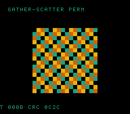

# #95 — SNES Gather-Scatter Permutation (`permscat`): data-dependent 16-bit scatter index under xy16

<p align="center"></p>

**Status:** ✅ DONE (2026-07-02). Demo **#95** of the **compiler stress-test demo battery** (Round 6,
Cluster A). Clean positive — `host == default == +mos-a16 == +mos-xy16 == 0x0C2C` on MAME + bsnes-jg,
`-verify-machineinstrs` clean in a16 + xy16. **No compiler bug.** Published:
[/snes/permscat/](https://biohack.net/snes/permscat/).

## Context

Cluster A hardens **patch `0002`** (`MOSInsertREPSEP::placeIntraBlock`, the #23 `+mos-xy16` index-width
miscompile — a stray `sep #$10` between writing a 16-bit index and reading it zeroed its high byte). This
demo attacks it **at its hardest**: a scatter `dst[perm[i]] = src[i]` over a **576-entry (> 512)** grid
where the inner loop holds **two 16-bit indices live simultaneously** — the loop counter `i` (indexing
`perm[]` and `src[]`) and the **data-dependent scatter index** `pi = perm[i]` (indexing `dst[]`). This is
the exact shape the #23 bug would corrupt (zeroing ONE of the two live indices' high byte).

**Measured — this produces the literal #23 addressing form:** under `+mos-xy16` the scatter emits
**`sta abs,X` with a 16-bit index** (3×) — which **#94 rotslab did NOT** (rotslab's pointer-based reversal
lowered to ZP-indirect access). So the two Cluster-A hand-written demos are complementary: rotslab hardens
the width-flag scheduling around 16-bit *indirect* access; permscat hardens it around 16-bit *indexed*
(`abs,X`) access with a data-dependent index that cannot be strength-reduced to a stride.

## Algorithm

```
perm[i] = (i * 5) % 576        # setup: a bijection (gcd(5,576)=1) — every cell hit exactly once
src[i]  = ((i%24) ^ (i/24)) & 3  # initial pattern

# hot loop — TWO live 16-bit indices: i and pi=perm[i]
scatter(dst, src):
    for i in 0..576:  dst[perm[i]] = src[i]   # load @ index i; store @ data-dependent index pi
```

- `perm[]` is `uint16_t[576]`; `src`/`dst` are `uint8_t[576]` (a small datum stored at a 16-bit index →
  `sta abs,X` under xy16, the #23 shape). Ping-pong `ps_a`/`ps_b`, folding the destination each step.
- `ps_step` is `__attribute__((noinline))` — realistic call boundary + register pressure.
- No runtime divide in the hot loop (the setup `%` builds `perm` once); integer-exact by construction (a
  permutation is a pure data move, bit-identical host vs target).

Codegen corners: `rep`/`sep` (a16 width brackets, 41×), `sta abs,X` 16-bit-indexed store (xy16, 3×),
16-bit indexed load. No `__mulsi3`/float.

## Screen layout

```
row 1   HUD:  T=xxxx CRC=xxxx
rows 6..21  16×16 window of the 24×24 grid (solid 2bpp tiles, BOX at col 8/row 6)
row 25  HUD:  GATHER-SCATTER PERM
```

The 24×24 grid maps 1:1 to a 576-cell buffer; the visible window is the top-left 16×16. Each step
re-permutes → a kaleidoscopic tile-shuffle that must land every cell exactly (a bijection).

## Display architecture

- `BitmapCanvas` (BG3 2bpp), banded flush (4 rows/frame, `CANVAS_FLUSH_TILES 256`).
- `TextLayer` (BG3) 2 HUD rows; `TitleLayer` "PERMSCAT / SCATTER INDEX XY16" fly-in (gate runs during hold).
- VRAM `CANVAS_CHR 0x0000`, `CANVAS_MAP 0x4000`. Palette: 4 colours CGRAM[0..3]. DMA ≤ 1024 B/frame.

## Files

| File | New/Mod | Purpose |
|---|---|---|
| `examples/65816/permscat.h` | new | perm table + scatter + `permscat_gate_crc()` |
| `examples/snes/corpus/permscat_sim.c` | new | HAL-free corpus slice |
| `tools/permscat-sim.c` | new | host oracle |
| `examples/snes/permscat.c` | new | SNES ROM |
| `dev/permscat.sh`, `dev/permscat.lua` | new | gate + MAME assert |
| `Taskfile.yml`, `TODO.md`, plan-index, ideas doc | mod | tracking |

## Differential gate

- `corpus_result = permscat_gate_crc()` — GATE_N=12 scatter steps (ping-pong), fold all 576 dest cells/step.
- `EXPECT = 0x0C2C`.
- **5-way bar** — no far pointers, bank-0 BSS; same permutation default / a16 / xy16.
- Disasm probes: a16 `rep/sep ≥ 1`, xy16 `sta abs,X ≥ 1` (the #23 shape), xy16 compiles clean.

## Verification results

1. **Host oracle:** `permscat gate_crc = 0x0C2C` — PASS. Bijection sanity: 0 cells not hit exactly once.
2. **ROM builds + checksum:** `build/permscat.sfc` (+mos-a16) + `build/permscat-default.sfc` clean — PASS.
3. **Corpus slice host-compiles** — PASS.
4. **`dev/run.sh permscat`** — PASS:
   ```
   ==> host oracle: permscat gate hash = 0x0C2C
       PASS  a16-rep/sep=41  xy16-compile=OK  xy16-sta-abs,X=3  (data-dependent 16-bit scatter index)
   SMOKE: PASS off=0x67 len=2 got=0x0C2C (ran 500 frames, bsnes-jg)
       SHOT: PASS corpus=0x0C2C (snapshot at frame 500)
   RESULT: PASS — Gather-Scatter Permutation on SNES; MAME + bsnes-jg + corpus hash 0x0C2C host == +mos-a16
   ```
5. **`-verify-machineinstrs`:** clean under `+mos-a16` AND `+mos-xy16` — PASS.
6. **Title card + animation:** `build/permscat-jg.png` shows the shuffle running, HUD `CRC 0C2C` — PASS.

## Publication

`/snes-rom-page --rom build/permscat-default.sfc --slug permscat --site ~/SRC/biohack.net
--title "Gather-Scatter Permutation" --preview build/permscat-jg.png
--selfcheck "0x67 2 0x0C2C 500 permscat"` (Stage A default-8-bit; Stage B re-publish +mos-a16).
