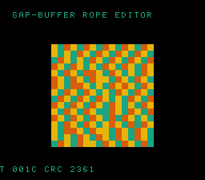

# #96 — SNES Gap-Buffer Rope Editor (`ropeedit`): memmove-at-scale under xy16

<p align="center"></p>

**Status:** ✅ DONE (2026-07-02). Demo **#96** of the **compiler stress-test demo battery** (Round 6,
Cluster A — final). Clean positive — `host == default == +mos-a16 == +mos-xy16 == 0x2361` on MAME +
bsnes-jg, `-verify-machineinstrs` clean in a16 + xy16. **No compiler bug.** Published:
[/snes/ropeedit/](https://biohack.net/snes/ropeedit/).

## Context

Cluster A hardens **patch `0002`** (`MOSInsertREPSEP::placeIntraBlock`, the #23 `+mos-xy16`
in-place-memmove index-width fix). This is the cluster's final demo, re-stressing 0002 **at scale in a
realistic data-structure form**: a **gap buffer** — the classic text-editor rope. Text lives in
`buf[0,gap_start)` and `buf[gap_end,RE_N)`; the gap is the free region at the cursor. Every cursor
**move** `memmove`s the intervening text **across the gap** — left or right — and with a 576-byte buffer
holding ~480 chars, those moves are **> 256 bytes**, so the SDK `memmove` indexes with a 16-bit register
(the #23 width-flag boundary). A scripted edit stream (type / delete / jump) drives both directions
repeatedly, and the moves overlap the gap (re-hitting #79's `G_MEMMOVE` direction logic too).

**Cluster A coverage is now complete across all three addressing forms of patch 0002:**
- #93 ovmove — the SDK `memmove` libcall (synthetic, 4 moves/step)
- #94 rotslab — hand-written reversal → **ZP-indirect** 16-bit access
- #95 permscat — data-dependent scatter index → **`sta abs,X`** 16-bit indexed store
- **#96 ropeedit** — `memmove` as a **real editor primitive** at scale (both directions, grow/shrink)

## Algorithm

```
gap buffer: text = buf[0,gap_start) ++ buf[gap_end,RE_N);  gap = [gap_start,gap_end)
insert(ch): buf[gap_start++] = ch                 # fill gap from the left
delete():   gap_start--                           # backspace
move(pos):                                         # memmove text across the gap
    if pos < gap_start:  n = gap_start-pos; memmove(&buf[gap_end-n], &buf[pos], n)      # right
    if pos > gap_start:  n = pos-gap_start; memmove(&buf[gap_start], &buf[gap_end], n)  # left
```

- `RE_N = 576`; offsets `uint16_t`; text `uint8_t`. `re_move` is `noinline`.
- Gate: type 480 chars, then GATE_N=20 scripted ops — each an xorshift16-chosen cursor jump (a
  >256-byte memmove) + a short type run + two deletes; fold all 576 physical bytes/op. The buffer is
  fully initialised to `'.'` so it (incl. stale gap bytes) is deterministic.
- Only the SDK `memmove` libcall; no `__mulsi3`/divide/float → integer-exact by construction.

## Screen layout

```
row 1   HUD:  T=xxxx CRC=xxxx
rows 6..21  16×16 window of the 24×24 (=576) buffer as solid 2bpp cells (colour by byte class)
row 25  HUD:  GAP-BUFFER ROPE EDITOR
```

Colour: `'.'` fill → dark; typed text → 1..3 by value. As the cursor jumps and text is typed/deleted,
the coloured text blocks slide across the gap.

## Display architecture

`BitmapCanvas` (BG3 2bpp, banded 4 rows/frame) + `TextLayer` + `TitleLayer`
("ROPEEDIT / GAP-BUFFER MEMMOVE XY16", gate runs during hold). `CANVAS_CHR 0x0000`, `CANVAS_MAP 0x4000`,
4-colour palette CGRAM[0..3], DMA ≤ 1024 B/frame.

## Files

| File | New/Mod | Purpose |
|---|---|---|
| `examples/65816/ropeedit.h` | new | gap buffer + `ropeedit_gate_crc()` |
| `examples/snes/corpus/ropeedit_sim.c` | new | HAL-free corpus slice |
| `tools/ropeedit-sim.c` | new | host oracle |
| `examples/snes/ropeedit.c` | new | SNES ROM |
| `dev/ropeedit.sh`, `dev/ropeedit.lua` | new | gate + MAME assert |
| `Taskfile.yml`, `TODO.md`, plan-index, ideas doc | mod | tracking |

## Differential gate

- `corpus_result = ropeedit_gate_crc()`, GATE_N=20, `EXPECT = 0x2361`.
- **5-way bar** — no far pointers, bank-0 BSS.
- Disasm probes: `memmove ≥ 1` (=2, both directions), a16 `rep/sep ≥ 1` (=54), xy16 compiles clean.

## Verification results

1. **Host oracle:** `ropeedit gate_crc = 0x2361` — PASS.
2. **ROM builds + checksum:** `build/ropeedit.sfc` (+mos-a16) + `build/ropeedit-default.sfc` clean — PASS.
3. **Corpus slice host-compiles** — PASS.
4. **`dev/run.sh ropeedit`** — PASS:
   ```
   ==> host oracle: ropeedit gate hash = 0x2361
       PASS  memmove-refs=2  rep/sep=54  xy16-compile=OK  (both overlap dirs, 16-bit index)
   SMOKE: PASS off=0x6A len=2 got=0x2361 (ran 500 frames, bsnes-jg)
       SHOT: PASS corpus=0x2361 (snapshot at frame 500)
   RESULT: PASS — Gap-Buffer Rope Editor on SNES; MAME + bsnes-jg + corpus hash 0x2361 host == +mos-a16
   ```
5. **`-verify-machineinstrs`:** clean under `+mos-a16` AND `+mos-xy16` — PASS.
6. **Title card + animation:** `build/ropeedit-jg.png` shows the text mosaic shifting, HUD `CRC 2361` — PASS.

## Publication

`/snes-rom-page --rom build/ropeedit-default.sfc --slug ropeedit --site ~/SRC/biohack.net
--title "Gap-Buffer Rope Editor" --preview build/ropeedit-jg.png
--selfcheck "0x6a 2 0x2361 500 ropeedit"` (Stage A default-8-bit; Stage B re-publish +mos-a16).
