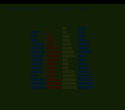

# #97 — SNES Width-Sweep Sort Gallery: G_SCMP three-way compare at s16/s32/s64

<p align="center"></p>

**Status:** ✅ **DONE + PUBLISHED** ([/snes/spaceship/](https://biohack.net/snes/spaceship/)), gate CRC `0xF20F`,
5-way green + `-verify` clean. Demo **#97** — **Round 6 (harden-the-fixes), Cluster B**, first-picks.
**Result: patch `0016` (`G_SCMP`/`lowerThreewayCompare`) holds at s32 and s64 — widths #46 never reached.
Clean positive, no compiler bug.**

## Context

Re-stresses patch `0016` (the #46 qsortviz fix): the three-way-compare idiom `(a>b)-(a<b)` is canonicalized
by clang to the generic **`G_SCMP`** opcode, which `MOSLegalizerInfo` routes to `.lower()` →
`LegalizerHelper::lowerThreewayCompare` (icmp+select). #46 crashed the backend before the fix and exercised
G_SCMP at **one** width (int16 qsort keys).

**Escalation:** qsort four arrays whose comparators return the spaceship at **int8/int16/int32/int64** keys,
forcing G_SCMP at the distinct IR widths **s16** (int8+int16 after C integer promotion), **s32**, and
**s64**. `lowerThreewayCompare` at s64 (a 64-bit icmp+select) is unexercised by any prior demo.

**Why qsort, not a hand sort:** a direct `spaceship(a,b) > 0` folds back to a plain `a > b` and the G_SCMP
vanishes. Through qsort's opaque `int(*)(const void*,const void*)` callback the comparator genuinely RETURNS
the −1/0/+1 scmp result (qsort compares it to 0), so the scmp survives — the exact mechanism that made #46
emit (and crash on) G_SCMP. Confirmed by the IR probe below (`scmp.i64=2`).

## Algorithm

`spaceship_gate_crc()` — qsort four `SP_N=24`-element panels (int8/16/32/64), each with its width-specific
spaceship comparator, folding the sorted VALUES (dup-safe: equal values interchangeable → order identical
host vs target regardless of qsort tie-break). Values are spread across all bits of each width so the sort
ORDER depends on the high limbs (an s64 compare mishandling a high limb diverges the order) and both signs
are exercised.

Maps to: `llvm.scmp.i16/i32/i64` intrinsics → `lowerThreewayCompare`; `rep`/`sep` under +mos-a16.

## Files

`examples/65816/spaceship.h` (gate + comparators), `examples/snes/corpus/spaceship_sim.c`,
`tools/spaceship-sim.c`, `examples/snes/spaceship.c` (4-panel bar-sort viz), `dev/spaceship.sh` +
`dev/spaceship.lua`, `Taskfile.yml`.

## Differential gate

- `corpus_result = spaceship_gate_crc()`, `EXPECT = 0xF20F`.
- **5-way bar** (no far pointers): host == default == +mos-a16 == +mos-xy16 on MAME + bsnes-jg, `-verify`.
- **G_SCMP presence probe** (load-bearing): emit LLVM IR (`--config … -fno-lto -emit-llvm -S`) and assert
  `llvm.scmp/ucmp ≥ 1` **and `scmp.i64 ≥ 1`** — otherwise the demo would be vacuous (scmp folded away).

## Verification results (2026-07-02) — PASS, clean positive

**`dev/run.sh spaceship`:**
```
==> host oracle: spaceship gate hash = 0xF20F
==> built build/spaceship.sfc (+mos-a16); corpus_result @ WRAM 0x58
==> G_SCMP IR probe (llvm.scmp at s16/s32/s64) + a16 rep/sep
    PASS  llvm.scmp/ucmp=8  scmp.i64=2  rep/sep=49  (G_SCMP formed incl. s64)
==> bsnes-jg: SMOKE: PASS off=0x58 got=0xF20F
==> MAME (Xvfb): SHOT: PASS corpus=0xF20F (frame 500)
RESULT: PASS
```

**`dev/run.sh _demo5 spaceship`:**
```
== -verify-machineinstrs ==   +mos-a16: verify OK   +mos-xy16: verify OK
RESULT: PASS — host==default==a16==xy16==0xF20F on bsnes-jg
```

**PASS.** `llvm.scmp/ucmp=8` (the spaceship intrinsic genuinely survives to IR) with **`scmp.i64=2`**
(G_SCMP at s64 — the width qsortviz never reached). The ROM compiled (the #46 crash would have aborted the
build), all four widths lower correctly, 5-way bit-exact, `-verify` clean.

## Compiler-correctness diagnosis — NO miscompile, fix holds

**No compiler bug.** Patch `0016` (`{G_SCMP,G_UCMP}.lower()` → `lowerThreewayCompare`) is **confirmed correct
at s32 and s64**, the wide widths the finding demo (#46, s16) never exercised — 64-bit three-way compares
lower to a correct icmp+select, bit-exact across default/+mos-a16/+mos-xy16, `-verify` clean. Permanent
regression guard for `0016` at the wide widths. Fast gate → preview at frame 500.

Published to [/snes/spaceship/](https://biohack.net/snes/spaceship/), selfcheck `0x58 2 0xF20F 500`,
category **Algorithms & Data**.
