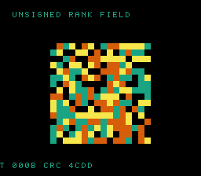

# #98 — SNES Unsigned Rank Percentile Field (`ucmprank`): the G_UCMP half of patch 0016

<p align="center"></p>

**Status:** ✅ DONE (2026-07-02). Demo **#98** of the **compiler stress-test demo battery** (Round 6,
Cluster B). Clean positive — `host == default == +mos-a16 == +mos-xy16 == 0x4CDD` on MAME + bsnes-jg,
`-verify-machineinstrs` clean in a16 + xy16. **No compiler bug.** Published:
[/snes/ucmprank/](https://biohack.net/snes/ucmprank/).

## Context

Cluster B hardens **patch `0016`** (#46 qsortviz): the three-way-compare idiom `(a>b)-(a<b)` canonicalizes
to a generic compare opcode that 0016 routes via `.lower()` → `LegalizerHelper::lowerThreewayCompare`.
Crucially, **0016 handles BOTH `G_SCMP` (signed) and `G_UCMP` (unsigned)** — but #46 and #97 spaceship only
ever emitted the **signed** `G_SCMP`. The **unsigned `G_UCMP` lowering path was completely unexercised.**
This demo closes that gap: qsort with **unsigned** spaceship comparators at `uint16`/`uint32`/`uint64`
forces `G_UCMP` at u16/u32/u64 in one ROM.

Unsigned ordering diverges from signed exactly where the high bit is set (values `> 0x7FFF…` compare as
*large*, not *negative*), so a lowering that reused the signed compare for `G_UCMP` would sort those wrong
and diverge the CRC — making this a real test of the unsigned path, not a duplicate of #97.

## Algorithm

```
ucmp(a,b): return (a>b) - (a<b)   // UNSIGNED operands → clang llvm.ucmp → G_UCMP
gate: qsort uint16[24], uint32[24], uint64[24] each with its ucmp comparator; fold sorted values
```

- WHY qsort (the #97 lesson): a direct `ucmp(a,b) > 0` folds back to `a > b` and the `G_UCMP` vanishes.
  Through qsort's opaque `int(*)(const void*,const void*)` callback the comparator genuinely returns the
  −1/0/+1 result (qsort compares it to 0), so the intrinsic survives.
- Differential folds the **sorted values** (qsort is unstable, but equal values are interchangeable → the
  sorted sequence is identical host vs target). Integer-exact.
- Visual (ROM): a 16×16 field of `uint32` values, each cell recoloured by its **rank/percentile** among all
  cells under unsigned ordering (4 bands); re-seeded periodically.

Codegen corner: `llvm.ucmp` at i16/i32/i64 operands (`G_UCMP` → `lowerThreewayCompare`), a16 `rep/sep`.

## Screen layout

```
row 1   HUD:  T=xxxx CRC=xxxx
rows 6..21  16×16 percentile-rank field (solid 2bpp cells, low→high rank = blue→teal→orange→gold)
row 25  HUD:  UNSIGNED RANK FIELD
```

## Display architecture

`BitmapCanvas` (BG3 2bpp, banded 4 rows/frame) + `TextLayer` + `TitleLayer`
("UCMPRANK / UNSIGNED THREE-WAY U64", gate runs during hold). 4-colour percentile ramp CGRAM[0..3].
The rank field is an O(N²) unsigned-ordering count, recomputed on each periodic re-seed.

## Files

| File | New/Mod | Purpose |
|---|---|---|
| `examples/65816/ucmprank.h` | new | unsigned spaceship comparators + qsort gate + rank field |
| `examples/snes/corpus/ucmprank_sim.c` | new | HAL-free corpus slice |
| `tools/ucmprank-sim.c` | new | host oracle |
| `examples/snes/ucmprank.c` | new | SNES ROM |
| `dev/ucmprank.sh`, `dev/ucmprank.lua` | new | gate (IR ucmp probe) + MAME assert |
| `Taskfile.yml`, `TODO.md`, plan-index, ideas doc | mod | tracking |

## Differential gate

- `corpus_result = ucmprank_gate_crc()`, GATE_N=24, `EXPECT = 0x4CDD`.
- **5-way bar** — no far pointers, bank-0 BSS.
- IR probe: `llvm.ucmp ≥ 1` (=6) incl. `ucmp.i64 ≥ 1` (=2), **signed `scmp == 0`** (no signed leak),
  a16 `rep/sep ≥ 1` (=57).

## Verification results

1. **Host oracle:** `ucmprank gate_crc = 0x4CDD` — PASS.
2. **ROM builds + checksum:** `build/ucmprank.sfc` (+mos-a16) + `build/ucmprank-default.sfc` clean — PASS.
   (NB: `corpus_result` lands at WRAM 0x67 in the a16 build vs 0x53 in default — a benign linker-layout
   difference; the shipped ROM is the a16 build with selfcheck offset 0x67.)
3. **Corpus slice host-compiles** — PASS.
4. **`dev/run.sh ucmprank`** — PASS:
   ```
   ==> host oracle: ucmprank gate hash = 0x4CDD
       PASS  llvm.ucmp=6  ucmp.i64=2  scmp=0  rep/sep=57  (G_UCMP formed incl. u64, no signed leak)
   SMOKE: PASS off=0x67 len=2 got=0x4CDD (ran 500 frames, bsnes-jg)
       SHOT: PASS corpus=0x4CDD (snapshot at frame 500)
   RESULT: PASS — Unsigned Rank Percentile Field on SNES; MAME + bsnes-jg + corpus hash 0x4CDD host == +mos-a16
   ```
5. **`-verify-machineinstrs`:** clean under `+mos-a16` AND `+mos-xy16` — PASS.
6. **Title card + animation:** `build/ucmprank-jg.png` shows the percentile-rank field, HUD `CRC 4CDD` — PASS.

## Publication

`/snes-rom-page --rom build/ucmprank.sfc --slug ucmprank --site ~/SRC/biohack.net
--title "Unsigned Rank Percentile Field" --preview build/ucmprank-jg.png
--selfcheck "0x67 2 0x4CDD 500 ucmprank"` (a16 build shipped directly; default and a16 VMAs differ).
