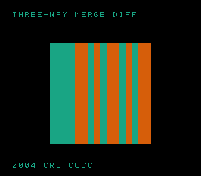

# #99 — SNES Three-Way Merge Diff (`trimerge`): the spaceship compare as control flow

<p align="center"></p>

**Status:** ✅ DONE (2026-07-02). Demo **#99** of the **compiler stress-test demo battery** (Round 6,
Cluster B). Clean positive — `host == default == +mos-a16 == +mos-xy16 == 0xCCCC` on MAME + bsnes-jg,
`-verify-machineinstrs` clean in a16 + xy16. **No compiler bug.** Published:
[/snes/trimerge/](https://biohack.net/snes/trimerge/).

## Context

Cluster B hardens **patch `0016`** (#46 qsortviz: `{G_SCMP,G_UCMP}.lower()` → `lowerThreewayCompare`).
#97 spaceship (signed sort) and #98 ucmprank (unsigned rank) both fed the three-way-compare result to
**qsort** (compared to 0). This demo uses the −1/0/+1 result **as control flow**: a 2-input merge branches
on its sign — `< 0` advance-left, `> 0` advance-right, `== 0` **emit-both** (the equal case) — a distinct
downstream consumer of the same `lowerThreewayCompare` output. Exercised at **s32 and s64**.

## Algorithm

```
noinline cmp(a,b) = (a>b) - (a<b)          // G_SCMP; opaque call keeps it alive
merge(L,R):                                 // L,R sorted ascending
    while i<nl && j<nr:
        c = cmp(L[i], R[j])
        if c < 0:  out += L[i++]            // advance left
        elif c > 0: out += R[j++]           // advance right
        else:      out += L[i++]; out += R[j++]   // emit both (c == 0)
    drain remaining
```

- WHY noinline `cmp`: inline `((a>b)-(a<b)) < 0` folds to `a < b` and the `G_SCMP` vanishes (the #97
  lesson). An opaque `noinline` comparator materializes the −1/0/+1 as its return value (qsort's
  mechanism), and the merge branches on it.
- Streams centered on 0 (both signs), strides 3 vs 2 so they collide periodically → the emit-both branch
  fires (verified: 7 equal-adjacent pairs in a sample merge). Merge of sorted streams is a deterministic
  reordering → bit-identical host vs target.
- Gate: GATE_N=8 rounds, each merges an s32 pair and an s64 pair at a rotating offset, folds the outputs.

Codegen corner: `llvm.scmp` at i32/i64 (`G_SCMP` → `lowerThreewayCompare`) feeding a **branch**, a16 `rep/sep`.

## Screen layout

```
row 1   HUD:  T=xxxx CRC=xxxx
rows 6..21  16×16: each row is a merge round; each cell coloured by the branch that emitted it
            (teal = advance-left, orange = advance-right, gold = emit-both) → the merge decisions braid
row 25  HUD:  THREE-WAY MERGE DIFF
```

## Display architecture

`BitmapCanvas` (BG3 2bpp, banded 4 rows/frame) + `TextLayer` + `TitleLayer`
("TRIMERGE / SPACESHIP AS CONTROL FLOW", gate runs during hold). 4-colour palette CGRAM[0..3]. Each row
re-merges at a rotating offset; the ROM's display merge tracks branch provenance (also driving `tm_cmp32`).

## Files

| File | New/Mod | Purpose |
|---|---|---|
| `examples/65816/trimerge.h` | new | noinline three-way comparators + merge + gate |
| `examples/snes/corpus/trimerge_sim.c` | new | HAL-free corpus slice |
| `tools/trimerge-sim.c` | new | host oracle |
| `examples/snes/trimerge.c` | new | SNES ROM (branch-provenance braid) |
| `dev/trimerge.sh`, `dev/trimerge.lua` | new | gate (IR scmp probe) + MAME assert |
| `Taskfile.yml`, `TODO.md`, plan-index, ideas doc | mod | tracking |

## Differential gate

- `corpus_result = trimerge_gate_crc()`, GATE_N=8, `EXPECT = 0xCCCC`.
- **5-way bar** — no far pointers, bank-0 BSS.
- IR probe: `llvm.scmp ≥ 1` (=4) incl. `scmp.i64 ≥ 1` (=2), a16 `rep/sep ≥ 1` (=198). No `--config` (no stdlib).

## Verification results

1. **Host oracle:** `trimerge gate_crc = 0xCCCC` — PASS. Merge sanity: len 40, monotonic non-decreasing,
   7 emit-both branches fired, spans negatives→positives.
2. **ROM builds + checksum:** `build/trimerge.sfc` (+mos-a16) + `build/trimerge-default.sfc` clean; VMAs
   match at 0x46 — PASS.
3. **Corpus slice host-compiles** — PASS.
4. **`dev/run.sh trimerge`** — PASS:
   ```
   ==> host oracle: trimerge gate hash = 0xCCCC
       PASS  llvm.scmp=4  scmp.i64=2  rep/sep=198  (G_SCMP formed incl. s64, drives control flow)
   SMOKE: PASS off=0x46 len=2 got=0xCCCC (ran 500 frames, bsnes-jg)
       SHOT: PASS corpus=0xCCCC (snapshot at frame 500)
   RESULT: PASS — Three-Way Merge Diff on SNES; MAME + bsnes-jg + corpus hash 0xCCCC host == +mos-a16
   ```
5. **`-verify-machineinstrs`:** clean under `+mos-a16` AND `+mos-xy16` — PASS.
6. **Title card + animation:** `build/trimerge-jg.png` shows the branch-provenance braid, HUD `CRC CCCC` — PASS.

## Publication

`/snes-rom-page --rom build/trimerge.sfc --slug trimerge --site ~/SRC/biohack.net
--title "Three-Way Merge Diff" --preview build/trimerge-jg.png
--selfcheck "0x46 2 0xCCCC 500 trimerge"`.
