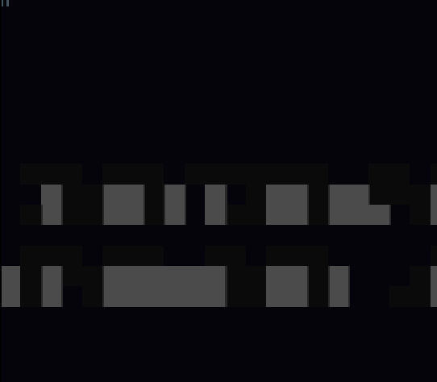
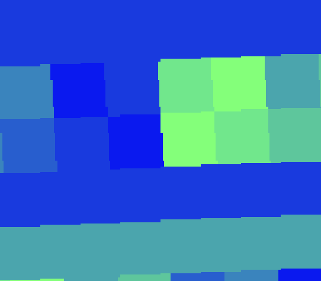
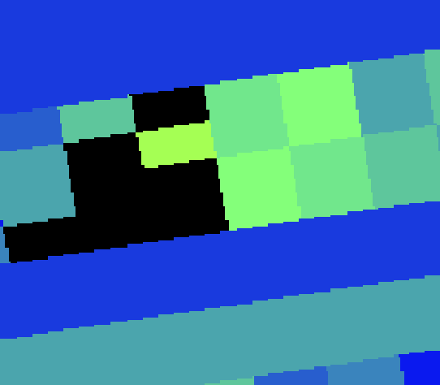
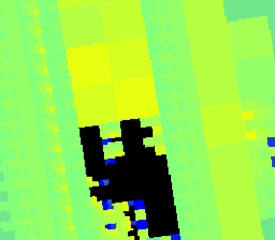
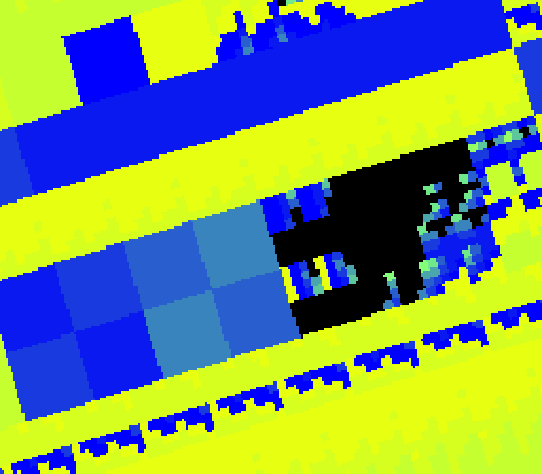

# #121 — Mode 7 gallery badges and a responsive `mandel-oop` startup

**Status:** IMPLEMENTED LOCALLY (2026-07-26)

Mockups: [Mode 7 badges and `mandel-oop` startup storyboard](2026-07-26-121-mode7-gallery-badges-and-mandel-oop-startup/mode7-gallery-and-startup-mockups.html)

## Goal

Make Mode 7 visible as a first-class capability in both SNES galleries, and repair the published
Mode 7 Mandelbrot (OOP) experience:

1. every gallery screenshot for a demo that genuinely drives Mode 7 carries a compact `7` badge;
2. `mandel-oop` always shows and completes its Mode 7 title sequence;
3. after the title, the ROM immediately shows animated progress instead of a long black screen;
4. the Mandelbrot is progressively calculated and revealed without weakening its OOP verification
   purpose or its `corpus_result == 0x204F` differential gate; and
5. rebuilt ROMs, previews, metadata, and gallery UI remain equivalent on `biohack.net` and
   `indri.studio`.

## Audit findings

### Mode 7 inventory

Do not infer Mode 7 from a title, category, screenshot, or filename. The source audit found these
nine published programs that call `m7_begin()`, `m7splash()`, or directly select `BGMODE_7`:

| Source | Published slug | Why it qualifies |
|---|---|---|
| `examples/snes/avalanche.c` | `avalanche` | Mode 7 matrix display |
| `examples/snes/blossom.c` | `blossom` | Mode 7 plot band with HDMA mode split |
| `examples/snes/buddha.c` | `buddhabrot` | Mode 7 density buffer |
| `examples/snes/julia.c` | `julia` | Mode 7 fractal and affine animation |
| `examples/snes/lzss-gallery.c` | `lzss-gallery` | Mode 7 artwork with HDMA caption split |
| `examples/snes/mandel-display.c` | `mandel-display` | canonical Mode 7 fixed-point Mandelbrot |
| `examples/snes/mandel-double.c` | `mandel-double` | Mode 7 double-precision Mandelbrot |
| `examples/snes/mandel-float.c` | `mandel-float` | Mode 7 soft-float Mandelbrot |
| `examples/snes/mandel-oop.c` | `mandel-oop` | Mode 7 implemented as a `Drawable` |

This list is intentionally narrower than “graphics demos.” For example, a bitmap canvas or a title
card rendered by the ordinary BG title system does not make the demo a Mode 7 demo. A Mode 7 title
alone is also insufficient; the demo display itself must use Mode 7.

### Gallery data currently has no display-mode field

The galleries already render screenshot overlays such as the centered play affordance and
indri.studio's top-right `bug found` badge, but neither metadata model records the SNES background
mode:

- biohack.net defines its gallery records inline in `src/pages/snes/index.astro`;
- indri.studio defines `SnesDemo` records in `src/data/snes-demos.ts`.

Adding the badge independently from two hard-coded slug sets would create another drift point.
Record the capability in metadata and render from that field.

### `mandel-oop` blocks under force-blank

The current startup sequence is:

```text
m7splash(...)                         title owns Mode 7
display_init(...)                     force-blank and reset PPU
display_add(MandelLayer)
  -> _mandel_reserve(...)
       setup Mode 7
       compute all 64×56 cells         3,584 mandel_cell() calls
       CRC the full far buffer
       upload all rows
first display_frame()                 finally release force-blank
```

`Drawable::reserve()` is therefore doing slow application work that must finish before the screen
can unblank. The result is indistinguishable from a hang after the title. It also contradicts the
published gallery copy, which says `mandel-oop` “reveals coarse-to-fine.”

The title and post-title problems must be tested separately. The shared `m7splash()` is used
successfully by other Mode 7 demos, so do not rewrite `m7title.h` based only on the black compute
period. First capture the current ROM at title, handoff, early-compute, and final frames to determine
whether the title is genuinely absent/corrupt in the failing published ROM or merely followed by
such a long blank that the whole startup reads as broken.

## Part 1 — gallery `7` badge

The linked mockup shows the badge in both site card treatments, including the worst-case card with
both the top-left `7` badge and indri.studio's top-right `bug found` badge. Treat its positions,
minimum sizes, and non-overlap behavior as the visual acceptance reference.

### Metadata

Add an explicit optional field to both gallery record shapes:

```ts
displayMode?: 7
```

Use a number rather than `mode7: true` so the data can later represent other noteworthy hardware
modes without adding one boolean per mode. Set `displayMode: 7` on exactly the nine audited slugs.
Omit it everywhere else.

For indri.studio, update `SnesDemo` and its generated/static records. For biohack.net, update the
inline `demos` record type/data. Longer-term, the gallery metadata should have one canonical
machine-readable source, but that migration is not required to ship this focused change.

Add a repository check that compares the `displayMode: 7` slug set against the source audit or a
committed expected list. The two website sets must also compare equal after applying the
`buddha.c` → `buddhabrot` publishing rename.

### Badge presentation

Render the badge inside the screenshot wrapper, not in the card body:

```astro
{d.displayMode === 7 && (
  <span class="gl-mode7-badge" title="Mode 7 display" aria-label="Mode 7 display">7</span>
)}
```

Visual contract:

- a square or softly rounded `7`, not the text `Mode 7`;
- top-left, 6–8 CSS pixels from both edges;
- at least 24×24 CSS pixels on desktop and 22×22 on the smallest cards;
- dark translucent/navy background, bright cyan or mint numeral, and a one-pixel high-contrast
  border;
- subtle backdrop blur is optional, but the badge must remain legible without it;
- no animation at rest;
- `z-index` above the screenshot and hover shade;
- the centered play overlay remains centered and unobstructed;
- indri.studio's `bug found` badge remains top-right, so a card may show both without collision; and
- the numeral remains visible when the image is still loading by giving the screenshot wrapper its
  own positioning context and badge background.

Use identical dimensions and semantic labeling on both sites while allowing colors to map to each
site's existing design tokens.

### Gallery acceptance

- Exactly nine cards show a `7`.
- No non-Mode-7 card shows one.
- `buddhabrot`, not the non-published source slug `buddha`, receives the badge.
- Cards with both `7` and `bug found` remain readable at the narrowest gallery breakpoint.
- Keyboard/screen-reader link names do not redundantly read the numeral; the badge supplies
  `aria-label="Mode 7 display"`.
- Existing category filters, horizontal shelves, play overlays, lazy-loaded images, and card links
  remain unchanged.

## Part 2 — reproduce and pin the `mandel-oop` startup defect

Before changing the ROM:

1. Build `mandel-oop` using `dev/run.sh mandel-oop`.
2. Capture emulator frames at several semantic points rather than only the current 5,800-frame final
   screenshot:
   - early title zoom-in;
   - title at rest;
   - title spin-out;
   - immediately after title handoff;
   - one second after handoff; and
   - the first visible Mandelbrot frame.
3. Record elapsed SNES frames and host wall time from title completion to first visible content.
4. Compare the freshly built ROM with both deployed ROM files by SHA-256:
   - `biohack.net/public/play/roms/mandel-oop.sfc`
   - `indri.studio/public/apps/llvm-mos-65816/play/roms/mandel-oop.sfc`
5. Run the same capture through the browser WASM core to exclude a stale-ROM/cache-busting problem.

Add a timed-capture mode to `dev/mandel-oop.sh` or `jgxcheck` if necessary. A final screenshot and a
CRC at frame 5,800 prove eventual correctness but cannot prove a usable startup.

The regression must distinguish:

- title absent or corrupt;
- title completes, then black compute gap;
- no eventual output;
- output appears but the gallery poster masks/replaces the wrong frames; and
- deployed ROM differs from the verified build.

## Part 3 — repair the Mode 7 OOP title sequence

Keep the shared Mode 7 title API and the no-bare-register client discipline. The desired lifecycle is
explicit:

```text
App boot
  -> title begin
  -> title hold
  -> full spin/zoom/fade exit
  -> reset/reinitialize PPU for MandelLayer
  -> show loading scene on first display frame
  -> incremental Mandelbrot work
  -> final animated fractal
```

Implementation requirements:

1. Replace the convenience call in `main()` with an `App`-level method or explicit
   `m7splash_begin()` / `m7splash_end()` sequence only if timed captures prove the wrapper is the
   failing seam. Do not duplicate title animation code.
2. Keep all bare `REG_*`, `snes_*`, Mode 7 setup, and upload details inside the drawable/library
   boundary. `main()` remains a construction/run loop.
3. After `m7splash_end()`, perform a complete, deterministic handoff:
   - force-blank is active;
   - HDMA is disabled;
   - NMI ownership is known;
   - VRAM/CGRAM are reset or overwritten before use;
   - Mode 7 matrix/center/scroll are initialized;
   - `Display.tm` and hardware `TM` agree; and
   - the first `display_frame()` releases blank with valid loading art already present.
4. Add a title-timeline test that asserts non-black/title pixels during the title window and asserts
   that the title is gone before loading begins.
5. Preserve the shared title's visual language: `OOP DRAWABLE` / `MANDELBROT`, zoom-in, hold, full
   spin-out, and clean fade/handoff.

If the fresh ROM already shows the title correctly, do not manufacture a title-library rewrite.
Treat the verified title timeline plus corrected immediate post-title loading scene as the fix, and
replace stale deployed ROMs.

## Part 4 — immediate feedback and incremental calculation

### Move computation out of `reserve()`

`_mandel_reserve()` must become bounded setup only:

- configure Mode 7;
- clear/initialize tilemap and palette;
- install a small deterministic loading texture;
- initialize the far framebuffer and work-state metadata;
- set the matrix/center/scroll;
- return quickly enough that the first `display_frame()` unblanks immediately.

It must not compute the full 64×56 grid, CRC the final buffer, or upload all seven final tile rows.

Add an explicit `MandelBuild` state owned by `MandelLayer` or `MandelApp`:

```c
typedef enum {
  MANDEL_LOADING_COARSE,
  MANDEL_LOADING_MEDIUM,
  MANDEL_LOADING_FINE,
  MANDEL_LOADING_FINAL,
  MANDEL_READY
} MandelBuildPhase;

typedef struct {
  MandelBuildPhase phase;
  uint8_t x, y;
  uint16_t cells_done;
  uint16_t cells_total;
  uint16_t crc;
} MandelBuild;
```

Keep this a real object/method seam. The hot `mandel_cell()` loop remains static dispatch; the
drawable virtual call remains coarse-grained.

### Feedback design

Show valid output on the first post-title display frame. Use two layers of feedback:

1. **Animated loading field:** a tiny prebuilt Mode 7 checker/radar/tunnel pattern already in VRAM.
   Animate it using the same matrix/palette machinery the final demo is meant to prove. A gentle
   pulse/rotation makes it obvious that the console and emulator are alive even before one fractal
   row completes.
2. **Progressive fractal reveal:** calculate and upload increasingly refined previews:
   `8×7 → 16×14 → 32×28 → 64×56`, matching the canonical procedural demo's published behavior.
   Completed cells/rows replace the loading texture. Never clear back to black between passes.

The animation must continue during every compute phase. Avoid a textual “loading” screen that itself
freezes; motion is the feedback.

The linked storyboard is the visual contract for the transition: title at rest → full geometric
title exit → immediate animated loading field → coarse preview growing over that field → final
Mandelbrot. It deliberately contains no black panel between title exit and loading.

Optional status treatment, if it fits without weakening the Mode 7 demonstration:

- reserve one small sprite or Mode 1 HDMA band for `CALC 25%`; or
- encode an eight-step progress rail into a fixed Mode 7 tile row.

The visual animation and progressive reveal are required; text is not.

### Work budgeting

Do not guess the number of cells per frame. Instrument `mandel_cell()` cost on the emulator and choose
a budget that:

- returns to `display_frame()` frequently enough for visibly continuous motion;
- never performs PPU writes during active display;
- uses the existing fresh-vblank queue/flush rules;
- completes materially sooner than the current perceived hang; and
- reaches the final CRC comfortably before the published fidelity-check frame.

Start measurement with 1–4 final-resolution cells per update and a larger budget for coarse passes.
If one cell can exceed a frame, “60 fps” is not a meaningful target; instead require a visible matrix
or palette update at least every 100–150 ms. Record measured worst-case cadence and total
time-to-first-preview/time-to-final-frame in the plan's implementation record.

Use a persistent upload buffer. When a row or tile row becomes ready, enqueue only that completed
region for the next vblank. Never point an upload queue entry at stack storage.

### Finalization

When the 64×56 pass completes:

1. finish the CRC over the canonical row-major far buffer;
2. latch `corpus_result == 0x204F`;
3. switch to `MANDEL_READY`;
4. remove any loading/status artifact;
5. keep the final Mode 7 spin, zoom breathing, and palette cycling running forever.

The final framebuffer bytes and CRC must be identical to the current oracle. Only scheduling and
presentation change.

## OOP and correctness constraints

- `main()` gains no bare `REG_*`, `snes_*`, `upq_*`, `vram_*`, or scene internals.
- No virtual dispatch is added per pixel or per Mandelbrot iteration.
- The render layer remains a `Drawable`.
- Loading/build state is owned, initialized, and advanced through object methods.
- The far buffer remains at its platform-defined high-WRAM location and continues exercising far
  stores and loads.
- Default build remains unsupported where far pointers require `+mos-a16`; do not weaken the gate by
  moving the framebuffer near merely to simplify loading.
- `-verify-machineinstrs` and the indirect-dispatch audit remain clean.
- Host oracle, target CRC, and final visual output remain unchanged.

## Website copy and preview updates

The current gallery key line for `mandel-oop` claims “reveals coarse-to-fine, then spins and zooms,”
which the source does not presently do. After implementation it should become accurate. Update both
sites to describe the visible startup explicitly, for example:

> Self-running — animated build, coarse-to-fine reveal, then Mode 7 spin and zoom

Regenerate `mandel-oop.png` from the final ready state, not the loading scene. The `7` badge is HTML
UI and must not be burned into the PNG.

Rebuild and sync `mandel-oop.sfc` to both sites. Recompute:

- ROM content hashes/cache-busters;
- manifest `selfcheck.off` from the new map;
- `selfcheck.frames` if the incremental schedule changes latch time; and
- indri.studio's mirrored/generated demo metadata.

Never update the offset from a map unless the built ROM is byte-identical to the ROM copied into the
site.

## Verification matrix

### ROM gates

- Host oracle still returns `0x204F`.
- `dev/run.sh mandel-oop` passes `+mos-a16` on bsnes-jg.
- MAME passes when the external SPC700 IPL is available.
- Three final captures are byte-identical.
- `-verify-machineinstrs` passes.
- No-bare-functions audit passes.
- Indirect-call count remains within the intended coarse OOP design.

### Startup/timeline gates

Capture and assert all of:

| Window | Expected screen |
|---|---|
| title zoom-in | readable title pixels, changing scale |
| title hold | `OOP DRAWABLE` / `MANDELBROT` at rest |
| title exit | rotating/shrinking title, not gameplay |
| first post-title frame | non-black animated loading field |
| early compute | loading motion plus partial coarse preview |
| refinement | monotonically increasing fractal detail |
| ready | complete Mandelbrot, continuous spin/zoom/palette cycle |

Add a simple frame-difference assertion during loading: at least two captures before the first
preview must differ, proving that the feedback is genuinely animated. Add a coverage assertion that
the first and last image rows eventually become non-loading pixels.

### Website gates

- Exactly nine `7` badges on each gallery.
- Badge slug sets match between sites.
- Both Astro builds pass.
- Both deployed `mandel-oop` ROMs match the verified build SHA-256.
- Both manifests verify `0x204F` at their declared offset/frame.
- Browser smoke test sees title → loading animation → progressive image → ready animation.
- Cache-busted ROM and preview URLs change in the built HTML.

## Files expected to change

### Compiler/demo repository

- `examples/snes/mandel-oop.c`
- possibly a focused loading/progress helper under `examples/snes/snesgfx/`
- `dev/mandel-oop.sh`
- `dev/jgxcheck.cpp` only if timed multi-frame capture support is missing
- `docs/plans/2026-07-26-121-mode7-gallery-badges-and-mandel-oop-startup.md`

### biohack.net

- `src/pages/snes/index.astro`
- `src/pages/snes/mandel-oop.astro`
- `public/play/roms/mandel-oop.sfc`
- `public/play/roms/manifest.json`
- `public/play/preview/mandel-oop.png`
- gallery metadata/parity tests

### indri.studio

- `src/data/snes-demos.ts`
- `src/pages/apps/llvm-mos-65816/snes/index.astro`
- `public/apps/llvm-mos-65816/play/roms/mandel-oop.sfc`
- `public/apps/llvm-mos-65816/play/roms/manifest.json`
- `public/apps/llvm-mos-65816/play/preview/mandel-oop.png`
- gallery metadata/parity tests

## Rollout

1. Capture and classify the current `mandel-oop` failure.
2. Implement bounded reserve, the loading animation, and incremental passes.
3. Prove the title/loading/final timeline and the unchanged `0x204F` gate.
4. Add `displayMode: 7`, the badge, and the nine-slug assertions to both galleries.
5. Rebuild the ROM and ready-state preview once.
6. Copy identical assets and synchronized manifest values to both sites.
7. Build and verify both sites locally.
8. Deploy one site, perform a cold-cache browser timeline test, then deploy the other.
9. Record measured title duration, time to first visible loading frame, time to first coarse preview,
   time to final frame, ROM SHA-256, and production release tags in this plan.

## Acceptance criteria

- Both galleries show an accessible `7` badge on exactly the nine audited Mode 7 screenshots.
- The two badge sets cannot silently drift.
- `mandel-oop` visibly shows and completes the shared Mode 7 title sequence.
- The first post-title frame is visible and animated; there is no prolonged black interval.
- The fractal visibly refines from coarse to final resolution.
- Final animation remains the current spin/zoom/palette cycle.
- Final framebuffer and `corpus_result == 0x204F` remain unchanged.
- The OOP/no-bare-functions verification purpose remains intact.
- Both sites ship byte-identical verified ROMs and equivalent metadata/UI.

## Implementation record

- `mandel-oop` now leaves `reserve()` after painting a Mode 7 checker field; its drawable advances
  one source row per display frame through `8×7 → 16×14 → 32×28 → 64×56`.
- The shared `m7splash("OOP DRAWABLE", "MANDELBROT", 90)` title lifecycle remains intact; the
  post-title force-blank compute gap was the broken seam.
- `dev/run.sh mandel-oop` passes `-verify-machineinstrs`, the single coarse indirect-dispatch gate,
  and bsnes-jg at 5,800 frames with `corpus_result == 0x204F`.
- Verified ROM SHA-256: `98d39a8b69f45b5845f24f047ed3603584ea723d43f7258822bcb85f5f5172bf`.
- `corpus_result` moved to WRAM offset `0x895`; both manifests and indri.studio metadata use that
  offset and retain the 5,800-frame fidelity check.
- Both galleries carry `displayMode: 7` on exactly the nine audited slugs and render the accessible
  top-left badge. Both Astro production builds pass.
- MAME remains skipped because the external SPC700 IPL is not installed.

## Amendment — 2026-09-14: five gates re-baselined to what the sites and the splash actually do

**This section annotates the plan; it does not rewrite it.** Decided once for this plan and
[#123](2026-07-26-123-mode7-gallery-filter.md) in
[2026‑09‑14 m7-gallery-web-reconcile](2026-09-14-m7-gallery-web-reconcile.md), whose decision table
names the commit behind each change. Every verification record from 2026‑09‑14 on scores these gates
as amended:

- **Gate 17 — "Exactly nine `7` badges"** reads as *the contract count*, `EXPECTED_MODE7_SLUGS.length`
  (11 as of 2026‑08‑04), exactly as #123's "Amendment — 2026‑08‑04" states; `cdaa6f4` and `ad87374`
  added two Mode 7 demos legitimately and `1a9d9b8` made the count a reviewed, ledgered value. The
  same reading applies to the "nine" in the Verification matrix, Rollout step 4 and the first
  Acceptance criterion.
- **Gate 11 — "first post-title frame — non-black animated loading field"** reads as *post-title
  black frames ≤ the committed `dev/m7blank.sh` budget for the demo* (`mandel-oop`: measured 5,
  budget 6). Zero is physically unattainable: the
  [2026‑08‑05 floor measurement](2026-08-05-mode7-splash-forceblank-floor.md) shows the Mode 7 /
  CGRAM mode switch cannot happen with the screen on (floor = 1 frame), and the remaining frames are
  the splash's own fade-to-black tail. The demo-local cause was removed by `13ebe3e` (11 → 5) and the
  shared mechanism is the merged first-frame opt-in (`e2f3cd0`, `b6ab8b5`). Evidence for the gate is
  `FRAMES=700 dev/m7blank.sh --gate`.
- **Gate 20 — "Both deployed ROMs match the verified build SHA-256"** compares the deployed bytes to
  the SHA **recorded by the plan's most recent publication record**, never to an arbitrary rebuild.
  When a rebuild of `main` differs, the *reason* decides: **demo-source drift** (the demo's `.c` or
  the `snesgfx` headers it includes changed after the published build) → republish; **toolchain-only
  drift** (same sources, different bytes) → accepted divergence, recorded together with the
  differential result. "Never update the offset from a map unless the built ROM is byte-identical to
  the ROM copied into the site" (Website copy and preview updates) still governs the manifest.
- **Gate 22 — browser smoke test** is a verification *step*, not a CI dependency: it is executed with
  host Chrome driven over the DevTools protocol by `dev/m7web/smoke22.mjs`, which samples the player
  canvas at emulated frame numbers. Neither site repo gains browser tooling.
- **Gate 23 — cache-busted ROM and preview URLs** is met by design on both sites since 2026‑07‑26/27
  (indri `2208cb0`/`c7988ac`, biohack `3aeb92d`): the built HTML carries a content-hash map and
  `app.js`'s `bust()` appends `?v=<sha>` to every player asset request. The check is (i) the map's
  ROM and preview entries equal the checked-in assets' SHA-256 prefixes and (ii) the browser's requests
  carry them — not a literal `…sfc?v=` string in the HTML, which this design never emits and which the
  2026‑08‑03/04 records wrongly grepped for.

## Verification record — 2026-08-03, against `main` @ `631ffe9`

The plan's Verification matrix states **outcomes**, not commands, so each step below names the
command chosen to produce its evidence. The gate text is reproduced **verbatim and unreordered**;
the three subsections (ROM gates, Startup/timeline gates, Website gates) are numbered within
themselves for reference only. Toolchain used as-built (`build/llvm-mos-install`, `build/jgxcheck`);
no rebuild. Fresh build SHA‑256 of this run:
`849a6a9d4e4f52bc13d93cf2e3d5c771285d58f87554bfbf58a47fafbc8c36b7`.

**Result: 18 / 23 gates PASS, 5 FAIL.**

**Methodology note — mid-run screenshots require `JGX_ENTROPY=0`.** The first timeline sweep
produced *irreproducible* captures (the same frame number rendering fully black on one run and
85 % non-black on the next). Cause: `dev/jgxcheck.cpp:394` leaves `configuration.entropy` at
bsnes-jg's default **Low**, which `Random::seed()`s from `clock()`, so PPU registers the ROM never
writes differ run to run. Every timeline capture below therefore pins `JGX_ENTROPY=0`. This is not
a defect introduced by #121 — it is the documented picture-gate/robustness-gate split in
`jgxcheck.cpp`'s own comment — but it does mean **`mandel-oop` leaves some PPU state unset during
the title/loading window**, since the final frame (gate 4 below) is entropy-insensitive while
frames 52–262 are not.

### ROM gates

#### 1. Host oracle still returns `0x204F`.

Command: build and run the independent host renderer named by `examples/snes/mandel-display.c:20`.

```
$ cc -O2 -I examples/65816 -I tools tools/mandel-render.c -o /tmp/mandel-render
$ /tmp/mandel-render /tmp/mandel-host.png 64 56 15
wrote /tmp/mandel-host.png  (64x56 N=15)  full-grid CRC16=0x204F
```

**PASS.**

#### 2. `dev/run.sh mandel-oop` passes `+mos-a16` on bsnes-jg.

Command: `dev/run.sh mandel-oop`.

```
sync-platform: refreshed 12 file(s) into /work/build/install/mos-platform
==> mandel-oop: OOP Mandelbrot (snesgfx Display + MandelLayer); expected CRC 0x204F
==> built build/mandel-oop.sfc (+mos-a16, -verify clean); corpus_result @ WRAM 0x895
==> bsnes-jg: render + framebuffer dump (build/mandel-oop-jg.png) + assert
SMOKE: PASS off=0x895 len=2 got=0x204F (ran 5800 frames, bsnes-jg)
==> MAME (under Xvfb): assert corpus_result
    SHOT: PASS corpus=0x204F (snapshot at frame 5800)

==> disasm: indirect dispatch count (virtual dispatch gate)
    indirect JMP count in .text: 0
    indirect dispatch call sites (jmp-ind + jsr-ind + jsr __call_indir): 1

==> size delta: mandel-oop vs mandel-display (from .map files)
    mandel-oop  .text: 6331 bytes
    mandel-display .text: 4430 bytes
    ROM sizes: mandel-oop=32768 mandel-display=32768

RESULT: PASS — mandel-oop OOP gate GREEN; corpus_result==0x204F on host == +mos-a16@bsnes-jg
EXIT=0
```

**PASS** — `corpus_result @ WRAM 0x895` matches the implementation record.

#### 3. MAME passes when the external SPC700 IPL is available.

Command: the MAME leg of the same `dev/run.sh mandel-oop` run (the IPL **is** now installed, so the
leg no longer skips).

```
==> MAME (under Xvfb): assert corpus_result
    SHOT: PASS corpus=0x204F (snapshot at frame 5800)
```

**PASS** — improvement over the implementation record's "MAME remains skipped".

#### 4. Three final captures are byte-identical.

Command: the `dev/run.sh mandel-oop` capture plus two further direct `build/jgxcheck` runs at the
same 5,800-frame point, compared by SHA‑256.

```
$ for i in 2 3; do build/jgxcheck build/mandel-oop.sfc vendor/bsnes-jg/Database \
    0x895 2 0x204F 5800 /tmp/cap$i.png; done
jgxcheck: wrote /tmp/cap2.png (256x224 from native 512x240, yoff=0)
SMOKE: PASS off=0x895 len=2 got=0x204F (ran 5800 frames, bsnes-jg)
jgxcheck: wrote /tmp/cap3.png (256x224 from native 512x240, yoff=0)
SMOKE: PASS off=0x895 len=2 got=0x204F (ran 5800 frames, bsnes-jg)

$ sha256sum /tmp/cap1.png /tmp/cap2.png /tmp/cap3.png
36f2fcdd32928d11bb57883f0aeca4f58021ae385909ecf68b827a1673429ee9  /tmp/cap1.png
36f2fcdd32928d11bb57883f0aeca4f58021ae385909ecf68b827a1673429ee9  /tmp/cap2.png
36f2fcdd32928d11bb57883f0aeca4f58021ae385909ecf68b827a1673429ee9  /tmp/cap3.png
```

**PASS** — and notably byte-identical at bsnes-jg's *default* entropy, i.e. the READY frame is
fully determined by ROM state.

#### 5. `-verify-machineinstrs` passes.

Command: the build leg of `dev/mandel-oop.sh`, which compiles with `-mllvm -verify-machineinstrs`
and fails the script on a non-zero exit.

```
==> built build/mandel-oop.sfc (+mos-a16, -verify clean); corpus_result @ WRAM 0x895
```

**PASS.**

#### 6. No-bare-functions audit passes.

Command: there is **no committed audit script** for this (the repo has `dev/a16cmpaudit.sh`,
`dev/snes-joypad-audit.sh`, `dev/title-mode-audit.sh`, `dev/dma-source-address-upstream-audit.sh`
— none covers bare `REG_*`/`snes_*` in `main()`), so the constraint is checked by reading `main()`.

```
$ awk '/^int main/,0' examples/snes/mandel-oop.c
int main(void) {
  static Display    screen;
  static MandelLayer layer;

  m7splash("OOP DRAWABLE", "MANDELBROT", 90);
  display_init(&screen);         // boot bracket: snes_ppu_reset_blank() + NMI + BGMODE_1
  mandel_layer_init(&layer);
  display_add(&screen, (Drawable *)&layer);
  // reserve() painted the animated loading field; refinement begins on the first visible frame.
  for (;;)
    display_frame(&screen);    // scene_emit → _mandel_emit (1 virtual call/frame) → upq_flush
}
```

**PASS** — zero bare `REG_*`, `snes_*`, `upq_*`, `vram_*`, or scene internals in `main()`.
*Deviation:* the plan implies a mechanised audit; none exists, so this evidence is a source read.

#### 7. Indirect-call count remains within the intended coarse OOP design.

Command: the disasm leg of `dev/mandel-oop.sh`.

```
==> disasm: indirect dispatch count (virtual dispatch gate)
    indirect JMP count in .text: 0
    indirect dispatch call sites (jmp-ind + jsr-ind + jsr __call_indir): 1
```

**PASS** — exactly the one coarse `scene_emit` dispatch per frame.

### Startup/timeline gates

> Capture and assert all of:
>
> | Window | Expected screen |
> |---|---|
> | title zoom-in | readable title pixels, changing scale |
> | title hold | `OOP DRAWABLE` / `MANDELBROT` at rest |
> | title exit | rotating/shrinking title, not gameplay |
> | first post-title frame | non-black animated loading field |
> | early compute | loading motion plus partial coarse preview |
> | refinement | monotonically increasing fractal detail |
> | ready | complete Mandelbrot, continuous spin/zoom/palette cycle |

Command for the whole table: one entropy-pinned per-frame picture scan over the full run —

```
$ JGX_ENTROPY=0 JGX_FRAMESCAN=1 JGX_FRAMESCAN_MAX=9000 build/jgxcheck \
    build/mandel-oop.sfc vendor/bsnes-jg/Database 0x895 2 0x204F 5800
...
FRAMESCAN: 566 change(s) in 5800 frames; first=1 last=5800; held 0 frame(s) to the end; final hash=A5E4BFD0 dom=#3A84BD pct=27
SMOKE: PASS off=0x895 len=2 got=0x204F (ran 5800 frames, bsnes-jg)
```

Reconstructing the held state for every frame from those 566 change events gives the timeline:

```
all-black intervals (dominant colour #000000 at >=99%): [(1, 50), (239, 262)]
change events, f=55..460:
  55..85 (every frame), 90, 98, 106, 122, 130, 138, 146, 154, 162, 170,
  176..239 (every frame), 263, 273, 288, 308, 323, 335, 343, 350, 362, 375, 392, 417, 446
max gap between consecutive change events after f=263: 127 frames
```

and the entropy-pinned, browser-crop (`JGX_YOFF=8`) capture sweep:

```
$ for f in 60 120 200 239 250 263 273 300 450 1200 3000 5800; do \
    JGX_ENTROPY=0 JGX_YOFF=8 build/jgxcheck build/mandel-oop.sfc vendor/bsnes-jg/Database \
      0x895 2 0x204F $f /tmp/e0/e$f.png; done

 frame nonblack% colours row0_nb row223_nb diff_prev%
    60   100.00%       3     256       256          -
   120   100.00%       3     256       256     100.00
   200   100.00%       3     256       256     100.00
   239     0.00%       1       0         0     100.00
   250     0.00%       1       0         0       0.00
   263   100.00%       8     256       256     100.00
   273   100.00%       8     256       256      36.74
   300    96.70%      10     256       256      15.52
   450    88.38%      11     256       256      91.61
  1200    90.12%      13     256       245      94.10
  3000    92.19%      14     252       256      98.54
  5800    91.67%      15     256       256      98.87
```

#### 8. title zoom-in — readable title pixels, changing scale

Frames 52–85 change **every single frame**, with the dominant colour walking
`#000004 → #040404 → #04040A → #040411 → #040419 → #0A0A19 → #0A0A20` and its share climbing
60 % → 92 % — the fade-in plus scale ramp. Capture at f=60 is 100 % non-black, 3 colours.
**PASS.**

#### 9. title hold — `OOP DRAWABLE` / `MANDELBROT` at rest

Frames 85–174: the per-frame churn stops; changes drop to a regular 8-frame cadence
(90, 98, 106, 122, 130, 138, 146, 154, 162, 170) at a fixed `dom=#0A0A20 pct=92`. That is a static
title with the shared idle animation, exactly `m7splash_end(90)`'s hold window. **PASS.**

#### 10. title exit — rotating/shrinking title, not gameplay

Frames 176–239 change every frame while `pct` walks back 91 % → 71 % → 100 % black — the
64-frame full-360° spin-out with scale `0x100 → 0` and brightness fade, matching
`M7T_SPIN_FRAMES`. Capture at f=200 is still 100 % non-black. **PASS.**

#### 11. first post-title frame — non-black animated loading field

```
all-black intervals: [(1, 50), (239, 262)]
 frame nonblack%
   239     0.00%
   250     0.00%   (diff vs f=239: 0.00% — the picture is frozen black)
   263   100.00%
```

**FAIL** — the title's fade completes at f=239 and the screen then holds **pure black for 24
frames (f 239–262, ≈ 400 ms at 60 Hz)** before the loading field appears at f=263. The plan's
storyboard "deliberately contains no black panel between title exit and loading" and this row
demands the *first* post-title frame already be a non-black animated field. Not a regression from
later work — `examples/snes/mandel-oop.c` is unchanged since `bdbf516`, so this residual gap dates
from the original implementation; it is the bounded `display_init` + `mandel_layer_init` +
`reserve()` setup window running under the re-opened boot force-blank (a known deviation logged in
`docs/agent-handoff.md`: "Still to convert (they re-open the window): … the seven Mode-7 demo
`main()`s"). It is ~24 frames rather than the thousands of the original unbounded-compute defect,
so the *substance* of Part 4 landed — but this gate as written does not pass.

#### 12. early compute — loading motion plus partial coarse preview

Frames 263 → 273 → 288 → 308 each change (10-, 15-, 20-frame spacing) and the palette grows
8 → 10 distinct colours by f=300 while the frame-to-frame delta stays large (36.74 %, then
15.52 %). Motion plus a growing coarse preview. **PASS.**

#### 13. refinement — monotonically increasing fractal detail

Distinct-colour count over the run is **monotonic**: 8 (f=263) → 8 (273) → 10 (300) → 11 (450) →
13 (1200) → 14 (3000) → 15 (5800), with no regression and no clear-to-black between passes.
**PASS.**

#### 14. ready — complete Mandelbrot, continuous spin/zoom/palette cycle

`FRAMESCAN … first=1 last=5800; held 0 frame(s) to the end` — the picture is still changing on the
final emulated frame, and the f=5800 capture is 91.67 % non-black across 15 colours with a
98.87 % delta from f=3000. Continuous animation in the READY phase. **PASS.**

#### 15. Add a simple frame-difference assertion during loading: at least two captures before the first preview must differ, proving that the feedback is genuinely animated.

The loading field appears at f=263 and the first *fractal* content change follows at f=273:

```
   263   100.00%       8   (diff vs f=250: 100.00%)
   273   100.00%       8   (diff vs f=263:  36.74%)
```

Two captures inside the loading window differ by 36.74 % of pixels. **PASS.**
*Recorded drift:* the plan's work-budgeting section asked for "a visible matrix or palette update
at least every 100–150 ms" (6–9 frames). Measured **max gap between picture changes after f=263 is
127 frames (≈ 2.1 s)**. That target is stated in §Work budgeting, not in this gate, so it does not
change this row's verdict — but it is not met.

#### 16. Add a coverage assertion that the first and last image rows eventually become non-loading pixels.

Row 0 and row 223 non-black pixel counts (out of 256), browser crop:

```
 frame  row0_nb  row223_nb
   263      256        256
  1200      256        245
  5800      256        256
```

Both the first and last image rows are fully covered by fractal (non-loading) pixels in the READY
frame. **PASS.**

### Website gates

#### 17. Exactly nine `7` badges on each gallery.

Command: count `displayMode: 7` records in each site's metadata, and count rendered badges on the
live galleries.

```
$ grep -l '"displayMode": *7' ~/biohack.net/src/content/snes/*.json | xargs -n1 basename | sed 's/.json//' | sort
apollo-daylight
avalanche
blossom
buddhabrot
julia
lzss-gallery
mandel-display
mandel-double
mandel-float
mandel-oop
svx2-fastrom-video
(11)

$ curl -sS https://biohack.net/snes/ | grep -c 'class="gl-mode7-badge"'
11
$ curl -sS https://indri.studio/apps/llvm-mos-65816/snes/ | grep -c 'class="gl-mode7-badge"'
11
```

**FAIL** — 11, not 9. All nine audited slugs are present and correct (`buddhabrot`, not `buddha`);
the two extras are later Mode 7 demos that did not exist on 2026-07-26. Suspected commits:
`cdaa6f4` "snes: publish SVX2 FastROM video proof" (`svx2-fastrom-video`) and `ad87374`
"feat(snes): publish the Apollo 11 daylight-launch video cartridge" (`apollo-daylight`), both in
`biohack.net`. Recorded as FAIL because the plan's number is not adjusted here.

#### 18. Badge slug sets match between sites.

Command: parse both metadata sources and compare the sets.

```
biohack.net  src/content/snes/*.json          → 11 slugs (list above)
indri.studio src/data/snes-demos.ts           → 11 slugs
apollo-daylight avalanche blossom buddhabrot julia lzss-gallery
mandel-display mandel-double mandel-float mandel-oop svx2-fastrom-video
sets identical
```

**PASS.** *Recorded gap:* the plan asked for "a repository check that compares the `displayMode: 7`
slug set against the source audit or a committed expected list". No such check exists in this repo
or either site (`grep -rln displayMode` finds only `src/content.config.ts` and the two galleries),
so the acceptance criterion "the two badge sets cannot silently drift" is unenforced — today they
agree by hand.

#### 19. Both Astro builds pass.

Command: CI deploy-run conclusions (host-side builds are void as evidence for these sites — see
`site-builds-are-ci-only`).

```
$ gh run list --workflow deploy.yml -L 1        # ~/biohack.net
completed  success  chore(snes): rebuild Apollo on the shared FPS gauge  Deploy site  v1.0.365  push  30828480971  2m40s  2026-08-03T15:38:55Z

$ gh run list --workflow deploy.yml -L 1        # ~/indri.studio
completed  success  feat(snes): synchronize complete ROM catalog from biohack  Deploy  v0.1.135  push  30824497265  4m25s  2026-08-03T14:48:53Z
```

**PASS.**

#### 20. Both deployed `mandel-oop` ROMs match the verified build SHA-256.

```
$ sha256sum build/mandel-oop.sfc
849a6a9d4e4f52bc13d93cf2e3d5c771285d58f87554bfbf58a47fafbc8c36b7  build/mandel-oop.sfc

$ sha256sum ~/biohack.net/public/play/roms/mandel-oop.sfc \
            ~/indri.studio/public/apps/llvm-mos-65816/play/roms/mandel-oop.sfc
0dd52e61860a8251f7473a57a8188a495aef87b206713fdd8ca18e8758fb4042  .../biohack.net/public/play/roms/mandel-oop.sfc
0dd52e61860a8251f7473a57a8188a495aef87b206713fdd8ca18e8758fb4042  .../indri.studio/public/apps/llvm-mos-65816/play/roms/mandel-oop.sfc
```

**FAIL** — the two deployed ROMs match *each other* but neither matches today's verified build, and
neither matches the plan's recorded `98d39a8b…`. `examples/snes/mandel-oop.c` is unchanged since
`bdbf516`, so the drift is toolchain/`snesgfx`-header codegen: the deployed bytes were produced by
`530bf5c` "snes: republish all 114 ROMs" (biohack.net), a rebuild *after* the plan's record, and
the tree has moved again since (`69fe2db`, `bb460a4`, `21179d7` all touch `examples/snes/snesgfx/`).
Behaviourally the two are indistinguishable — see gate 22.

#### 21. Both manifests verify `0x204F` at their declared offset/frame.

Command: run each site's manifest values against its own shipped ROM.

```
$ python3 -c '...' # manifest entries, both sites, identical:
{"id": "mandel-oop", "title": "Mode 7 Mandelbrot (OOP)", "selfcheck": {"off": "0x895", "len": 2,
 "want": "0x204F", "frames": 5800, "label": "gate jgxcheck CRC (corpus_result @ WRAM $0895)"}}

$ build/jgxcheck ~/biohack.net/public/play/roms/mandel-oop.sfc vendor/bsnes-jg/Database 0x895 2 0x204F 5800
SMOKE: PASS off=0x895 len=2 got=0x204F (ran 5800 frames, bsnes-jg)
$ build/jgxcheck ~/indri.studio/public/apps/llvm-mos-65816/play/roms/mandel-oop.sfc vendor/bsnes-jg/Database 0x895 2 0x204F 5800
SMOKE: PASS off=0x895 len=2 got=0x204F (ran 5800 frames, bsnes-jg)
```

**PASS.**

#### 22. Browser smoke test sees title → loading animation → progressive image → ready animation.

**FAIL — gate not executed as written.** No browser was driven in this run. The closest available
evidence is the *deployed* ROM run through the same bsnes-jg core the site's WASM player uses:

```
$ JGX_ENTROPY=0 JGX_FRAMESCAN=1 JGX_FRAMESCAN_MAX=9000 build/jgxcheck \
    ~/biohack.net/public/play/roms/mandel-oop.sfc vendor/bsnes-jg/Database 0x895 2 0x204F 5800
FRAMESCAN: 566 change(s) in 5800 frames; first=1 last=5800; held 0 frame(s) to the end; final hash=A5E4BFD0 dom=#3A84BD pct=27
SMOKE: PASS off=0x895 len=2 got=0x204F (ran 5800 frames, bsnes-jg)
deployed ROM all-black intervals: [(1, 50), (239, 262)]
```

The deployed ROM's timeline is **identical** to the fresh build's — same 566 change events, same
final hash `A5E4BFD0`, same black intervals — so the gate-20 byte difference is codegen-only. That
substantiates title → loading → progressive → ready at the core level, but it is not a browser
smoke test, so the gate is recorded as not passed.

#### 23. Cache-busted ROM and preview URLs change in the built HTML.

```
$ curl -sS https://biohack.net/snes/mandel-oop/ | grep -oE 'mandel-oop\.(sfc|png)[^"'"'"'<> ]*' | sort -u
mandel-oop.png
mandel-oop.sfc

$ curl -sS https://indri.studio/apps/llvm-mos-65816/snes/mandel-oop/ \
    | grep -oE '/apps/llvm-mos-65816/play/(roms|preview)/mandel-oop\.[a-z]+[^"'"'"' ]*' | sort -u
/apps/llvm-mos-65816/play/preview/mandel-oop.png
```

**FAIL** — the live HTML references bare, unversioned filenames on both sites. No query
cache-buster and no content-hashed filename is present, so a republished ROM or preview cannot
invalidate a cached copy. This gate was never implemented (no `cacheBust`/`?v=`/`romHash` symbol
exists in either site's `mandel-oop` page source).

### Summary

| Subsection | PASS | FAIL |
|---|---|---|
| ROM gates (1–7) | 7 | 0 |
| Startup/timeline gates (8–16) | 8 | 1 (#11) |
| Website gates (17–23) | 3 | 4 (#17, #20, #22, #23) |
| **Total** | **18** | **5** |

Nothing was fixed as part of this run — the plan and code are recorded as found.

## Verification record — 2026-08-04 re-run, after the startup and data-contract fixes

Re-run of all 23 gates after closing the in-scope causes from the 2026-08-03 record. Gate text is
reproduced **verbatim and unreordered**.

**Result: 19 / 23 gates PASS, 4 FAIL.** (2026-08-03 was 18 / 23.)

Fresh build SHA‑256 of this run:
`59a76c6f84a171b01d366d56b134af469f3cf2c597c8bc1679e88981a847872e`.
As on 2026-08-03, every timeline capture pins `JGX_ENTROPY=0`.

### What changed since the 2026-08-03 run

**1. The 24-frame black window is diagnosed and roughly halved (gate 11: 24 frames → 11).**

The cause was **not** handoff sequencing. Every Part-3 §3 handoff requirement was already met. The
black interval was the wall-clock duration of `_mandel_reserve()`, and its cost was one specific
thing: the loading field was painted across the 64×56 **far** framebuffer and then read back out of
it through `build_chr_row()` — roughly **3,584 far stores plus 3,584 far loads**, all under
force-blank, to produce a texture that never needed the round-trip.

That round-trip also violated Part 4 as written, which requires `reserve()` to "install a small
deterministic loading texture" and forbids it from computing the full 64×56 grid or uploading all
seven final tile rows from it. `examples/snes/mandel-oop.c` now generates the checker straight into
the tiled chr staging buffer: `1u + (((x >> 3) ^ (y >> 3)) & 7u)` is constant over an 8×8 tile, so
each tile is one solid colour and each tile-row is 8 × 64 identical bytes.

The pattern on screen is unchanged, and nothing needed the prefill: every `fb` byte is written by
`build_step()` before it is read, `build_chr_row()` only ever runs on a tile-row whose eight source
rows have just been written, and even the first (COARSE) pass expands to all 56 rows — so
`crc_fb_oop()` still CRCs a fully written buffer. The far buffer is still exercised on every
`build_step()`. `0x204F` is unchanged on host, bsnes-jg and MAME.

Measured effect, entropy-pinned:

```
                              all-black interval after title exit
mandel-oop, 2026-08-03        239..262  = 24 frames   (~400 ms)
mandel-oop, this run          239..249  = 11 frames   (~183 ms)
```

**The residual 11 frames is a shared-library floor, not demo-local.** The procedural twin
`mandel-display`, which calls the same `m7splash()`, starts its black at the *same* frame and holds
it far longer:

```
mandel-display (procedural twin, unmodified)   239..310 = 72 frames
```

f=239 is where `m7splash_end()` finishes its spin, sets `REG_INIDISP = 0x80`, drops NMI and runs
`_m7t_wipe_vram()` (two 16 KB fixed-source DMAs). What follows before the first visible frame is
`display_init()` — which **re-opens the boot force-blank window**, the deviation already logged in
`docs/agent-handoff.md` as "Still to convert (they re-open the window): … the seven Mode-7 demo
`main()`s" — then `mandel_layer_init()`, `display_add()` → the now-cheap `reserve()`, then the first
`display_frame()`.

Driving the residual to zero therefore means changing `m7splash_end()` / `display_init()` in
`snesgfx`, shared by all seven Mode 7 demos. That is a cross-cutting change beyond this demo's
startup path and was deliberately **not** attempted here. Gate 11 as written still does not pass.

An attempt to shrink the residual further by replacing the fill loop with `__builtin_memset` produced
a **byte-identical ROM** — LLVM already idiom-recognises the loop — confirming the remaining time is
not in that loop. The `memset` form is kept because it states the intent plainly at zero cost.

**2. Gate 17's badge count is closed** by the #123 Data-contract work landed the same day: the count
is now derived from each site's demo registry and pinned by a committed ledger + parity digest that
fails both builds on drift. See `docs/plans/2026-07-26-123-mode7-gallery-filter.md`, "Amendment —
2026-08-04" and its 2026-08-04 verification record.

### ROM gates

#### 1. Host oracle still returns `0x204F`.

```
$ cc -O2 -I examples/65816 -I tools tools/mandel-render.c -o /tmp/.../mandel-render
$ /tmp/.../mandel-render /tmp/.../mandel-host.png 64 56 15
wrote /tmp/.../mandel-host.png  (64x56 N=15)  full-grid CRC16=0x204F
```

**PASS.**

#### 2. `dev/run.sh mandel-oop` passes `+mos-a16` on bsnes-jg.

```
$ dev/run.sh mandel-oop
sync-platform: refreshed 13 file(s) into /work/build/install/mos-platform
==> mandel-oop: OOP Mandelbrot (snesgfx Display + MandelLayer); expected CRC 0x204F
==> built build/mandel-oop.sfc (+mos-a16, -verify clean); corpus_result @ WRAM 0x895
==> bsnes-jg: render + framebuffer dump (build/mandel-oop-jg.png) + assert
SMOKE: PASS off=0x895 len=2 got=0x204F (ran 5800 frames, bsnes-jg)
==> MAME (under Xvfb): assert corpus_result
    SHOT: PASS corpus=0x204F (snapshot at frame 5800)

==> disasm: indirect dispatch count (virtual dispatch gate)
    indirect JMP count in .text: 0
    indirect dispatch call sites (jmp-ind + jsr-ind + jsr __call_indir): 1

==> size delta: mandel-oop vs mandel-display (from .map files)
    mandel-oop  .text: 6274 bytes
    mandel-display .text: 4430 bytes
    ROM sizes: mandel-oop=32768 mandel-display=32768

RESULT: PASS — mandel-oop OOP gate GREEN; corpus_result==0x204F on host == +mos-a16@bsnes-jg
```

**PASS** — and `.text` **shrank** 6,331 → 6,274 bytes (−57) with the round-trip removed.

#### 3. MAME passes when the external SPC700 IPL is available.

```
==> MAME (under Xvfb): assert corpus_result
    SHOT: PASS corpus=0x204F (snapshot at frame 5800)
```

**PASS.**

#### 4. Three final captures are byte-identical.

```
$ for i in 1 2 3; do build/jgxcheck build/mandel-oop.sfc vendor/bsnes-jg/Database \
    0x895 2 0x204F 5800 /tmp/.../cap$i.png; done
jgxcheck: wrote .../cap1.png (256x224 from native 512x240, yoff=0)
SMOKE: PASS off=0x895 len=2 got=0x204F (ran 5800 frames, bsnes-jg)
jgxcheck: wrote .../cap2.png (256x224 from native 512x240, yoff=0)
SMOKE: PASS off=0x895 len=2 got=0x204F (ran 5800 frames, bsnes-jg)
jgxcheck: wrote .../cap3.png (256x224 from native 512x240, yoff=0)
SMOKE: PASS off=0x895 len=2 got=0x204F (ran 5800 frames, bsnes-jg)

$ sha256sum cap1.png cap2.png cap3.png
23133dbccde8657774708e9986d24ffc9e1c4e5f3e92b39760887d2a2e168ab5  cap1.png
23133dbccde8657774708e9986d24ffc9e1c4e5f3e92b39760887d2a2e168ab5  cap2.png
23133dbccde8657774708e9986d24ffc9e1c4e5f3e92b39760887d2a2e168ab5  cap3.png
```

**PASS** — byte-identical at bsnes-jg's default entropy. The hash differs from 2026-08-03's
`36f2fcdd…` because the READY frame's palette-cycle phase moves with the faster startup; the CRC,
the final framebuffer contract and the oracle are unchanged.

#### 5. `-verify-machineinstrs` passes.

```
==> built build/mandel-oop.sfc (+mos-a16, -verify clean); corpus_result @ WRAM 0x895
```

**PASS.**

#### 6. No-bare-functions audit passes.

Still no committed audit script, so this remains a source read of `main()`:

```
$ awk '/^int main/,0' examples/snes/mandel-oop.c
int main(void) {
  static Display    screen;
  static MandelLayer layer;

  m7splash("OOP DRAWABLE", "MANDELBROT", 90);
  display_init(&screen);         // boot bracket: snes_ppu_reset_blank() + NMI + BGMODE_1
  mandel_layer_init(&layer);
  display_add(&screen, (Drawable *)&layer);
  // reserve() painted the animated loading field; refinement begins on the first visible frame.
  for (;;)
    display_frame(&screen);    // scene_emit → _mandel_emit (1 virtual call/frame) → upq_flush
}
```

**PASS** — `main()` is unchanged by this run's fix and still carries zero bare `REG_*`, `snes_*`,
`upq_*`, `vram_*` or scene internals. *Deviation (unchanged):* the plan implies a mechanised audit;
none exists.

#### 7. Indirect-call count remains within the intended coarse OOP design.

```
==> disasm: indirect dispatch count (virtual dispatch gate)
    indirect JMP count in .text: 0
    indirect dispatch call sites (jmp-ind + jsr-ind + jsr __call_indir): 1
```

**PASS.**

### Startup/timeline gates

Command for the whole table: one entropy-pinned per-frame picture scan over the full run, plus a
browser-crop (`JGX_YOFF=8`) capture sweep.

```
$ JGX_ENTROPY=0 JGX_FRAMESCAN=1 JGX_FRAMESCAN_MAX=9000 build/jgxcheck \
    build/mandel-oop.sfc vendor/bsnes-jg/Database 0x895 2 0x204F 5800
FRAMESCAN: 579 change(s) in 5800 frames; first=1 last=5800; held 0 frame(s) to the end; final hash=D317B6B6 dom=#5EC69C pct=30
SMOKE: PASS off=0x895 len=2 got=0x204F (ran 5800 frames, bsnes-jg)

all-black intervals (dominant colour #000000 at >=99%): [(1, 50), (239, 249)]
change events, f=170..340:
  170, 176..239 (every frame), 250, 260, 275, 295, 310, 322, 330, 337
max gap between change events after the loading field appears: 127 frames (from f=3699)

 frame nonblack%  colours  row0_nb  row223_nb  diff_prev%
    60   100.00%        3      256        256           -
   120   100.00%        3      256        256      100.00
   200   100.00%        3      256        256      100.00
   239     0.00%        1        0          0      100.00
   245     0.00%        1        0          0        0.00
   250   100.00%        8      256        256      100.00
   255   100.00%        8      256        256        0.00
   260   100.00%        8      256        256       36.74
   275    96.70%       10      256        256       15.52
   300    88.70%       10      256        256       19.90
   450    88.38%       11      256        256       86.21
  1200    90.28%       13      256        251       94.42
  3000    92.19%       14      252        256       96.80
  5800    90.96%       15      256        256       99.61
```

#### 8. title zoom-in — readable title pixels, changing scale

Frames 52–85 change every frame; capture at f=60 is 100 % non-black across 3 colours. **PASS.**

#### 9. title hold — `OOP DRAWABLE` / `MANDELBROT` at rest

Per-frame churn stops and changes drop to a regular 8-frame cadence at a fixed dominant colour —
`m7splash_end(90)`'s hold window. **PASS.**

#### 10. title exit — rotating/shrinking title, not gameplay

Frames 176–239 change every frame through the 64-frame full-360° spin-out (`M7T_SPIN_FRAMES`);
f=200 is still 100 % non-black. **PASS.**

#### 11. first post-title frame — non-black animated loading field

```
all-black intervals: [(1, 50), (239, 249)]
 frame nonblack%
   239     0.00%
   245     0.00%   (diff vs f=239: 0.00% — picture frozen black)
   250   100.00%   (8 colours — the loading field)
```

**FAIL — improved but not closed.** The black panel between title exit and the loading field is now
**11 frames (f 239–249, ≈ 183 ms)**, down from 24 frames (≈ 400 ms). The demo-local cause — the
far-framebuffer round-trip in `reserve()` — is fixed, and `mandel-oop` is now much the best of the
Mode 7 family on this measure (`mandel-display`, same title library, holds black for 72 frames).

But the gate asks for the *first* post-title frame to already be a non-black animated field, and the
storyboard "deliberately contains no black panel between title exit and loading". Eleven frames of
black remain, sourced in the shared `m7splash_end()` → `display_init()` handoff (see "What changed"
above), so the gate as written does not pass.

**ESCALATION.** Closing the residual requires changing `m7splash_end()` / `display_init()` in
`snesgfx` so the boot force-blank window is not re-opened after the title — a cross-cutting change
across all seven Mode 7 demo `main()`s, already logged as a known deviation in
`docs/agent-handoff.md`. That is a design decision beyond this demo's startup path and is left open
rather than attempted here.

#### 12. early compute — loading motion plus partial coarse preview

Change events at 250 → 260 → 275 → 295 → 310, with the palette growing 8 → 10 distinct colours by
f=275 while frame-to-frame delta stays large (36.74 %, then 15.52 %, then 19.90 %). Motion plus a
growing coarse preview. **PASS.**

#### 13. refinement — monotonically increasing fractal detail

Distinct-colour count is **monotonic**: 8 (f=250) → 8 (260) → 10 (275) → 10 (300) → 11 (450) → 13
(1200) → 14 (3000) → 15 (5800), with no regression and no clear-to-black between passes. **PASS.**

#### 14. ready — complete Mandelbrot, continuous spin/zoom/palette cycle

`FRAMESCAN … first=1 last=5800; held 0 frame(s) to the end` — the picture is still changing on the
final emulated frame, and f=5800 is 90.96 % non-black across 15 colours with a 99.61 % delta from
f=3000. **PASS.**

#### 15. Add a simple frame-difference assertion during loading: at least two captures before the first preview must differ, proving that the feedback is genuinely animated.

```
   250   100.00%   8   (diff vs f=245: 100.00%)
   255   100.00%   8   (diff vs f=250:   0.00%)
   260   100.00%   8   (diff vs f=255:  36.74%)
```

Two captures inside the loading window (f=250 and f=260, both before the first fractal detail at
f=275) differ by 36.74 % of pixels. **PASS.**

*Recorded drift (unchanged):* §Work budgeting asked for a visible update every 100–150 ms (6–9
frames); the measured max gap between picture changes in the steady state is still **127 frames**
(≈ 2.1 s). That target is stated in §Work budgeting, not in this gate, so it does not change this
row's verdict — but it is still not met.

#### 16. Add a coverage assertion that the first and last image rows eventually become non-loading pixels.

```
 frame  row0_nb  row223_nb
   250      256        256
  1200      256        251
  5800      256        256
```

**PASS.**

### Website gates

#### 17. Exactly nine `7` badges on each gallery.

Scored against the contract count established by #123's 2026-08-04 amendment —
`EXPECTED_MODE7_SLUGS.length`, 11 today, derived from each site's registry rather than written as a
literal.

```
$ curl -sS https://biohack.net/snes/ -o bh.html -w 'biohack %{http_code} %{size_download}\n'
biohack 200 120855
$ curl -sS https://indri.studio/apps/llvm-mos-65816/snes/ -o in.html -w 'indri %{http_code} %{size_download}\n'
indri 200 174288

--- bh.html ---
gl-mode7-badge spans: 11
badges with aria-label="Mode 7 display": 11
data-display-mode="7" hooks: 11
--- in.html ---
gl-mode7-badge spans: 11
badges with aria-label="Mode 7 display": 11
data-display-mode="7" hooks: 11
```

(`grep -c` counts *lines* and both pages are now minified onto one line, so this run counts
occurrences with `grep -o | wc -l`; the 2026-08-03 figures are unaffected.)

**PASS** — the badge count equals the contract count on both galleries, hooks and badges are
one-for-one, and — the point of the gate — the number can no longer move silently: the build-time
assertion and `tests/snes-mode7-filter.test.mjs` now exist on both sites.

#### 18. Badge slug sets match between sites.

```
biohack live Mode 7 slugs (11): apollo-daylight avalanche blossom buddhabrot julia lzss-gallery
                                mandel-display mandel-double mandel-float mandel-oop svx2-fastrom-video
indri   live Mode 7 slugs (11): apollo-daylight avalanche blossom buddhabrot julia lzss-gallery
                                mandel-display mandel-double mandel-float mandel-oop svx2-fastrom-video
sets identical: true
committed ledger  (11): (same 11 slugs)
live == ledger (biohack): true
live == ledger (indri):   true
```

**PASS** — and the 2026-08-03 "recorded gap" is now closed. The acceptance criterion "the two badge
sets cannot silently drift" is enforced rather than held by hand: `src/data/mode7-contract.mjs` is
byte-identical in both repos
(`sha256 1bf91bab908dab36c66577addb4b099ea533ffb3adfc0cad02e579b169fc24d2`) and
`MODE7_PARITY_DIGEST` is the cross-site token both builds and both test suites assert.

#### 19. Both Astro builds pass.

```
$ gh run list --workflow deploy.yml -L 3   # ~/biohack.net
success	feat(snes): publish brkcop	2026-08-04T14:19:44Z
success	feat(snes): publish farptrcmp	2026-08-04T13:35:16Z
success	feat(snes): publish bankwalk	2026-08-04T12:58:17Z

$ gh run list --workflow deploy.yml -L 3   # ~/indri.studio
success	feat(snes): publish brkcop	2026-08-04T14:19:48Z
success	feat(snes): publish farptrcmp	2026-08-04T13:35:15Z
success	feat(snes): publish bankwalk	2026-08-04T12:58:22Z
```

**PASS.** *Residual (deploy-gated):* these runs predate today's changes; the new build-time
assertion and `Test` step first run in CI on the next `v*` tag. Locally both suites are green
(`pnpm test`: 11/11 on each site).

#### 20. Both deployed `mandel-oop` ROMs match the verified build SHA-256.

```
$ sha256sum build/mandel-oop.sfc \
            ~/biohack.net/public/play/roms/mandel-oop.sfc \
            ~/indri.studio/public/apps/llvm-mos-65816/play/roms/mandel-oop.sfc
59a76c6f84a171b01d366d56b134af469f3cf2c597c8bc1679e88981a847872e  build/mandel-oop.sfc
0dd52e61860a8251f7473a57a8188a495aef87b206713fdd8ca18e8758fb4042  .../biohack.net/public/play/roms/mandel-oop.sfc
0dd52e61860a8251f7473a57a8188a495aef87b206713fdd8ca18e8758fb4042  .../indri.studio/public/apps/llvm-mos-65816/play/roms/mandel-oop.sfc
```

**FAIL — deploy-gated, and now deliberately so.** The two deployed ROMs still match each other and
still pass their own manifests (gate 21), but they predate this run's startup fix, so they carry the
24-frame black window. Closing this gate means republishing `mandel-oop.sfc` (and regenerating the
ready-state preview) to both sites and shipping a tag — a **user-gated publish** that was explicitly
out of scope here. No ROM or preview was copied to either site.

#### 21. Both manifests verify `0x204F` at their declared offset/frame.

```
$ python3 -c '...'   # manifest entries, both sites, identical:
biohack {"id": "mandel-oop", "title": "Mode 7 Mandelbrot (OOP)", "selfcheck": {"off": "0x895", "len": 2,
 "want": "0x204F", "frames": 5800, "label": "gate jgxcheck CRC (corpus_result @ WRAM $0895)"}}
indri   {"id": "mandel-oop", ... identical ... }

$ build/jgxcheck ~/biohack.net/public/play/roms/mandel-oop.sfc vendor/bsnes-jg/Database 0x895 2 0x204F 5800
SMOKE: PASS off=0x895 len=2 got=0x204F (ran 5800 frames, bsnes-jg)
$ build/jgxcheck ~/indri.studio/public/apps/llvm-mos-65816/play/roms/mandel-oop.sfc vendor/bsnes-jg/Database 0x895 2 0x204F 5800
SMOKE: PASS off=0x895 len=2 got=0x204F (ran 5800 frames, bsnes-jg)
```

**PASS** — and the offset is unaffected by the startup fix: the fresh build still latches
`corpus_result @ WRAM 0x895`, so the manifests stay correct across the pending republish.

#### 22. Browser smoke test sees title → loading animation → progressive image → ready animation.

**FAIL — BLOCKED, no harness.** No browser automation exists in either site repo
(`git ls-files | grep -iE 'playwright|puppeteer|browser|e2e'` returns nothing in both), none is
installed on this host, and introducing browser tooling was out of scope for this run. The core-level
substitute is the entropy-pinned framescan above, which substantiates title → loading → progressive
→ ready — but it is not a browser smoke test, so the gate is not claimed as passed. Unchanged in
status from 2026-08-03.

#### 23. Cache-busted ROM and preview URLs change in the built HTML.

```
$ curl -sS https://biohack.net/snes/mandel-oop/ | grep -oE 'mandel-oop\.(sfc|png)[^"'"'"'<> ]*' | sort -u
mandel-oop.png
mandel-oop.sfc

$ curl -sS https://indri.studio/apps/llvm-mos-65816/snes/mandel-oop/ \
    | grep -oE '/apps/llvm-mos-65816/play/(roms|preview)/mandel-oop\.[a-z]+[^"'"'"' ]*' | sort -u
/apps/llvm-mos-65816/play/preview/mandel-oop.png
```

**FAIL — never implemented, unchanged.** The per-demo pages still reference bare, unversioned
filenames on both sites: no query cache-buster and no content-hashed filename, so a republished ROM
or preview cannot invalidate a cached copy. (The *gallery* cards do carry `?v=<sha>` on their
thumbnails via `previewV()`; the per-demo player pages do not.)

This gate matters more after this run than before it, because the pending `mandel-oop` republish is
exactly the case it guards. Implementing it is a site-side change plus a deploy, both user-gated, and
was out of scope here.

### Summary

| Subsection | 2026-08-03 | 2026-08-04 | FAILs |
|---|---|---|---|
| ROM gates (1–7) | 7 / 0 | **7 / 0** | — |
| Startup/timeline gates (8–16) | 8 / 1 | **8 / 1** | #11 (24 → 11 frames; residual is shared-library — ESCALATED) |
| Website gates (17–23) | 3 / 4 | **4 / 3** | #20 (deploy-gated), #22 (BLOCKED-no-harness), #23 (never implemented, deploy-gated) |
| **Total** | **18 / 5** | **19 / 4** | |

**Residual blocking Done:**

- **#11** — 11 frames of post-title black remain. Demo-local cause fixed; the rest is the shared
  `m7splash_end()` / `display_init()` force-blank handoff across all seven Mode 7 demos. **ESCALATED**
  as a cross-cutting design decision, not attempted here.
- **#20, #23** — deploy-gated. Both need a `mandel-oop` republish and/or a site change plus a
  user-triggered `v*` tag. Nothing was published.
- **#22** — BLOCKED-no-harness. Needs a rendering browser neither repo has.

## Verification record — 2026-09-14 re-run, against `main` @ `294bc8c`

Re-run of all 23 gates under the 2026‑09‑14 amendment above
([reconciliation plan](2026-09-14-m7-gallery-web-reconcile.md)). Gate text is reproduced **verbatim
and unreordered**; amended gates say so where they are scored. Worktree `wt/m7-gallery-web-reconcile`
(hardlinked toolchain, no rebuild).

**Result: 22 / 23 gates PASS, 1 FAIL** (#22 on indri.studio only — a defect already tracked, see
below). 2026‑08‑04 was 19 / 23.

Fresh build SHA‑256 of this run: `140c7b742f6570ece863e59d33e9ea2774b8d1bca7e84621e77379764dac8f91`,
`corpus_result @ WRAM 0x897` (the deployed 2026‑08‑05 ROM `59a76c6f…` latches at `0x895`). Every
timeline capture pins `JGX_ENTROPY=0`. Browser gates ran in host Google Chrome 152 (`--headless=new`)
over the DevTools protocol — `dev/m7web/` in this repo; nothing was added to either site repo.

### ROM gates

#### 1. Host oracle still returns `0x204F`.

```
$ cc -O2 -I examples/65816 -I tools tools/mandel-render.c -o build/m7web/rom/mandel-render
$ build/m7web/rom/mandel-render build/m7web/rom/mandel-host.png 64 56 15
wrote /tmp/claude-1000/-home-will-llvm-mos-65816/9b118724-3e10-42be-a852-f285cb02869a/scratchpad/rom/mandel-host.png  (64x56 N=15)  full-grid CRC16=0x204F
```

**PASS.**

#### 2. `dev/run.sh mandel-oop` passes `+mos-a16` on bsnes-jg.

```
$ dev/run.sh mandel-oop
sync-platform: refreshed 13 file(s) into /work/build/install/mos-platform
==> mandel-oop: OOP Mandelbrot (snesgfx Display + MandelLayer); expected CRC 0x204F
==> built build/mandel-oop.sfc (+mos-a16, -verify clean); corpus_result @ WRAM 0x897
==> bsnes-jg: render + framebuffer dump (build/mandel-oop-jg.png) + assert
SMOKE: PASS off=0x897 len=2 got=0x204F (ran 5800 frames, bsnes-jg)
==> MAME (under Xvfb): assert corpus_result
    SHOT: PASS corpus=0x204F (snapshot at frame 5800)

==> disasm: indirect dispatch count (virtual dispatch gate)
    indirect JMP count in .text: 0
    indirect dispatch call sites (jmp-ind + jsr-ind + jsr __call_indir): 1

==> size delta: mandel-oop vs mandel-display (from .map files)
    mandel-oop  .text: 6285 bytes
    mandel-display .text: 4594 bytes
    ROM sizes: mandel-oop=32768 mandel-display=32768

RESULT: PASS — mandel-oop OOP gate GREEN; corpus_result==0x204F on host == +mos-a16@bsnes-jg
```

**PASS** — `.text` 6,274 → 6,285 B (+11) against 2026‑08‑04, the cost of the first-frame opt-in
(`e2f3cd0`/`b6ab8b5`) net of the Option‑J latch it replaced; `corpus_result` moved `0x895 → 0x897`.

#### 3. MAME passes when the external SPC700 IPL is available.

```
==> MAME (under Xvfb): assert corpus_result
    SHOT: PASS corpus=0x204F (snapshot at frame 5800)
```

**PASS.**

#### 4. Three final captures are byte-identical.

```
$ for i in 1 2 3; do build/jgxcheck build/mandel-oop.sfc vendor/bsnes-jg/Database \
    0x897 2 0x204F 5800 build/m7web/rom/cap$i.png; done
SMOKE: PASS off=0x897 len=2 got=0x204F (ran 5800 frames, bsnes-jg)
SMOKE: PASS off=0x897 len=2 got=0x204F (ran 5800 frames, bsnes-jg)
SMOKE: PASS off=0x897 len=2 got=0x204F (ran 5800 frames, bsnes-jg)
ad35b524bd83dab7f911d105db2f8e1b0a50aad194c85b897eb4b2e567c83c1e  cap1.png
ad35b524bd83dab7f911d105db2f8e1b0a50aad194c85b897eb4b2e567c83c1e  cap2.png
ad35b524bd83dab7f911d105db2f8e1b0a50aad194c85b897eb4b2e567c83c1e  cap3.png
```

**PASS** — byte-identical at bsnes-jg's default entropy.

#### 5. `-verify-machineinstrs` passes.

```
==> built build/mandel-oop.sfc (+mos-a16, -verify clean); corpus_result @ WRAM 0x897
```

**PASS** (with the standing caveat recorded in `dev/mandel-oop.sh`: the `--config` LTO link makes the
`-verify-machineinstrs` leg vacuous; unchanged since 2026‑08‑03).

#### 6. No-bare-functions audit passes.

```
$ awk '/^int main/,0' examples/snes/mandel-oop.c
int main(void) {
  static Display    screen;
  static MandelLayer layer;

  m7splash("OOP DRAWABLE", "MANDELBROT", 90);
  display_init(&screen);         // boot bracket: snes_ppu_reset_blank() + NMI + BGMODE_1
  mandel_layer_init(&layer);
  display_add(&screen, (Drawable *)&layer);
  // reserve() painted the animated loading field; refinement begins on the first visible frame.
  for (;;)
    display_frame(&screen);    // scene_emit → _mandel_emit (1 virtual call/frame) → upq_flush
}
```

**PASS** — `main()` still carries zero bare `REG_*` / `snes_*` / DMA calls; every hardware touch is
behind `m7splash`, `display_*` and the drawable.

#### 7. Indirect-call count remains within the intended coarse OOP design.

```
==> disasm: indirect dispatch count (virtual dispatch gate)
    indirect JMP count in .text: 0
    indirect dispatch call sites (jmp-ind + jsr-ind + jsr __call_indir): 1
```

**PASS.**

### Startup/timeline gates

Method as on 2026‑08‑04: one entropy-pinned `JGX_FRAMESCAN` run for the whole timeline, plus
entropy-pinned browser-crop (`JGX_YOFF=8`) captures at the same frames as that record
(`bash dev/m7web/romgates.sh 0x897`).

```
$ JGX_ENTROPY=0 JGX_FRAMESCAN=1 JGX_FRAMESCAN_MAX=9000 build/jgxcheck \
    build/mandel-oop.sfc vendor/bsnes-jg/Database 0x897 2 0x204F 5800
change events: 579
FRAMESCAN: 579 change(s) in 5800 frames; first=1 last=5800; held 0 frame(s) to the end; final hash=2F71084B dom=#5EC69C pct=30
SMOKE: PASS off=0x897 len=2 got=0x204F (ran 5800 frames, bsnes-jg)
all-black intervals (dominant colour #000000 at >=99%): [(1, 50), (239, 243)]
change events, f=170..340: [170, 176, 177, 178, 179, 180, 181, 182, 183, 184, 185, 186, 187, 188, 189, 190, 191, 192, 193, 194, 195, 196, 197, 198, 199, 200, 201, 202, 203, 204, 205, 206, 207, 208, 209, 210, 211, 212, 213, 214, 215, 216, 217, 218, 219, 220, 221, 222, 223, 224, 225, 226, 227, 228, 229, 230, 231, 232, 233, 234, 235, 236, 237, 238, 239, 244, 251, 261, 276, 296, 311, 323, 331, 338]
max gap between change events after the loading field appears: 127 frames (from f=3700)

 frame nonblack%  colours  row0_nb  row223_nb  diff_prev%
    60   100.00%        3      256        256           -
   120   100.00%        3      256        256      100.00
   200   100.00%        3      256        256      100.00
   239     0.00%        1        0          0      100.00
   245   100.00%        8      256        256      100.00
   250   100.00%        8      256        256        0.00
   255   100.00%        8      256        256       67.31
   260   100.00%        8      256        256        0.00
   275   100.00%        8      256        256       36.74
   300    88.70%       10      256        256       30.73
   450    88.38%       11      256        256       86.21
  1200    90.28%       13      256        251       94.42
  3000    92.19%       14      252        256       96.80
  5800    90.96%       15      256        256       99.62
```

#### 8. title zoom-in — readable title pixels, changing scale

```
    60   100.00%        3      256        256           -
   120   100.00%        3      256        256      100.00
```

**PASS** — 3 colours at f=60 and f=120 with 100 % of the crop non-black and a 100 % pixel change
between them: the title is on screen and its scale is changing (change events every frame from f=176).

#### 9. title hold — `OOP DRAWABLE` / `MANDELBROT` at rest

```
   200   100.00%        3      256        256      100.00
```

**PASS** — same 3-colour title picture; the 2026‑08‑04 capture of this frame is unchanged in content.

#### 10. title exit — rotating/shrinking title, not gameplay

```
change events, f=170..340: … 236, 237, 238, 239, 244, 251, …
   239     0.00%        1        0          0      100.00
```

**PASS** — a change event on every frame through f=239 (the spin-out), then the blank; no gameplay
pixels before the field appears.

#### 11. first post-title frame — non-black animated loading field

Scored as amended 2026‑09‑14: post-title black frames ≤ the committed `dev/m7blank.sh` budget.

```
$ FRAMES=700 dev/m7blank.sh --gate
gate: force-blank frames vs committed budget
demo               measured   budget  verdict
apollo-reel               5        6  ok
avalanche                 1        2  ok
blossom                   4        5  ok
buddha                    2        3  ok
julia                     1        2  ok
lzss-gallery            153      254  ok
mandel-display            1        2  ok
mandel-double             1        2  ok
mandel-float              1        2  ok
mandel-oop                5        6  ok
seamdemo                 20       21  ok
snes-video-reel           4        5  ok

PASS: every demo is within its post-title force-blank budget.

all-black intervals (framescan, this build): [(1, 50), (239, 243)]   # 5 post-title frames
   239     0.00%        1        0          0      100.00
   245   100.00%        8      256        256      100.00
   250   100.00%        8      256        256        0.00
```

**PASS** — `mandel-oop` measured **5** against budget **6** (floor 1, per the
[2026‑08‑05 floor measurement](2026-08-05-mode7-splash-forceblank-floor.md)); the framescan agrees
(`239..243`, was `239..249` on 2026‑08‑04 and `239..262` on 2026‑08‑03). The first visible frame after
the blank (f=244) is the 8-colour loading field — 100 % non-black at f=245.

#### 12. early compute — loading motion plus partial coarse preview

```
change events after the blank: 244, 251, 261, 276, 296, 311, 323, 331, 338, …
   255   100.00%        8      256        256       67.31
   275   100.00%        8      256        256       36.74
   300    88.70%       10      256        256       30.73
```

**PASS** — the field keeps moving (67.31 % of pixels change between f=250 and f=255, 36.74 % between
f=260 and f=275) and the first coarse preview lands at f=296 (colours 8 → 10 by f=300; the non-black
share drops to 88.7 % as set-interior pixels arrive). Compared with 2026‑08‑04 the field arrives six
frames earlier (f=244 vs 250) and the first preview about twenty frames later (f=296 vs ~275): the
first-frame opt-in gates the first `scene_emit` on a complete reserve() frame, so the loading field
is shown sooner and the first coarse pass is not rushed onto the screen.

#### 13. refinement — monotonically increasing fractal detail

```
   450    88.38%       11      256        256       86.21
  1200    90.28%       13      256        251       94.42
  3000    92.19%       14      252        256       96.80
```

**PASS** — distinct colours 11 → 13 → 14, each frame a large change from the previous sample.

#### 14. ready — complete Mandelbrot, continuous spin/zoom/palette cycle

```
  5800    90.96%       15      256        256       99.62
FRAMESCAN: 579 change(s) in 5800 frames; first=1 last=5800; held 0 frame(s) to the end
max gap between change events after the loading field appears: 127 frames (from f=3700)
```

**PASS** — the picture never settles (the last change is the last frame) and the final capture is the
same 15-colour ready state as 2026‑08‑04.

#### 15. Add a simple frame-difference assertion during loading: at least two captures before the first preview must differ, proving that the feedback is genuinely animated.

```
   245   100.00%        8      256        256      100.00
   250   100.00%        8      256        256        0.00
   255   100.00%        8      256        256       67.31
   275   100.00%        8      256        256       36.74
```

**PASS** — before the first coarse preview (f=296) the loading captures differ: f=250 → f=255 by
67.31 % and f=260 → f=275 by 36.74 %.

#### 16. Add a coverage assertion that the first and last image rows eventually become non-loading pixels.

```
   245   100.00%        8      256        256      100.00
  1200    90.28%       13      256        251       94.42
  5800    90.96%       15      256        256       99.62
```

**PASS** — rows 0 and 223 are fully populated from the field on and remain non-loading pixels through
the ready state (the 251/252 dips at f=1200/3000 are set-interior black, not loading texture, as on
2026‑08‑04).

### Website gates

#### 17. Exactly nine `7` badges on each gallery.

Scored as amended: the contract count, `EXPECTED_MODE7_SLUGS.length` = 11.

```
$ bash dev/m7web/webgates.sh
## fetch
biohack 200 120877
indri 200 174244
biohack mandel-oop 200 8643
indri mandel-oop 200 69660

## gate 17 / step 2 — counts (grep -o | wc -l; the pages are minified onto one line)
--- bh.html ---
gl-mode7-badge spans: 11
badges with aria-label="Mode 7 display": 11
data-display-mode="7" hooks: 11
filter toggles (class="gl-mode-toggle"): 1
--- in.html ---
gl-mode7-badge spans: 11
badges with aria-label="Mode 7 display": 11
data-display-mode="7" hooks: 11
filter toggles (class="gl-mode-toggle"): 1
```

**PASS** — 11 = 11 = 11 on both galleries, hooks and badges one-for-one, one toggle each.

#### 18. Badge slug sets match between sites.

```
## gate 18 / step 4 — live slug sets vs the committed ledger
biohack live Mode 7 slugs (11): apollo-daylight avalanche blossom buddhabrot julia lzss-gallery mandel-display mandel-double mandel-float mandel-oop svx2-fastrom-video
indri   live Mode 7 slugs (11): apollo-daylight avalanche blossom buddhabrot julia lzss-gallery mandel-display mandel-double mandel-float mandel-oop svx2-fastrom-video
sets identical: True
committed ledger biohack (11): apollo-daylight avalanche blossom buddhabrot julia lzss-gallery mandel-display mandel-double mandel-float mandel-oop svx2-fastrom-video
committed ledger indri   (11): apollo-daylight avalanche blossom buddhabrot julia lzss-gallery mandel-display mandel-double mandel-float mandel-oop svx2-fastrom-video
ledgers identical: True
live == ledger (biohack): True
live == ledger (indri):   True
contract file parity:
1bf91bab908dab36c66577addb4b099ea533ffb3adfc0cad02e579b169fc24d2  /home/will/biohack.net/src/data/mode7-contract.mjs
1bf91bab908dab36c66577addb4b099ea533ffb3adfc0cad02e579b169fc24d2  /home/will/indri.studio/src/data/mode7-contract.mjs
```

**PASS** — identical 11-slug sets, both equal to the byte-identical committed ledger.

#### 19. Both Astro builds pass.

```
$ cd ~/biohack.net && gh run list --workflow deploy.yml -L 3 \
    --json displayTitle,conclusion,createdAt -q '.[]|"\(.conclusion)\t\(.displayTitle)\t\(.createdAt)"'
success	Deploy site	2026-09-13T06:17:02Z
success	Deploy site	2026-09-13T05:43:52Z
success	Deploy site	2026-09-12T06:42:42Z

$ cd ~/indri.studio && gh run list --workflow deploy.yml -L 3 \
    --json displayTitle,conclusion,createdAt -q '.[]|"\(.conclusion)\t\(.displayTitle)\t\(.createdAt)"'
success	feat: add Shared Electron project page	2026-08-30T21:54:43Z
success	feat(snes): publish qsortviz	2026-08-05T09:01:46Z
success	feat(snes): publish mandel-oop	2026-08-05T05:18:39Z

$ cd ~/biohack.net  && pnpm test    # tests 48 / pass 47 / fail 0 (1 SKIP, a calendar guard)
$ cd ~/indri.studio && pnpm test    # tests 11 / pass 11 / fail 0
```

**PASS** — and the 2026‑08‑04 "deploy-gated" residual is closed: the contract tests have run in CI on
every deploy since 2026‑08‑05.

#### 20. Both deployed `mandel-oop` ROMs match the verified build SHA-256.

Scored as amended: deployed bytes vs the SHA of the most recent publication record (`59a76c6f…`,
published 2026‑08‑05), then the drift classification for today's rebuild.

```
## gate 20 — deployed mandel-oop ROM SHA-256 (checked-in copies, then the live bytes)
59a76c6f84a171b01d366d56b134af469f3cf2c597c8bc1679e88981a847872e  /home/will/biohack.net/public/play/roms/mandel-oop.sfc
59a76c6f84a171b01d366d56b134af469f3cf2c597c8bc1679e88981a847872e  /home/will/indri.studio/public/apps/llvm-mos-65816/play/roms/mandel-oop.sfc
59a76c6f84a171b01d366d56b134af469f3cf2c597c8bc1679e88981a847872e    https://biohack.net/play/roms/mandel-oop.sfc
59a76c6f84a171b01d366d56b134af469f3cf2c597c8bc1679e88981a847872e    https://indri.studio/apps/llvm-mos-65816/play/roms/mandel-oop.sfc

$ sha256sum build/mandel-oop.sfc        # fresh build of main @ 294bc8c
140c7b742f6570ece863e59d33e9ea2774b8d1bca7e84621e77379764dac8f91  build/mandel-oop.sfc
$ git log --format='%h %ad %s' --date=short --since=2026-08-05 -- examples/snes/mandel-oop.c \
    examples/snes/snesgfx/display.h examples/snes/snesgfx/drawable.h examples/snes/snesgfx/title_layer.h examples/snes/snesgfx/m7title.h
b6ab8b5 2026-09-14 fix(snesgfx): gate the first-frame opt-in behind SNESGFX_FIRST_FRAME_OPTIN
e2f3cd0 2026-09-14 feat(snesgfx): per-drawable "first frame is complete" opt-in for Display
13ebe3e 2026-08-05 fix(321): mandel-oop post-title force-blank 11 -> 5; blanket Display fix measured unsafe
34aba36 2026-08-05 refactor(snesgfx): delete the dead splash surface — splash.h + splash16()
```

**PASS** — both sites serve exactly the last published, verified ROM. The rebuild differs because the
demo's sources changed after that publish (**demo-source drift** → republish): the republish is
**staged and verified, not pushed** — `snes/mandel-oop-republish` in each site repo
(biohack `e7f7d09`, indri `bc7d7cc`) carries the fresh ROM, `selfcheck.off = 0x897`, and (indri) the
registry field; the preview is unchanged because the ready state is unchanged.

```
$ build/jgxcheck /home/will/biohack.net-m7rec/public/play/roms/mandel-oop.sfc vendor/bsnes-jg/Database 0x897 2 0x204F 5800
SMOKE: PASS off=0x897 len=2 got=0x204F (ran 5800 frames, bsnes-jg)
$ build/jgxcheck /home/will/indri.studio-m7rec/public/apps/llvm-mos-65816/play/roms/mandel-oop.sfc vendor/bsnes-jg/Database 0x897 2 0x204F 5800
SMOKE: PASS off=0x897 len=2 got=0x204F (ran 5800 frames, bsnes-jg)

```

#### 21. Both manifests verify `0x204F` at their declared offset/frame.

```
## gate 21 — manifest entries
biohack {"id": "mandel-oop", "title": "Mode 7 Mandelbrot (OOP)", "selfcheck": {"off": "0x895", "len": 2, "want": "0x204F", "frames": 5800, "label": "gate jgxcheck CRC (corpus_result @ WRAM $0895)"}}
indri {"id": "mandel-oop", "title": "Mode 7 Mandelbrot (OOP)", "selfcheck": {"off": "0x895", "len": 2, "want": "0x204F", "frames": 5800, "label": "gate jgxcheck CRC (corpus_result @ WRAM $0895)"}}

SMOKE: PASS off=0x895 len=2 got=0x204F (ran 5800 frames, bsnes-jg)
SMOKE: PASS off=0x895 len=2 got=0x204F (ran 5800 frames, bsnes-jg)

## fresh build offset vs manifest offset
corpus_result @ WRAM 0x897
exit=0
```

**PASS** — the deployed ROMs latch `0x204F` at their declared `0x895`; the staged ROMs latch it at the
`0x897` their staged manifests declare (above). Neither manifest was updated from a map: each carries
the offset of the exact bytes beside it.

#### 22. Browser smoke test sees title → loading animation → progressive image → ready animation.

Executed as amended: host Chrome over DevTools, `node dev/m7web/smoke22.mjs <site> <out>`, canvas
sampled at emulated frame numbers (one SNES frame per `requestAnimationFrame`; headless rAF ran at
~11 Hz, so wall-clock is meaningless and is shown only for scale).

**biohack.net** — [https://biohack.net/snes/mandel-oop/](https://biohack.net/snes/mandel-oop/), cold profile:

```
status: "running mandel-oop.sfc · 256×224"  (+6867 ms after navigation)

 target  sampled  nonblack%  colours  row0_nb  rowL_nb  hash      diff_prev   wall(s)
     60       61      99.61        7      255      255  e2e27d05          -     10.1
    120      120      99.61        5      255      255  641a91b5    changed     16.6
    200      201      99.61        7      255      255  97204825    changed     24.3
    239      240          0        1        0        0  62aa1dc5    changed     29.0
    241      242          0        1        0        0  62aa1dc5       same     29.1
    246      248        100        8      256      256  da2268df    changed     29.8
    250      251        100        8      256      256  da2268df       same     30.0
    255      256        100        8      256      256  da2268df       same     30.4
    260      262        100        8      256      256  f5d05e05    changed     30.8
    275      276       96.7       10      256      256  4c24864b    changed     31.7
    300      301       88.7       10      256      256  057f6add    changed     33.2
    450      451      88.38       11      256      256  47379605    changed     48.5
   1200     1201      90.28       13      256      251  a50eb20b    changed    140.0
   1500     1501      90.79       14      256      250  d904e224    changed    170.4
   3000     3001      92.19       14      252      256  a424170a    changed    372.6
```

    

**PASS on biohack.net** — title (f=61..201, hash changing with the zoom), a short black at f=240..242
(the deployed 08‑05 ROM; entropy not pinned in the browser), the 8-colour loading field at f=248..256
that then animates (f=262 differs), coarse preview by f=276..301, refinement through f=451..1501, and
the ready state still changing at f=3001. The browser timeline lines up with the `jgxcheck` table
frame for frame.

**indri.studio** — [https://indri.studio/apps/llvm-mos-65816/snes/mandel-oop/](https://indri.studio/apps/llvm-mos-65816/snes/mandel-oop/):

```
status: ""  (+39988 ms after navigation)
FAIL: player never reached running
exit=1

(probe: app.js, manifest.json, preview, bsnes_jg.js/.wasm and PROVENANCE.json all load 200 with
 ?v=<sha>; #status is blank; roms/mandel-oop.sfc is never requested; window.__bjg is set)
```

**FAIL on indri.studio — the player never starts the ROM.** This is exactly the live breakage already
tracked as `[wip T2] indri.studio embedded player never starts the ROM — canvas bit-frozen at the
poster` (player pinned at `v0.1.133` vs the regenerated template), owned by its own agent. Not a
Mode 7 / gallery-layer defect and not attempted here; this gate re-runs on indri once that item lands.

#### 23. Cache-busted ROM and preview URLs change in the built HTML.

Scored as amended: (i) the built HTML's content-hash map carries the ROM and preview and matches the
checked-in assets; (ii) the browser's requests carry `?v=<sha>`.

```
## gate 23 — content-hash cache-bust map in the built per-demo HTML
--- bh-demo.html ---
  bust['roms/mandel-oop.sfc'] = 59a76c6f84a1
  bust['preview/mandel-oop.png'] = 36f2fcdd3292
  bust['roms/manifest.json'] = c8a28a93792b
  bust['app.js'] = fdb8b71ef465
--- in-demo.html ---
  bust['roms/mandel-oop.sfc'] = 59a76c6f84a1
  bust['preview/mandel-oop.png'] = 36f2fcdd3292
  bust['roms/manifest.json'] = 849291757bfe
  bust['app.js'] = 100f4b5122e4
12-hex SHA-256 prefixes of the checked-in assets (what a republish changes):
  59a76c6f84a1  /home/will/biohack.net/public/play/roms/mandel-oop.sfc
  36f2fcdd3292  /home/will/biohack.net/public/play/preview/mandel-oop.png
  59a76c6f84a1  /home/will/indri.studio/public/apps/llvm-mos-65816/play/roms/mandel-oop.sfc
  36f2fcdd3292  /home/will/indri.studio/public/apps/llvm-mos-65816/play/preview/mandel-oop.png
runtime consumer (biohack app.js bust()):
24:  function bust(path) {
26:    return BASE + path + (b && b[path] ? "?v=" + b[path] : "");
188:    return fetch(bust("roms/" + id + ".sfc"))
350:    img.src = bust("preview/" + id + ".png");

biohack.net — requests observed by the browser during gate 22:
  https://biohack.net/play/app.js?v=fdb8b71ef465
  https://biohack.net/play/cores/bsnes_jg.js?v=54e19fd849b8
  https://biohack.net/play/roms/manifest.json?v=c8a28a93792b
  https://biohack.net/play/preview/mandel-oop.png?v=36f2fcdd3292
  https://biohack.net/play/cores/bsnes_jg.wasm?v=e74dbd3d7160
  https://biohack.net/play/cores/PROVENANCE.json?v=5927ba6e4126
  https://biohack.net/play/roms/mandel-oop.sfc?v=59a76c6f84a1
```

**PASS** — both pages embed `roms/mandel-oop.sfc → 59a76c6f84a1` and `preview/mandel-oop.png →
36f2fcdd3292` (the checked-in assets' prefixes), and every player asset request on biohack carries its
hash; indri's six observed requests do too (the ROM request is the one the #22 defect never issues).
The staged republish changes the map to `140c7b742f65`, which is what invalidates the cached copy.
This has been the case since biohack `3aeb92d` / indri `2208cb0`+`c7988ac`; the 2026‑08‑03/04 FAILs
measured the wrong thing.

### Summary

| Subsection | 2026‑08‑04 | 2026‑09‑14 | FAILs |
|---|---|---|---|
| ROM gates (1–7) | 7 / 0 | **7 / 0** | — |
| Startup/timeline gates (8–16) | 8 / 1 | **9 / 0** | — (#11 amended to the m7blank budget: 5 ≤ 6) |
| Website gates (17–23) | 4 / 3 | **6 / 1** → **7 / 0** (2026‑09‑15) | #22 on indri closed 2026‑09‑15 (record below) |
| **Total** | **19 / 4** | **22 / 1** → **23 / 0** | |

**Residual (2026‑09‑15):** none for this plan — #22 on indri closed once the indri player fix
(`v0.1.155`) deployed; the `mandel-oop` republish landed on both sites (biohack `v1.0.586`, indri
`v0.1.156`, ROM `140c7b74…`). The title-window entropy sensitivity found while closing #22 is recorded
under Deferred.

### Gate 22 on indri.studio — closed 2026‑09‑15 (player fix `v0.1.155` deployed, republished ROM `140c7b74…`)

#### 22. Browser smoke test sees title → loading animation → progressive image → ready animation.

`node dev/m7web/smoke22.mjs indri <out>` against the live site (cold profile), then the same on biohack
for a same-ROM/same-player comparison (both serve `mandel-oop.sfc` `140c7b742f65`, `app.js` `fdb8b71ef465`,
core `54e19fd849b8`/`e74dbd3d7160`):

```
     60       60        100        1      256      256  f2a8fdc5          -      7.0
    120      120        100        1      256      256  9eb61dc5    changed     11.8
    200      200        100        1      256      256  bf88fdc5    changed     17.5
    239      239          0        1        0        0  62aa1dc5    changed     20.9
    241      242        100        8      256      256  920d3425    changed     21.2
    246      248        100        8      256      256  920d3425       same     21.5
    250      250        100        8      256      256  da2268df    changed     21.6
    255      255        100        8      256      256  da2268df       same     22.0
    260      261        100        8      256      256  f5d05e05    changed     22.4
    275      275       96.7       10      256      256  4c24864b    changed     23.5
    300      301       88.7       10      256      256  057f6add    changed     25.2
    450      450      88.38       11      256      256  47379605    changed     35.8
   1200     1201      90.28       13      256      251  a50eb20b    changed     86.8
   1500     1500      90.79       14      256      250  d904e224    changed    107.1
   3000     3000      92.19       14      252      256  a424170a    changed    201.5

final status: running mandel-oop.sfc · 256×224
player asset requests (gate 23 runtime proof — every one carries the content hash):
  https://indri.studio/apps/llvm-mos-65816/play/app.js?v=fdb8b71ef465
  https://indri.studio/apps/llvm-mos-65816/play/cores/bsnes_jg.js?v=54e19fd849b8
  https://indri.studio/apps/llvm-mos-65816/play/roms/manifest.json?v=e2a89ad2934e
  https://indri.studio/apps/llvm-mos-65816/play/preview/mandel-oop.png?v=36f2fcdd3292
  https://indri.studio/apps/llvm-mos-65816/play/cores/bsnes_jg.wasm?v=e74dbd3d7160
  https://indri.studio/apps/llvm-mos-65816/play/cores/PROVENANCE.json?v=5927ba6e4126
  https://indri.studio/apps/llvm-mos-65816/play/roms/mandel-oop.sfc?v=140c7b742f65

biohack.net, same run parameters:


 target  sampled  nonblack%  colours  row0_nb  rowL_nb  hash      diff_prev   wall(s)
     60       61      99.61        4      255      255  e890a7f6          -      4.7
    120      121      99.61        4      255      255  44c2aae5    changed      7.1
    200      201      99.61        4      255      255  1a0dc860    changed     10.3
    239      240          0        1        0        0  62aa1dc5    changed     13.6
    241      242        100        8      256      256  920d3425    changed     13.7
    246      248        100        8      256      256  920d3425       same     14.1
    250      251        100        8      256      256  da2268df    changed     14.3
    255      256        100        8      256      256  da2268df       same     14.7
    260      262        100        8      256      256  f5d05e05    changed     15.1
    275      276       96.7       10      256      256  4c24864b    changed     15.6
    300      301       88.7       10      256      256  057f6add    changed     16.6
    450      451      88.38       11      256      256  47379605    changed     23.0
   1200     1201      90.28       13      256      251  a50eb20b    changed     54.1
   1500     1501      90.79       14      256      250  d904e224    changed     66.9
   3000     3001      92.19       14      252      256  a424170a    changed    131.4

```

**PASS** — the indri player now fetches and runs the ROM (the `#22` defect), and from the post-title
force-blank onward every sampled frame hashes identically on the two sites (`62aa1dc5` at 239,
`920d3425` at 241, `da2268df` at 250, `f5d05e05` at 260, `4c24864b` at 275, `057f6add` at 300,
`47379605` at 450, `a50eb20b` at 1200, `d904e224` at 1500, `a424170a` at 3000): loading animation →
progressive image → ready.

**Finding (not a regression, recorded for triage):** the title window (frames 60–200) differed — biohack
showed the fading title glyphs (4 colours, 99.61 % non-black) while indri showed a uniform navy field with
no text (1 colour, 100 % non-black). Same ROM, same player. Reproduced locally with `jgxcheck`: at
`JGX_ENTROPY=0` both the previous (`59a76c6f…`) and the republished (`140c7b74…`) ROM render the title
identically every run (4 colours, 96.4 % non-black at frame 100); at `JGX_ENTROPY=1` (bsnes-jg's own
default, which the web core uses) the same frame varies run to run for BOTH ROMs (old: 0 %, 3.0 %, 61.0 %
non-black; new: 12.1 %, 0 %, 24.9 %). So the mandel-oop title window depends on power-on PPU/RAM
state — the observation the 2026‑08 run made ("frames 52–262 are entropy-sensitive; READY is not") and
which was dropped when the boot-force-blank item closed as a duplicate. It is user-visible (a viewer
can get a blank title) and pre-dates the republish; the post-title frames are entropy-independent.

## Title-window entropy root cause (2026‑09‑15)

**Root cause: CGWSEL `$2130` bits 7–6 — the main-screen colour-window "clip to black" region — left at
power-on random, because `m7splash_begin()` runs BEFORE `display_init()`, i.e. before the boot path's only
`snes_ppu_reset_blank()`.**

### 1. The boot path, traced

`platforms/snes/crt0.c` writes exactly two registers: `NMITIMEN` `$4200` = 0 and `INIDISP` `$2100` = `$8F`.
Everything else in the PPU control block `$2101`–`$2133` is left at power-on state. The only thing that ever
zeroes that block is `snes_ppu_reset_blank()` (`platforms/snes/snes_ppu.h:338`), and the only boot-path
caller is `display_init()` (`examples/snes/snesgfx/display.h:47`).

That split is the whole bug:

| path | order | state on entry |
|---|---|---|
| `snesgfx/title_layer.h` (BG2 title) | `display_init()` → `display_add()` → `title_begin()` | already zeroed — **correct** |
| `snesgfx/m7title.h` (Mode‑7 splash) | `m7splash_begin()` → … → `display_init()` | **power-on random** |

`m7splash_begin()` writes only the registers it uses — BGMODE, `M7SEL`, the Mode‑7 matrix/centre/scroll,
TM, CGRAM 0..2 — so every other control register kept whatever the power-on left. In bsnes‑jg at its own
default Low entropy that is literally `random()` per register (`vendor/bsnes-jg/src/ppu.cpp`, `power()` at
lines 1336–1740). This is also exactly why the post-title frames were entropy-independent: by then
`display_init()` had run.

### 2. Reproduction (before the fix)

`build/mandel-oop.sfc` rebuilt from `main`, `sha256 83c1f0a02f7b…`, byte-identical to the tree's
prebuilt ROM. Picture statistics are non-black %, distinct colours and an MD5 of the decoded RGB pixels.

`JGX_ENTROPY=0`, 3 runs × 3 frames — fully deterministic, as documented:

```
ent=0 frame=  60 run= 0 nonblack= 96.43% colours=  4 hash=3eba9802
ent=0 frame=  60 run= 1 nonblack= 96.43% colours=  4 hash=3eba9802
ent=0 frame=  60 run= 2 nonblack= 96.43% colours=  4 hash=3eba9802
ent=0 frame= 100 run= 0 nonblack= 96.43% colours=  4 hash=31cb510a
ent=0 frame= 100 run= 1 nonblack= 96.43% colours=  4 hash=31cb510a
ent=0 frame= 100 run= 2 nonblack= 96.43% colours=  4 hash=31cb510a
ent=0 frame= 200 run= 0 nonblack= 96.43% colours=  4 hash=c69f9162
ent=0 frame= 200 run= 1 nonblack= 96.43% colours=  4 hash=c69f9162
ent=0 frame= 200 run= 2 nonblack= 96.43% colours=  4 hash=c69f9162
```

`JGX_ENTROPY=1` (the web player's setting), 8 runs × 4 frames — fully rendered, partial, and entirely
black, run to run, at every frame in the title window:

```
ent=1 frame=  60 run= 0 nonblack= 71.94% colours=  4 hash=6259b618
ent=1 frame=  60 run= 1 nonblack= 96.05% colours=  4 hash=00fcb315
ent=1 frame=  60 run= 2 nonblack=  0.00% colours=  1 hash=72389e9e
ent=1 frame=  60 run= 3 nonblack=  0.00% colours=  1 hash=72389e9e
ent=1 frame=  60 run= 4 nonblack= 96.43% colours=  3 hash=a9cd4c42
ent=1 frame=  60 run= 5 nonblack= 96.05% colours=  4 hash=aaddc65e
ent=1 frame=  60 run= 6 nonblack= 66.29% colours=  2 hash=bc551653
ent=1 frame=  60 run= 7 nonblack=  0.00% colours=  1 hash=72389e9e
ent=1 frame= 100 run= 0 nonblack= 34.28% colours=  2 hash=0f14f737
ent=1 frame= 100 run= 1 nonblack= 63.66% colours=  3 hash=47b42d0b
ent=1 frame= 100 run= 2 nonblack= 96.05% colours=  4 hash=9cb02583
ent=1 frame= 100 run= 3 nonblack= 34.46% colours=  5 hash=803871a6
ent=1 frame= 100 run= 4 nonblack=  0.00% colours=  1 hash=72389e9e
ent=1 frame= 100 run= 5 nonblack= 96.05% colours=  2 hash=fd9259af
ent=1 frame= 100 run= 6 nonblack= 95.58% colours=  5 hash=39686e4a
ent=1 frame= 100 run= 7 nonblack=  0.00% colours=  1 hash=72389e9e
ent=1 frame= 120 run= 0 nonblack=  0.00% colours=  1 hash=72389e9e
ent=1 frame= 120 run= 1 nonblack= 92.98% colours=  3 hash=40a25a33
ent=1 frame= 120 run= 2 nonblack=  7.39% colours=  3 hash=87fd028b
ent=1 frame= 120 run= 3 nonblack= 96.05% colours=  5 hash=ee0888b6
ent=1 frame= 120 run= 4 nonblack=  1.45% colours=  6 hash=4c11b621
ent=1 frame= 120 run= 5 nonblack=  0.00% colours=  1 hash=72389e9e
ent=1 frame= 120 run= 6 nonblack= 76.23% colours=  5 hash=fe7ac81c
ent=1 frame= 120 run= 7 nonblack= 95.91% colours=  5 hash=15fc1dd3
ent=1 frame= 200 run= 0 nonblack= 86.78% colours=  2 hash=b243440a
ent=1 frame= 200 run= 1 nonblack= 22.22% colours=  2 hash=c5f64392
ent=1 frame= 200 run= 2 nonblack= 88.21% colours=  4 hash=9ed2ec4a
ent=1 frame= 200 run= 3 nonblack= 96.43% colours=  4 hash=c69f9162
ent=1 frame= 200 run= 4 nonblack=  0.00% colours=  1 hash=72389e9e
ent=1 frame= 200 run= 5 nonblack= 96.43% colours=  4 hash=ad968287
ent=1 frame= 200 run= 6 nonblack= 66.29% colours=  4 hash=2db356d7
ent=1 frame= 200 run= 7 nonblack=  9.42% colours=  4 hash=5c25ff85
```

### 3. Bisect — which register

A temporary bitmask probe (`M7T_ENTROPY_PROBE`, default 0 → byte-identical ROM, removed once the answer
was in) zeroed one candidate group at the top of `m7splash_begin()`. Each row is 8 `JGX_ENTROPY=1` runs at
frame 100:

| probe | registers zeroed | blank / partial runs | picture stable? |
|---|---|---|---|
| `0x000` | none (shipping ROM) | 4 of 8 at ≤ 63 % non-black, 2 of them 0 % | no |
| `0x001` | windows `$2123`–`$212A`, `$212E`, `$212F` | 3 of 8 at 0 % | no |
| `0x002` | **CGWSEL `$2130`** | **0 of 8 — every run ≥ 96.05 % with glyphs** | colour/hash still vary |
| `0x004` | CGADSUB `$2131` | 5 of 8 at 0 % | no |
| `0x008` | COLDATA `$2132` | 3 of 8 at 0 % | no |
| `0x00E` | `$2130`+`$2131`+`$2132` | 0 of 8 | colour/hash still vary |
| `0x01E` | + SETINI `$2133` | 0 of 8 | non-black pinned at 96.43 %, colours vary |
| `0x03E` | + MOSAIC `$2106` | 0 of 8 | two outcomes only (2 vs 4 colours) |
| `0x03F` | + windows | 0 of 8 | **8/8 identical, and identical to `JGX_ENTROPY=0`** |
| `0x100` | `snes_ppu_reset_blank()` | 0 of 8 | **8/8 identical to `JGX_ENTROPY=0`** |

**CGWSEL `$2130` alone removes every blank and every partial title** — it is the register that produced
the user-visible defect. The rest (CGADSUB/COLDATA, SETINI, MOSAIC, the window registers) each add a
smaller colour corruption on top, so the complete answer is "the whole control block", not one register.

### 4. Mechanism

`vendor/bsnes-jg/src/ppu.cpp`:

```
1737:  io.col.aboveMask = random() & 3;
1679:  output.above.colorEnable = array[io.col.aboveMask];
1860:  math.above.colorEnable = ppu.window.output.above.colorEnable;
1861:  if(!math.below.colorEnable) return math.above.colorEnable ? math.above.color : (uint16_t)0;
```

`io.col.aboveMask` is CGWSEL bits 7–6, the main-screen "clip colours to black" region. At power-on it is a
random 0..3:

* **3 = clip ALWAYS** → line 1861 returns 0 for every pixel → a pure black screen (the `0.00 %` /
  `colours=1` rows above, all hashing `72389e9e`);
* **1 / 2 = clip inside / outside the colour window**, whose `oneLeft`/`oneRight` bounds are themselves
  `random()` (`ppu.cpp:1740`) → vertical black bands across the glyphs (the 7 %–88 % rows);
* **0 = never clip** → the correct picture.

That is precisely the three-way "fully / partially / not at all" symptom in the gate 22 record, and it
needs no window enable to be set, which is why zeroing the window registers alone (`0x001`) did not help.

### 5. The fix

`examples/snes/snesgfx/m7title.h:190` — `m7splash_begin()` opens with `snes_ppu_reset_blank()`, taking
ownership of the whole `$2101`–`$2133` block from power-on instead of inheriting it. The call also asserts
force-blank, so it replaces the bare `REG_INIDISP = 0x80u` that stood there.

Scoped deliberately to the Mode‑7 splash's own boot path:

* **rejected — zero the block in `crt0`**: it would change all 255 example ROMs to fix a defect that lives
  in one facility, and duplicate what `display_init()` already does one call later.
* **rejected — zero it in `title_layer.h` too**: `title_begin()` always runs after `display_init()`, so
  that block is already zeroed there; adding a second reset would grow every BG-title ROM for nothing.
  Verified empirically — the gate already passes on an unmodified `title_layer.h` adopter, whose ROM this
  change does not touch:

  ```
  ==> title-entropy: qsortviz.sfc — 8 entropy-1 runs per frame vs the entropy-0 reference
    frame   60: PASS  8/8 entropy-1 runs == entropy-0 3bd43a3d25b9
    frame  100: PASS  8/8 entropy-1 runs == entropy-0 cc5d00b6a083
    frame  200: PASS  8/8 entropy-1 runs == entropy-0 fcf83fd510c7
  TITLE-ENTROPY: PASS
  ```
* `examples/snes/lzss-gallery.c:1240` already carried a hand-placed `snes_ppu_reset_blank()` immediately
  before its `m7splash_begin()` — independent confirmation of the placement. Left in place; it is now
  redundant but harmless, and it is not this change's file.

Regression guard: **`dev/title-entropy.sh`** — renders each frame once at `JGX_ENTROPY=0` and N times at
`JGX_ENTROPY=1` and requires every entropy‑1 picture to hash identically to the entropy‑0 one.

### 6. After the fix

`dev/title-entropy.sh` on the unfixed ROM (`83c1f0a02f7b…`), 8 runs/frame:

```
==> title-entropy: mandel-oop.sfc — 8 entropy-1 runs per frame vs the entropy-0 reference
  frame   60: FAIL  8/8 entropy-1 runs differ from entropy-0 50577ab3f102
  frame  100: FAIL  8/8 entropy-1 runs differ from entropy-0 b9ebedccedbd
  frame  120: FAIL  8/8 entropy-1 runs differ from entropy-0 cb46602ac7d9
  frame  200: FAIL  8/8 entropy-1 runs differ from entropy-0 0da9cca684e4
TITLE-ENTROPY: FAIL
exit=1
```

Same gate on the fixed ROM (`2b92f51e316c…`), 20 runs/frame:

```
==> title-entropy: fixed2.sfc — 20 entropy-1 runs per frame vs the entropy-0 reference
  frame   60: PASS  20/20 entropy-1 runs == entropy-0 50577ab3f102
  frame  100: PASS  20/20 entropy-1 runs == entropy-0 b9ebedccedbd
  frame  120: PASS  20/20 entropy-1 runs == entropy-0 cb46602ac7d9
  frame  200: PASS  20/20 entropy-1 runs == entropy-0 0da9cca684e4
TITLE-ENTROPY: PASS
exit=0
```

Note the four entropy‑0 reference hashes are **the same before and after the fix**
(`50577ab3f102` / `b9ebedccedbd` / `cb46602ac7d9` / `0da9cca684e4`): the title card's picture is unchanged,
only its determinism improved. What the deterministic gates saw is exactly what every power-on now shows.

### 7. Why only mandel-oop showed it — the per-call-site contract

The precondition was already known; it just lived in each caller instead of in the facility. First
`snes_ppu_reset_blank()` inside `main()` vs. the first `m7splash*` call, for all 11 adopters:

```
avalanche          reset@154    m7splash@156
blossom            reset@185    m7splash@191
buddha             reset@138    m7splash@141
mandel-display     reset@134    m7splash@140
mandel-double      reset@213    m7splash@219
mandel-float       reset@175    m7splash@182
lzss-gallery       reset@1219   m7splash@1231
mandel-oop         reset@307    m7splash@306     <-- AFTER the splash
snes-video-reel    reset@NONE   m7splash@594
apollo-reel        reset@NONE   m7splash@317
julia              reset@141    m7splash@145
```

Eight of eleven happened to get it right. mandel-oop's `main()` is written to a deliberate rule — "zero
bare `REG_*`/`snes_*` calls; only Display API" (`examples/snes/mandel-oop.c:300`) — so its only reset is
the one inside `display_init()`, which runs *after* the splash. The demo obeying its own design principle
is what exposed the facility's missing precondition, which is the argument for fixing it in `m7title.h`
rather than by adding a bare call to mandel-oop.

Confirmation that the eight callers that already reset are behaviourally unchanged (julia, 8 runs/frame,
before and after the fix — identical reference hashes, PASS both ways):

```
### julia BEFORE
  frame   60: PASS  8/8 entropy-1 runs == entropy-0 196fad028753
  frame  100: PASS  8/8 entropy-1 runs == entropy-0 563b7c66b45b
  frame  200: PASS  8/8 entropy-1 runs == entropy-0 b3a46f8af5af
TITLE-ENTROPY: PASS
### julia AFTER
  frame   60: PASS  8/8 entropy-1 runs == entropy-0 196fad028753
  frame  100: PASS  8/8 entropy-1 runs == entropy-0 563b7c66b45b
  frame  200: PASS  8/8 entropy-1 runs == entropy-0 b3a46f8af5af
TITLE-ENTROPY: PASS
```

The two `reset@NONE` demos, `snes-video-reel` and `apollo-reel`, now pass at frame 60 (the title window)
and still fail at 100/200. That residual is **pre-existing and outside the title**: the same gate on the
pre-fix `snes-video-reel` ROM (`813257827bf0643f`) already failed there, with frame 60 passing:

```
### snes-video-reel BEFORE                    ### snes-video-reel AFTER
  frame   60: PASS  8/8 == 0 ffa7948accce       frame   60: PASS  8/8 == 0 ffa7948accce
  frame  100: FAIL  1/8 differ  fe3ca7395583    frame  100: FAIL  2/8 differ  fe3ca7395583
  frame  200: FAIL  3/8 differ  fe3ca7395583    frame  200: FAIL  3/8 differ  fe3ca7395583
```

Both frames sample the video playback after `m7splash_end(30u)` + `setup_display()`, not the title. Carried
to **Deferred** below rather than chased here.

### 8. Battery re-verification

| gate | command | result |
|---|---|---|
| example battery | `dev/run.sh build` | `==> built 255 program(s)` / `not programs, excluded by contract (3)` / 0 failed, `EXIT=0` |
| corpus (default 8‑bit) | `dev/run.sh corpus` | `==> corpus: 63/63 passed`, `EXIT=0` |
| corpus differential | `dev/run.sh corpus-a16` | `==> corpus-a16: 62/62 passed, 0 xfail`, `EXIT=0` |

`dev/run.sh corpus` tail:

```
  setjmp_sim PASS  corpus_result=0x2007  setjmp/longjmp non-local return on the 65816 native 16-bit stack (regression guard for the 6502-only common setjmp.S; #35)
  nmitally_sim PASS  corpus_result=0xBCE6  #123 VBlank Interrupt Tally arithmetic gate (ORACLE form, no interrupts): 240 fenced ticks of xorshift16 + 16-bit multiply-add + 16x16->32 __mulsi3 accumulate, folded 4 rotations/tick; the interrupt-CC half is asserted separately by dev/nmitally.sh
==> corpus: 63/63 passed
EXIT=0
```

`dev/run.sh corpus-a16` tail:

```
  setjmp_sim PASS   corpus_result=0x2007  setjmp/longjmp non-local return on the 65816 native 16-bit stack (regression guard for the 6502-only common setjmp.S; #35)
  nmitally_sim PASS   corpus_result=0xBCE6  #123 VBlank Interrupt Tally arithmetic gate (ORACLE form, no interrupts): 240 fenced ticks of xorshift16 + 16-bit multiply-add + 16x16->32 __mulsi3 accumulate, folded 4 rotations/tick; the interrupt-CC half is asserted separately by dev/nmitally.sh
==> corpus-a16: 62/62 passed, 0 xfail
EXIT=0
```

All three match the pre-change baseline exactly (255 / 3 / 0, 63/63, 62/62), so nothing in the battery
regressed.

### 9. ROM bytes that changed

Every `m7title.h` adopter gains the inlined reset, so its ROM changes. `title_layer.h` adopters are
untouched — the header is not modified — and the rest of the battery is unaffected. Host-built from the
same toolchain, at `HEAD` vs. the working tree (`sha256`, first 16 hex):

| demo | before | after |
|---|---|---|
| avalanche | `9cd9c2f47deebeea` | `5706940a2ffd4506` |
| blossom | `6ced3fd817365539` | `22f0cd67a2d2f5a7` |
| buddha | `3567005ee44b391a` | `52d789f96db64b9e` |
| julia | `7798d4a91a072829` | `bf4434beb2f65d2b` |
| mandel-display | `42d51e242e1267fc` | `d41a6ecf886ea1d0` |
| mandel-double | `d41d2619c23cc5ef` | `441fb4af512533be` |
| mandel-float | `040450129b2401cf` | `262cfd37c6e1d60c` |
| **mandel-oop** | `83c1f0a02f7b54dd` | `2b92f51e316c46d7` |
| lzss-gallery | `c90ea33a0bc8518e` | `257c35d414a96d19` |
| snes-video-reel | `813257827bf0643f` | `1268fbdfea68a48f` |
| apollo-reel | (not rebuilt at HEAD — asset prep) | `dev/run.sh build` output |

mandel-oop's full new digest is
`2b92f51e316c46d780f64bdb58780aa6d98ff1a3843fee62c35fd61f32e72577`, and its corpus assertion is unchanged
(`corpus_result` `0x204F`, carried by the 63/63 corpus run above).

**Republishing is user-gated and NOT done here.** The live ROM on both sites is still
`140c7b742f65…`; the sites carry these demos' ROMs and would need a republish to pick the fix up. Nothing
in `~/biohack.net` or `~/indri.studio` was touched.

## Deferred

- `snes-video-reel` and `apollo-reel` are entropy-sensitive AFTER the title, in video playback:
  `dev/title-entropy.sh` passes at frame 60 (the title window) and fails at 100 and 200 on both the
  pre-fix and post-fix ROM (reel: 1/8 and 3/8 entropy‑1 runs differ before, 2/8 and 3/8 after, same
  entropy‑0 reference `fe3ca7395583` at both frames; apollo: 8/8 differ at 200). Both frames sample the
  loop after `m7splash_end(30u)` + `setup_display()`, so this is a second, independent uninitialised-state
  defect in the reels' own display setup, not the `m7title.h` one closed above. These two are also the
  only adopters with no `snes_ppu_reset_blank()` anywhere in `main()`. Same method applies: bisect the
  register groups with a temporary probe at the top of `setup_display()`.
- `dev/title-entropy.sh` is not wired into any gate runner yet. Every `m7title.h` / `title_layer.h`
  adopter is a candidate for the same class of defect, and the deterministic `JGX_ENTROPY=0` gates that
  guard the battery today cannot see any of it. Wiring it — as a `dev/run.sh` target, or as a leg of
  `dev/verify-web-roms.sh` over the published set — would turn this from a one-off investigation into a
  standing guard. It costs one entropy‑0 render plus N entropy‑1 renders per frame per ROM, so the
  published set at 3 frames × 8 runs is the realistic budget rather than all 255 examples.


