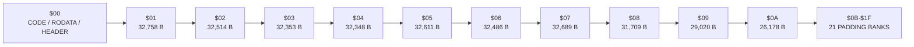

# #126 — Add Ten Public-Domain Masters to the Mode 7 LZSS Gallery

**Status:** IMPLEMENTED AND PUBLISHED (2026-07-26). Extends the ten-work gallery from
[#119](2026-07-26-119-snes-lzss-gallery-carousel.md), using the 219-color CGRAM
layout from [#125](2026-07-26-125-lzss-gallery-full-mode7-color.md).

Mockups: [ten-work contact sheet and 20-work player](2026-07-26-126-lzss-gallery-nine-public-domain-masters/gallery-expansion-mockups.html)

## Goal

Add ten visually distinct, royalty-free masterworks to the existing Mode 7
LZSS gallery without replacing its current ten works. The finished cartridge
contains **20 works**, each rendered from the complete uncropped composition at
the largest aspect-preserving Mode 7 raster that fits 256 tiles and quantized
to at most **219 artwork colors**.

Publish the exact same verified ROM, poster/contact sheet, work order,
attribution, and metadata on biohack.net and indri.studio.

## Agreed additions and order

Append these works after the existing ten in this order:

| # | Slug | Artist | Work | Preferred source |
|---:|---|---|---|---|
| 11 | `earthly-delights` | Hieronymus Bosch | *The Garden of Earthly Delights* | Museo Nacional del Prado |
| 12 | `the-scream` | Edvard Munch | *The Scream* | National Museum of Norway |
| 13 | `third-of-may` | Francisco de Goya | *The Third of May 1808* | Museo Nacional del Prado |
| 14 | `the-kiss` | Gustav Klimt | *The Kiss (Lovers)* | Belvedere, Vienna |
| 15 | `view-of-delft` | Johannes Vermeer | *View of Delft* | Mauritshuis |
| 16 | `wijk-windmill` | Jacob van Ruisdael | *The Windmill at Wijk bij Duurstede* | Rijksmuseum |
| 17 | `flower-still-life` | Ambrosius Bosschaert the Elder | *Flower Still Life* | Rijksmuseum |
| 18 | `sunflowers` | Vincent van Gogh | *Sunflowers* | National Gallery, London |
| 19 | `tableau-vii` | Piet Mondriaan | *Tableau No. VII* | public-domain museum/Commons scan |
| 20 | `ice-skaters` | Hendrick Avercamp | *Winter Landscape with Ice Skaters* | Rijksmuseum |

Use the Rijksmuseum’s public-domain c. 1608 Avercamp image, object
`SK-A-1718`, not a similarly titled canal scene or a cropped detail. The
full-resolution reference is 6278×3626:

- [Rijksmuseum object record](https://www.rijksmuseum.nl/en/collection/object/Winter%2BLandscape%2Bwith%2BIce%2BSkaters--918895dc18da94e357c6763adda8882f)
- [public-domain full-resolution file](https://commons.wikimedia.org/wiki/File:Hendrick_Avercamp_-_Winterlandschap_met_ijsvermaak.jpg)

Picasso, Dalí, and Joan Miró are deliberately excluded: the desired works are
not clean worldwide public-domain additions. Do not silently substitute a
portrait. The Dutch group is landscapes/still life only.

## Rights and source provenance

Before downloading an image, record one canonical object page and one original
image URL. Accept only a source whose object record explicitly labels the work
and digital image public domain, CC0, or an equivalently unrestricted public
domain mark. Artist death date alone is not enough to establish the scan’s
reuse status.

Extend `assets/snes/lzss-gallery/sources.json` so licensing is per work rather
than incorrectly implying that every source comes from the Art Institute of
Chicago:

```json
{
  "slug": "ice-skaters",
  "title": "Winter Landscape with Ice Skaters",
  "artist": "Hendrick Avercamp",
  "provider": "Rijksmuseum",
  "object_url": "...",
  "image_url": "...",
  "license": "Public Domain",
  "license_url": "https://creativecommons.org/publicdomain/mark/1.0/",
  "accessed": "2026-07-26"
}
```

Keep the original source files immutable. Store a SHA-256, pixel dimensions,
MIME type, and attribution string for each download. The asset build must fail
if a download is HTML, unexpectedly tiny, missing its recorded hash, or cannot
be decoded in the project container.

Where several versions exist, choose the named museum’s straight, full-frame
reproduction. Do not use colorized, AI-upscaled, framed, watermarked, poster,
detail, gigapixel tile, or perspective-corrected third-party derivatives. A
filename suffix such as `x0-y1` is a tile coordinate and must fail the source
review unless the manifest explicitly describes a multi-tile reconstruction.
For *The Scream*,
pin the exact version selected in metadata rather than treating the title as a
unique image.

## Composition and 219-color conversion

Use the #122 maximum-resolution solver independently for each source:

1. remove only reproduction borders outside the painted object when the museum
   scan includes them;
2. never crop painted content to fill the SNES screen;
3. preserve source aspect ratio;
4. find the largest integer raster whose ceil-divided 8×8 tile grid contains
   no more than 256 tiles;
5. resize with the existing deterministic high-quality filter;
6. quantize to at most 219 artwork colors;
7. remap into #125’s allowed CGRAM indices `1..27, 32..111, 144..255`;
8. use index 0 only for tile padding and the black surround; and
9. emit the indexed raster, 512-byte BGR555 palette, LZSS stream, report entry,
   and rendered reference.

The new corpus intentionally exercises different failure modes:

- Bosch and Avercamp contain many tiny figures and high-frequency detail;
- Munch and Goya contain dark gradients and strong local contrast;
- Klimt tests gold/yellow texture;
- Vermeer and Ruisdael test subtle sky and water gradients;
- Bosschaert tests saturated small features against a dark ground; and
- Mondriaan tests hard edges, flat fields, and unusually high compression.

Do not reduce these additions to 31 colors. Reports and gallery copy must say
“up to 219 artwork colors.”

## Twenty-work cartridge scaling

The current ten-work runtime uses 16-bit completion and failure masks. Twenty
assets cannot be represented by `1u << i` on the 16-bit SNES target. Replace
the masks with bounded per-work state arrays plus explicit counters:

```c
static uint8_t gallery_done[GALLERY_ASSET_COUNT];
static uint8_t gallery_failed[GALLERY_ASSET_COUNT];
static uint8_t gallery_completed_count;
```

The asset generator must fold every work exactly once in fixed manifest order
and emit the canonical host oracle as `GALLERY_CORPUS_ORACLE`. The ROM exposes
that value only after every target-side exact-stream, second-decode, checksum,
and byte comparison passes. Re-visiting an already completed work must not
increment the count or change its recorded result. Canceled work remains
incomplete.

Extend generated asset tables, bank-section names, and the linker map from ten
through twenty works. Treat every compressed stream and every 512-byte palette
as an independently placeable item; their independent far pointers let the
small palettes fill holes left by large streams. Add generated assertions for:

- every section exists and maps to the intended ROM bank;
- no stream or palette crosses an illegal bank boundary;
- all far pointers have the expected bank;
- the ROM size/header match the expanded image;
- the largest recompression result fits the WRAM buffer; and
- `GALLERY_ASSET_COUNT == 20`.

If twenty dedicated banks do not fit the present cartridge layout, increase
the smallest valid LoROM size and update its header rather than packing data
across banks ad hoc. Record occupied/free bytes per gallery bank in
`report.json` and the linker map.

Navigation remains circular:

```text
Left from work 1  -> work 20
Right from work 20 -> work 1
```

## Cartridge ROM map

This is a **1 MiB LoROM**: 32 banks of 32,768 bytes. The authoritative
[generated ROM map](../../assets/snes/lzss-gallery/derived/rom-map.md) is
regenerated from `build/lzss-gallery.map` after every link; asset-array
estimates are not a substitute for linked section sizes.

### Cartridge-size ceilings

Keep three different limits explicit:

| Target | Maximum useful mapperless ROM | Meaning |
|---|---:|---|
| Physical SNES cartridge | **64 Mbit (8 MiB)** | The largest standard CPU-visible image is an ExHiROM/ExLoROM layout. Ordinary LoROM/HiROM reaches 32 Mbit (4 MiB). A cartridge with custom bank-switching hardware can contain more, so 64 Mbit (8 MiB) is the standard mapperless limit rather than an absolute limit on custom PCBs. |
| MAME SNES cartridge slot | **64 Mbit (8 MiB)** | MAME's standard slot has 256 ROM-bank-map entries, each representing 32 KiB. Its loader can allocate a larger input, but more than 64 Mbit (8 MiB) cannot be represented safely by that bank map and is not a supported mapperless cartridge. |
| bundled bsnes-jg core | **8 MiB (64 Mbit)** | The core detects ExLoROM/ExHiROM headers and its board database maps the two 4 MiB halves. A larger host-side byte vector is not additional CPU-visible ROM unless a supported cartridge coprocessor/mapper exposes it. |

Consequently this gallery has ample room to grow from its current 1 MiB image,
but each proposed growth step must select the smallest power-of-two ROM image
that fits and must remain at or below 8 MiB unless the plan also specifies,
implements, and tests a real custom mapper. Add boundary fixtures at 4 MiB and
8 MiB when this project first changes from LoROM to an extended mapping; reject
an accidentally oversized mapperless image during the build.

Capacity evidence:

- [SNESdev HiROM/ExHiROM memory map](https://snes.nesdev.org/wiki/HiROM)
  documents the normal 4 MiB range and the additional ExHiROM half.
- MAME's
  [`snes_slot.h`](https://github.com/mamedev/mame/blob/master/src/devices/bus/snes/snes_slot.h)
  defines the 256-entry bank map consumed by
  [`snes_slot.cpp`](https://github.com/mamedev/mame/blob/master/src/devices/bus/snes/snes_slot.cpp).
- The bundled bsnes-jg evidence is
  `vendor/bsnes-jg/src/heuristics.cpp` (extended-header detection) and
  `vendor/bsnes-jg/Database/boards.bml` (`EXHIROM`/`EXLOROM` mappings).

Packing uses William B. Norris IV's 1992 `romopt` algorithm: sort all indivisible
items largest-to-smallest, then place each item in the first bank where it
fits. LZSS streams and 512-byte palettes are **separate items** because their
far pointers are independent and the small palettes are useful hole-fillers.
Bank `$00` is excluded from the allocator and remains dedicated to runtime and
shared data; asset packing begins at bank `$01`.

[Open the proportional `romopt` cartridge visualization](2026-07-26-126-lzss-gallery-nine-public-domain-masters/romopt-layout.html).
It is generated from `report.json`, the final linker map, and the cartridge itself:

```bash
python3 tools/lzss-gallery-rom-layout.py \
  --report assets/snes/lzss-gallery/derived/report.json \
  --map build/lzss-gallery.map \
  --rom build/lzss-gallery.sfc \
  --output docs/plans/2026-07-26-126-lzss-gallery-nine-public-domain-masters/romopt-layout.html
```

The renderer inserts a labeled divider after every 32 LoROM banks, marking each
8 Mbit (1 MiB) cartridge boundary.
`romopt` determines which items share a bank; it does not constrain their
physical order inside that bank. The visualization reads symbol addresses from
the final linker map and therefore shows the linker's actual ordering.

The current result uses ten asset banks:



### Superseded one-artwork-per-bank baseline

The following baseline is retained to make the packing improvement auditable;
it is not the shipped layout.

```mermaid
flowchart LR
  B00["$00<br/>CODE + RODATA<br/>26,856 B<br/>HEADER/VECTORS 80 B"]
  B01["$01<br/>GREAT WAVE<br/>15,771 B"]
  B02["$02<br/>BEDROOM<br/>16,348 B"]
  B03["$03<br/>GRANDE JATTE<br/>15,358 B"]
  B04["$04<br/>TWO SISTERS<br/>16,567 B"]
  B05["$05<br/>WATER LILIES<br/>15,470 B"]
  B06["$06<br/>BASKET APPLES<br/>15,712 B"]
  B07["$07<br/>STACK WHEAT<br/>16,211 B"]
  B08["$08<br/>SELF PORTRAIT<br/>17,434 B"]
  B09["$09<br/>PARIS STREET<br/>15,683 B"]
  B0A["$0A<br/>POPPY FIELD<br/>15,327 B"]
  B0B["$0B<br/>EARTHLY DELIGHTS<br/>16,971 B"]
  B0C["$0C<br/>THE SCREAM<br/>15,750 B"]
  B0D["$0D<br/>THIRD OF MAY<br/>15,166 B"]
  B0E["$0E<br/>THE KISS<br/>16,137 B"]
  B0F["$0F<br/>VIEW OF DELFT<br/>12,809 B"]
  B10["$10<br/>WIJK WINDMILL<br/>14,878 B"]
  B11["$11<br/>FLOWER STILL LIFE<br/>14,393 B"]
  B12["$12<br/>SUNFLOWERS<br/>16,307 B"]
  B13["$13<br/>TABLEAU VII<br/>15,816 B"]
  B14["$14<br/>ICE SKATERS<br/>16,558 B"]
  PAD["$15-$1F<br/>11 EMPTY PADDING BANKS<br/>360,448 B"]
  B00 --> B01 --> B02 --> B03 --> B04 --> B05 --> B06 --> B07 --> B08 --> B09 --> B0A
  B0A --> B0B --> B0C --> B0D --> B0E --> B0F --> B10 --> B11 --> B12 --> B13 --> B14 --> PAD
```



Bank `$00` contains `.text` 19,543 B and `.rodata` 7,313 B, leaving 5,832 B
in its `$8000-$FFAF` program region; its separate cartridge header and vectors
occupy the final 80 B. Each artwork bank contains one LZSS stream plus its
512-byte BGR555 palette:

| Bank | Work | Stream | Palette | Used | Free |
|---:|---|---:|---:|---:|---:|
| `$01` | Great Wave | 15,259 | 512 | 15,771 | 16,997 |
| `$02` | Bedroom | 15,836 | 512 | 16,348 | 16,420 |
| `$03` | Grande Jatte | 14,846 | 512 | 15,358 | 17,410 |
| `$04` | Two Sisters | 16,055 | 512 | 16,567 | 16,201 |
| `$05` | Water Lilies | 14,958 | 512 | 15,470 | 17,298 |
| `$06` | Basket of Apples | 15,200 | 512 | 15,712 | 17,056 |
| `$07` | Stack of Wheat | 15,699 | 512 | 16,211 | 16,557 |
| `$08` | Self-Portrait | 16,922 | 512 | 17,434 | 15,334 |
| `$09` | Paris Street | 15,171 | 512 | 15,683 | 17,085 |
| `$0A` | Poppy Field | 14,815 | 512 | 15,327 | 17,441 |
| `$0B` | Earthly Delights | 16,459 | 512 | 16,971 | 15,797 |
| `$0C` | The Scream | 15,238 | 512 | 15,750 | 17,018 |
| `$0D` | Third of May | 14,654 | 512 | 15,166 | 17,602 |
| `$0E` | The Kiss | 15,625 | 512 | 16,137 | 16,631 |
| `$0F` | View of Delft | 12,297 | 512 | 12,809 | 19,959 |
| `$10` | Wijk Windmill | 14,366 | 512 | 14,878 | 17,890 |
| `$11` | Flower Still Life | 13,881 | 512 | 14,393 | 18,375 |
| `$12` | Sunflowers | 15,795 | 512 | 16,307 | 16,461 |
| `$13` | Tableau VII | 15,304 | 512 | 15,816 | 16,952 |
| `$14` | Ice Skaters | 16,046 | 512 | 16,558 | 16,210 |
| `$15-$1F` | Explicit power-of-two padding | 0 | 0 | 0 each | 32,768 each |

Add a reusable map-to-Markdown generator to the verification path. It must fail
if any section is absent, crosses a bank, exceeds 32,768 bytes, overlaps the
header bank, or if the documented totals differ from the final link map.

### Navigation feedback

Every accepted Previous/Next input must produce immediate visible feedback on
the corresponding on-cartridge chevron, regardless of whether it originated
from a keyboard, gamepad, or a tap on the left/right half of the phone canvas.

- On trigger, animate the selected chevron instead of printing `LOADING
  NEXT...` or `LOADING PREVIOUS...`.
- Give the selected chevron a small vertical bounce (for example
  `0,-1,-2,-3,-2,-1,0,+1,0` pixels) plus a bright palette pulse/glow. Preserve
  its horizontal anchor so Previous/Next never appears to jump inward or become
  clipped at the screen edge.
- Hold the peak glow for at least three frames, then return to gold over a
  total animation of roughly 10–16 frames. Loop a gentler bounce/pulse while
  decode remains busy, and settle cleanly when the new work is ready.
- Begin the highlight on the first vblank after the accepted input. The next
  image's decode starts concurrently; feedback must not wait for decoding and
  must not add an artificial loading pause.
- Animate only the triggered direction. The opposite arrow remains gold.
- Ignore key/button auto-repeat already rejected by navigation debouncing;
  a newly accepted input restarts the appropriate arrow animation.
- Keep the feedback visible over the outgoing artwork throughout decode. It
  must not disappear when the outgoing picture begins its final transition.
- Do not display direction-specific loading prose. Preserve the console rows
  for phase progress, timings, and corpus state; the animated chevron alone
  communicates Previous versus Next.
- Use the existing reserved UI colors/sprite budget, without consuming artwork
  palette entries or changing the LZSS timing/oracle.

The linked player mockup shows the right/Next arrow at peak highlight. Test
Previous and Next independently, including touch input in fullscreen portrait
mode and circular wraparound at works 1 and 20.

### Visible test-battery console

The gallery is an on-cartridge LZSS test battery, not merely a slideshow. Make
that purpose continuously legible in the caption band by reserving up to three
additional 8×8 rows below the artist/title/date metadata:

```text
TEST 20/20  DECODE  143F
REPACK 982F  VERIFY 211F
CORPUS 19/20  RUNNING [#######.]
```

The exact numbers above are illustrative. Runtime values always come from the
existing frame counters and completion state.

- During decode, repack, stream comparison, and decoded-byte verification,
  animate the appropriate phase label plus a spinner or eight-cell progress
  bar. Update at least every 8–16 frames so a slow operation never looks
  frozen.
- Once a work completes, retain its measured `DECODE`, `REPACK`, and `VERIFY`
  frame counts together on screen; do not immediately replace them with a
  generic `OK`.
- Show the current work number out of 20 separately from the canonical corpus
  completion count. Browsing a previously completed work must not falsely
  advance corpus progress.
- Render `PASS` in the reserved success color and `FAIL` in the reserved error
  color. A corpus is only `PASS` after all 20 fixed-order oracle contributions
  are complete; before then label it `RUNNING`.
- Chevron animation must not erase or replace the last completed timing
  result. During navigation, keep the console devoted to decode progress and
  the other timing/corpus rows.
- Prefer three telemetry rows. A layout may use two where a two-line title
  requires the space, but every work must show phase animation, all three final
  timings, per-work result, and corpus progress without scrolling.
- Recompute the artwork/caption split as needed; never cover or crop artwork,
  overlap the chevrons, or write beyond scanline 223.
- Console updates are presentation work outside the timed codec intervals.
  Keep the benchmark counters honest and preserve the host-generated `0xB5D7`
  oracle.

### Live compression visualization

Make the repack phase visible on top of the artwork. The primary visualization
is a sprite-based outline of the LZSS run currently being encoded:

- expose a small volatile visualization record from the compressor containing
  token kind, current source offset, match source offset, match length, bytes
  consumed, and bytes emitted;
- convert the current linear source offset back to artwork `(x, y)` and project
  it through the same centered Mode 7 display scale used by the image;
- for a match token, assemble a thin bright outline from reusable OBJ endpoint
  and span tiles. Its horizontal length represents the match length at the
  exact place in the image being compressed;
- split a run that crosses a raster row into two outlined segments rather than
  drawing through the black surround;
- distinguish literals with a compact one-pixel/crosshair marker instead of a
  false run box;
- show the current match brightly and retain several prior outlines as a
  short, progressively dimmer trail, bounded by the available OBJ and
  per-scanline limits;
- sample/coalesce compressor events to at most one visible update per frame.
  The compressor may produce many tokens between vblanks; display the newest
  representative event rather than stalling once per token;
- perform OAM selection/placement from NMI-visible state so compression
  continues while the overlay animates. Do not mutate framebuffer indices,
  Mode 7 tiles, compressed bytes, or the canonical oracle;
- show `MATCH L=18 D=0421` or `LITERAL $7C` in an 8×8 telemetry row, together
  with raw bytes consumed, packed bytes emitted, and live compression ratio;
  and
- hide all compression sprites outside `REPACK`, restoring the normal
  navigation-chevron sprite state afterward.

Build the outline from a small fixed sprite vocabulary—single/literal marker,
left cap, repeatable middle span, right cap, and row-wrap caps—selected and
positioned dynamically. Do not generate character data during compression.
Use reserved UI palette colors: current match cyan/white, match-source marker
gold, and fading history in darker cyan. Assert no scanline exceeds 32 OBJ
sprites and no frame exceeds 128; if necessary, reduce trail length before
dropping the current run.

#### Site-specific REPACK colors

Build two functionally identical ROM variants whose only intended difference
is the current-run outline color:

| Site | Requested color | SNES BGR555 |
|---|---|---:|
| biohack.net | **neon cyan** (an intentional gallery exception to the site's normal orange `--accent`) | `SNES_RGB(8,31,30)` / `0x7BE8` |
| indri.studio | indri-eye neon green `#B8EF00` from `--color-primary-container` | `SNES_RGB(22,29,0)` / `0x03B6` |

Do not substitute biohack.net's general `#C2410C` orange token: the requested
gallery visualization is neon cyan. Keep all non-palette ROM behavior, asset
streams, checksums, WRAM offsets, and the `0xB5D7` oracle identical. Record and
verify a separate ROM SHA-256 for each site.

Store the site-color outline in reserved OBJ palette-0 colors 4/5 (CGRAM
132/133) and encode the outline tile with color index 4. Do **not** select OBJ
palette 1 or write CGRAM 144–159: those indices are part of the 219-color
artwork palette and overwriting them visibly corrupts the image.

All compression-overlay OAM writes must occur immediately after their own
VBlank wait. They must never share or corrupt the two navigation-chevron OAM
entries: throughout `REPACK`, the left and right chevrons remain complete,
stationary, and visible while the run outline moves independently.

The benchmark timing remains wall-clock performance with the visualization
enabled, including its bounded NMI cost. Add a headless build/run comparison
to quantify that cost separately, while requiring identical compressed bytes,
statistics, checksums, and corpus oracle in both modes.

#### Ten candidate compression views

These are compatible ideas, not ten simultaneous overlays. Implement the run
outline first, then select at most one or two secondary treatments after
native-resolution captures:

1. **Current-run outline:** outline the exact destination pixels covered by
   the current match; width directly communicates match length.
2. **Source-to-match link:** place a gold marker at the earlier dictionary
   source and a cyan marker at the current run, with a short dotted sprite
   trail suggesting the backward reference.
3. **Fading run history:** retain the last 4–8 match outlines, dimming with age
   so compressible regions visibly accumulate activity.
4. **Token scanner:** sweep a one-pixel vertical cursor across the raster in
   source order, changing color for literal versus match tokens.
5. **Compression heatmap trail:** stamp tiny translucent-looking dither
   sprites where long matches occur; hotter/brighter stamps represent longer
   runs.
6. **Dictionary window ribbon:** use one 8×8 text row as a 32-cell moving
   ribbon, marking the current byte, lookback distance, and matched interval.
7. **Literal/match lane:** animate tokens into two small sprite lanes below the
   artwork—dots for literals, bars proportional to match length—like a live
   logic analyzer.
8. **Ratio gauge:** maintain `RAW`, `PACKED`, and live percentage text plus a
   horizontal sprite bar that expands or contracts around the 100% break-even
   point.
9. **Match-length histogram:** use 18 tiny columns, one for each supported
   match length, updated during repack to reveal the stream’s token shape.
10. **Bank/tape spool:** animate raw bytes entering one sprite spool and packed
    bytes leaving another; spool speed is proportional to input/output rate,
    while the text rows retain exact counts.

### Caption metadata contract

Each caption includes the work's museum-supported creation date. Preserve the
source's uncertainty: use `C. 1608`, a range such as `1503-1515`, or another
short museum form where appropriate instead of inventing a single year. Record
the unabridged source date in `sources.json`; keep the on-screen rendering
within the existing caption area.

Artist display names have a strict, standing **mixed-font policy**:

- if the artist's full conventional name is 16 characters or fewer (including
  spaces), display the full name in the 16×16 font;
- if it is longer than 16 characters, keep the entire artist name on **one
  horizontal line**, rendering the given-name/prefix portion in the 8×8 font
  and the surname in the 16×16 font;
- vertically align the 8×8 portion within the 16-pixel-tall surname row and
  place the surname immediately after one normal inter-word space; do not put
  either portion above or below the other;
- preserve surname particles with the surname where that is the conventional
  display form, and preserve suffixes such as `THE ELDER` in the 8×8 portion;
- measure the complete mixed-font run before emitting it; if it exceeds the
  256-pixel line, render the complete conventional name in 8×8 instead;
- do not discard names, wrap the artist across lines, or use initials as a
  workaround; and
- apply this rule to every current asset and every gallery addition going
  forward.

The 20-work sweep therefore changes these existing display labels:

| Slug | 8×8 portion | 16×16 portion |
|---|---|---|
| `great-wave` | `KATSUSHIKA` | `HOKUSAI` |
| `two-sisters` | `PIERRE-AUGUSTE` | `RENOIR` |
| `paris-street` | `GUSTAVE` | `CAILLEBOTTE` |
| `third-of-may` | `FRANCISCO` | `DE GOYA` |
| `wijk-windmill` | `JACOB` | `VAN RUISDAEL` |
| `flower-still-life` | fallback: complete `AMBROSIUS BOSSCHAERT THE ELDER` in 8×8 | — |
| `ice-skaters` | `HENDRICK` | `AVERCAMP` |

Names at exactly 16 characters, including `VINCENT VAN GOGH`, `HIERONYMUS
BOSCH`, and `JOHANNES VERMEER`, remain unabbreviated. Keep `PIET MONDRIAAN`
with the agreed Dutch spelling. The asset generator must measure the final
pixel width, center the combined run as one unit, apply the all-8×8 fallback
when necessary, and reject any final caption wider than 256 pixels. Show
position as `11/20` through `20/20` and keep the date, progress/timing text,
and chevrons from overlapping.

### Display-layer contract

The current gallery intentionally uses a scanline split:

- across the artwork band, HDMA selects Mode 7 and enables Mode 7 BG1 plus OBJ;
- across the caption band, HDMA selects Mode 1 and enables BG2, BG3, plus OBJ.

Thus the artwork band has one Mode 7 background layer and sprite chevrons. The
caption/status backgrounds are real BG layers, but only after the raster
switches to Mode 1 near the bottom of the frame; they are not additional
independent Mode 7 planes.

The SNES can expose Mode 7 EXTBG as a second-priority view of the same Mode 7
pixel/tile data, but it is not an independent second tile layer and this gallery
does not enable it. Keep that design unchanged for this expansion. Verify the
HDMA split position against the tallest/widest new compositions so caption BGs
never cover painted content unexpectedly.

## Visual mockup contract

The linked mockup defines two acceptance views:

1. a 3×3 addition sheet that makes the exact selected works and order
   unmistakable; and
2. the on-cartridge experience at work 20, with preserved landscape aspect
   ratio, black surround, two-line caption, `20/20`, and left/right controls.

The mockup uses stylized stand-ins, not source reproductions. Generated
references during implementation must use the licensed scans and actual
BGR555 output.

## Verification

### Asset and codec gates

- Validate every source hash and rights record.
- Assert every derived raster uses only index 0 or the 219 allowed indices.
- Assert index 0 appears only outside the artwork or in partial-tile padding.
- Round-trip every one of the 20 streams with host `-O0` and `-O2` compressors.
- Assert both compressors emit identical bytes.
- Decode emitted indices through the emitted BGR555 palette and compare with
  the deterministic reference.
- Regenerate the contact sheet and report from scratch in the container.

### SNES gates

- Decode, upload, display, recompress, byte-compare, and checksum all 20 works.
- Run the uninterrupted canonical 20-work oracle.
- Re-run after adversarial Left/Right navigation, wraparound, cancellation,
  and repeated visits.
- Capture work 11, work 18, work 19, and work 20 at native 256×224.
- Inspect all additions for crop, aspect distortion, forbidden-color speckles,
  banding, stale palettes, caption overlap, and incorrect black padding.
- Capture both Previous and Next at peak highlight and assert the first changed
  frame occurs immediately after the accepted navigation input while decode is
  in progress. Capture the full bounce/glow sequence and assert horizontal
  position, complete 16×16 shape, and the opposite chevron remain unchanged.
- Record the console at every phase and after completion. Assert that progress
  animation advances during long work, final decode/repack/verify timings
  remain visible, and corpus progress reaches `20/20 PASS` only when the oracle
  completes.
- Capture literal, same-row match, row-wrapping match, maximum-length match,
  and dense-trail compression frames. Verify outline placement against the
  source offsets and audit OBJ totals on every scanline.
- Compare instrumented and headless recompression outputs byte-for-byte and
  report the visualization's frame/cycle overhead without hiding it from the
  displayed benchmark timing.
- Assert every rendered artist label follows the mixed-font, single-line
  policy and that every work renders its recorded creation date.
- Verify the detailed Bosch and Avercamp images remain readable enough at rest
  to justify their chosen raster dimensions.

### Website parity

- Copy each verified site-color ROM variant and the common generated
  poster/contact sheet to its corresponding site.
- Update both descriptions to say 20 works and up to 219 artwork colors.
- Add all ten titles/artists and the source/license attribution to both pages.
- Keep the Mode 7 badge/filter behavior unchanged.
- Build both sites in their existing containers.
- Compare each variant's SHA-256 with its corresponding repository copy and
  live download; the two site ROM hashes are expected to differ only because
  of the requested outline palette.
- Compare the ordered 20-work metadata rendered by biohack.net and indri.studio.

## Publication and documentation

After the ROM passes:

1. update #119, #122, and #125 with the final 20-work measurements;
2. record source and derived hashes, dimensions, colors used, raw/LZSS sizes,
   reduction, timings, checksums, and bank occupancy for every addition;
3. replace both sites’ ROM, poster/contact sheet, cache-busting metadata, and
   manifest offsets;
4. commit and push the source and both website repositories through their
   normal release workflows; and
5. verify both production deployments in the browser.

## Definition of done

- The original ten works remain and the agreed ten are appended in the stated
  order.
- The cartridge and both websites expose the same 20 works.
- Every new scan has explicit reusable public-domain provenance and a pinned
  source hash.
- Every complete composition preserves aspect ratio and may use up to 219
  artwork colors.
- Twenty-work completion, failure, timing, cancellation, wraparound, and
  oracle logic work without a 16-bit mask.
- All 20 host/SNES LZSS round trips and visual gates pass.
- Captions include source-supported dates; artist labels obey the standing
  mixed-font, single-line rule; position, chevrons, Mode 7 badge/filter, and
  fixed UI colors remain correct.
- Previous and Next inputs visibly flash only their corresponding chevron,
  including phone taps, without delaying the next-image decode.
- The on-screen console visibly identifies the gallery as a 20-work test
  battery and exposes animated phases, retained per-work timings, result, and
  canonical corpus progress.
- During repack, sprite outlines identify where matches occur and how long they
  are, while literal/match text and live byte/ratio counters update without
  changing compressed output or exceeding SNES OBJ limits.
- Both live ROM hashes equal the locally verified ROM hash.

## Implementation record

**Verification: PASS.**

Implemented as a 1 MiB LoROM with twenty artworks packed into ten asset banks
using first-fit decreasing. The final corpus is 311,784 indexed bytes and
304,426 LZSS bytes (2.36% reduction), with host-generated oracle `0xB5D7`.
All twenty host `-O0`/`-O2` streams match exactly. The ROM independently
requires every artwork's exact compressed stream, second decode, checksum, and
byte comparison to pass before it publishes that oracle. bsnes-jg reached
`0xB5D7` after 150,000 normal-timing frames; the verified ROM SHA-256 is
`992a575cca7e1bee26bdf894e8c37656dc546e7456914c622126a036cd46cbbf`.

The generated linker-map report proves every stream and independent 512-byte
palette fits its assigned `$8000`-byte LoROM bank. Native captures were
inspected for Bosch, Bosschaert, Sunflowers, Mondriaan, and Avercamp.

The web player now treats touch input on the left/right half of the canvas as
a momentary SNES Left/Right press, including in fullscreen. Both sites expose
the nineteen-work attribution table and generated contact sheet.

Publication:

- biohack.net commit `40d4590`, tag `v1.0.271`;
- indri.studio commit `118988d`, tag `v0.1.97`.

Both deployment workflows passed. The two live ROM downloads match the local
SHA-256 above, and both live cache-busted player scripts contain the touch
navigation handler.

### 2026-07-26 corpus expansion

The rebuilt cartridge contains **26 enabled works** in **8 Mbit (1 MiB)**:
404,576 indexed bytes compress to 400,142 LZSS bytes, a weighted **1.10%**
reduction. Six exact public-domain masters were added:

- George Inness, *The Home of the Heron*;
- unknown Chinese artist, *Dragon*;
- after Gao Kegong, *Scholar in Landscape*;
- Claude Monet, *Houses of Parliament, London*;
- John Singer Sargent, *Thistles*; and
- Vincent van Gogh, *The Starry Night*.

The generated oracle is `0x3D44`. Romopt uses thirteen asset banks (`$01`–`$0D`);
bank `$00` remains exclusively code/shared data. The address-based
[ROM visualization](2026-07-26-126-lzss-gallery-nine-public-domain-masters/romopt-layout.html)
and `assets/snes/lzss-gallery/derived/rom-map.md` were regenerated from the new
linker map.

Three additional Art Institute works remain recorded as disabled candidates:
their metadata is public domain, but the museum IIIF server blocked the exact
master download and no exact Commons equivalent was found. No substitute image
was used.

### 2026-08-01 La Grande Jatte source correction

The original `grande-jatte.jpg` was incorrectly vendored from Wikimedia's
gigapixel tile set as `...-x0-y1.jpg`. It contained only one region of Seurat's
painting, contradicting this plan's complete-composition requirement. It has
been replaced with the complete public-domain master
`File:A Sunday on La Grande Jatte, Georges Seurat, 1884.jpg`, linked to Art
Institute object 27992.

The vendored 1280×852 JPEG has SHA-256
`131ac8fcd2bfb74a7c189c7956ebaef4295e22d3efdcfed7e950ad7fccaf31db`.
The regenerated SNES raster is 152×101 and displays at 240×159, retaining the
entire painted composition and its painted border. Its palette SHA-256 is
`d5e731b930df32b4fe1587304c7d547711f742ee35ee5b91fa9c9a8a0732820d`;
15,352 indexed bytes encode to 14,463 LZSS bytes. The 62-work host oracle,
all-work target decode gate, automatic-joypad navigation gate, and reproducible
ROM link all pass.

### 2026-08-01 navigation pulse and automatic-advance animation

Timed slideshow advances now launch the same right-chevron animation as a
manual Next request, without incrementing the manual-cancellation counter or
adding a blocking transition delay. Browser and phone chevron taps are held as
a 120 ms synthetic joypad pulse so an immediate `pointerup` cannot erase a
click between emulator samples. The ROM retains the correct byte-sized
automatic-reader mapping: `$4219 & $03` is Right/Left for the conventional
`B=$8000` through `Right=$0100` controller word.

The full 62-work target gate and scripted Right-during-decode gate pass. The
reproducible ROM SHA-256 is
`726c421fb708956ccadbdf677c2d856eb4ae1103cd91cec7a590b8ba66ec8dcd`.
