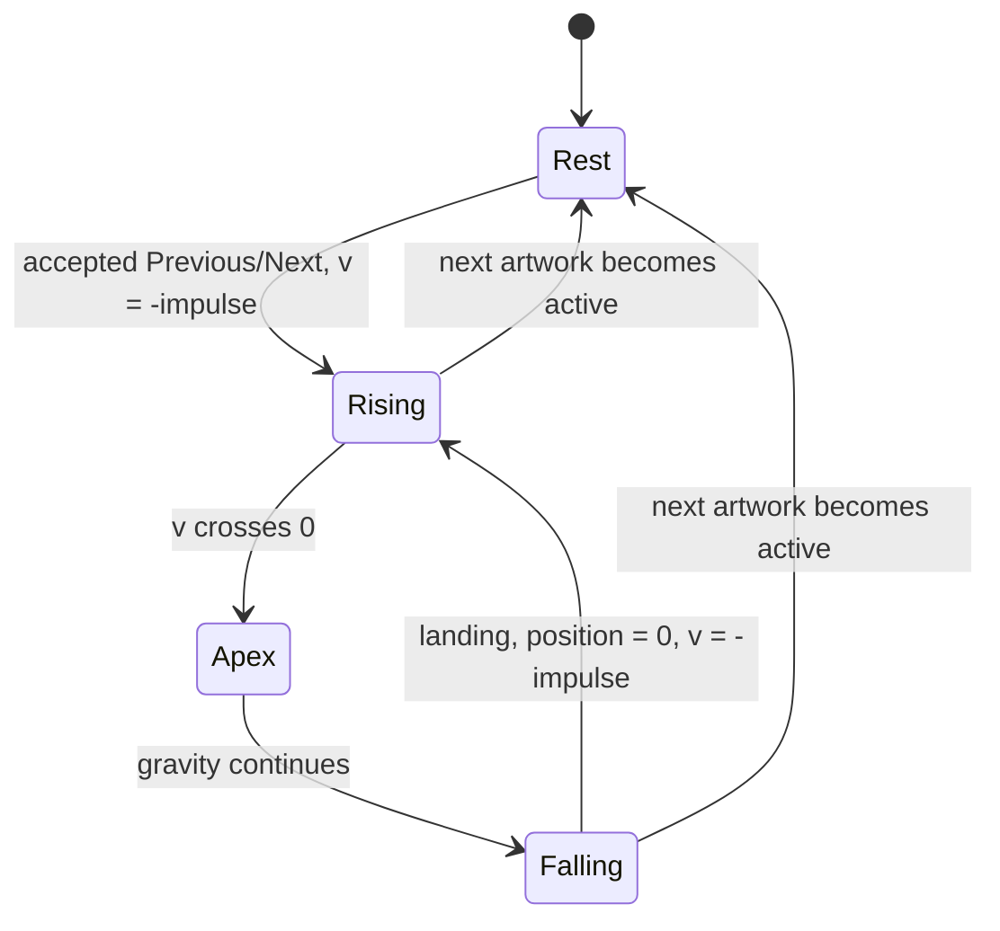

# #128 — LZSS gallery transparent 3D, gravity-driven chevrons

**Status:** planned 2026-07-27. Follow-up to the navigation feedback in
[#126](2026-07-26-126-lzss-gallery-nine-public-domain-masters.md).

**Updated 2026-07-27 (review pass):** corrected the gate facts (26 works, generated oracle
`0x3D44` — the draft's "20-artwork / `0xB5D7`" was stale), fixed the takeoff-impulse sign
contradiction, added the reserved-palette audit (today's destination visuals actually render
black), specified the zipper flight clock against the 256-byte hook cadence, and pinned the
OAM/tile budgets with an explicit degradation order.

Mockup: [transparent gravity-chevron motion study](2026-07-27-128-lzss-gallery-gravity-chevrons/gravity-chevron-mockup.html)

## Goal

Make Previous/Next feedback feel like a small physical object instead of a flashing UI badge:

- remove the opaque black rounded grounds behind both arrows;
- replace the flat stroke with a transparent, beveled 3D chevron;
- slow the selected chevron down;
- move it with velocity, gravity, and a fresh upward impulse whenever it lands; and
- retain the site-colored glow without rapidly alternating tiles.

The opposite arrow stays still. Navigation, decompression, repacking, cancellation, CRCs, and artwork
palettes must remain unchanged.

## Current defects

`load_chevrons()` deliberately fills a rounded 16×16 color-1 badge before drawing the color-2
chevron. Color 1 is black, so both arrows look like buttons with black grounds. That readability
tradeoff is no longer wanted.

The current NMI animation is an eight-frame triangle wave:

```text
offset = 0,1,2,3,3,2,1,0, repeat
```

It has no velocity or acceleration, repeats at about 7.5 Hz, and switches between normal and bright
tiles on three of every four frames. The result reads as nervous vibration rather than weight.

### Reserved-palette audit (pre-existing; fix in this pass)

`load_chevrons()` and `palette()` both write the reserved OBJ colors as CGRAM 132 = 0,
133 = `GALLERY_RUN_COLOR`, 134 = white: the leading `REG_CGDATA=0;REG_CGDATA=0;` pair after
`REG_CGADD=132` completes CGRAM entry 132 itself, shifting accent and white one slot above where
the tiles expect them. Every plane-2 tile and its comments assume palette-0 **index 4**
(CGRAM 132) is the accent and **index 5** (CGRAM 133) the white — so the destination outline
(tile 72) and the "bright" literal diamond (tile 76) render **black**, not accent, on today's
ROM. The bright chevron variant (badge → index 4, face → index 5) happens to look plausible with
a black badge and an accent face, which hid the slip. This pass adopts the contract the tiles
always assumed — **CGRAM 132 (index 4) = site accent, 133 (index 5) = brightest white** —
deleting the stray zero pair and the 134 write in both functions.

## Visual specification

The 16×16 OBJ remains transparent everywhere except the chevron itself. Give the mark three visible
surfaces:

1. a one-pixel pale highlight on its upper-left edge;
2. a three-pixel gold or site-accent front face; and
3. a one-to-two-pixel darker lower-right extrusion/shadow.

The dark pixels must be connected to the chevron as a bevel only. They must never close into a
rectangle, rounded badge, halo, or other backing silhouette.

Author dedicated left and right tile sets instead of obtaining Right with horizontal OBJ flip.
Mirroring a beveled tile would move its highlight to the upper-right and make the scene's light
direction inconsistent. Both arrows use a fixed upper-left light source.

```text
rest                  rising                 apex                  falling

       ❯                 ❯                    ❯                       ❯
  gold 3D face      accent 3D face       brightest face          glow recedes
  no backing        slight raised pose    slight face-on pose     accelerates
```

The mockup shows the chevrons over light, dark, and high-frequency artwork. Transparency is a hard
requirement: pixels outside the stroke must expose the Mode 7 image, not palette color 1.

### Posed 3D animation

The SNES cannot rotate an OBJ geometrically, so use a small set of hand-authored 16×16 poses rather
than attempting affine math:

| Pose | Shape | Use |
|---|---|---|
| rest | full front face, 1 px lower-right extrusion | idle arrow |
| rising | face shifted up 1 px relative to extrusion | upward impulse |
| apex | slightly narrower front face, strongest highlight | brief top-of-arc hang |
| falling | face shifted down 1 px toward extrusion | accelerating descent |
| land | one-pixel vertical compression | exactly one frame on impact |

The pose changes are subordinate to the slow ballistic Y motion. No pose may alter the 16×16
bounding box, move the arrow horizontally, or grow a background. The one-frame landing compression
must not restart the old rapid flashing feel.

## Motion model

Use signed 8.8 fixed point so subpixel acceleration produces slow, smooth integer OAM movement.
Track the airborne offset as a **displacement** from the resting Y — ground is 0, airborne values
are negative, and screen coordinates increase downward, so the integer OAM Y is
`rest_y + (position >> 8)`:

```text
TAKEOFF = 0x00C0            # 0.75 px/frame, upward

position += velocity
velocity += gravity

if position >= 0:           # at or below the ground
    position = 0
    velocity = -TAKEOFF
```

Initial tuning:

| Quantity | 8.8 value | Meaning |
|---|---:|---|
| takeoff velocity | `-0x00C0` | 0.75 px/frame upward, assigned at every landing |
| gravity | `+0x0010` | +0.0625 px/frame² |
| apex | about −4.5 px | restrained movement, not a jump |
| cycle | about 24 frames | roughly 2.5 bounces/second at 60 Hz |

(The math closes: −0x00C0 decelerating at +0x0010 returns to the ground in 24 frames with apex
192²∕(2·16) = 1152 subpixels = 4.5 px. An earlier draft named the table row "upward impulse
−0x00C0" while the pseudocode negated it again — a sign contradiction; the contract is
`velocity := -TAKEOFF = -0x00C0` at every landing.)

The landing rule supplies the requested “push up” on **every** bounce. Do not reflect the incoming
velocity: explicitly assign `velocity = -TAKEOFF`, making the cadence deterministic across long and
short loads. Stop the animation and restore exact resting Y when the requested artwork becomes
active.



## Glow timing

Remove the current `phase & 3` tile alternation. Derive glow from physical state:

- gold face only while **idle at rest** — index 2 appears in no airborne pose;
- site-accent face for the entire active bounce, including the one-frame landing pose (during
  continuous bouncing the ground contact is instantaneous, so gold never flashes mid-cycle);
- brightest reserved color only in the upper half of the arc (the apex pose's highlight); and
- brightness therefore changes at most twice per bounce (rising accent→bright, falling
  bright→accent). Pose artwork also changes, but only at arc milestones — roughly every 5–8
  frames — never on frame parity; the land pose is the only single-frame state, by design.

biohack.net keeps neon cyan; indri.studio keeps neon green. Continue using reserved OBJ palette-0
entries only. Every CGRAM entry above 133 belongs to the artwork's full 256-color upload
(including all higher OBJ palettes) — never touch it. (The draft's "144–159" understated the
artwork's ownership: `palette()` restores only 128–133 after the artwork's 256-color write, so
134–255 are all artwork data.)

Palette-index intent inside each 3D sprite:

| Index | Rest | Triggered |
|---:|---|---|
| 0 | transparent | transparent |
| 1 | dark bevel/extrusion only | dark bevel/extrusion only |
| 2 | gold front face | unused while active — the face moves to index 4 |
| 4 | unused | site-accent front face |
| 5 | pale edge highlight | brightest apex highlight |

Each palette index N lives at CGRAM 128+N: 129 dark, 130 gold, 132 accent, 133 white — valid only
after the reserved-palette audit above is applied (today 132 holds black and the accent sits at
133). This mapping also fixes pose-set arithmetic: glow states map one-to-one onto poses (rest =
the sole gold tile set; rising/falling/land = accent; apex = accent + brightest highlight), so the
total is exactly **10 sprites** (5 poses × 2 directions), not poses × glow treatments.

Index 1 is allowed only in pixels directly adjoining the face; the tile transparency test treats
any detached dark region as a failed reintroduction of the black ground.

## Repack tracker: luminous zipper seam

The bracket experiment is rejected. Its defects are structural:

- tile 72 is a complete 8×8 outline, so repeating it over a run produces a row of separate squares;
- a match deliberately draws both its source and destination, which explains reports of seeing two
  squares; and
- even a corrected three-pixel-high outline makes short single-line matches look like selected
  blocks, which is confusing rather than explanatory.

Replace all source/destination outlines with a luminous zipper:

```text
source                                      destination
  ✦  ·  ⋮  ·  ⋮  ·  ⋮  ·  ✦  ───────────────→
     teeth progressively appear along the seam
```

This is schematic. The ROM uses small alternating upper/lower pixel-art teeth in the site's accent
color and a brighter zipper head. No closed outline, cap, rail, run-length box, or persistent source
marker remains.

### Zipper construction

Generate three transparent 8×8 tiles:

- upper tooth;
- lower/interlocking tooth; and
- bright zipper head.

The visible pixels occupy only a few rows of each sprite cell. Place eight alternating teeth at
evenly interpolated points from the projected source to destination. Reveal them progressively over
the flight, and move one bright head over the same path. Visually coincident endpoints omit the
zipper. Literal tokens retain the existing small bright diamond.

### Flight sampling and cadence

The compressor redraws the scene from its progress hook (`oam_compression()` fires every
256 input bytes from `compress_far()`'s meter). Measurements show adjacent hooks can be more than
32 frames apart, so a frame-expiring latch repeatedly restarted at step zero and displayed only its
head. Advance by presentation hooks instead:

- On a hook with a fresh match event and no active zipper, latch its projected endpoints and set
  `flight_phase = 0`.
- Every later hook re-renders the **latched** event, ignoring newer events for OAM purposes,
  reveals one additional tooth, and advances the head to that tooth.
- Newer match/literal events during an active flight update only the text telemetry rows. "The
  destination persists until the next visualization event" therefore means the next **latched**
  event, not every token.
- After eight hook presentations, the next hook latches its newest match event.
- A literal event with no active flight draws only its diamond; during a flight it leaves the
  scene untouched.

### OAM budget

The visualization owns sprites 2..17 (`OAM_VISUAL_MAX` = 16), all 8×8, X in 0..255, hidden at
Y = 240. Eight teeth plus one head use at most **9 sprites**, leaving seven spare entries. Literal
events use one sprite.

### Atomic lifetime

Treat the visualization as a complete OAM scene, never as incremental sprite edits:

1. clear every compression-visual entry in the WRAM OAM shadow to hidden Y;
2. stage the revealed zipper teeth, head, or literal diamond;
3. publish the whole low-table range during one VBlank DMA;
4. keep every visualization sprite 8×8 with X in 0..255, so the OAM high-table nibbles for the
   range never change after `oam_init()` — assert that invariant instead of rewriting the high
   table; and
5. explicitly hide the complete scene on phase exit, cancellation, and slide preparation.

The zipper animation rebuilds the same complete shadow each step. No old tooth, head, literal, or
source marker may survive merely because the new event uses fewer sprites.

## Implementation

1. In `load_chevrons()`, delete the rounded badge fill. Generate dedicated Left/Right rest, rise,
   apex, fall, and land poses with highlight, face, and extrusion. Confirm transparent pixels have
   all four bitplanes zero.
2. Stop using horizontal flip for Right. Assign dedicated base tiles and audit the OBJ VRAM layout
   so all ten 16×16 poses avoid the compression-outline/cap/span tiles. Add named tile constants
   rather than embedding tile numbers in NMI assembly. Budget: 10 poses × 4 tiles = 40 OBJ tiles,
   plus four 8×8 tracker tiles (upper tooth, lower tooth, zipper head, and literal). Lay the 16×16 poses out in
   row-pairs from tile 64 upward (each row-pair holds eight sprites, so two row-pairs suffice) and
   keep the 8×8 visualization tiles in a row no pose pair touches.
3. Replace `arrow_anim_phase` / triangle offset with signed 16-bit 8.8 position and velocity plus the
   direction and active flag. Keep the NMI save/restore width-safe; if the pose lookup indexes with
   X or Y inside the NMI, save and restore those registers with explicit width control too. Seed the
   physics at acceptance: `nav_target()` sets the direction, `position = 0`,
   `velocity = -TAKEOFF`, active = 1 (replacing today's `arrow_anim_phase = 0`).
4. Update physics once per NMI while active. Clamp the integer OAM Y to the resting Y minus the
   planned maximum travel; never permit unsigned underflow.
5. Select rest/rise/apex/fall/land pose and normal/accent/bright treatment from displacement and
   velocity, not frame parity.
6. Write only the selected arrow's OAM entry during VBlank. The opposite arrow must retain its fixed
   X, resting Y, tile, and full 16×16 shape. On a direction switch (latest-edge-wins, per #124) or a
   stop, the next NMI must first restore the previously animated arrow's rest tile and resting Y —
   a mid-air accent chevron must not stay frozen on the deselected side until `prepare_slide()`
   happens to run.
7. On `prepare_slide()`, clear velocity/position, restore both arrows at rest, and leave compression
   visualization OAM entries untouched.
8. Replace the full-box compression tile and five-dot trail with the progressively closing zipper.
   Build each visualization from an all-hidden WRAM OAM shadow and upload it atomically.
   Add the flight latch (event endpoints + `flight_start`) implementing the sampling rules above.
9. Give source and destination distinct palette roles (dim gold source, site-accent destination)
   without changing artwork CGRAM or the chevron palette contract. Apply the reserved-palette
   audit in the same pass: accent to CGRAM 132 (index 4), white to 133 (index 5), deleting the
   stray zero pair and the 134 write in both `load_chevrons()` and `palette()`.
10. Treat the NMI as emitted-machine-code-sensitive. Use branch-over-`JMP` control flow for any
    conditional target that may grow beyond ±127 bytes, encode 16-bit immediates explicitly until
    the MOS assembler has accumulator-width directives, and audit the emitted NMI bytes in the
    build. Upstream, make `MOSAsmBackend::applyFixup()` diagnose any resolved PCRel8/PCRel16 value
    that remains out of range after relaxation; add an MC negative test so truncation can never
    silently turn a forward branch into a backward one again.

## Verification

1. Tile transparency/bevel test: decode all ten OBJ poses from the ROM and assert every
   non-chevron pixel has palette index 0. Explicitly fail if the old rounded color-1 silhouette is
   present, if a dark pixel is detached from the face, or if either arrow's highlight is not on the
   upper-left edge. Also dump CGRAM at a live frame and assert 129 = dark, 130 = gold,
   132 = site accent, 133 = white — the pre-fix ROM resolves the destination outline and diamond
   to black (CGRAM 132 = 0), which is the red half of this check.
2. Physics unit trace for at least 96 frames:
   - position never crosses below the ground;
   - each landing assigns exactly `-0x00C0`;
   - acceleration is exactly `+0x0010` between landings;
   - a bounce lasts 20–28 frames; and
   - maximum displacement stays between 3 and 6 pixels.
3. Script Right and Left separately in bsnes-jg (the #124 `JGX_NAV` harness build driven by
   `JGX_SCRIPT`). Capture rest, rise, apex, fall, and second-rise frames plus the one-frame landing
   pose. Assert only the selected arrow moves and that no `LOADING ...` prose appears.
4. Pixel-check the arrow's former badge corners against the underlying artwork in every capture.
5. Repack-cursor sprite test:
   - 1–8 px, 9–16 px, and 17+ px runs contain vertical pixels only at their outer caps;
   - wrapped runs receive fresh caps on both row segments;
   - at most eight teeth and one zipper head are visible;
   - literals contain no zipper;
   - a shorter event following a long match leaves zero stale sprites;
   - the OAM high-table nibbles for sprites 2..17 never change after init;
   - every real asset's maximum 18-pixel double-wrapped span fits within 16 sprites;
   - a synthetic future-format span, deliberately larger than today's codec permits, degrades
     source-first per the OAM budget order without partially drawing a scene; and
   - phase exit/cancel hides every visualization entry.
6. Capture match events over light/dark/busy works. Confirm one dim source, one bright continuous
   destination, and one unambiguous closing seam—no square grid and no chicken-foot trail. Assert
   each flight lasts 24–32 NMI-clock frames regardless of hook cadence.
7. Run the complete 150,000-frame, 26-work gallery gate; `corpus_result` equals the generated
   `GALLERY_CORPUS_ORACLE` (currently `0x3D44`). The gate script recomputes the oracle from
   `report.json` — never assert a hardcoded literal (this plan's first draft said "20-artwork /
   `0xB5D7`", both stale).
8. Build both site variants and visually check light/dark/busy works on biohack cyan and indri green.

## Acceptance criteria

- Neither chevron has a black or opaque backing shape.
- Both arrows read as beveled/extruded 3D objects under one consistent upper-left light source.
- Left and Right use dedicated artwork; Right is not a horizontally flipped Left.
- The selected arrow follows a visibly accelerating ballistic arc with an upward impulse on every
  landing.
- The cadence is calm: approximately 24 frames per bounce, with no rapid frame-parity flashing.
- Glow follows the arc and uses the correct site accent.
- The opposite arrow does not move, jump, disappear, or become obscured.
- Matches render as a progressively closing luminous zipper with no outline boxes.
- At most eight teeth and one head connect source to destination; the old five-dot trail is absent.
- A literal, short match, cancellation, or phase change cannot leave stale zipper sprites.
- Zipper teeth, head, and literal diamonds render in the site accent — the reserved
  CGRAM slots hold the contract colors (132 accent, 133 white), not the pre-fix black.
- Navigation stays responsive and all corpus/CRC gates pass.
- The cartridge ROM map continues to be generated from the linker map as required by #126.

## Possible follow-ups (recorded, not in #128 scope)

Keep these alternatives for later visual experiments after the zipper version runs on
hardware. Each should get its own mockup and A/B capture before replacing the selected design:

1. **Corner frame:** four detached corner marks surround the run, leaving its center unobstructed.
2. **Underline ruler:** a thin line below the run with bright start/end ticks.
3. **Scanner beam:** one vertical needle sweeps across the span and leaves a fading underline.
4. **Compression calipers:** opposing jaws squeeze inward around matched bytes.
5. **Endpoint packet:** source/destination diamonds with a traveling particle but no span outline.
6. **Heat ribbon:** a dotted ribbon whose intensity communicates match length.

Do not implement multiple selectable tracker modes in the shipping ROM yet. They would consume OBJ
tiles/OAM budget and complicate evaluation before the clean baseline has been judged.
