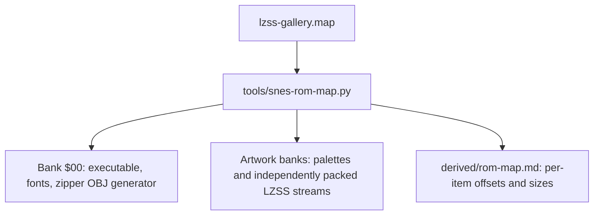

# 129 — LZSS Gallery Luminous Zipper Visualization

**Status:** Draft; prototype implemented, visual and full-corpus acceptance pending  
**Sites:** biohack.net and indri.studio  
**ROM:** `lzss-gallery.sfc`  
**Supersedes:** the compression brackets in plan #128  
**Mockup:** [zipper-visualization-mockup.html](2026-07-27-129-lzss-gallery-zipper-visualization/zipper-visualization-mockup.html)

## Goal

Replace the confusing source/destination run boxes with a visualization that communicates motion
and closure without implying that an LZSS match is a rectangular image region:

> **Zipper:** a luminous seam closes progressively from source to destination.

Keep the literal diamond, telemetry, navigation chevrons, artwork, and site-specific accent colors.

## Rejected baseline

The bracket tracker is not salvageable:

- an 8×8 single-span tile reads as a square around a block;
- source and destination outlines can display two squares;
- reducing the visible height still makes short one-dimensional runs look like selected regions;
- cap/rail sprites explain projected run length more strongly than they explain copying.

Delete the single/start/rail/end tiles and every branch that stages them. No compatibility mode or
hidden bracket fallback remains.

## Visual contract

For each latched match:

1. Project the source and destination byte offsets into the displayed Mode 7 artwork.
2. Place fifteen evenly spaced seam positions along the straight source-to-destination path.
3. Reveal two additional teeth per presentation hook.
4. Alternate upper and lower tooth tiles so the marks visibly interlock.
5. Move one brighter zipper head to the newest revealed tooth.
6. After eight presentation steps, latch the newest available match and begin a new seam.

Each tooth occupies only a few pixels inside its transparent 8×8 OBJ cell. It must never resemble a
closed outline. The zipper uses the site's accent:

- biohack.net: neon cyan;
- indri.studio: neon green.

Literal events retain the small luminous diamond. A literal does not display zipper teeth.

### Edge behavior

- Clamp sprite origins before subtracting the visual center offset; never permit unsigned wrapping.
- Omit a zipper whose projected endpoints coincide.
- Paths may cross artwork rows or travel diagonally; they are diagrams of source-to-destination
  copying, not outlines of the encoded run.
- All pixels outside the tooth/head glyph are palette index zero.

## Cadence

`oam_compression()` is called from the 256-input-byte progress hook. Measurements show hooks can be
more than 32 NMI frames apart, so a frame-expiring flight repeatedly restarted at phase zero.

Use hook cadence:

- latch endpoints with `flight_phase = 0`;
- each subsequent presentation hook increments `flight_phase`;
- reveal `flight_phase × 2 + 1` teeth, clamped to fifteen;
- the ninth hook may latch the newest match.

Newer tokens continue updating text telemetry while a zipper is active. They do not redirect a
partially closed seam.

## OBJ and palette budget

Reserve four 8×8 tracker tiles:

| Tile | Purpose |
|---|---|
| `TRACK_ZIP_UP` | upper/interlocking tooth |
| `TRACK_ZIP_DOWN` | lower/interlocking tooth |
| `TRACK_ZIP_HEAD` | bright moving closure head |
| `TRACK_LITERAL` | unchanged literal diamond |

The maximum match scene is fifteen teeth plus one head: **16 sprites**. Compression visualization
owns exactly 16 OAM entries. Rebuild the entire WRAM OAM shadow for every presentation and
hide unused entries at Y=240 before the atomic VBlank upload.

Use reserved OBJ palette-0 indices 4/5 for accent and white. Do not alter artwork-owned CGRAM
entries or borrow another OBJ palette.

## Implementation

1. Remove bracket constants, tile generation, span counting, cap degradation, and bracket staging.
2. Generate the two tooth glyphs, bright head, and literal diamond at startup.
3. Add `flight_phase` to the latched source/destination state.
4. Interpolate fifteen fixed seam positions with signed intermediate arithmetic.
5. Clamp every staged X/Y origin.
6. Preserve complete-scene OAM clearing on cancellation, slide preparation, and phase exit.
7. Keep the NMI opcode audit for the explicit long conditional and 16-bit `ADC` immediate.
8. Build both site-color variants from identical source.

## Mockup and visual review

The mockup shows four successive closure states over representative horizontal and diagonal paths.
Review these questions before publishing:

- Does it read as a zipper rather than a dotted pointer?
- Are upper/lower teeth visibly interlocking at native 256×224 resolution?
- Is the head distinguishable without becoming another persistent star?
- Does a top-edge or bottom-edge path remain legible after clamping?
- Does the seam obscure too much artwork when all fifteen teeth are visible?

## Verification

1. Decode the four tracker tiles from the ROM and assert transparent pixels are zero.
2. Assert bracket tile constants and bracket-staging symbols no longer exist.
3. Capture phases 1, 3, 5, and 8 on horizontal and diagonal matches.
4. Assert visible zipper sprites progress monotonically from 2 (tooth + head) through 9.
5. Assert no sprite origin wraps from a negative coordinate to the opposite screen edge.
6. Capture a literal and assert exactly one diamond with no teeth.
7. Script Left and Right navigation during repack; cancellation must clear the full zipper scene.
8. Run quick bsnes-jg gates for neon cyan and neon green.
9. Instrument `gallery_progress` during the full gate. Distinguish a stalled work from an
   insufficient frame ceiling; do not accept a run where `corpus_result` remains zero.
10. Complete all 26 works and assert `corpus_result == GALLERY_CORPUS_ORACLE` (`0x3D44`).

## Cartridge ROM map

Generate the cartridge map from the linker map on every build:

The generated report, not this schematic, is authoritative. Continue packing independent linker
items largest-first into the first bank where each fits. Do not bind an artwork stream and its
512-byte palette into one indivisible item; small independent items are useful bank fillers.

The map gate fails on overlap, bank overflow, missing artwork, or any item not accounted for by the
linker-derived report.

## Site delivery

1. Build biohack.net with the neon-cyan accent and indri.studio with neon green.
2. Copy each verified ROM to its site repository and update its manifest checksum/self-check data.
3. Build both sites and verify their gallery/player routes locally.
4. Confirm the live-served ROM hashes after deployment.
5. Commit, push, and publish only as explicit release actions.

## Acceptance

- No square, bracket, cap, rail, or rectangular run outline can appear.
- A match visibly closes as an alternating luminous seam.
- Literals remain a single correct diamond.
- Top/bottom/left/right edge paths never wrap or clip unexpectedly.
- Navigation remains responsive during repack.
- Both site-color variants pass quick gates.
- The complete 26-work corpus reaches `0x3D44`.
- The linker-generated cartridge map accounts for every ROM item.
