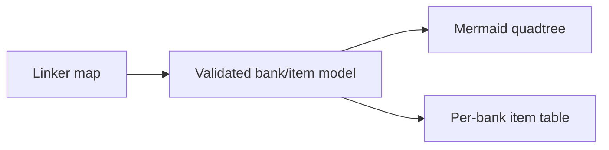

# 131 — SNES Cartridge Map as a Mermaid Quadtree

**Status:** Ready to implement
**ROM:** LZSS Mode 7 Gallery, 1 MiB LoROM
**Generator:** `tools/snes-rom-map.py`
**Mockup:** [quadtree-cartridge-map-mockup.html](2026-07-27-131-snes-cartridge-map-mermaid-quadtree/quadtree-cartridge-map-mockup.html)

## Goal

Replace the current left-to-right bank chain with a spatial hierarchy that matches the cartridge's
power-of-two organization:

```text
1 MiB cartridge
├── 256 KiB quadrant $00-$07
│   ├── 64 KiB cell $00-$01
│   │   ├── 32 KiB bank $00
│   │   └── 32 KiB bank $01
│   └── three more 64 KiB cells
└── three more 256 KiB quadrants
```

The generated Mermaid diagram is the overview; the existing per-bank item table remains the
authoritative detail view.

## Why a quadtree

- The ROM is exactly 1 MiB: a power-of-two square.
- Its 32 LoROM banks are uniform 32 KiB leaves.
- Four 256 KiB quadrants expose occupied versus padded regions immediately.
- Each quadrant naturally contains four 64 KiB cells.
- Each 64 KiB cell resolves to a pair of adjacent LoROM banks.
- The hierarchy remains readable if later ROMs use more banks or different occupancy.

The final 64 KiB-to-32 KiB division is binary because the physical leaf is a 32 KiB LoROM bank.
Calling the overall structure a quadtree is still accurate: the spatial hierarchy uses four-way
quadrant subdivision until the final physical bank pair.

## Mermaid structure

Generate one spatial `treemap-beta` diagram:

1. Root node: cartridge size, mapping, bank range, occupied/padding totals.
2. Four quadrant nodes:
   - Q0: `$00-$07`
   - Q1: `$08-$0F`
   - Q2: `$10-$17`
   - Q3: `$18-$1F`
3. Four 64 KiB cells beneath each quadrant.
4. Two equally weighted 32 KiB bank leaves beneath each cell.

Every bank leaf uses the physical value `32768`, including padding. That preserves the cartridge's
actual geometry; occupancy is expressed by label and color rather than shrinking empty banks out of
the map.

Every bank leaf shows:

- bank number;
- concise contents summary;
- bytes used and free;
- stream/palette counts where names would overflow.

Bank `$00` is explicitly labeled as system/code/RODATA/header. Empty padding banks remain individual
leaves so the 1 MiB topology is visually honest.

## Occupancy colors

Use Mermaid classes generated from linker-derived free space:

| Class | Rule | Meaning |
|---|---:|---|
| `system` | bank `$00` | executable/system bank |
| `critical` | free < 32 B | essentially full |
| `tight` | free < 256 B | little placement flexibility |
| `packed` | free < 1,024 B | efficiently packed |
| `used` | other occupied bank | meaningful remaining room |
| `empty` | zero gallery bytes | explicit ROM padding |

Quadrants and 64 KiB cells use neutral hierarchy colors. Do not encode status with color alone:
every occupied bank also prints exact used/free byte counts.

## Concise content labels

Keep up to two stream names in the leaf because streams dominate placement. Summarize palettes:

```text
$06 · 32,694 B used
KISS LZ + HOME HERON LZ
+ 3 palettes · 74 B free
```

If a bank has no stream, print its palette count. Full titles remain in the table below the
diagram.

## Generator implementation

1. Preserve linker-map/report validation and the 32-bank limit.
2. Build a 32-element bank model containing items, stream bytes, palette bytes, used bytes, and
   free bytes.
3. Add bank `$00` as a system leaf and materialize every padding bank through `$1F`.
4. Generate root, quadrant, cell, and bank nodes with stable IDs.
5. Emit deterministic root→quadrant→cell→bank edges.
6. Emit class definitions and assign every leaf exactly one occupancy class.
7. Retain the detailed Markdown table and generated-file warning.
8. Fail if any linked gallery section, expected item, size, bank, or total is inconsistent.

## Mockup

The HTML mockup renders a compact four-quadrant cartridge square with nested 64 KiB cells and bank
pairs. It is a visual design reference; the shipping documentation uses the generated Mermaid
hierarchy, not hand-maintained HTML.

Review:

- Can the occupied `$00-$0D` region and padded `$0E-$1F` region be understood at a glance?
- Are critical banks `$01-$04` visually distinct?
- Are stream names readable without making leaves enormous?
- Does the diagram remain useful on a narrow browser viewport?

## Verification

1. Run the generator twice and compare byte-for-byte output.
2. Assert exactly 1 root, 4 quadrants, 16 cells, and 32 bank leaves.
3. Assert each bank `$00-$1F` appears exactly once as a leaf.
4. Assert every leaf has exactly one occupancy class.
5. Assert linked used/free totals match the existing table.
6. Assert `$03` reports 32,758 used and 10 free for the current build.
7. Assert `$0E-$1F` are individual empty leaves, totaling 589,824 padding bytes.
8. Render with `task md -- assets/snes/lzss-gallery/derived/rom-map.md`.
9. Open the rendered HTML and visually inspect the hierarchy.

## Cartridge-map requirement

This plan changes the cartridge map itself. The same linker-derived map remains mandatory in every
SNES ROM plan going forward:



Never hand-author occupancy data. The linker map and generated artwork report remain authoritative.

## Acceptance

- The generated overview is a Mermaid quadtree hierarchy, not a linear bank chain.
- All 32 physical LoROM banks are visible.
- Tight occupancy and empty padding are immediately distinguishable.
- Exact byte counts and complete item names remain available.
- Generation and rendering are deterministic and pass all validation checks.
