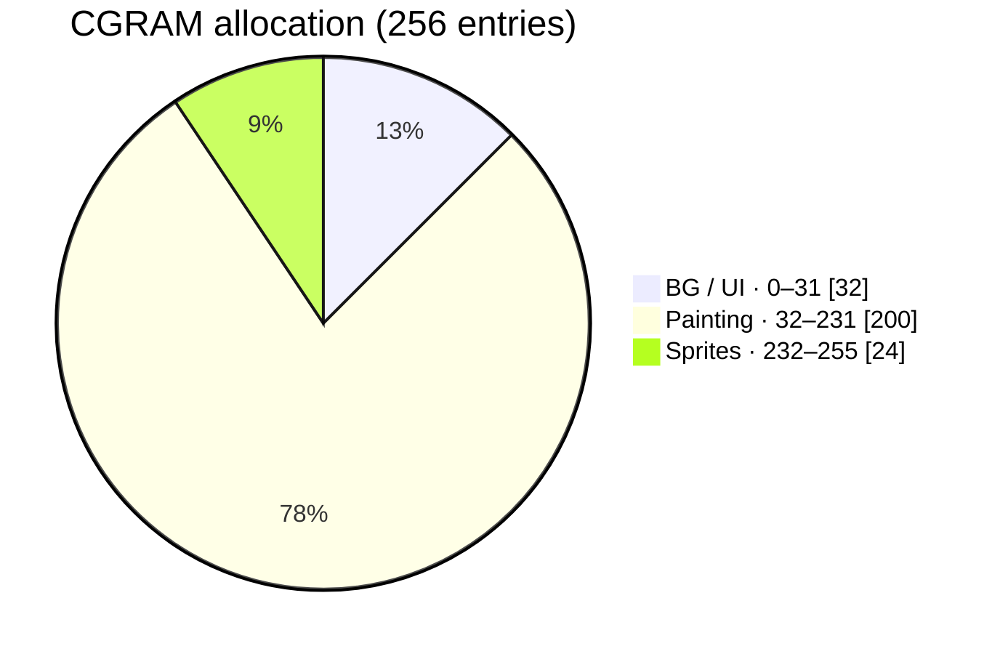
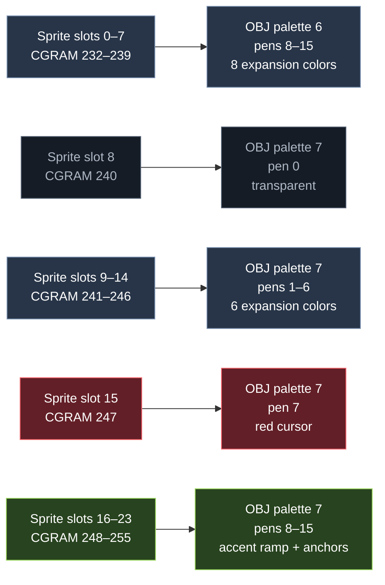
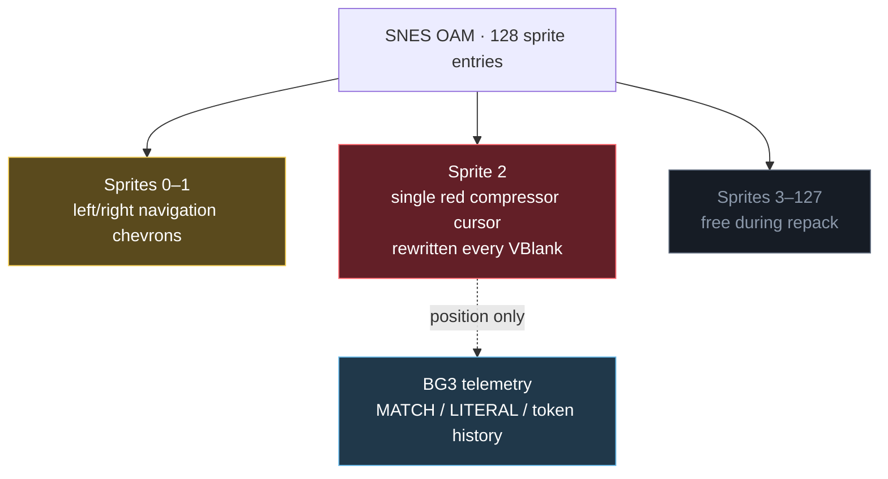
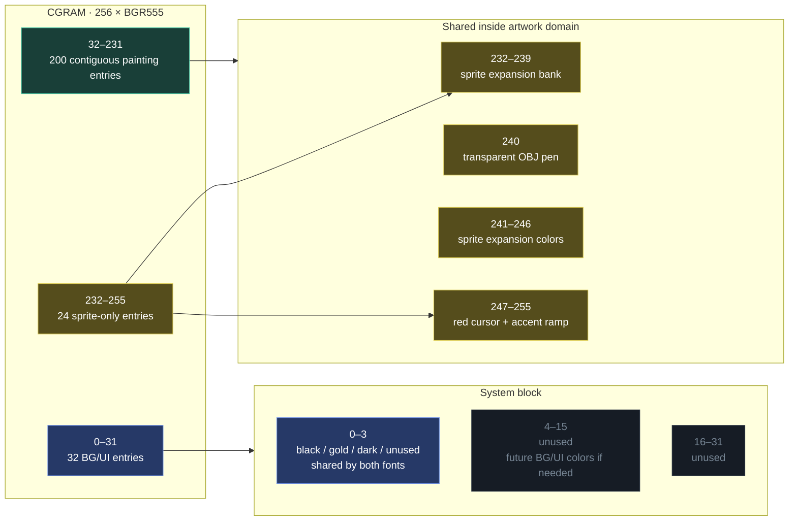

# #136 — LZSS Gallery: Contiguous High-200 Artwork Palette + 24-Color Sprite Block

**Status:** PLANNED  
**Source:** Extracted from the implemented CGRAM contract in
[#125 — LZSS Gallery: Full Mode 7 Color](2026-07-26-125-lzss-gallery-full-mode7-color.md).

> **Settled palette capacity (2026-07-28): 221 colours, `3..223`.** #139 tried to raise this plan's
> allocation to 223 by lending CGRAM `1..2` to the painting and swapping them at the raster split
> with HDMA; that corrupted every painting, because CGRAM is only writable during VBlank or forced
> blank. #139 is retired. The shipped contract is:
>
> | CGRAM | Owner |
> |---|---|
> | `0` | black surround, partial-tile padding, font background |
> | `1` | dashboard gold ink — **static**, baked into every `.pal` |
> | `2` | dashboard dark ink — **static** |
> | `3..223` | 221 adaptive painting colours |
> | `224..255` | reserved sprite block (this plan's rationale stands) |
>
> Retain this document for the contiguous-palette and sprite-block reasoning; take the numbers
> above rather than either plan's original figure.

## Goal

Replace the gallery's fragmented artwork indices:

```text
1–27, 32–111, 144–255
```

with one contiguous 200-entry range immediately below a dedicated 24-entry sprite block:

```text
32–231
```

Every painting receives up to 200 colors (was 219). CGRAM 232–255 is reserved as one deliberately
roomy sprite block for the chevrons, the red compressor cursor, and future overlay vocabulary.
The match/literal sprite effect is retired; its state remains textual telemetry. The change makes the artwork palette contiguous,
makes the first 32 entries an obvious BG/UI block, reserves the final eight entries exclusively for
sprites, and removes the sparse-index translation from the asset pipeline.

The displayed composition, dimensions, Mode 7 tile budget, source attribution, LZSS format, and
navigation behavior must not change.

## Existing mapping extracted from #125

| Indices | Count | Current owner |
|---:|---:|---|
| 0 | 1 | Transparent/black artwork surround and padded tile pixels |
| 1–27 | 27 | Artwork |
| 28–31 | 4 | Mode 1 BG3 palette 7: 8×8 title, progress, and status |
| 32–111 | 80 | Artwork |
| 112–127 | 16 | Mode 1 BG2 palette 7: 16×16 artist text |
| 128–143 | 16 | OBJ palette 0: navigation and compression sprites |
| 144–255 | 112 | Artwork |

The current artwork allocation totals `27 + 80 + 112 = 219` colors, but it has three disjoint
ranges because whole BG and OBJ palettes were conservatively excluded.

## Requested mapping

| Indices | Count | New owner |
|---:|---:|---|
| 0 | 1 | Black: Mode 7 surround/padding and transparent/background pen for both fonts |
| 1 | 1 | Gold font ink shared by BG2 and BG3 |
| 2 | 1 | Dark font shadow/secondary ink shared by BG2 and BG3 |
| 3 | 1 | Black/unused fourth BG3 pen; retained because a 2bpp palette has four entries |
| 4–15 | 12 | Currently unused; natural future use is additional BG/UI colors, not font-size-specific colors |
| 16–31 | 16 | Unused |
| **32–231** | **200** | **Painting image colors** |
| **232–255** | **24** | **Sprite-only block: chevrons, red cursor, future use; 23 visible colors plus OBJ palette-7 transparent pen 0** |

This is the normative mapping. Generated constants must name the boundaries; generator and runtime
code must not contain independent numeric copies.

### Intentional font-palette overlap

Mode 1 gives BG2 a 4bpp palette and BG3 a 2bpp palette:

- BG2 palette 0 addresses CGRAM `0–15`;
- BG3 palette 0 addresses CGRAM `0–3`.

Therefore BG3's complete four-color palette can be an exact subset of BG2's sixteen-color palette.
The two gallery fonts already use the same black, gold, and dark-outline colors, so no visual
compromise is required. Both tilemaps must select palette 0. Index 0 simultaneously serves as the
font background, Mode 7 black surround, partial-tile padding, and transparent OBJ pen.

No current gallery feature uses indices `4–31`. Do not describe them as diagnostics, expansion
space, or UI ownership unless an implementation actually assigns such a use.

Font size must not imply a separate color scheme. The 8×8 and 16×16 fonts should normally share
the same white-or-gold foreground, dark secondary ink, and black background. If indices `4–15`
are assigned later, prefer actual background-layer needs—panels, borders, meters, or other UI
graphics—over redundant colors for one font size.

## Dedicated sprite tail

The SNES fixes all eight OBJ palettes at CGRAM `128–255`; OBJ colors cannot be moved into the low
BG/UI block. Reserve the final 24 CGRAM entries. They span OBJ palette 6 pens 8–15 and all of OBJ
palette 7:

The plan numbers the reserved block linearly as sprite slots 0–23. Hardware palette/pen numbering
is secondary and resets at CGRAM 240; this is an SNES addressing boundary, not a second allocation.

| Sprite slot | CGRAM index | OBJ palette/pen | Fixed anchor |
|---:|---:|---:|---|
| 0–7 | 232–239 | OBJ palette 6, pens 8–15 | Sprite-only expansion colors |
| 8 | 240 | OBJ palette 7, pen 0 | Sprite-only transparent anchor (never visible) |
| 9–14 | 241–246 | OBJ palette 7, pens 1–6 | Sprite-only expansion colors |
| 15 | 247 | OBJ palette 7, pen 7 | Sprite-only live compressor cursor red |
| 16 | 248 | OBJ palette 7, pen 8 | Sprite-only accent shading ramp, step 1 (dimmest) |
| 17 | 249 | OBJ palette 7, pen 9 | Sprite-only accent shading ramp, step 2 |
| 18 | 250 | OBJ palette 7, pen 10 | Sprite-only accent shading ramp, step 3 (brightest below the accent) |
| 19 | 251 | OBJ palette 7, pen 11 | Sprite-only dark outline/shadow |
| 20 | 252 | OBJ palette 7, pen 12 | Sprite-only gold |
| 21 | 253 | OBJ palette 7, pen 13 | Sprite-only glow intermediate |
| 22 | 254 | OBJ palette 7, pen 14 | Sprite-only site accent: neon cyan or neon green |
| 23 | 255 | OBJ palette 7, pen 15 | Sprite-only white highlight |

The ramp exists for #128's gravity-chevron 3D shading (the apex-arc glow): steps 1–3 at `248–250`
rise toward the site accent at `254`, with `253`/`255` continuing to serve as glow intermediate and
top highlight. The ramp colors are derived from the site accent, so they differ between the two
site variants exactly as `254` does.

<!-- REVISED 2026-07-27 (Will, via the biohack.net session — external edit to this in-flight doc):
     the sprite-tail table's 241–250 row ("unused by sprite tiles") was removed per Will — those
     entries are just part of the normative 32–250 painting range; the table now lists only the
     fixed anchors (240 transparent pen, 251–255 sprite-only tail). The paragraph below keeps the
     rationale: sprites COULD index pens 1–10, but they're rewritten per artwork, so using them
     would need runtime palette-matching — too much effort; converter should reject such pixels.
     THEN (same day) Will opted INTO the chevron shading ramp: sprite tail grew 5 -> 8 entries
     (248–255, pens 8–15), paintings 219 -> 216 (32–247), free adaptive pens now 1–7.
     The live compressor cursor then reserves one more painting entry: 247 / pen 7 becomes red,
     paintings become 215 (32–246), and only pens 1–6 remain adaptive.
     Final decision: reserve 24 entries total (232–255), yielding 200 painting colors (32–231),
     23 visible sprite colors, and palette-7's mandatory transparent pen at 240. All normative
     ranges in this doc reflect that final state; "219" survives only in historical/legacy-mapping
     text and in the public-copy update task. See "Implementing the accent shading ramp". -->
Painting pixels must never use `232–255`. All 200 painting colors at `32–231` are adaptive; none
are forced to match sprite colors. The converse is a rule, not a hardware fact: sprite tiles are
4bpp sprites can use the reserved colors through palette 6 or 7. Current overlay tiles use palette
7: pen 7 is cursor red and pens 8–15 retain the established accent roles; pens 1–6 are reserved
expansion colors. Palette-6 pens 8–15 form a second eight-color expansion bank. The converter must
validate the selected palette and pen against this block rather than assuming one palette.
The transparent OBJ pen at 240 does not produce a visible color because
SNES transparency is determined by the sprite pixel value, not by CGRAM ownership.

Generate separate palette variants for the two site accents, or generate one neutral canonical
palette plus a deterministic site-specific sprite-tail patch. Both variants must use identical
indexed pixels and LZSS streams. The only permitted ROM difference is palette bytes/checksum caused
by the accent-derived entries: indices 248–250 and 254.

The complete generated 512-byte palette must already contain the correct sprite-only colors at
`232–255`; no post-upload restoration is required.

## Implementing the accent shading ramp (decided 2026-07-27)

The ramp is not reservation-only — this plan includes putting it to use:

1. **Generator** (`tools/lzss-gallery-assets.py`): derive the three ramp BGR555 values at
   `248–250` deterministically from the site accent at `254` (one shared formula, e.g. linear
   interpolation accent→dark in perceptual-ish steps; document the exact formula in the generated
   constants). Both site variants use the same formula so the only variant deltas remain
   `248–250` + `254`.
2. **Chevron art (#128)**: redraw the gravity-chevron tiles' arc shading with pens `8–10` rising
   into `14` (accent) — the apex-arc glow the #128 plan wants — keeping `11` (dark outline),
   `12` (gold), `13` (glow intermediate), `15` (white highlight) roles unchanged. The zipper,
   scanner, match-anchor, needle, and literal-diamond effects are all retired per #137; the only
   repack sprite is the red cursor on pen 7.
3. **Live compressor cursor (#137)**: reserve pen `7` / CGRAM `247` for invariant red. It is not
   accent-derived and must be identical in both site variants.
4. **Converter check**: validate palette/pen pairs: palette 7 pens 1–15 and palette 6 pens 8–15
   are sprite-owned; palette 7 pen 0 is transparent. Retain role checks for cursor-only pen 7 and
   the established accent anchors.
5. **Public copy (do in the same landing):** both sites advertise "up to **219** artwork colors" —
   update to **200** in biohack.net's lzss-gallery lede/desc (`src/pages/snes/lzss-gallery.astro`,
   `src/content/snes/lzss-gallery.json`) and indri.studio's gallery registry entry, in the same
   change that ships the rebuilt corpus. (biohack's build asserts the desc's artwork *count*
   against the catalog; the color-count copy is unasserted — update it by hand.)

## Visual mapping mockup

### Capacity allocation



The painting keeps 78.1% of CGRAM. The sprite reservation is exactly 9.4%: 24 entries, not two
complete OBJ palettes. The remaining 12.5% is the low BG/UI block.

### Linear sprite slots versus SNES hardware pens



The sprite-slot number is the plan's stable, linear identifier. Palette and pen are the SNES
encoding needed by OAM/tile data. Pen numbering restarts at CGRAM 240 because that is the start of
OBJ palette 7.

### Final visible sprite ownership



There is no match needle, underline trail, source/destination anchor, or literal diamond. Algorithm
state is text; the only repack sprite reports position.



Compact index strip:

```text
  0–3                 4–15               16–31       32                    231 232–255
┌──────────────────┬─────────────────┬───────────┬─────────────────────────┬────────┐
│ SHARED FONT      │     UNUSED      │  UNUSED   │    PAINTING · 200       │ SPRITE │
│ BLACK/GOLD/DARK  │                 │           │                         │ + RAMP │
└──────────────────┴─────────────────┴───────────┴─────────────────────────┴────────┘
```

## Asset-generator changes

Update `tools/lzss-gallery-assets.py`:

1. Replace `ART_INDICES` with the contiguous tuple `range(32, 232)`.
2. Set `ART_COLORS == 200` as an assertion.
3. Quantize all 200 painting colors adaptively; sprite colors do not participate in quantization.
4. Map dense quantizer output monotonically to `32–231`; do not maintain a sparse lookup table.
5. Emit all 256 BGR555 entries deterministically:
   - `0–3` contain the overlapping BG2/BG3 font colors;
   - `4–31` are deterministic black and unused;
   - `32–231` contain adaptive painting colors; and
   - `232–255` contain sprite-only colors (cursor red at `247`; the 3-step accent ramp at `248–250` computed
     deterministically from the site accent — same formula for both variants).
6. Assert every non-padding pixel is in `32–231`.
7. Assert padding and surround pixels are exactly index 0.
8. Assert sprite indices contain their required site-specific BGR555 values.
9. Record mapping version, artwork range, sprite indices, actual used-color count, palette hash,
    and variant name in `derived/report.json` and `derived/catalog.json`.

Quantize the painting independently of all UI colors, then place its dense palette at `32–231`.
Do not depend on undocumented palette ordering.

## Runtime changes

Update `examples/snes/lzss-gallery.c`:

- change the 8×8 tilemap from BG3 palette 7 to palette 0;
- change the 16×16 tilemap from BG2 palette 7 to palette 0;
- define CGRAM `0–3` once as the shared subset required by both fonts;
- write deterministic black to unused entries `4–31` and never reference them from a tile or sprite;
- replace numeric CGRAM boundaries with generated ownership constants;
- upload the complete generated palette once per work;
- remove post-upload restoration of indices `28–31`, `112–127`, and `128–143`;
- select OBJ palette 7 for the chevrons and #137 red cursor; no other repack sprites remain;
- remap the cursor to palette-7 pen 7 and current overlay pixels to palette-7 pens `8–15`;
- retain an assertion/audit for palette/pen ownership across the complete `232–255` block;
- retain index 0 for partial tiles and the black outside-image surround; and
- ensure cancellation cannot reveal a half-uploaded palette.

The title sequence may continue using its own temporary palette because `title_end()` completes
before gallery palette ownership begins.

## Generated assets, compression, and cartridge layout

Regenerate every enabled work. This changes:

- indexed pixels;
- BGR555 palettes;
- raw hashes and checksums;
- LZSS streams and sizes;
- host and target corpus oracle;
- ROM checksum and SHA-256;
- linker packing; and
- the generated cartridge map.

Run first-fit-decreasing on every stream and every 512-byte palette as independent items. Generate
`assets/snes/lzss-gallery/derived/rom-map.md` from the actual linker map. The plan is not complete
if the generated map is stale or if any enabled work is silently removed to make the ROM fit.

If the new entropy prevents the existing corpus from fitting, stop and report exact overage and
bank fragmentation. Do not delete paintings, lower their resolution, reduce their color count, or
split a stream without an explicit follow-up decision.

## Web gallery requirements

Regenerate the web thumbnails and contact sheet from the new indexed pixels and emitted palette,
not from the original museum JPEGs. Update both:

- `biohack.net`;
- `indri.studio`.

Every enabled cartridge work must appear on both gallery webpages, in cartridge order, with the
same artist, title, year, source link, and derived thumbnail. Add a generation-time equality gate:

```text
ROM work slugs == catalog slugs == biohack webpage slugs == indri webpage slugs
```

Publish as soon as asset generation, the quick ROM smoke test, and both site builds pass. Continue
the exhaustive emulator corpus run after publication and report any late failure immediately.

## Verification

### Static gates

- `ART_INDICES == tuple(range(32, 232))`;
- exactly 200 artwork indices;
- every image pixel is 0 or `32–231`;
- index 0 occurs only in painting padding/surround (font tiles may also use it as background);
- low font entries and the exclusive sprite tail match the generated contract;
- every visible sprite resolves inside CGRAM `232–255`, and transparent pixels use palette-7 pen 0;
- palettes are exactly 512 bytes;
- source, report, catalog, ROM, and both webpages have identical enabled-work counts and order;
- linker-derived cartridge map matches the final ROM; and
- `git diff --check` passes in every changed repository.

### Visual gates

Inspect the complete derived contact sheet and emulator captures for:

- palette corruption around the ownership boundaries at indices 31/32 and 231/232;
- UI colors leaking into large painting regions;
- black or transparent speckles inside paintings;
- broken title/status/artist text;
- incorrect biohack neon-cyan or indri neon-green accents;
- chevron contrast and the #137 red cursor's visibility over both dark and bright paintings;
- the chevron accent ramp reading as smooth 3-D shading (no banding into the flat accent) over both dark and bright paintings; and
- stale colors when navigating rapidly between unrelated palettes.

Capture at least one dark, one bright, one highly saturated, and one low-saturation work on both
site variants.

### Functional gates

- host `-O0` and `-O2` streams are byte-identical;
- every host stream round-trips;
- SNES decode → display → repack → golden compare → decode → checksum passes for every work;
- quick bsnes-jg smoke passes before publication;
- full bsnes-jg corpus completes at the new oracle;
- targeted first/middle/last work runs pass;
- repeated Left/Right cancellation passes during decode and repack; and
- both Astro production builds succeed with every generated image present.

## Completion record

When implemented, append:

- final palette constants and anchor colors;
- enabled work count;
- raw and compressed corpus totals;
- new oracle, ROM checksum, and SHA-256;
- final per-bank occupancy and free space;
- contact-sheet and emulator-capture paths;
- test results and frame budget;
- core, biohack.net, and indri.studio commits;
- release tags and deployment results; and
- any visual difference between the cyan and green site variants.
