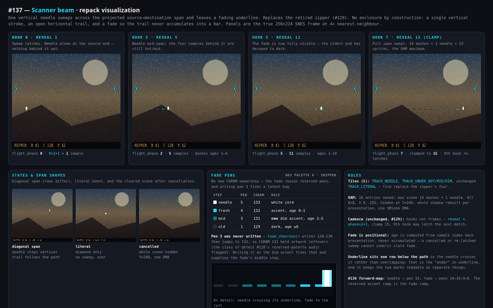
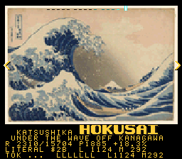
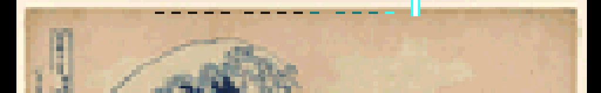

# #137 — LZSS Gallery: Retire the Zipper, New Repack Visualization

**Status:** CLOSED 2026-07-28 — **superseded within hours of shipping.** The scanner beam was
implemented and gated on 2026-07-27, then retired along with every other span-drawing attempt in
favour of the **live compressor cursor** (a single moving playhead, colour-cycling per #137-followup).
Kept as the record of the third and final attempt to draw the match *span*, and of why that whole
family of designs was abandoned.

**The lesson, stated once:** brackets enclosed a region; the zipper's interlocking teeth read as a
closed object; the scanner beam's fading underline still drew *the extent of the match*. Every one
of them answered "where did this copy come from" with a shape spanning two points, and every one was
read as "this rectangle is selected". The cursor stops answering that question visually — it shows
*where the compressor is now* and leaves span/length to the telemetry line. Do not propose a fourth
span-drawing visualization without addressing that.
**Sites:** biohack.net and indri.studio
**ROM:** `lzss-gallery.sfc`
**Supersedes:** [#129 — Luminous Zipper Visualization](2026-07-27-129-lzss-gallery-zipper-visualization.md)
(shipped as a prototype, retired before visual/full-corpus acceptance)

## Goal

Remove the zipper seam visualization from the gallery's repack stage and replace it with the
scanner beam. Keep the literal diamond, telemetry, navigation chevrons, artwork, and
site-specific accent colors — the same invariants #129 preserved.

## Part 1 — Removal (IMPLEMENTED 2026-07-27)

In `examples/snes/lzss-gallery.c`:

- delete the zipper tooth/head OBJ tiles and their generator (#129's layout places the "zipper
  OBJ generator" in bank $00 — reclaim that space);
- delete every branch that stages, animates, or clamps zipper sprites (flight clock, monotonic
  tooth progression, origin clamping);
- do NOT resurrect #129's rejected bracket tracker as a fallback;
- the fidelity selfcheck oracle is unaffected in principle (visualization is presentation-side) —
  **confirmed as built:** `corpus_result` stayed at WRAM `0x376` and the oracle stayed `0x5CF0`, so
  the sites' manifest selfcheck needed no change. Only the ROM checksum/SHA moved.

Because removal and replacement landed together, there was one ROM churn, not two. This shipped
**ahead of** #136 — the scanner beam therefore uses the *shipped* OBJ palette-0 pens today and maps
onto #136's `248–255` tail when that lands (see the forward-map below).

## Part 2 — Replacement technique: **scanner beam** (chosen 2026-07-27)

> **Scanner beam:** one vertical needle sweeps across the span and leaves a fading underline.

### Why this one

Both rejected predecessors failed the same way — they drew a *shape*. The brackets enclosed a
region outright; the zipper's interlocking upper/lower teeth still read as a closed object with
thickness. The scanner beam has no enclosure by construction:

- a **vertical needle** is one stroke, so there is a single unambiguous reading head — the eye
  follows one moving thing instead of resolving fifteen simultaneous teeth;
- the **underline is horizontal and open-ended**, so it can never close on itself; and
- because the trail **fades**, it never accumulates into a solid bar (a solid bar is a selected
  region again — the exact failure mode being avoided).

It also matches what the repack stage *is*: a head scanning input and emitting output. The needle is
the read head; the fading underline is what it has already consumed.

### Fade levels come from the palette, not from tile shapes

The fade is four steps, one tile each, using the reserved OBJ palette-0 pens:

| Step | Pen | CGRAM | Role |
|---|---:|---:|---|
| needle | `5` | 133 | white core — the sweeping vertical stroke |
| fresh | `4` | 132 | site accent — just-passed underline |
| mid | `3` | **131** | **dimmed accent — new** |
| old | `1` | 129 | dark — tail of the underline |

Pen `3` (CGRAM 131) is **currently never written**: `load_chevrons()` writes 128–130, then jumps to
132. It therefore holds whatever the artwork left there, which is precisely the class of defect
#128's *reserved-palette audit* flagged. Writing it as the dimmed accent both fixes that latent bug
and supplies the fade's middle step — the fade needs no new CGRAM ownership at all.

**Forward-compat with #136:** when the palette moves to the `248–255` sprite tail, this maps
straight across — needle → pen `15` (white), fade → pens `14` → `10` → `9` → `8`. The three-step
accent ramp #136 reserves *is* a fade ramp; the scanner beam is its natural consumer on the
visualization side, exactly as the chevron apex glow is on the navigation side.

### Tiles and OAM budget

| Tile | Pens | Purpose |
|---|---|---|
| `TRACK_NEEDLE` | `5` core, `4` shoulders | vertical stroke, ~7 px tall, 2 px wide |
| `TRACK_UNDER_HOT` | `4` | underline dash, freshest |
| `TRACK_UNDER_MID` | `3` | underline dash, mid fade |
| `TRACK_UNDER_DIM` | `1` | underline dash, oldest |
| `TRACK_LITERAL` | unchanged | literal diamond (behavior unchanged) |

Five tiles replace the zipper's four. OAM ownership is unchanged at 16 entries: the maximum scene is
14 underline dashes + 1 needle = **15 sprites**, all 8×8, X in `0..255`, hidden at Y = 240, whole
WRAM shadow rebuilt per presentation and published in a single VBlank DMA (#128 atomic lifetime).

### Sweep, cadence, and geometry

The 15 sample positions along the projected source→destination span are unchanged from #129, as is
the hook-based flight clock (hooks can be >32 NMI frames apart, so frames would restart the flight):

- latch endpoints with `flight_phase = 0`;
- each subsequent hook increments `flight_phase`;
- `reveal = flight_phase × 2 + 1`, clamped to 15 — this is now **how far the needle has swept**;
- the ninth hook may latch the newest match;
- newer tokens keep updating text telemetry but never redirect a sweep in flight.

Staging per presentation:

1. the **needle** goes at sample `reveal − 1` (the leading edge);
2. every sample behind it gets an **underline dash**, one row below the sweep path so the needle
   crosses it rather than overlapping — the "under" in underline;
3. dash tile is chosen by **age behind the needle**: ages 0–1 → `HOT`, 2–5 → `MID`, ≥6 → `DIM`;
4. spans whose projected endpoints coincide are omitted entirely;
5. literals show the diamond and no sweep.

Ages are computed from position, never accumulated across presentations, so a cancelled or
re-latched sweep cannot inherit a stale fade state.

### As built

`examples/snes/lzss-gallery.c`, +77/−37:

| Change | Detail |
|---|---|
| tile enum | `TRACK_ZIP_UP/DOWN/HEAD` → `TRACK_NEEDLE`, `TRACK_UNDER_HOT/MID/DIM`; `TRACK_LITERAL` moves 131→132 |
| `upload_tracker_tile()` | shape 0 = needle (7 px vertical stroke, pen 5 core + pen `color` shoulders); shape 1 = 4 px underline dash on tile row 5; shape 2 = literal diamond, unchanged |
| `write_reserved_obj_palette()` | **new**, replaces two divergent inline copies — writes CGRAM 128–133 as one contiguous run, closing the pen-3 gap |
| `load_chevrons()` / `palette()` | both now call it, so the reserved run cannot drift apart between initial load and per-work restore |
| `oam_compression()` | zipper staging → sweep staging: needle at `reveal−1`, dashes behind it with tile chosen by `age = lead − i` |

The dim accent is derived at runtime by halving each 5-bit BGR555 field of
`GALLERY_RUN_COLOR`, so it tracks whichever accent a site builds with instead of needing a second
`-D` define per site.

### Mockup

[](2026-07-27-137-lzss-gallery-new-repack-visualization/scanner-beam-mockup.html)

Panels are the true 256×224 frame at 4× nearest-neighbour over a stand-in dithered painting carrying
both a bright patch and a dark mass under the sweep. Shown in the **biohack neon-cyan** variant;
indri is identical with the accent at `#b8ef00`.

## Verification

Run 2026-07-27 against the isolated change (see the note below).

1. **Removal** — no zipper tiles or branches remain.

    ```
    $ grep -inE "zip|tooth|teeth" examples/snes/lzss-gallery.c
    629:     * failure that killed both the brackets and the zipper).
    ```
    PASS — the single hit is the explanatory comment, not code.

2. **Build + header + bank gates**

    ```
    /work/build/lzss-gallery.sfc: LoROM size=1024KiB map_mode=0x20 rom_size_byte=0x0A checksum=0xF058 complement=0x0FA7
    NMI opcode audit: PASS (long conditional and 16-bit immediate are explicit)
    bank $00 asset gate: PASS (FONT16=$14:EFEE, FONT8=$07:FB2A; 5466 B before header)
    ```
    PASS — five extra tiles and the shared palette writer cost no bank-$00 margin trouble.

3. **Oracle placement unchanged** — the reason the sites needed no manifest edit.

    ```
    ==> corpus_result @ WRAM 0x376; oracle 0x5CF0
    ```
    PASS (identical to the shipped manifest entry `off 0x376` / `want 0x5CF0`).

4. **Quick smoke (1000 frames, bsnes-jg)**

    ```
    SMOKE: PASS off=0x378 len=1 got=0x00 (ran 1000 frames, bsnes-jg)
    RESULT: PASS — 62-work LZSS gallery host oracle, relink, header and bsnes-jg gate
    ee0fea5b17aa31494ca4e8f81015f036cdd1160643ac710cbacc38a084c06cc3  lzss-gallery.sfc
    ```
    PASS.

5. **Visual — the beam actually renders.** Captures at repack-stage frames 1100/1300/1600/2000 on
   *Under the Wave off Kanagawa*:

    

    Detail (4×) of the sweep — dark tail → mid → hot accent → white needle at the leading edge:

    

    PASS — needle leads, trail fades, dashes stay separate, nothing encloses. Short spans and
    literals show as single marks (frames 1600/2000), as specified.

6. **Full 200 000-frame corpus at the oracle** — **FAIL, BLOCKED.** Recorded-from-prior-probe (not
   re-run here — the 200 000-frame corpus run is explicitly blocked; see
   [per-image selfcheck plan](2026-07-28-gallery-per-image-selfcheck.md)):

    ```
    works completed at 200000 frames: 22 of 62
    linear need = 200000 * 62/22 = 563636 frames; +25% margin = 704545
    ```

    The ROM never reaches `corpus_result` at the shipped `frames: 200000` budget — not merely unrun,
    genuinely too short by ~3.5×. Separately, at 40 000 frames the corpus fails its own repack
    differential regardless of budget (`gallery_failed[62]`/`gallery_done[62]` dump):

    ```
    done[k]   : 1111000000...      4 works completed
    failed[k] : 1011000000...
    failed: [0, 2, 3]      passed: [1]
    ```

    with per-stage counters (`unpack_frames[0]`, `stage_frames[0]`, `near_frames[0]`, all non-zero)
    confirming the decode pipeline runs to completion rather than bailing early on `nav_cancel`. FAIL
    — blocked on `[wip T4]` **"`lzss-gallery` repack differential fails for most works"**
    (TODO.md), which owns the root-cause (miscompile vs. demo bug) and gates raising the budget.

7. **Both site builds green; deploy** — PASS. Cheap re-checks run 2026-07-30 (no redeploy, no
   emulator run):

    ```
    $ sha256sum ~/biohack.net/public/play/roms/lzss-gallery.sfc \
                ~/indri.studio/public/apps/llvm-mos-65816/play/roms/lzss-gallery.sfc
    686ce9d6cab46875fdf57f58f60f48dd19559f58f5c2dcc10c9693f9eb9c7ce9  biohack.net .../lzss-gallery.sfc
    686ce9d6cab46875fdf57f58f60f48dd19559f58f5c2dcc10c9693f9eb9c7ce9  indri.studio .../lzss-gallery.sfc
    ```

    Both site repos are fully pushed (local `HEAD` == the tracked remote branch, both directions
    ancestor-equal) through the republish that carries #137's final "red dot only" commit
    (`4aed503`) plus three later gallery fixes (`dd10d2b` CGRAM/HDMA, `dcc80d9` 221-colour,
    `8856df6` `decode_bank7e`): biohack.net `530bf5c` ("snes: republish all 114 ROMs …", explicitly
    lists `lzss-gallery`) and indri.studio `4a8c988` ("sync the 114-ROM republish from biohack.net"),
    both 2026-07-28. Confirmed **live in production**, not just committed:

    ```
    $ curl -sL -o /dev/null -w '%{http_code}\n' https://biohack.net/snes/lzss-gallery
    200
    $ curl -sL -o /dev/null -w '%{http_code}\n' https://indri.studio/apps/llvm-mos-65816/snes/lzss-gallery
    200
    $ curl -s https://biohack.net/play/roms/lzss-gallery.sfc | sha256sum
    686ce9d6cab46875fdf57f58f60f48dd19559f58f5c2dcc10c9693f9eb9c7ce9  -
    $ curl -s https://indri.studio/apps/llvm-mos-65816/play/roms/lzss-gallery.sfc | sha256sum
    686ce9d6cab46875fdf57f58f60f48dd19559f58f5c2dcc10c9693f9eb9c7ce9  -
    ```

    Both live ROMs are byte-identical to the site checkouts and to each other. "Builds green" is
    additionally evidenced by the canonical build path — CI, not a host build (`deploy.yml`:
    `pnpm install --frozen-lockfile` + `pnpm build` on a GitHub Actions runner):

    ```
    $ cd ~/biohack.net && gh run list --workflow deploy.yml ...
    success 530bf5c 2026-07-29T02:19:50Z snes: republish all 114 ROMs — gallery corruption, ...
    $ cd ~/indri.studio && gh run list ...
    success 4a8c988 2026-07-29T02:22:13Z snes: sync the 114-ROM republish from biohack.net
    ```

    (Correction 2026-07-30: an earlier revision of this note recorded a host-side `npm run build`
    attempt and its failure on an unresolved `@wbniv/bsnes-jg-player` import. That attempt was
    out-of-band — the sites build only in CI with `pnpm` from a frozen lockfile — so its result is
    void as evidence in either direction and has been replaced by the CI run records above.)
    PASS stands on the CI-success + live-site + SHA-256 evidence.

### Note on isolation

`examples/snes/lzss-gallery.c` carried ~110 lines of *uncommitted* work from a concurrent session
(a `decode_near` near-WRAM decoder, an FB_A/FB_B swap, NMI DBR handling, `gallery_near_frames`
telemetry). Per Will's call, this change was rebuilt as **HEAD + scanner-beam hunks only**, verified
in that isolated state, and committed alone; the concurrent work was then restored to the working
tree untouched and still uncommitted. The map file confirms the shipped ROM contains none of it
(`grep -c "decode_near\|gallery_near_frames" build/lzss-gallery.map` → 0) while carrying this
change (`write_reserved_obj_palette` → 2).

## Completion record

Filled in 2026-07-30 during `[verify T2]` (steps 6–7; steps 1–5 already carried their own evidence).

- **Full corpus result:** FAIL/BLOCKED — see step 6 above. Not simply unrun: 200 000 frames completes
  only 22/62 works (need ~704 545 with margin), and independently the corpus fails its own repack
  differential at 40 000 frames (`gallery_failed[] = [0,2,3]`). Root-cause owned by `[wip T4]`
  "`lzss-gallery` repack differential fails for most works" (TODO.md); full analysis in the
  [per-image selfcheck plan](2026-07-28-gallery-per-image-selfcheck.md).
- **Commit hashes:** compiler-repo final implementation `4aed503` ("cycle the compressor cursor;
  retire the span visualizations" — the "red dot only" decision above). Site republishes:
  biohack.net `530bf5c`, indri.studio `4a8c988` (both 2026-07-28).
- **Site tags/deploy:** no separate release tag mechanism in either site repo — deploy is
  push-to-`main`/`master`-triggers-build. Both repos' local `HEAD` is ancestor-equal to their tracked
  remote branch (fully pushed), and both live sites serve the identical ROM SHA-256
  (`686ce9d6cab46875fdf57f58f60f48dd19559f58f5c2dcc10c9693f9eb9c7ce9`) confirmed by direct fetch —
  see step 7 above.

## Readability revision — anchored match copy (2026-07-27)

Live user testing found that the fading scanner trail was visually attractive but did not explain
itself: without stable endpoints, the sprites looked decorative rather than like an LZSS
back-reference. Retain the literal diamond and the single moving needle, but replace the trail with
an explicit three-sprite diagram:

1. a **dim, persistent source underline** at the earlier bytes;
2. a **bright, persistent destination underline** at the current output position; and
3. one **white needle** moving source → destination.

The adjacent telemetry remains the textual legend: `MATCH L… D… COPY …/…` for a back-reference and
`LITERAL $…` for a literal. Thus geometry, motion, brightness, and text all communicate the same
operation. A match now uses only three of the sixteen visualization OAM entries; unused entries are
hidden atomically as before. Navigation chevrons retain their separate OAM ownership.

Acceptance:

- source and destination remain visible for the entire flight;
- only the needle moves;
- a literal still shows exactly one diamond;
- `MATCH`/`LITERAL` remains visible in the telemetry during the corresponding sprite state;
- quick gallery build, bank gate, bsnes-jg smoke, and site build pass before publication.

> **Superseded by the red-dot-only decision below.** The anchored match-copy experiment was useful
> for diagnosing why the scanner trail was unclear, but it still asked several sprites to explain
> one algorithm. Remove it rather than layering it under the live cursor.

## Proposed live compressor cursor — one dot, refreshed every VBlank

Add one visually independent sprite showing the compressor's **current raw-input position**. This
is not another token animation: it is the persistent playhead for the whole repack stage.

- glyph: one compact dot (prefer red, subject to the reserved-OBJ-palette audit below);
- position: projected from the latest completely processed raw offset;
- lifetime: visible from `REPACK` start through completion/cancel, hidden in every other stage;
- cadence: NMI writes its OAM entry on **every VBlank**, even when the foreground compressor is in
  a long hash-chain search and the match-copy diagram has not advanced;
- relationship to the match diagram: the dot answers “where is compression now?” while the dim
  source / bright destination / moving white needle answer “what back-reference was selected?”.
  They must have separate OAM ownership and may coexist.

### Publication protocol

The foreground compressor must not perform projection math in NMI. It publishes a coherent
`cursor_x`, `cursor_y`, and visible flag after advancing `pos`; NMI snapshots those byte fields and
writes one reserved OAM entry. Reserve sprite 2 for the cursor and move the match/literal shadow-DMA
range to sprite 3 onward, preventing the foreground DMA from overwriting the cursor in the same
VBlank. Arrow sprites remain 0–1.

“Every VBlank” describes the presentation contract: NMI rewrites the sprite every frame from the
newest published position. The cursor can only move when foreground code publishes a later offset;
it must never invent interpolation or imply progress while the compressor is searching.

### Red palette requirement

Deliberately reserve one additional color from the painting palette for cursor red. In the current
pre-#136 layout, CGRAM 134 (OBJ palette-0 pen 6) becomes gallery-owned alongside the existing
reserved run 128–133:

1. the shared reserved-palette writer owns the contiguous range 128–134;
2. both initial load and every per-artwork palette restore rewrite 134 to the same red;
3. `TRACK_CURSOR` uses pen 6 exclusively—chevrons and match/literal glyphs keep their colors;
4. the palette-range audit/gate records 134 as unavailable to artwork; and
5. both biohack cyan and indri chartreuse builds render the cursor identically red.

This intentionally trades one painting color for a stable semantic overlay. Do not silently fall
back to gold: if CGRAM 134 conflicts with asset preparation, remap that artwork entry during
generation and keep red reserved.

When #136 lands the contiguous palette, this reservation moves to CGRAM 247 / OBJ palette-7 pen 7.
The complete sprite-only block is 232–255 (24 entries), the painting range becomes 32–231
(200 colors), and 248–255 retain the existing accent ramp.

### Cursor acceptance

- NMI/disassembly audit proves one cursor OAM write per VBlank;
- cursor is hidden outside repack and after cancellation;
- cursor offset is monotonic within one work and reaches the final raw offset;
- navigation cancellation cannot leave a stale dot on the next work;
- match anchors/needle and cursor never overwrite one another's OAM entries;
- quick/full corpus oracles remain unchanged and blank-band scanning stays green.

### Cursor implementation record

Implemented 2026-07-27:

- `TRACK_CURSOR` is tile 133, a 2×2-pixel dot using dedicated red pen 6;
- the shared palette writer now restores the contiguous reserved CGRAM range 128–134;
- sprite 2 is cursor-only and is rewritten by NMI on every VBlank;
- the match/literal shadow DMA now begins at sprite 3;
- foreground publication occurs after every token advances the raw position, with visibility
  cleared while the coordinate pair is replaced;
- `repack_slide()` makes the cursor visible at offset zero and hides it before leaving repack.

Quick gate: PASS — host O0/O2 codec oracle, 1 MiB header, NMI opcode audit, bank-$00 gate, and
bsnes-jg smoke. ROM SHA-256:
`55a28584354bec7e6512a50d23b8a741d020ca28cacec601823c094b9e3b8ac8`.

## Final simplification — red dot only (decision 2026-07-27)

The live red compressor cursor is the complete repack-stage sprite visualization. Remove every
other compression sprite effect:

- remove the dim source anchor;
- remove the bright destination anchor;
- remove the moving white match needle;
- remove the literal diamond;
- remove the old hot/mid/dim underline tiles and their flight state;
- remove match/literal visualization OAM shadow staging and DMA; and
- remove palette entries that existed only for those retired glyphs, unless chevrons still consume
  them.

Keep the three textual telemetry rows. In particular, `MATCH L… D… COPY …/…`, `LITERAL $…`, and
the token-history line remain the detailed explanation; the dot answers only “where is the
compressor now?” This division is intentional: one moving sprite for position, text for algorithm
state.

The cursor retains dedicated sprite 2 ownership and NMI refresh on every VBlank. With no secondary
compression sprites, sprites 3 onward are free outside the navigation chevrons' separate ownership.
Delete `flight_active`, `flight_phase`, `flight_source`, `flight_destination`,
`oam_compression()`, `oam_upload_visual()`, and `oam_visual` if no remaining caller needs them.

Final acceptance:

- exactly one non-chevron sprite is visible during repack: the red cursor;
- no compression sprite is visible during decode, display hold, verify, cancellation, or the next
  work;
- source contains no match needle, underline, literal-diamond, or flight-animation code;
- NMI still rewrites cursor OAM every VBlank from the latest published coordinates;
- textual match/literal telemetry remains unchanged;
- cursor reaches the final projected raw offset and is hidden on every exit path;
- quick/full corpus oracle, navigation cancellation, NMI opcode audit, and blank-band scan pass.
