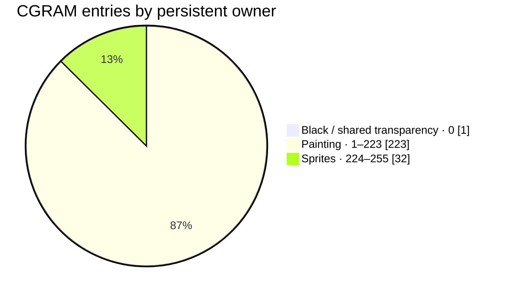
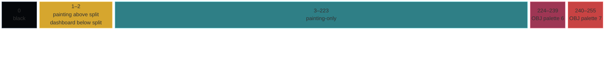
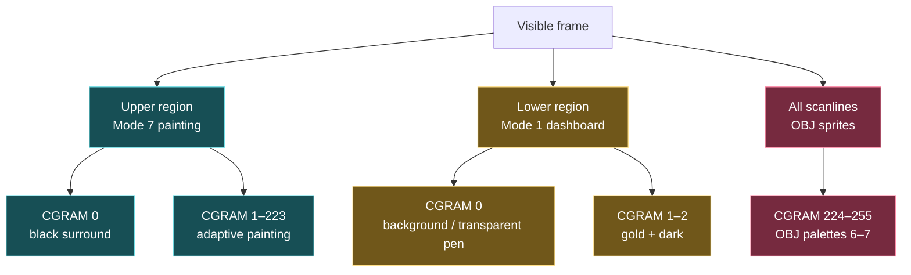
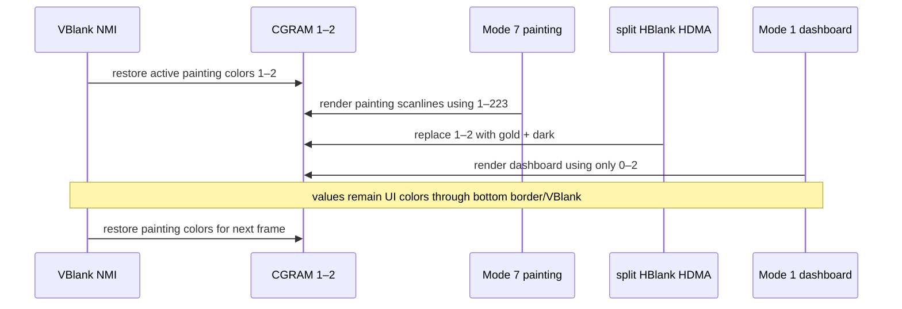
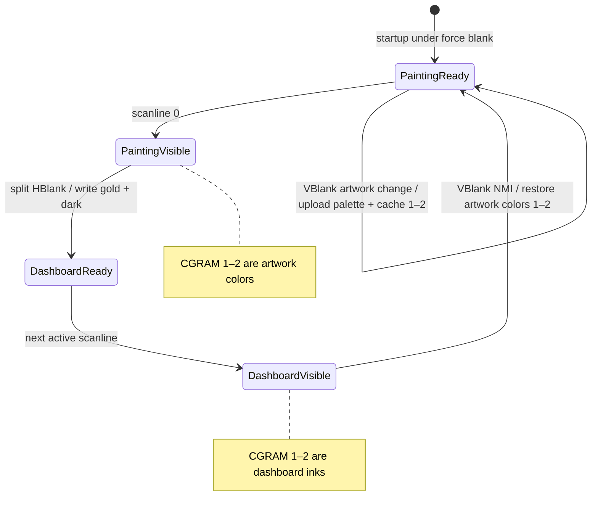

# #139 — LZSS Gallery: HBlank Palette Reuse, 223 Painting Colors, 32 Sprite Entries

**Status:** IMPLEMENTED 2026-07-27  
**Depends on:** [#136 — contiguous artwork palette](2026-07-27-136-lzss-gallery-contiguous-artwork-palette.md)  
**Touches:** gallery asset generation, Mode 7/Mode 1 split HDMA, NMI palette restore, emulator/hardware
validation, and the repository's general SNES graphics guidance.

## Goal

Use the fact that the painting and dashboard occupy different scanline regions to reuse two CGRAM
entries across one frame:

- while Mode 7 displays the painting, CGRAM `1–223` are 223 adaptive painting colors;
- CGRAM `224–255` are 32 permanently reserved sprite entries;
- at the Mode 7 → Mode 1 dashboard split, HBlank HDMA rewrites only CGRAM 1 and 2 to the dashboard's
  gold and dark font colors;
- during the following VBlank, NMI restores the active painting's colors 1 and 2 before scanline 0;
- CGRAM 0 remains black throughout the frame for padding, surround, and font transparency.

This gains 23 painting colors over #136's current 200-color proposal without reducing the
hardware-aligned 32-entry sprite reservation and without blanking a visible scanline.

## Implementation result

All 62 paintings now use the contiguous adaptive range `1–223`; CGRAM `224–255` is reserved for
OBJ palettes 6–7. The dashboard borrows entries 1–2 at the Mode 7/Mode 1 split through HDMA
channels 3–4, and NMI restores each painting's cached entries 1–2 during VBlank.

The rollout was first published for Great Wave alone, visually checked, and then regenerated for
the complete corpus. The final static audit proved every painting index is within `1–223`; the host
codec oracle, target build, 62-work corpus wiring, NMI opcode audit, bank-zero asset gate, and
bsnes-jg smoke gate passed. Repack visualization is red-cursor-only.

## Normative CGRAM ownership

### Spatial ownership during one frame

| CGRAM | Painting scanlines — Mode 7 | Dashboard scanlines — Mode 1 |
|---:|---|---|
| 0 | Black surround/padding | Black/font background |
| **1–2** | **Adaptive painting colors 1–2** | **Gold and dark font inks, rewritten in HBlank** |
| 3–223 | Adaptive painting colors 3–223 | Unreferenced by dashboard tiles; values may remain |
| **224–255** | **Sprite-only** | **Sprite-only** |

Painting pixels may use indices `1–223`. Padding and out-of-image surround must remain index 0.
Dashboard tiles may reference only indices `0–2`; index 3 is no longer reserved merely because BG3
is 2bpp. A representable but unused font pen does not need exclusive CGRAM ownership.

### Capacity



The dashboard has no persistent palette allocation. It borrows painting entries 1–2 only below the
split.

### CGRAM block map



The widths are schematic rather than numerically proportional so the one- and two-entry regions
remain readable. The labels and boundary values are normative.

### Spatial ownership tree

The screen is partitioned first by scanline region, then by the palette indices each region is
allowed to reference. This is quadtree-like spatial reasoning, not a runtime quadtree or a new data
structure.



### Frame timeline



Nothing tries to change colors that have not yet finished rendering. Rasterization above the split
is complete before the dashboard values replace entries 1–2.

### Palette-state graph



Only two states are visible. `PaintingReady` and `DashboardReady` are bounded transition points in
VBlank and HBlank; neither requires a forced-blank active scanline.

### Interactive mockups

- [Production palette split](2026-07-27-139-lzss-gallery-hblank-palette-reuse/palette-split-mockup.html)
  — switch among painting, split-HBlank, and dashboard states to see entries 1–2 change ownership.
- [HBlank versus forced blank](2026-07-27-139-lzss-gallery-hblank-palette-reuse/forced-blank-comparison.html)
  — side-by-side frames showing the invisible production transfer and the rejected black-line
  fallback, including an optional timing-jitter simulation.

## Why only two colors move

Both dashboard fonts share the same palette semantics:

- pen 0: black/transparent background;
- pen 1: gold ink;
- pen 2: dark outline/secondary ink;
- pen 3: unused.

CGRAM 0 is already permanent black. Therefore the split needs four CGDATA bytes, not a 32-color
reload. Entries 3–31 become ordinary painting colors and remain untouched during the dashboard.

Before implementation, statically audit both font tile sets and tilemap palette selection. Fail if
any visible font pixel uses pen 3 or if BG2/BG3 select different palette groups.

## HDMA design

### Existing split

The gallery already switches `BGMODE` and `TM` at the painting/dashboard boundary. Preserve those
channels and add the CGRAM write to the same HDMA line-counter transition.

### Candidate transfer

Use ascending HDMA channels so CGRAM address precedes data:

1. channel N, pattern 3 targeting `CGADD`/`CGDATA`: ignored/address byte pair followed by painting
   entry 1's replacement BGR555 word;
2. channel N+1, pattern 2 targeting `CGDATA`: entry 2's BGR555 word, relying on CGRAM's automatic
   word-address increment.

The transfer payload is six B-bus bytes for two colors. Confirm the precise channel pattern against
the emulator trace; if pattern 3's write-twice semantics differ on the selected core/hardware,
use a dedicated `CGADD` channel followed by one channel per CGDATA word. Correct register sequencing
is more important than saving a channel.

HDMA tables must be initialized during VBlank, remain immutable while active, and put the CGADD and
CGDATA writes on the same scanline. Do not enable or reconfigure an active channel mid-frame.

### VBlank restore

When loading an artwork, cache its original CGRAM 1 and 2 words in near WRAM. Every NMI during the
gallery display:

1. set `CGADD = 1`;
2. write the four cached CGDATA bytes; and
3. continue with input, cursor OAM, and other bounded VBlank work.

Do not read a far ROM palette from NMI, change DBR for this operation, or calculate colors there.
The cached four bytes make the restore constant-time and independent of cartridge placement.

Initialize the cached words and write the complete painting palette before first enabling NMI.
Cancellation may change the active artwork only under force blank/VBlank; publish both cached words
coherently before revealing the next painting.

## Sprite block: exactly 32 entries

Reserve CGRAM `224–255`, exactly two complete OBJ palettes:

| CGRAM | Hardware mapping | Ownership |
|---:|---|---|
| 224–239 | OBJ palette 6, pens 0–15 | Sprite-only |
| 240–255 | OBJ palette 7, pens 0–15 | Sprite-only |

Pen 0 in each OBJ palette is transparent, so the reservation provides 30 visible colors plus two
transparent anchors. Keep the red compressor cursor as the only repack-stage sprite effect; the
chevrons may use either reserved palette. Generator and tile-conversion checks must validate both
the OBJ palette number and pen number.

No painting pixel may use `224–255`, even if a particular sprite pen is currently unused.

## Asset-generator changes

Update `tools/lzss-gallery-assets.py` and generated headers/reports:

1. `ART_INDICES == tuple(range(1, 224))`;
2. `ART_COLORS == 223`;
3. reserve index 0 for black padding/surround;
4. reserve `224–255` for the two complete OBJ palettes;
5. quantize each painting to at most 223 adaptive colors and map densely to `1–223`;
6. emit and record the active artwork's BGR555 words at indices 1 and 2;
7. emit dashboard gold/dark constants separately from painting palettes;
8. assert every non-padding artwork pixel is `1–223`;
9. assert every padding pixel is 0;
10. assert sprite palette/pen pairs resolve only to `224–255`;
11. record mapping version, boundaries, used-color count, hashes, and the two borrowed entries in
    `derived/report.json` and `derived/catalog.json`; and
12. regenerate thumbnails/contact sheets from the final indexed palette.

The two site accent variants must have identical painting indices and LZSS streams. Only documented
sprite palette words and the ROM checksum may differ.

## Runtime changes

In `examples/snes/lzss-gallery.c`:

- replace #136's proposed `32–231` painting mapping with `1–223`;
- retain complete-palette upload while force blanked for artwork changes;
- cache active painting CGRAM words 1–2 in near WRAM;
- extend `split_arm()` with synchronized CGRAM HDMA;
- restore painting entries 1–2 in every VBlank NMI;
- keep dashboard tilemaps on palette 0 and prove tiles use only pens 0–2;
- reserve and initialize CGRAM 224–255 for sprites;
- select OBJ palette 6/7 deliberately in OAM attributes;
- preserve sprite 0–1 chevrons and sprite 2 red cursor ownership;
- keep the red cursor as the only repack-stage sprite;
- keep cancellation/force-blank transitions atomic; and
- update the NMI opcode/budget audit for the four new CGDATA writes.

Generated constants must name `ART_FIRST`, `ART_LAST`, `SPRITE_FIRST`, `SPRITE_LAST`,
`DASH_GOLD`, and `DASH_DARK`. Runtime and generator code must not carry independent boundary
numbers.

## Forced-blank scanline experiment and decision

### Expected behavior

Forcing blank for one active scanline does not create harmless temporal whole-frame flicker. With a
fixed raster position it creates a stable horizontal blank/backdrop band every frame—typically a
crisp black line in an emulator/LCD presentation and a spatially softened but still persistent line
on a CRT. Jitter in the enable/disable boundary could make the band shimmer, but that is an
additional defect, not a benefit.

### Plan decision

Do not use forced blank in the production path. The two-color HBlank transfer is intentionally tiny.
Retain a diagnostic build flag only if useful for documenting hardware behavior:

```text
GALLERY_PALETTE_SPLIT_FORCE_BLANK_TEST=1
```

Capture it in bsnes-jg, MAME, and—if available—real hardware. The experiment belongs in the
documentation evidence, not in the shipped ROM.

## Timing and channel audit

Before landing:

1. list every active HDMA channel, destination register, transfer pattern, and split-table byte;
2. calculate per-HBlank overhead and transferred bytes for the worst split line;
3. verify channel ordering places CGADD before CGDATA;
4. trace the split in bsnes/ares or equivalent register logging;
5. confirm no HDMA channel is configured or enabled mid-frame;
6. measure NMI duration before/after the four-byte VBlank restore;
7. prove NMI remains inside VBlank on the busiest cursor/input frame; and
8. retain the existing blank-band scanner as a publication gate.

If the emulator trace and calculation disagree, stop and reduce/split the transfer. Do not use
forced blank to hide an unexplained overrun.

## Documentation updates

This implementation must update general guidance, not remain gallery folklore.

### `docs/snes-demo-cookbook.md`

Add a section, **Raster palette reuse with HBlank HDMA**, covering:

- CGRAM's 256 BGR555 words and spatial reuse across non-overlapping scanline regions;
- the safe lifecycle: restore upper-region colors in VBlank, replace borrowed entries at split
  HBlank, never change a color while its region is being rendered;
- same-scanline CGADD/CGDATA ordering;
- using only the colors the lower region actually references;
- a minimal two-color pseudo-code/table example based on this gallery;
- HDMA channel budgeting and immutable tables;
- why full-palette per-HBlank reloads are usually the wrong model; and
- why a forced-blank scanline is a visible band, not free bandwidth.

Correct the blanket “PPU data ports only in `emit()`” wording: ordinary queued writes remain
VBlank/force-blank operations, while deliberately configured CGRAM HDMA is the documented HBlank
exception.

### `docs/handoffs/2026-06-24-snes-graphics-rendering.md`

Correct statements that say VRAM, CGRAM, and OAM are writable *only* during force blank or VBlank:

- VRAM/OAM retain the conservative rule for this codebase;
- CGRAM may be written during HBlank, preferably through preconfigured HDMA;
- explain that active-display writes remain invalid;
- add the CGADD + two CGDATA-write rule;
- replace “HDMA is irrelevant” in the DMA discussion with a concise boundary: general DMA handles
  bulk VBlank uploads; HDMA handles small deterministic raster-time register changes;
- add forced-blank-line appearance and timing cautions; and
- link the cookbook's reusable recipe and this plan's measured gallery example.

### `docs/65816-references.md`

Add authoritative SNES references for:

- CGRAM access timing and `CGADD`/`CGDATA`;
- HDMA transfer patterns and channel ordering;
- HBlank/VBlank timing; and
- `INIDISP` forced blank.

Prefer the Nintendo SNES Development Manual plus the maintained SNESdev register/timing pages. Note
which claims are hardware specification and which are emulator/real-hardware observations.

### Hardware-reference guidance

Update any generated or SDK-facing SNES hardware documentation associated with
`snes_ppu.h`/`snes_dma.h`:

- register comments for CGADD/CGDATA must say HBlank, VBlank, or forced blank;
- HDMA channel helpers must document write-twice patterns;
- examples must set up active HDMA only during VBlank; and
- warnings must distinguish CGRAM from the stricter VRAM/OAM policy.

Search-gate the repository for stale absolute claims:

```sh
rg -n "VRAM, CGRAM and OAM.*only|CGRAM.*only.*[Vv]-blank|HDMA.*irrelevant" docs
```

Every surviving hit must either be corrected or explicitly scoped to a simpler API policy.

## Verification

**Implementation gate: PASS (2026-07-27).** All 62 generated works passed the `1–223` static
index audit; the host codec oracle, optimized target build, NMI opcode audit, bank-$00 asset gate,
and 1,000-frame bsnes-jg smoke passed. Extended 200,000-frame, MAME, and real-hardware observations
remain post-publication validation rather than blockers for this experimental gallery release.

### Static

- palette boundaries are exactly `0`, `1–223`, and `224–255`;
- exactly 223 adaptive painting colors and exactly 32 sprite entries;
- font pixels use only 0–2;
- painting pixels use only 0 or 1–223;
- sprite tiles resolve only to 224–255;
- split tables place CGADD and both colors on the same scanline;
- NMI restores precisely four CGDATA bytes per frame;
- source/report/catalog/web orders agree; and
- `git diff --check` and all documentation link checks pass.

### Visual

Inspect at least:

- paintings that heavily use palette indices 1 and 2;
- bright/dark/saturated/low-saturation works;
- the exact last painting line above the split;
- the first three dashboard lines below it;
- rapid left/right cancellation;
- red cursor and chevrons across both site variants; and
- diagnostic forced-blank capture, verifying it appears as a stable line and is absent from
  production.

There must be no one-line wrong-color flash, palette tear, black band, font recoloring, or sprite
recoloring.

### Functional

- host O0/O2 LZSS streams and round trips agree;
- optimized far and near decoders remain correct;
- quick bsnes-jg smoke passes before publication;
- site builds pass and the exact ROM SHA is served;
- full 62-work 200,000-frame bsnes-jg oracle passes after publication;
- MAME agrees at the final oracle and selected split-line captures;
- real hardware is preferred for the final HBlank/forced-blank observation when available; and
- bank-$00 and VBlank/NMI margins remain above their configured gates.

## Publication sequence

1. Generate the 223-color assets and both sprite-palette variants.
2. Pass static/timing/font-use gates.
3. Pass quick ROM smoke and visual split captures.
4. Build both sites.
5. Publish the gallery ROM/page for interactive review.
6. Run full correctness validation after publication, per the gallery workflow.
7. Record and immediately report any late emulator/hardware discrepancy.

## Completion record

When implemented, append:

- actual HDMA channels/patterns/table bytes and calculated timing;
- NMI before/after timing;
- palette hashes and proof that indices 1–2 are restored/replaced at the intended scanlines;
- enabled-work count, corpus sizes, oracle, ROM checksum/SHA, and bank occupancy;
- split-line and diagnostic forced-blank captures;
- bsnes-jg, MAME, and real-hardware results;
- updates/commits for the cookbook, graphics handoff, references, and hardware headers;
- core, biohack.net, and indri.studio commits;
- release tags, production URLs, and served-ROM SHA; and
- any observed difference between emulator, LCD, and CRT presentation.
