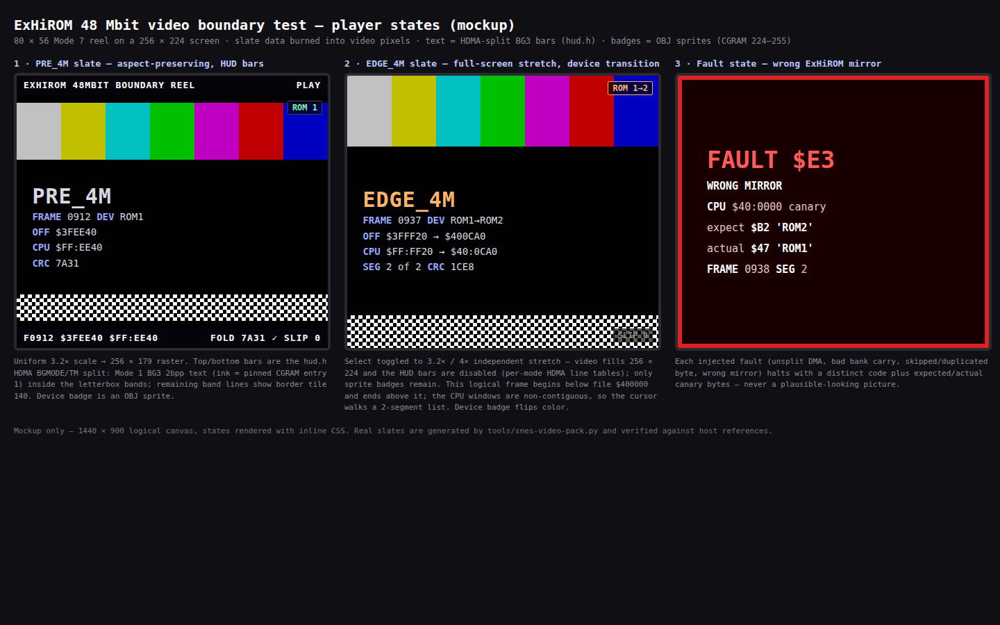
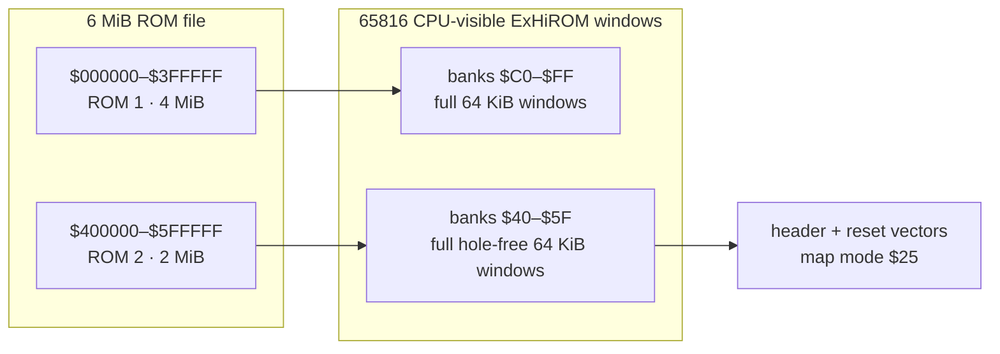
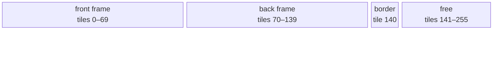
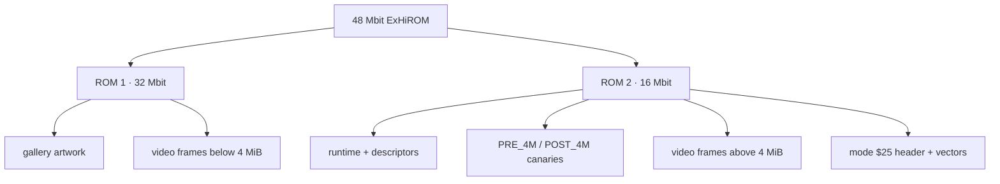

# ExHiROM Video Boundary Test

**Status:** PLANNED 2026-07-30  
**Tracks:** TODO.md `[T4] Implement extended SNES cartridge mapping (ExHiROM) — general
cartridge/mapper test coverage, not driven by gallery size`  
**Target cartridge:** **48 Mbit (6 MiB) ExHiROM**, map mode `$25`, modeled as one 32 Mbit
(4 MiB) mask ROM plus one 16 Mbit (2 MiB) mask ROM.

## Goal

Build a deliberately larger-than-32-Mbit test cartridge that proves the complete extended
cartridge path, rather than padding an ordinary LoROM until an emulator happens to accept it.
The motivation is **general cartridge/mapper test coverage** — exercising the toolchain and
runtime across cartridge configurations — not a present gallery-capacity need. The deliverables
are **standalone test ROMs** (the milestone matrix: HiROM 4 MiB; ExHiROM 6 MiB and 8 MiB), not a
gallery variant; gallery integration (Phase 3) is optional, later, and independent of this
milestone.

The test payload is a real-time Mode 7 video player. Video is useful here because it:

- naturally consumes several MiB without duplicating static paintings;
- performs sustained sequential reads on both sides of—and logically spanning—the 4 MiB boundary;
- makes a wrong frame, mirror, bank, byte order, or dropped DMA immediately visible;
- can burn the file offset and mapped CPU address into every frame;
- exercises far ROM descriptors, cross-bank cursor carry, segmented DMA, and decoder/refill state
  continuously; and
- remains interesting to inspect interactively after the mapping test is complete.

This is explicitly a cross-bank usage test, not merely an address probe. Some logical frames and
compressed chunks must begin near the end of one bank and finish in the next, including a fixture
that spans the physical 4 MiB boundary. The runtime must consume those objects normally and prove
that its pointer, remaining-length, checksum, and decoder state survive every segment transition.

The first deliverable is a deterministic synthetic **boundary test reel**, not a codec showcase.
An optional public-domain film excerpt may be added after the mapping and playback gates pass.

## Mockups

Bundle: [`2026-07-30-exhirom-video-boundary-test/`](2026-07-30-exhirom-video-boundary-test/)

[](2026-07-30-exhirom-video-boundary-test/boundary-slate.html)

Three player states: a `PRE_4M` slate in aspect-preserving letterbox with the `hud.h`-style BG3
text bars, the `EDGE_4M` transition in full-screen stretch (sprite badges only, bars disabled),
and the distinct mirror-fault failure screen. The publication-page layout gets its own mockup in
Phase 4.

## Why ExHiROM

Ordinary LoROM and HiROM expose at most 4 MiB. The test must use the conventional extended mapping,
normally official map mode `$25`/ExHiROM, for the region beyond that boundary.

The existing `platforms/snes-hirom` platform is useful groundwork but is not ExHiROM:

- its header is patched as ordinary HiROM mode `$21`;
- it emits a power-of-two image;
- it maps far data only through `$C1+`;
- it does not place the ExHiROM header/reset vectors in the file's second 4 MiB region; and
- its checksum tool does not model two independently sized mask ROMs.

Do not call a 6 or 8 MiB byte vector with the old LoROM header an extended cartridge.

## Cartridge-configuration coverage

The 48 Mbit reel is the largest runtime fixture, but it does **not** by itself cover every SNES
cartridge. Treat this work as the ordinary-ROM mapper suite: direct ROM plus optional SRAM, without
an address-decoding coprocessor.

Generate small canary ROMs from the same authoritative mapping model before the large video test.
The matrix is split by what actually gates this milestone: only the rows that de-risk ExHiROM are
required before Phase 1; the rest are a follow-up item so Phase 0 does not absorb the budget.

**Required for this milestone:**

| Family | Required configurations | What they prove |
|---|---|---|
| HiROM | slow ROM; 4 MiB | 64 KiB linear banks, `$00FFC0` file header, LoROM-area mirrors, cross-bank reads — the ordinary-map baseline the extended map builds on |
| ExHiROM | slow ROM; 6 MiB, 8 MiB | `$40FFC0` file header, inverted A23/region transition, second-device mirroring, extended spans |

6 MiB (the Tales of Phantasia 48 Mbit configuration) and 8 MiB are the two ExHiROM sizes with
commercial precedent — which is what database/heuristic emulators actually detect. **5 MiB
(`4 + 1`) is a stretch fixture, not a gate:** a plain 40 Mbit ExHiROM cart has essentially no
precedent, so a failure there is likely an emulator-heuristic edge case rather than a mapping bug.
FastROM (`$35`) variants follow once slow `$25` passes.

**Deferred to a follow-up item (same generator and mapping model; separate TODO entry):**

| Family | Configurations | What they prove |
|---|---|---|
| LoROM | slow and fast ROM; 512 KiB, 1 MiB, 3 MiB, 4 MiB | 32 KiB bank order, `$007FC0` file header, upper-half windows, mirrors, compound-size checksum |
| HiROM (rest) | fast ROM; 512 KiB, 2 MiB, 3 MiB | remaining ordinary-HiROM size/speed matrix |
| SRAM | LoROM and HiROM/ExHiROM, volatile and battery-backed header variants | RAM aperture does not collide with ROM windows; size/header/save-file agreement |
| Header/input | legacy and expanded internal header; unheadered `.sfc`; detected 512-byte copier input | header selection, normalization, vectors, size, chipset, region, checksum/complement |

For every generated row, test emulation and native CPU modes, reset/native vectors, canonical
address round-trips, first/last byte of every decoded window, intended mirrors, rejected holes, and
slow/FastROM timing selection. This milestone uses NTSC headers only; PAL header variants ride with
the deferred matrix, and video cadence testing stays separate from address-decoder correctness.

Required size classes are:

- exact power of two;
- sum of two descending powers of two, such as 3 MiB (`2 + 1`) and 6 MiB (`4 + 2`);
- maximum ordinary-map size;
- minimum and maximum extended-map size used by this project; and
- invalid/truncated/ambiguously padded images that the host tools must reject.

The builder always emits an unheadered `.sfc`. A 512-byte copier header is only an import/inspection
fixture and must never contaminate cartridge offsets or checksum calculation.

### Explicitly separate cartridge families

Do not claim universal cartridge support from this plan. The following require independent
platform plans and fixtures because the cartridge hardware remaps memory or adds observable state:

- SA-1;
- SuperFX/GSU;
- S-DD1 and SPC7110 decompression/mapping;
- DSP-1/2/3/4, ST010/ST011, and Cx4;
- OBC1, S-RTC, and other memory/register peripherals;
- BS-X, Sufami Turbo, Super Game Boy, and other multi-cartridge/custom systems;
- flash-cartridge-specific large-ROM extensions; and
- unofficial ExLoROM/ROM-hack layouts.

Their header map-mode/chipset values may be recognized and reported by inspection tooling, but
recognition is not implementation support. Add one negative fixture per known unsupported family
so the linker and packer fail clearly instead of accidentally emitting a plausible-looking ROM.

## Normative test cartridge

### Capacity

Use **48 Mbit (6 MiB)** for the first test:

| Component | Capacity | Purpose |
|---|---:|---|
| ROM 1 | 32 Mbit / 4 MiB | first ExHiROM region, most video frames |
| ROM 2 | 16 Mbit / 2 MiB | boot/header region, runtime, boundary fixtures, remaining video |
| Logical image | 48 Mbit / 6 MiB | smallest convenient non-power-of-two two-device stress image |

This intentionally tests more than “8 MiB filled with zeros.” The builder and reports must preserve
the physical `4 MiB + 2 MiB` decomposition, while the internal ROM-size field uses the appropriate
logical/decode size required by the ExHiROM header model.

### Address model

Define one authoritative host function:

```text
file_offset -> { physical_rom, physical_offset, cpu_bank, cpu_address }
```

and its checked inverse for every mapped byte. Generate linker regions, asset descriptors, map
reports, and host verification from that model. Do not independently reimplement the mapping in
the linker generator, video packer, and report renderer.

The mapping specification must explicitly identify:

- the CPU windows for file offsets `0x000000–0x3FFFFF`;
- the CPU windows for file offsets `0x400000–0x5FFFFF`;
- header location, map-mode byte, reset vector, native vectors, and emulation vectors;
- which mirrors are accepted but never emitted into descriptors;
- the inaccessible holes — these affect only the `$00–$3F`/`$80–$BF` upper-half mirror windows and
  the `$7E`/`$7F` WRAM cap; the canonical windows `$C0–$FF` and `$40–$5F` are hole-free full banks;
- the maximum contiguous DMA source span before a 16-bit A-bus address wraps; and
- how a 6 MiB physical image is mirrored for checksum purposes.



Before implementation, confirm these bank ranges against the chosen ExHiROM decoder model and add a
complete file-offset/CPU-address table.

## Video format

### Normative format

| Property | Value |
|---|---:|
| Visible source raster | **80 × 56 pixels** |
| Tile geometry | 10 × 7 = **70 Mode 7 tiles** |
| Pixel format | 8-bit indexed / Mode 7 chunky |
| Bytes per frame | **4,480** |
| Buffers in VRAM | 2 × 70 tiles = **140 of 256 tiles** |
| Presentation cadence | **30 fps NTSC**, one new frame every two VBlanks |
| Palette | one fixed 223-color video palette, CGRAM 1–223 contiguous (entry 1 pinned white as HUD text ink); index 0 reserved transparent; CGRAM 224–255 sprite-owned (OBJ palettes 6–7, gallery convention) |
| Audio | none in milestone 1 |
| Scaling | Mode 7 affine matrix scales and centers the raster in the 256 × 224 display |

Mode 7 has a 128 × 128-entry tilemap (one byte per entry) but only 256 available 8 × 8 chunky
tiles. Two 80 × 56 frames fit simultaneously; two 160 × 96 frames do not.

At 80 × 56, a complete frame is 4,480 DMA bytes. The theoretical 224-line NTSC VBlank ceiling is
6,123 bytes before setup/interrupt overhead. Reserve the remainder for OAM, bounded palette work,
register setup, and safety margin. Do not target a format that requires forced blank for ordinary
frame presentation.



The block widths are schematic. Exact tile-number ownership is normative in the generated report.
There is no Mode 7 UI tile allocation: text readouts live on HDMA-split BG3 bars and the few
overlay badges are sprites (see Mode 7 mechanics below).

### Mode 7 mechanics (normative)

These hardware details are contractual; a first implementation that guesses any of them will fail
on console while passing every host gate.

- **VRAM interleaving.** Mode 7 map entries are the *low* bytes and tile pixels the *high* bytes of
  VRAM words `$0000–$3FFF`. Frame pixel DMA targets `$2119` only, single-byte transfer unit, with
  `VMAIN = $80`; tilemap writes target `$2118` with `VMAIN = $00`. The 4,480-byte frame figure is
  valid only in this high-byte-only DMA mode.
- **Buffer flip = tilemap-entry rewrite.** There is no Mode 7 tilemap base register. The flip
  rewrites the 70 visible map entries (one small low-byte DMA) from tiles 0–69 to 70–139 or back,
  in the same VBlank as the frame's final DMA segment. The scroll-anchor alternative — two
  pre-written map regions plus `M7HOFS`/`M7VOFS`/matrix-center retarget — is rejected: it needs
  per-mode, per-buffer anchor bookkeeping for no saving.
- **Write-twice registers.** `M7HOFS`/`M7VOFS`, matrix `M7A–M7D`, and center `M7X`/`M7Y` are
  write-twice registers; "atomic" means all writes complete inside one VBlank in a fixed order.
- **Index 0 is transparent.** A Mode 7 pixel value of 0 shows the backdrop, not CGRAM entry 0. The
  quantizer never emits index 0; the backdrop color is black and is part of the format contract.
- **Sprite-owned CGRAM.** Sprite palettes occupy fixed 16-entry groups in CGRAM 128–255; this
  format reserves exactly CGRAM 224–255 (OBJ palettes 6–7), matching the `lzss-gallery.c`
  convention (the gallery's proof "owns the complete 224..255 block") and keeping the video range
  contiguous at 1–223. Because Mode 7 pixels index the same 0–255 space, a frame pixel mapped to a
  reserved index passes every host gate and fails only visually on console — so the packer asserts
  no frame pixel uses index 0 or 224–255. Entry 1 is additionally pinned to white: it doubles as
  the BG3 HUD ink color (the `hud.h`/blossom convention) while remaining usable as a video color.
- **Live UI = HDMA-split BG3 bars plus a few sprites.** Mode 7 has no spare BG layer, and at
  3.2–4× zoom the visible map window is exactly the 10 × 7 frame — no Mode 7 tiles can composite
  over the video. Burned-in per-frame data covers the deterministic content. Live *text* readouts
  (frame ID, descriptor address, fold/CRC) reuse the repo's established pattern
  (`examples/snes/hud.h`, proven in `blossom.c`): an HDMA scanline split streams `BGMODE`/`TM` so
  the top/bottom bars render in Mode 1 with a tiled BG3 2bpp text layer while the middle band
  stays Mode 7 — no per-scanline OBJ limit, and drawing a string is a tilemap poke. In
  aspect-preserving mode the bars sit inside the letterbox bands; in full-screen stretch mode the
  bars are disabled (per-mode HDMA line tables, swapped during VBlank) and only the *overlay
  badges* remain — device marker, pause and slip state — as OBJ sprites using CGRAM 224–255. HDMA
  channels 1–2 are owned by the split and frame GP-DMA stays on channel 0, per `hud.h`. VRAM
  budget: BG3 tilemap at word `$4000`, 2bpp font at `$5000`, OBJ character data at `$6000`+ — all
  clear of the Mode 7 map/tile region; the linker layout and generated report must budget all
  three explicitly.
- **Letterbox surround.** In aspect-preserving mode the 16-line HUD bars occupy most of each
  ~22-line letterbox band; the remaining Mode 7 lines between bar and video, and any map area
  outside the 80 × 56 frame, reference a dedicated all-black border tile (tile 140, every pixel a
  non-zero black index) over the black backdrop.
- **VBlank margin arithmetic.** 37 usable VBlank lines × (1,364 − 40 refresh) master cycles ÷ 8
  cycles per DMA byte = 6,123 bytes — that is where the ceiling figure above comes from. The frame
  (4,480 bytes ≈ 27 lines) + flip map DMA (70 bytes) + OAM (≤ 544 bytes ≈ 3.3 lines) leaves about
  6 lines of margin: adequate but thin, which is why the playback gate uses the measured budget,
  not the theoretical ceiling.

### Frame presentation

1. During active display, prepare the next frame descriptor and DMA registers only.
2. On the chosen presentation VBlank, DMA all 4,480 pixel bytes into the hidden tile set
   (high-byte-only mode; see Mode 7 mechanics).
3. In the same VBlank, rewrite the 70 visible tilemap entries (low-byte DMA) so the completed
   buffer becomes visible — there is no Mode 7 tilemap base register to switch.
4. Never reveal a partially uploaded frame.
5. Alternate front/back tile sets.
6. Advance at 30 fps using a `0, 2, 4, ...` VBlank cadence. **NTSC lag policy:** if a presentation
   deadline is missed (seek landing mid-upload, a long fixture fold), hold the current frame and
   re-arm for the next even VBlank — slip, never tear — and increment a visible slip counter so
   cadence gates can distinguish slip from drop. Define PAL behavior explicitly (25 fps conversion
   or cadence-correct duplicate/drop policy).

The logical frame may span banks, but each physical DMA command must stop at the end of its current
64 KiB A-bus bank. The runtime then advances through the mapper-aware segment list and resumes the
same frame from the next canonical CPU window. The SNES DMA source address increments only its
16-bit address; it does not carry into the bank byte. A frame becomes visible only after all of its
segments have completed.

### Scaling

Default to aspect-preserving scale with black letterbox/pillarbox surround (border tile + black
backdrop; see Mode 7 mechanics). Add an optional full-screen stretch mode for the requested Mode 7
effect:

- `A`/`D` matrix terms scale 80 × 56 independently to 256 × 224;
- nearest-neighbor sampling preserves the indexed-video character;
- Select toggles aspect-preserving versus full-screen stretch; and
- no rotation is enabled in the correctness gate, though a slow optional rotation is acceptable
  as a presentation extra after playback is stable.

## Boundary test reel

Generate frames deterministically. Every frame contains:

- frame number;
- ROM file offset;
- canonical CPU address;
- physical device (`ROM 1` or `ROM 2`);
- a per-frame CRC/fold rendered as text;
- moving color bars and a one-pixel checker pattern that expose dropped/corrupt bytes; and
- a large boundary slate before and after every critical transition.

Required frame placements:

| Fixture | Placement requirement |
|---|---|
| `PRE_4M` | last complete frame wholly below file offset `0x400000` |
| `BANK_SPAN` | one logical frame split across two adjacent 64 KiB CPU banks |
| `MULTIBANK_SPAN` | one logical record spanning at least three CPU banks |
| `EDGE_4M` | one logical frame/chunk beginning below and ending above file offset `0x400000` |
| `POST_4M` | first complete frame wholly above file offset `0x400000` |
| `ROM2_MID` | frame in the middle of the second physical ROM |
| `ROM2_LAST` | last addressable complete frame in the 6 MiB image |
| `MIRROR_PROBE` | distinct canaries proving the canonical window is not the wrong mirror |

`BANK_SPAN`, `MULTIBANK_SPAN`, and `EDGE_4M` are required positive fixtures. The packer emits one
logical object plus an ordered list of mapper-aware physical segments; it must never silently pad
these objects back to a bank boundary. Also add negative fixtures for an unsplit DMA operation,
an incorrect linear bank carry, a skipped byte, a duplicated byte, and use of the wrong ExHiROM
mirror. Each fault must produce a distinct host-test or on-console oracle failure.

Run the same span matrix through three consumers:

1. raw frame DMA, proving segmented source use and atomic presentation;
2. CPU byte/word reads and running CRC, proving ordinary far reads and pointer carry; and
3. LZSS refill/decode into a bounded staging buffer, proving stateful consumption across mapper
   discontinuities rather than only direct DMA.

**Consumer CPU budget.** The CPU-CRC and LZSS-refill consumers run only on the fixture frames of
the span matrix, not on every frame: at 2.68 MHz slow-ROM (`$25`) execution there are ~178k CPU
cycles per 30 fps period, and a ~15–20 cycle/byte fold over 4,480 bytes costs 67–90k of them —
affordable occasionally, ruinous continuously. Record the measured per-consumer CPU cost alongside
the DMA budget.

**End of reel.** The reel loops. The final oracle latches on the first complete pass (both physical
regions displayed, all fixture consumers run); subsequent passes are presentation-only.

The reel should fill essentially all remaining cartridge capacity. At 4,480 bytes/frame and
30 frames/second, about 5 MiB of frame payload represents roughly 39 seconds of raw video.

## Optional public-domain clip

After the synthetic reel passes, the same converter may ingest a short public-domain or CC0 clip:

1. crop/letterbox to 80 × 56;
2. choose one global 223-color BGR555 palette for the complete clip;
3. quantize/dither every frame against that fixed palette;
4. burn a small frame counter and boundary marker into the image;
5. emit raw keyframes first; and
6. select the storage codec by measurement — see **Codec selection** below. LZSS is a comparison
   baseline there, not the assumed winner.

Raw frames are preferred for the mapping milestone because decompressor performance must not hide
an address-decoder error. Audio is deferred; BRR/SPC streaming is a separate subsystem and does not
help prove ExHiROM.

### Codec selection (post-milestone)

LZSS is a poor default video codec: it is intraframe-only and ignores frame-to-frame similarity,
which is the largest compression opportunity in this footage (stationary star fields and
backgrounds, coherent launch/ascent motion). The boundary reel's LZSS-refill consumer is a
**mapping-test fixture**, not a codec endorsement — do not let it anoint LZSS by default.

The expected winner is a small custom interframe codec:

- periodic raw keyframes (which double as the seek/slate targets);
- the fixed 223-color palette, unchanged;
- frames divided into 8 × 8 blocks (70 per frame);
- per-block commands: unchanged from previous frame; copy another block from the previous frame;
  solid color; two-color bitmap; XOR/RLE delta; raw 64-byte block;
- decode into a 4,480-byte WRAM framebuffer during active display, then DMA the completed
  framebuffer to the hidden Mode 7 tile set during VBlank; and
- each compressed packet stays logically contiguous while deliberately spanning ROM banks, so the
  refill path keeps exercising the mapper.

Two implementation constraints:

- **Double-buffer the WRAM framebuffer.** Motion-copy commands reference the *previous* frame;
  in-place update would corrupt source blocks consumed after they are overwritten. Two 4,480-byte
  buffers cost 8,960 bytes of the 128 KiB WRAM — cheap and removes the ordering hazard.
- **The codec must not replace the mapping gates.** A WRAM-framebuffer path moves the presentation
  DMA source from ROM to WRAM (`$7E`, fixed bank, no boundary to cross), so it silently bypasses
  the segmented ROM-DMA consumer. The synthetic reel's raw-from-ROM DMA fixtures remain mandatory
  gates regardless of the shipped codec; the codec path proves the mapper through its ROM refill
  reads instead.

Decode cost is predictable: the all-raw worst case is a block move at ~7 cycles/byte (`MVN`),
≈ 31k of the ~178k CPU cycles per 30 fps period, and typical frames cost roughly in proportion to
changed blocks. That predictability matters at 2.68 MHz slow ROM.

Benchmark these candidates over the quantized clip frames before choosing (add a benchmark mode to
`tools/snes-video-pack.py` that reports bytes/frame, worst-case decode cycles, and keyframe
spacing):

1. raw frames — correctness baseline;
2. PackBits/RLE scanlines — simplest compression;
3. XOR against previous frame plus RLE;
4. changed 8 × 8 blocks with raw fallback;
5. changed blocks plus tile-aligned motion copies;
6. changed blocks with solid/two-color/XOR/raw modes; and
7. LZSS — comparison only.

Pick on the measured table, per the project's measure-don't-assume rule; the selection and its
numbers go in the completion record.

### Selected clip: Artemis I launch and return

Use candidate **#29, Artemis I launch and return animations**, as the normative presentation clip.
The synthetic reel remains the mapping/cross-bank correctness oracle; Artemis I is the visually
interesting demonstration payload that follows it.

Source both segments from NASA Scientific Visualization Studio item
[14191](https://svs.gsfc.nasa.gov/14191/):

| Order | Source asset | Selected action | Target duration |
|---:|---|---|---:|
| 1 | `Pre-launch_through_launch.webm` | final pre-launch moment through tower clearance | 8–10 seconds |
| 2 | `Return_to_Earth.webm` | Orion approach/reentry portion with the clearest large-scale motion | 8–10 seconds |

Use the explicitly no-audio downloadable versions. Do not ingest the surrounding interview,
broadcast package, music, NASA logo slate, captions, or third-party montage material. Record exact
in/out timestamps and source SHA-256 values after downloading the masters.

Join the two excerpts with one hard cut—no generated dissolve—then:

1. crop or letterbox consistently to the 80 × 56 source raster;
2. retime to 30 fps without optical-flow interpolation;
3. quantize both excerpts against one shared 223-color BGR555 palette;
4. show an unobtrusive `LAUNCH` or `RETURN` test label and monotonically increasing frame number;
5. place at least one required bank-spanning frame in each excerpt;
6. place the physical 4 MiB `EDGE_4M` span within a motion-heavy portion of the launch; and
7. emit a contact sheet containing the first/last frame of each excerpt, the hard cut, every
   bank-spanning frame, and the physical-device transition.

If the selected launch or return interval contains a protected NASA identifier as part of the
animation, choose a nearby clean interval or crop it out; do not paint over a logo frame and then
represent the result as unmodified NASA material.

### Eligible clip candidates

The target excerpt is 8–20 seconds with large motion, bold silhouettes, limited cuts, and no
necessary dialogue. Prefer the downloadable Library of Congress item or an original
agency-produced master—not a restoration, social-media repost, colorization, or rescored edition.

**Hard exclusion:** never use *Duck and Cover* or its animated turtle sequence as source material,
a fallback, or a visual reference for this test.

| # | Candidate excerpt | Why it should survive 80 × 56 | Candidate source/status |
|---:|---|---|---|
| 1 | [*The Great Train Robbery*](https://www.loc.gov/item/00694220/) — bandits advancing toward camera | strong figures and lateral motion | LOC downloadable public-domain item |
| 2 | [*The Great Train Robbery*](https://www.loc.gov/item/00694220/) — final gunshot close-up | iconic high-contrast close-up | LOC downloadable public-domain item |
| 3 | [*May Irwin Kiss*](https://www.loc.gov/item/00694131/) — central close-up | two large faces; almost no background detail | LOC downloadable public-domain item |
| 4 | [*Panorama of Machine Co. Aisle*](https://www.loc.gov/item/96522104/) — Westinghouse factory pan | repeating machinery makes corruption obvious | LOC downloadable public-domain item |
| 5 | [*San Francisco Earthquake and Fire*](https://www.loc.gov/item/00694425/) — street panorama | strong parallax and documentary motion | LOC downloadable public-domain item |
| 6 | [*President McKinley Taking the Oath*](https://www.loc.gov/item/00694336/) — oath platform | stable composition plus human movement | LOC downloadable public-domain item |
| 7 | [*Popeye the Sailor Meets Sindbad the Sailor*](https://www.loc.gov/item/mbrs00068306/) — giant bird/ship action | bold cel-animation outlines and saturated shapes | LOC downloadable public-domain item |
| 8 | [*St. Louis Blues*](https://www.loc.gov/item/mbrs00063365/) — performance close-up | expressive faces and rhythmic motion | LOC downloadable public-domain item |
| 9 | [*The Middleton Family at the New York World's Fair*](https://www.loc.gov/item/mbrs00021068/) — fair machinery | geometric exhibits and mechanical movement | LOC downloadable public-domain item |
| 10 | [*Master Hands*](https://www.loc.gov/item/mbrs02297907/) — assembly-line machinery | excellent motion/detail stress material | LOC downloadable public-domain item |
| 11 | [*The Memphis Belle*](https://www.loc.gov/item/mbrs00009301/) — bomber takeoff or formation | large aircraft silhouettes and sky gradients | LOC downloadable public-domain item |
| 13 | [*Trance and Dance in Bali*](https://www.loc.gov/item/mbrs02425201/) — dance passage | full-body rhythmic motion and costume texture | LOC downloadable public-domain item |
| 14 | [*Within Our Gates*](https://www.loc.gov/item/mbrs00046435/) — outdoor or train-platform movement | readable staging and historical visual character | LOC downloadable public-domain item |
| 15 | [*The Hitch-Hiker*](https://www.loc.gov/item/mbrs00047382/) — road/car passage | headlights, road motion, and noir contrast | LOC downloadable public-domain item |
| 16 | [Apollo 11 Saturn V launch](https://www.nasa.gov/missions/apollo-11-hd-videos/) | huge central object, smoke, and continuous vertical motion | NASA HD download page |
| 17 | [Apollo 11 first step and moonwalk](https://www.nasa.gov/missions/apollo-11-hd-videos/) | unmistakable silhouette at very low resolution | NASA HD download page |
| 18 | [Apollo 11 flag raising](https://www.nasa.gov/missions/apollo-11-hd-videos/) | two large figures and strong geometric motion | NASA HD download page |
| 19 | [Apollo 15 hammer-and-feather drop](https://science.nasa.gov/resource/the-apollo-15-hammer-feather-drop/) | two trackable objects and a clean scientific action | NASA MP4/MOV download page |
| 20 | [Perseverance descent and touchdown](https://svs.gsfc.nasa.gov/31250/) | fast terrain expansion and a historic landing | NASA SVS movies and frame-set downloads |
| 21 | [Ingenuity helicopter b-roll](https://svs.gsfc.nasa.gov/13828/) | small moving subject against textured ground | NASA SVS MP4 download |
| 22 | [DART terminal approach to Dimorphos](https://www.nasa.gov/solar-system/darts-final-images-prior-to-impact/) | dramatic expanding target and terminal motion | NASA source-image movie page |
| 23 | [ISS Aurora Australis time-lapse](https://svs.gsfc.nasa.gov/30179/) | dark field with bright moving color structures | NASA SVS download page |
| 24 | [ISS Earth-limb airglow time-lapse](https://svs.gsfc.nasa.gov/GOLDresources/12833/5488) | smooth horizon motion and limited bright colors | NASA SVS MP4/WebM download page |
| 25 | [SDO moderate solar flare](https://svs.gsfc.nasa.gov/14126/) | fixed framing, organic motion, extreme gradients | NASA SVS source-footage toolkit |
| 26 | [Four days of Solar Dynamics Observatory imagery](https://svs.gsfc.nasa.gov/5649/) | continuous texture, rotation, flares, and eclipses | NASA SVS movie download |
| 27 | [OSIRIS-REx capsule atmospheric entry](https://svs.gsfc.nasa.gov/20381/) | bright moving capsule and reentry glow | NASA SVS isolated shot/frame-set downloads |
| 28 | [OSIRIS-REx parachute descent](https://svs.gsfc.nasa.gov/20381/) | clean silhouette and slow vertical motion | NASA SVS isolated shot/frame-set downloads |
| 29 | [Artemis I launch and return animations](https://svs.gsfc.nasa.gov/14191/) | modern high-contrast launch and exhaust plume | NASA SVS no-audio downloadable clips |
| 30 | [Apollo 17 Taurus-Littrow flyover](https://svs.gsfc.nasa.gov/4717/) | continuous terrain motion and readable lunar relief | NASA SVS MP4 and frame-set downloads |

Artemis I is selected. Keep **#16 Apollo 11 launch**, **#19 hammer-and-feather**, **#24 ISS Earth
limb**, and **#25 SDO solar flare** as fallbacks if item-level rights review or the 80 × 56
conversion exposes a problem with the selected source.

“Public domain collection” is not a substitute for recording the exact asset used. Before checking
media into the repository, add a provenance record containing:

- canonical item/download URL and retrieval date;
- creator/agency and title;
- the item-level rights statement or explicit CC0 declaration;
- exact source-file SHA-256;
- selected time range and whether frames were cropped, retimed, or otherwise modified;
- confirmation that the chosen file has no copyrighted score, narration, restoration, stock
  footage, third-party watermark, or agency logo used as branding; and
- jurisdiction note: public-domain status is verified for United States distribution, with any
  known limits called out rather than silently assuming worldwide status.

NASA media is generally not subject to copyright in the United States, but NASA identifiers are
protected and individual files can contain marked third-party material. NOAA is a useful fallback
source only after item-level review because NOAA explicitly warns that some videos incorporate
third-party footage or music. The Library of Congress **Public Domain Films from the National Film
Registry** set is preferred over arbitrary National Screening Room results because the latter also
contains copyrighted streaming-only works.

## Linker and platform work

Create an opt-in platform rather than mutating ordinary gallery LoROM:

- `platforms/snes-exhirom/` for reusable mapping/header/link rules;
- `platforms/snes-gallery-exhirom/` if generated per-bank gallery/video sections remain
  application-specific;
- a generated linker fragment for occupied video banks;
- explicit assertions for header/vector addresses and both physical-ROM boundaries;
- generated segment tables for logical objects that cross CPU-bank or physical-device boundaries;
- an assertion that each individual DMA segment—not each logical frame—stays within one 64 KiB
  source bank;
- separate sections for runtime, descriptors, palettes, boundary canaries, and video frames; and
- an `OUTPUT_FORMAT` order that exactly matches the decoder/file-offset model.

Near code must still boot through bank `$00` semantics. Far video descriptors must use real
24-bit CPU addresses and must be consumable by both 8-bit and `+mos-a16` builds where applicable.
No descriptor may store a raw file offset and pretend it is a CPU pointer.

## Header, size, and checksum tooling

Extend `tools/snes-checksum.py` or replace its mapping-specific branches with a structured mapper
model:

- `--mapping exhirom`;
- map mode `$25` (slow ExHiROM) for milestone 1;
- ExHiROM header/checksum/complement offsets;
- logical ROM-size byte policy for 6 MiB;
- two-device physical decomposition validation;
- correct checksum mirroring for the smaller second device;
- rejection of invalid lengths/decompositions;
- header title and reset/vector structural checks; and
- a read-only `--inspect` mode that prints mapping, logical size, devices, header, vectors,
  checksum, and canonical CPU ranges.

Add golden fixtures for 4 MiB ordinary HiROM, 5/6/8 MiB ExHiROM, invalid `4 MiB + non-power-of-two`,
wrong header location, wrong mode byte, and incorrect mirror/checksum calculations.

## Asset and video generator

Add `tools/snes-video-pack.py` with deterministic output:

- accepts a generated reel or image sequence;
- quantizes to one fixed palette;
- tiles frames in Mode 7 chunky order;
- deliberately places selected logical frames/chunks across bank and device boundaries;
- emits bank-contained physical segments for every spanning logical object;
- emits far-address descriptors from linker symbols, not guessed bank arithmetic;
- records raw-frame SHA-256, tile SHA-256, palette hash, expected CPU address, and physical device;
- produces contact sheets for boundary frames;
- emits a host decoder/player oracle; and
- can generate a small fixture cartridge without the gallery for fast tests.

The generator report becomes the input to romopt and the cartridge-map visualizer.

## Runtime

Add a small video state machine:

```text
READ_DESCRIPTOR
  -> ARM_HIDDEN_BUFFER_DMA
  -> WAIT_FOR_PRESENTATION_VBLANK
  -> DMA_COMPLETE_FRAME
  -> FLIP_VISIBLE_TILE_SET
  -> VERIFY_FRAME_ID
  -> NEXT_FRAME
```

`VERIFY_FRAME_ID` is a source-side check: VRAM cannot be read during active display, so the runtime
re-reads the frame's source bytes (or its recorded descriptor CRC) and folds them. Display-side
correctness is proven by the emulator readback gates, not on console.

Runtime requirements:

- controller remains responsive every VBlank;
- Left/Right seek to previous/next boundary slate — seek targets raw-frame slate boundaries only;
  LZSS-refill fixtures are excluded from seek and always restart from their descriptor start;
- Start pauses; Select toggles scaling mode;
- a visible indicator changes when playback crosses ROM 1 → ROM 2;
- live text readouts (frame ID, descriptor address, fold/CRC) render on the HDMA-split BG3 bars
  (`hud.h` pattern) in aspect-preserving mode; overlay badges (device, pause/slip) are OBJ sprites
  using CGRAM 224–255; stretch mode shows badges only; no Mode 7 tiles composite over the video;
- a running fold (fixture frames only — see the consumer CPU budget) includes frame ID, descriptor
  address, first/last pixel, and per-frame expected CRC;
- the source cursor is `(canonical CPU address, bytes remaining, segment index)` and advances
  through generated mapper segments without assuming that bank-byte increment is always valid;
- raw DMA, CPU-copy/CRC, and LZSS-refill paths consume the required spanning fixtures;
- the final `corpus_result` cannot pass unless frames from both physical regions were displayed;
- a wrong mirror must produce a distinct failure code; and
- video playback must not share mutable buffers with the gallery compressor.

## ROM-map visualization

Update `tools/lzss-gallery-rom-layout.py` and `tools/snes-rom-map.py` to understand ExHiROM:

- show file offsets and canonical CPU addresses together;
- group banks by physical ROM device;
- mark the 4 MiB mapping boundary prominently;
- show the header/vector bank in its actual file position;
- show every video frame or collapsed frame range;
- distinguish runtime, paintings, video, palettes, boundary canaries, padding, and mirrors;
- show physical `32 + 16 Mbit` decomposition;
- retain dividers at every 1 MiB; and
- provide boundary filters/jump links in the HTML view.



## Files

| File | Change |
|---|---|
| `platforms/snes-exhirom/*` | reusable ExHiROM platform and linker layout |
| `platforms/snes-gallery-exhirom/*` | generated gallery/video bank sections if needed |
| `tools/snes-checksum.py` | ExHiROM header, device sizing, mirrored checksum, inspection |
| `tools/snes-video-pack.py` | deterministic Mode 7 test-reel converter/packer |
| `tools/lzss-gallery-rom-layout.py` | extended map/device/boundary HTML |
| `tools/snes-rom-map.py` | ExHiROM-aware Markdown/diagram report |
| `examples/snes/exhirom-video.c` | minimal isolated player fixture |
| `examples/snes/hud.h` | reused HDMA `BGMODE`/`TM` split HUD; player adds per-mode line tables |
| `examples/snes/lzss-gallery.c` | optional gallery integration after fixture passes |
| `dev/exhirom-video.sh` | build, structural, emulator, and frame-readback gate |
| `test/snes/cartridge-maps/*` | generated LoROM/HiROM/ExHiROM mapper and header matrix |
| `dev/run.sh` | target routing and test knobs |
| `docs/snes-demo-cookbook.md` | extended cartridge and video-DMA recipe |
| `docs/refs/snes-hardware/snes-hardware-summary.md` | LoROM/HiROM/ExHiROM limits and windows |
| `docs/65816-references.md` | authoritative mapping/timing references |

## Implementation phases

### Phase 0 — lock the decoder model

1. Write exact file-offset ↔ CPU-address tables for every ordinary-map matrix size.
2. Generate and run the small LoROM/HiROM/ExHiROM canary cartridges.
3. Confirm header/vector placement and map-mode/speed bytes.
4. Confirm compound-size checksum mirroring with at least two independent tools/emulators.
5. Add pure-host unit tests before writing the ExHiROM linker script.

### Phase 1 — minimal 6 MiB boot/canary ROM

Build a tiny program padded to 6 MiB with distinct canaries below/above 4 MiB. Boot, read both via
far pointers, then CRC buffers that span one bank, multiple banks, and the 4 MiB device boundary.
Pass in MAME and bsnes-jg. This isolates mapping and cross-bank cursor behavior from video.

### Phase 2 — video-only boundary fixture

Add the 80 × 56 double-buffered synthetic reel. Prove correct sustained playback and boundary
crossing without the painting gallery. Exercise raw segmented DMA and LZSS refill/decode with
logical frames/chunks that span the required boundaries.

### Phase 3 — gallery integration

Pack the current gallery plus the test reel with romopt, generate the complete linker layout, and
add a gallery menu entry that opens the video test.

### Phase 4 — optional film clip and publication

Add a licensed public-domain clip only after raw synthetic playback passes. Publish the ROM,
layout visualization, boundary contact sheet, and verification evidence.

## Verification

### Host structural gates

Each step is a runnable command; per the house verification format, paste the raw output in a code
block beneath the step with a PASS/FAIL note.

1. `dev/exhirom-video.sh --gate canaries` — every required mapper configuration (HiROM 4 MiB;
   ExHiROM 6 MiB and 8 MiB) has a generated passing canary, and known coprocessor/custom mapper
   inputs are recognized but rejected as unsupported.
2. `tools/snes-checksum.py --inspect <rom>` — exact ROM length is 6,291,456 bytes; physical
   decomposition is exactly 4 MiB + 2 MiB; header is found only at the ExHiROM location; map mode
   is `$25`; reset and interrupt vectors point to linked executable code; checksum/complement agree
   with independent calculation.
3. `dev/exhirom-video.sh --gate descriptors` — every emitted descriptor round-trips CPU
   address ↔ file offset; PRE/POST boundary canaries are distinct and at exact offsets; no frame
   pixel uses palette index 0 or 224–255, and entry 1 is white.
4. `dev/exhirom-video.sh --gate segments` — every required logical span is present; no
   individual DMA segment crosses a 64 KiB bank; concatenating each segment list exactly reproduces
   its source object with neither gaps nor duplicated bytes.
5. `dev/exhirom-video.sh --gate consumers-host` — `BANK_SPAN`, `MULTIBANK_SPAN`, and
   `EDGE_4M` pass through host-model raw DMA, CPU CRC, and LZSS refill.
6. `dev/exhirom-video.sh --gate map` — every padding/mirror byte is deterministic; the visual
   map covers every physical byte exactly once, including the BG3 map/font and OBJ VRAM budgets.

(Exact gate names may be refined during implementation; keep one command per numbered step.)

### Playback gates

1. Native 80 × 56 frame readback equals the host frame before scaling. Instrument: an emulator VRAM
   dump of the high bytes of words `$0000–$3FFF` (MAME debugger or a bsnes-jg hook) — not a scaled
   screenshot.
2. 30 fps cadence has no partial-frame exposure; the slip counter reads 0 in the unstressed run,
   and a stressed run (held seek) shows slips, never tearing.
3. Worst-case VBlank DMA bytes and per-consumer CPU cycles are measured and remain below the
   recorded project budget, not merely the 6,123-byte theoretical ceiling.
4. First, `PRE_4M`, `POST_4M`, `ROM2_MID`, and `ROM2_LAST` screenshots match host references.
5. The visible `BANK_SPAN`, `MULTIBANK_SPAN`, and `EDGE_4M` frames match host references.
6. The final oracle, latched on the first complete pass, proves both physical devices were read.
7. Pause, seek (slate boundaries only), scaling toggle, and cancellation remain responsive.
8. No forced-blank frame or black band appears.
9. Red-dot/gallery sprite palettes remain isolated if integrated (CGRAM 224–255, OBJ palettes
   6–7 — the block the gallery already owns).

### Emulator/browser matrix

Run:

1. bsnes-jg native;
2. MAME;
3. the bundled bsnes-jg WASM player on both sites;
4. a second accuracy-oriented emulator if available; and
5. real hardware or a flash cartridge that explicitly supports ExHiROM before claiming physical
   cartridge compatibility.

For each, record boot, header detection, mapped canary values, frame CRCs around 4 MiB, final
oracle, screenshots, and ROM SHA-256. An emulator accepting the file is not sufficient; it must
return the expected bytes from both canonical CPU regions.

## Publication

Publish the video fixture as a separate experimental ROM/page first. Do not replace the stable
gallery ROM until the extended version passes the complete matrix.

The page must include:

- mapping type and 48 Mbit capacity;
- physical `32 + 16 Mbit` decomposition;
- embedded, non-scroll-region cartridge map;
- frame format, resolution, cadence, duration, and palette;
- PRE/POST 4 MiB screenshots;
- emulator/hardware support table;
- downloadable ROM SHA-256; and
- a warning if a flash cartridge or emulator lacks ExHiROM support.

## Documentation updates

Update the cookbook and hardware summary with:

- why ordinary LoROM cannot be appended beyond 4 MiB;
- ordinary HiROM versus ExHiROM header and address geometry;
- physical device size versus logical header size;
- checksum mirroring for non-power-of-two sums;
- DMA source bank wrapping;
- Mode 7's 256-tile limit, high-byte-only tile DMA, and index-0 transparency;
- the measured VBlank upload budget; and
- the 80 × 56 double-buffered video recipe and its `hud.h` HDMA-split HUD.

References:

- [SNESdev memory map and ExHiROM](https://snes.nesdev.org/wiki/Memory_map)
- [SNESdev Mode 7/background limits](https://snes.nesdev.org/wiki/Mode_7)
- [SNESdev Mode 7 tile format](https://snes.nesdev.org/wiki/Tiles)
- [SNESdev DMA registers and bank wrapping](https://snes.nesdev.org/wiki/DMA_registers)
- [SNESdev timing and VBlank DMA ceiling](https://snes.nesdev.org/wiki/Timing)
- [Nintendo Super NES Development Manual, Book I](https://gamingdoc.org/technical-documentation/consoles/super-nintendo/official/sdk/book-i/)
- [Library of Congress Public Domain Films from the National Film Registry](https://www.loc.gov/free-to-use/public-domain-films-from-the-national-film-registry/)
- [NASA images and media usage guidelines](https://www.nasa.gov/nasa-brand-center/images-and-media/)
- [NOAA Science On a Sphere digital-media copyright guidance](https://sos.noaa.gov/copyright/)

## Completion record

When implemented, append:

- exact decoder truth table;
- linker/header/checksum commits;
- physical/logical size report;
- frame count, duration, palette hash, and video-source license;
- measured DMA bytes and cycles per presentation;
- canary addresses/values on both sides of 4 MiB;
- emulator/browser/hardware results;
- final oracle and ROM SHA-256;
- cartridge-map screenshots; and
- source/site commits and release tags.
