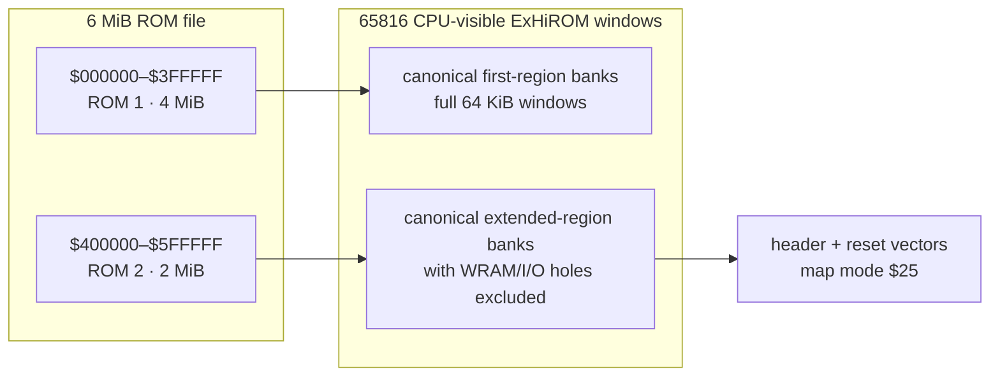
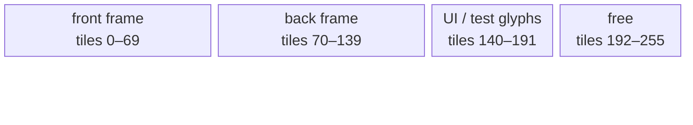
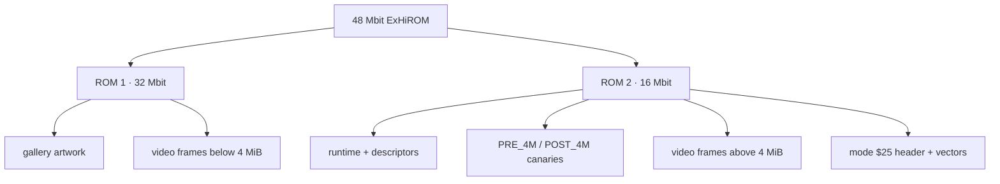

# LZSS Gallery ExHiROM Video Boundary Test

**Status:** PLANNED 2026-07-30  
**Tracks:** TODO.md `[T4] Implement extended SNES cartridge mapping when the gallery grows above
32 Mbit`  
**Target cartridge:** **48 Mbit (6 MiB) ExHiROM**, map mode `$25`, modeled as one 32 Mbit
(4 MiB) mask ROM plus one 16 Mbit (2 MiB) mask ROM.

## Goal

Build a deliberately larger-than-32-Mbit gallery cartridge that proves the complete extended
cartridge path, rather than padding an ordinary LoROM until an emulator happens to accept it.

The test payload is a real-time Mode 7 video player. Video is useful here because it:

- naturally consumes several MiB without duplicating static paintings;
- performs sustained sequential reads on both sides of—and logically spanning—the 4 MiB boundary;
- makes a wrong frame, mirror, bank, byte order, or dropped DMA immediately visible;
- can burn the file offset and mapped CPU address into every frame;
- exercises far ROM descriptors, cross-bank cursor carry, segmented DMA, and decoder/refill state
  continuously; and
- remains interesting to inspect interactively after the mapping test is complete.

This is explicitly a cross-bank usage test, not merely an address probe. Some logical frames and
compressed chunks must begin near the end of one bank and finish in the next, including a fixture
that spans the physical 4 MiB boundary. The runtime must consume those objects normally and prove
that its pointer, remaining-length, checksum, and decoder state survive every segment transition.

The first deliverable is a deterministic synthetic **boundary test reel**, not a codec showcase.
An optional public-domain film excerpt may be added after the mapping and playback gates pass.

## Why ExHiROM

Ordinary LoROM and HiROM expose at most 4 MiB. The test must use the conventional extended mapping,
normally official map mode `$25`/ExHiROM, for the region beyond that boundary.

The existing `platforms/snes-hirom` platform is useful groundwork but is not ExHiROM:

- its header is patched as ordinary HiROM mode `$21`;
- it emits a power-of-two image;
- it maps far data only through `$C1+`;
- it does not place the ExHiROM header/reset vectors in the file's second 4 MiB region; and
- its checksum tool does not model two independently sized mask ROMs.

Do not call a 6 or 8 MiB byte vector with the old LoROM header an extended cartridge.

## Cartridge-configuration coverage

The 48 Mbit reel is the largest runtime fixture, but it does **not** by itself cover every SNES
cartridge. Treat this work as the ordinary-ROM mapper suite: direct ROM plus optional SRAM, without
an address-decoding coprocessor.

Generate small canary ROMs from the same authoritative mapping model before the large video test:

| Family | Required configurations | What they prove |
|---|---|---|
| LoROM | slow and fast ROM; 512 KiB, 1 MiB, 3 MiB, 4 MiB | 32 KiB bank order, `$007FC0` file header, upper-half windows, mirrors, compound-size checksum |
| HiROM | slow and fast ROM; 512 KiB, 2 MiB, 3 MiB, 4 MiB | 64 KiB linear banks, `$00FFC0` file header, LoROM-area mirrors, cross-bank reads |
| ExHiROM | slow and fast ROM; 5 MiB, 6 MiB, 8 MiB | `$40FFC0` file header, inverted A23/region transition, second-device mirroring, extended spans |
| SRAM | LoROM and HiROM/ExHiROM, volatile and battery-backed header variants | RAM aperture does not collide with ROM windows; size/header/save-file agreement |
| Header/input | legacy and expanded internal header; unheadered `.sfc`; detected 512-byte copier input | header selection, normalization, vectors, size, chipset, region, checksum/complement |

For every row, test emulation and native CPU modes, reset/native vectors, canonical address
round-trips, first/last byte of every decoded window, intended mirrors, rejected holes, and
slow/FastROM timing selection. Include NTSC and PAL header variants, but keep video cadence testing
separate from address-decoder correctness.

Required size classes are:

- exact power of two;
- sum of two descending powers of two, such as 3 MiB (`2 + 1`) and 6 MiB (`4 + 2`);
- maximum ordinary-map size;
- minimum and maximum extended-map size used by this project; and
- invalid/truncated/ambiguously padded images that the host tools must reject.

The builder always emits an unheadered `.sfc`. A 512-byte copier header is only an import/inspection
fixture and must never contaminate cartridge offsets or checksum calculation.

### Explicitly separate cartridge families

Do not claim universal cartridge support from this plan. The following require independent
platform plans and fixtures because the cartridge hardware remaps memory or adds observable state:

- SA-1;
- SuperFX/GSU;
- S-DD1 and SPC7110 decompression/mapping;
- DSP-1/2/3/4, ST010/ST011, and Cx4;
- OBC1, S-RTC, and other memory/register peripherals;
- BS-X, Sufami Turbo, Super Game Boy, and other multi-cartridge/custom systems;
- flash-cartridge-specific large-ROM extensions; and
- unofficial ExLoROM/ROM-hack layouts.

Their header map-mode/chipset values may be recognized and reported by inspection tooling, but
recognition is not implementation support. Add one negative fixture per known unsupported family
so the linker and packer fail clearly instead of accidentally emitting a plausible-looking ROM.

## Normative test cartridge

### Capacity

Use **48 Mbit (6 MiB)** for the first test:

| Component | Capacity | Purpose |
|---|---:|---|
| ROM 1 | 32 Mbit / 4 MiB | first ExHiROM region, most video frames |
| ROM 2 | 16 Mbit / 2 MiB | boot/header region, runtime, boundary fixtures, remaining video |
| Logical image | 48 Mbit / 6 MiB | smallest convenient non-power-of-two two-device stress image |

This intentionally tests more than “8 MiB filled with zeros.” The builder and reports must preserve
the physical `4 MiB + 2 MiB` decomposition, while the internal ROM-size field uses the appropriate
logical/decode size required by the ExHiROM header model.

### Address model

Define one authoritative host function:

```text
file_offset -> { physical_rom, physical_offset, cpu_bank, cpu_address }
```

and its checked inverse for every mapped byte. Generate linker regions, asset descriptors, map
reports, and host verification from that model. Do not independently reimplement the mapping in
the linker generator, video packer, and report renderer.

The mapping specification must explicitly identify:

- the CPU windows for file offsets `0x000000–0x3FFFFF`;
- the CPU windows for file offsets `0x400000–0x5FFFFF`;
- header location, map-mode byte, reset vector, native vectors, and emulation vectors;
- which mirrors are accepted but never emitted into descriptors;
- the inaccessible holes around WRAM/I/O banks;
- the maximum contiguous DMA source span before a 16-bit A-bus address wraps; and
- how a 6 MiB physical image is mirrored for checksum purposes.



Before implementation, replace the descriptive bank labels in this diagram with exact bank ranges
derived from the chosen ExHiROM decoder model and add a complete file-offset/CPU-address table.

## Video format

### Normative format

| Property | Value |
|---|---:|
| Visible source raster | **80 × 56 pixels** |
| Tile geometry | 10 × 7 = **70 Mode 7 tiles** |
| Pixel format | 8-bit indexed / Mode 7 chunky |
| Bytes per frame | **4,480** |
| Buffers in VRAM | 2 × 70 tiles = **140 of 256 tiles** |
| Presentation cadence | **30 fps NTSC**, one new frame every two VBlanks |
| Palette | one fixed 223-color video palette; 32 CGRAM entries remain sprite-owned |
| Audio | none in milestone 1 |
| Scaling | Mode 7 affine matrix scales and centers the raster in the 256 × 224 display |

Mode 7 has a 128 × 128-byte tilemap but only 256 available 8 × 8 chunky tiles. Two 80 × 56 frames
fit simultaneously; two 160 × 96 frames do not.

At 80 × 56, a complete frame is 4,480 DMA bytes. The theoretical 224-line NTSC VBlank ceiling is
6,123 bytes before setup/interrupt overhead. Reserve the remainder for OAM, bounded palette work,
register setup, and safety margin. Do not target a format that requires forced blank for ordinary
frame presentation.



The block widths are schematic. Exact tile-number ownership is normative in the generated report.

### Frame presentation

1. During active display, prepare the next frame descriptor and DMA registers only.
2. On the chosen presentation VBlank, DMA all 4,480 pixel bytes into the hidden tile set.
3. Change the Mode 7 tilemap selection or precomputed viewport/scroll anchor atomically so the
   completed buffer becomes visible.
4. Never reveal a partially uploaded frame.
5. Alternate front/back tile sets.
6. Advance at 30 fps using a `0, 2, 4, ...` VBlank cadence; define PAL behavior explicitly
   (25 fps conversion or cadence-correct duplicate/drop policy).

The logical frame may span banks, but each physical DMA command must stop at the end of its current
64 KiB A-bus bank. The runtime then advances through the mapper-aware segment list and resumes the
same frame from the next canonical CPU window. The SNES DMA source address increments only its
16-bit address; it does not carry into the bank byte. A frame becomes visible only after all of its
segments have completed.

### Scaling

Default to aspect-preserving scale with black letterbox/pillarbox surround. Add an optional
full-screen stretch mode for the requested Mode 7 effect:

- `A`/`D` matrix terms scale 80 × 56 independently to 256 × 224;
- nearest-neighbor sampling preserves the indexed-video character;
- Select toggles aspect-preserving versus full-screen stretch; and
- no rotation is enabled in the correctness gate, though a slow optional rotation is acceptable
  as a presentation extra after playback is stable.

## Boundary test reel

Generate frames deterministically. Every frame contains:

- frame number;
- ROM file offset;
- canonical CPU address;
- physical device (`ROM 1` or `ROM 2`);
- a per-frame CRC/fold rendered as text;
- moving color bars and a one-pixel checker pattern that expose dropped/corrupt bytes; and
- a large boundary slate before and after every critical transition.

Required frame placements:

| Fixture | Placement requirement |
|---|---|
| `PRE_4M` | last complete frame wholly below file offset `0x400000` |
| `BANK_SPAN` | one logical frame split across two adjacent 64 KiB CPU banks |
| `MULTIBANK_SPAN` | one logical record spanning at least three CPU banks |
| `EDGE_4M` | one logical frame/chunk beginning below and ending above file offset `0x400000` |
| `POST_4M` | first complete frame wholly above file offset `0x400000` |
| `ROM2_MID` | frame in the middle of the second physical ROM |
| `ROM2_LAST` | last addressable complete frame in the 6 MiB image |
| `MIRROR_PROBE` | distinct canaries proving the canonical window is not the wrong mirror |

`BANK_SPAN`, `MULTIBANK_SPAN`, and `EDGE_4M` are required positive fixtures. The packer emits one
logical object plus an ordered list of mapper-aware physical segments; it must never silently pad
these objects back to a bank boundary. Also add negative fixtures for an unsplit DMA operation,
an incorrect linear bank carry, a skipped byte, a duplicated byte, and use of the wrong ExHiROM
mirror. Each fault must produce a distinct host-test or on-console oracle failure.

Run the same span matrix through three consumers:

1. raw frame DMA, proving segmented source use and atomic presentation;
2. CPU byte/word reads and running CRC, proving ordinary far reads and pointer carry; and
3. LZSS refill/decode into a bounded staging buffer, proving stateful consumption across mapper
   discontinuities rather than only direct DMA.

The reel should fill essentially all remaining cartridge capacity. At 4,480 bytes/frame and
30 frames/second, about 5 MiB of frame payload represents roughly 39 seconds of raw video.

## Optional public-domain clip

After the synthetic reel passes, the same converter may ingest a short public-domain or CC0 clip:

1. crop/letterbox to 80 × 56;
2. choose one global 223-color BGR555 palette for the complete clip;
3. quantize/dither every frame against that fixed palette;
4. burn a small frame counter and boundary marker into the image;
5. emit raw keyframes first; and
6. evaluate tile-delta/RLE/LZSS only as a later storage experiment.

Raw frames are preferred for the mapping milestone because decompressor performance must not hide
an address-decoder error. Audio is deferred; BRR/SPC streaming is a separate subsystem and does not
help prove ExHiROM.

### Thirty clip candidates

The target excerpt is 8–20 seconds with large motion, bold silhouettes, limited cuts, and no
necessary dialogue. Prefer the downloadable Library of Congress item or an original
agency-produced master—not a restoration, social-media repost, colorization, or rescored edition.

| # | Candidate excerpt | Why it should survive 80 × 56 | Candidate source/status |
|---:|---|---|---|
| 1 | *The Great Train Robbery* — bandits advancing toward camera | strong figures and lateral motion | LOC Public Domain Films set |
| 2 | *The Great Train Robbery* — final gunshot close-up | iconic high-contrast close-up | LOC Public Domain Films set |
| 3 | *May Irwin Kiss* — central close-up | two large faces; almost no background detail | LOC Public Domain Films set |
| 4 | *Panorama of Machine Co. Aisle* — Westinghouse factory pan | repeating machinery makes corruption obvious | LOC Public Domain Films set |
| 5 | *San Francisco Earthquake and Fire* — street panorama | strong parallax and documentary motion | LOC Public Domain Films set |
| 6 | *President McKinley Taking the Oath* — oath platform | stable composition plus human movement | LOC Public Domain Films set |
| 7 | *Popeye the Sailor Meets Sindbad the Sailor* — giant bird/ship action | bold cel-animation outlines and saturated shapes | LOC Public Domain Films set |
| 8 | *St. Louis Blues* — performance close-up | expressive faces and rhythmic motion | LOC Public Domain Films set |
| 9 | *The Middleton Family at the New York World's Fair* — fair machinery | geometric exhibits and mechanical movement | LOC Public Domain Films set |
| 10 | *Master Hands* — assembly-line machinery | excellent motion/detail stress material | LOC Public Domain Films set |
| 11 | *The Memphis Belle* — bomber takeoff or formation | large aircraft silhouettes and sky gradients | LOC Public Domain Films set |
| 12 | *Duck and Cover* — animated turtle sequence | simple graphic animation ideal for low resolution | LOC Public Domain Films set |
| 13 | *Trance and Dance in Bali* — dance passage | full-body rhythmic motion and costume texture | LOC Public Domain Films set |
| 14 | *Within Our Gates* — outdoor or train-platform movement | readable staging and historical visual character | LOC Public Domain Films set |
| 15 | *The Hitch-Hiker* — road/car passage | headlights, road motion, and noir contrast | LOC Public Domain Films set |
| 16 | Apollo 11 Saturn V launch | huge central object, smoke, and continuous vertical motion | NASA-produced footage candidate |
| 17 | Apollo 11 lunar-module descent | terrain flow provides a natural codec stress pattern | NASA-produced footage candidate |
| 18 | Apollo 11 first step on the Moon | unmistakable silhouette at very low resolution | NASA-produced footage candidate |
| 19 | Apollo 15 hammer-and-feather drop | two trackable objects and a clean scientific action | NASA-produced footage candidate |
| 20 | Apollo 17 lunar-rover drive | landscape scrolling, wheel motion, and dust | NASA-produced footage candidate |
| 21 | STS-1 Columbia launch | bright flame and strong vertical composition | NASA-produced footage candidate |
| 22 | Space Shuttle solid-rocket-booster onboard view | rapid rotation and Earth/horizon movement | NASA-produced footage candidate |
| 23 | ISS Earth-limb daylight time-lapse | smooth full-frame motion and cloud texture | NASA-produced footage candidate |
| 24 | ISS aurora time-lapse | dark field with bright moving color structures | NASA-produced footage candidate |
| 25 | Perseverance rover descent-camera sequence | fast terrain expansion and a historic landing | NASA/JPL-produced footage candidate |
| 26 | Ingenuity helicopter first flight | small moving subject against textured ground | NASA/JPL-produced footage candidate |
| 27 | DART impact on Dimorphos | dramatic expanding target and terminal motion | NASA-produced footage candidate |
| 28 | OSIRIS-REx sample capsule return | bright moving capsule/parachute silhouette | NASA-produced footage candidate |
| 29 | Artemis I launch | modern high-contrast launch and exhaust plume | NASA-produced footage candidate |
| 30 | Solar Dynamics Observatory flare/prominence | fixed framing, organic motion, extreme color gradients | NASA-produced visualization candidate |

Best first visual trials are **#12 Duck and Cover animation**, **#16 Apollo 11 launch**, **#19
hammer-and-feather**, **#23 ISS Earth limb**, and **#30 solar flare**. Test all five through the
fixed 223-color quantizer and choose using measured compressed size plus a side-by-side 80 × 56
contact sheet, not the HD source alone.

“Public domain collection” is not a substitute for recording the exact asset used. Before checking
media into the repository, add a provenance record containing:

- canonical item/download URL and retrieval date;
- creator/agency and title;
- the item-level rights statement or explicit CC0 declaration;
- exact source-file SHA-256;
- selected time range and whether frames were cropped, retimed, or otherwise modified;
- confirmation that the chosen file has no copyrighted score, narration, restoration, stock
  footage, third-party watermark, or agency logo used as branding; and
- jurisdiction note: public-domain status is verified for United States distribution, with any
  known limits called out rather than silently assuming worldwide status.

NASA media is generally not subject to copyright in the United States, but NASA identifiers are
protected and individual files can contain marked third-party material. NOAA is a useful fallback
source only after item-level review because NOAA explicitly warns that some videos incorporate
third-party footage or music. The Library of Congress **Public Domain Films from the National Film
Registry** set is preferred over arbitrary National Screening Room results because the latter also
contains copyrighted streaming-only works.

## Linker and platform work

Create an opt-in platform rather than mutating ordinary gallery LoROM:

- `platforms/snes-exhirom/` for reusable mapping/header/link rules;
- `platforms/snes-gallery-exhirom/` if generated per-bank gallery/video sections remain
  application-specific;
- a generated linker fragment for occupied video banks;
- explicit assertions for header/vector addresses and both physical-ROM boundaries;
- generated segment tables for logical objects that cross CPU-bank or physical-device boundaries;
- an assertion that each individual DMA segment—not each logical frame—stays within one 64 KiB
  source bank;
- separate sections for runtime, descriptors, palettes, boundary canaries, and video frames; and
- an `OUTPUT_FORMAT` order that exactly matches the decoder/file-offset model.

Near code must still boot through bank `$00` semantics. Far video descriptors must use real
24-bit CPU addresses and must be consumable by both 8-bit and `+mos-a16` builds where applicable.
No descriptor may store a raw file offset and pretend it is a CPU pointer.

## Header, size, and checksum tooling

Extend `tools/snes-checksum.py` or replace its mapping-specific branches with a structured mapper
model:

- `--mapping exhirom`;
- map mode `$25` (slow ExHiROM) for milestone 1;
- ExHiROM header/checksum/complement offsets;
- logical ROM-size byte policy for 6 MiB;
- two-device physical decomposition validation;
- correct checksum mirroring for the smaller second device;
- rejection of invalid lengths/decompositions;
- header title and reset/vector structural checks; and
- a read-only `--inspect` mode that prints mapping, logical size, devices, header, vectors,
  checksum, and canonical CPU ranges.

Add golden fixtures for 4 MiB ordinary HiROM, 5/6/8 MiB ExHiROM, invalid `4 MiB + non-power-of-two`,
wrong header location, wrong mode byte, and incorrect mirror/checksum calculations.

## Asset and video generator

Add `tools/snes-video-pack.py` with deterministic output:

- accepts a generated reel or image sequence;
- quantizes to one fixed palette;
- tiles frames in Mode 7 chunky order;
- deliberately places selected logical frames/chunks across bank and device boundaries;
- emits bank-contained physical segments for every spanning logical object;
- emits far-address descriptors from linker symbols, not guessed bank arithmetic;
- records raw-frame SHA-256, tile SHA-256, palette hash, expected CPU address, and physical device;
- produces contact sheets for boundary frames;
- emits a host decoder/player oracle; and
- can generate a small fixture cartridge without the gallery for fast tests.

The generator report becomes the input to romopt and the cartridge-map visualizer.

## Runtime

Add a small video state machine:

```text
READ_DESCRIPTOR
  -> ARM_HIDDEN_BUFFER_DMA
  -> WAIT_FOR_PRESENTATION_VBLANK
  -> DMA_COMPLETE_FRAME
  -> FLIP_VISIBLE_TILE_SET
  -> VERIFY_FRAME_ID
  -> NEXT_FRAME
```

Runtime requirements:

- controller remains responsive every VBlank;
- Left/Right seek to previous/next boundary slate;
- Start pauses; Select toggles scaling mode;
- a visible indicator changes when playback crosses ROM 1 → ROM 2;
- a running fold includes frame ID, descriptor address, first/last pixel, and per-frame expected CRC;
- the source cursor is `(canonical CPU address, bytes remaining, segment index)` and advances
  through generated mapper segments without assuming that bank-byte increment is always valid;
- raw DMA, CPU-copy/CRC, and LZSS-refill paths consume the required spanning fixtures;
- the final `corpus_result` cannot pass unless frames from both physical regions were displayed;
- a wrong mirror must produce a distinct failure code; and
- video playback must not share mutable buffers with the gallery compressor.

## ROM-map visualization

Update `tools/lzss-gallery-rom-layout.py` and `tools/snes-rom-map.py` to understand ExHiROM:

- show file offsets and canonical CPU addresses together;
- group banks by physical ROM device;
- mark the 4 MiB mapping boundary prominently;
- show the header/vector bank in its actual file position;
- show every video frame or collapsed frame range;
- distinguish runtime, paintings, video, palettes, boundary canaries, padding, and mirrors;
- show physical `32 + 16 Mbit` decomposition;
- retain dividers at every 1 MiB; and
- provide boundary filters/jump links in the HTML view.



## Files

| File | Change |
|---|---|
| `platforms/snes-exhirom/*` | reusable ExHiROM platform and linker layout |
| `platforms/snes-gallery-exhirom/*` | generated gallery/video bank sections if needed |
| `tools/snes-checksum.py` | ExHiROM header, device sizing, mirrored checksum, inspection |
| `tools/snes-video-pack.py` | deterministic Mode 7 test-reel converter/packer |
| `tools/lzss-gallery-rom-layout.py` | extended map/device/boundary HTML |
| `tools/snes-rom-map.py` | ExHiROM-aware Markdown/diagram report |
| `examples/snes/lzss-gallery-video.c` | minimal isolated player fixture |
| `examples/snes/lzss-gallery.c` | optional gallery integration after fixture passes |
| `dev/lzss-gallery-video.sh` | build, structural, emulator, and frame-readback gate |
| `test/snes/cartridge-maps/*` | generated LoROM/HiROM/ExHiROM mapper and header matrix |
| `dev/run.sh` | target routing and test knobs |
| `docs/snes-demo-cookbook.md` | extended cartridge and video-DMA recipe |
| `docs/refs/snes-hardware/snes-hardware-summary.md` | LoROM/HiROM/ExHiROM limits and windows |
| `docs/65816-references.md` | authoritative mapping/timing references |

## Implementation phases

### Phase 0 — lock the decoder model

1. Write exact file-offset ↔ CPU-address tables for every ordinary-map matrix size.
2. Generate and run the small LoROM/HiROM/ExHiROM canary cartridges.
3. Confirm header/vector placement and map-mode/speed bytes.
4. Confirm compound-size checksum mirroring with at least two independent tools/emulators.
5. Add pure-host unit tests before writing the ExHiROM linker script.

### Phase 1 — minimal 6 MiB boot/canary ROM

Build a tiny program padded to 6 MiB with distinct canaries below/above 4 MiB. Boot, read both via
far pointers, then CRC buffers that span one bank, multiple banks, and the 4 MiB device boundary.
Pass in MAME and bsnes-jg. This isolates mapping and cross-bank cursor behavior from video.

### Phase 2 — video-only boundary fixture

Add the 80 × 56 double-buffered synthetic reel. Prove correct sustained playback and boundary
crossing without the painting gallery. Exercise raw segmented DMA and LZSS refill/decode with
logical frames/chunks that span the required boundaries.

### Phase 3 — gallery integration

Pack the current gallery plus the test reel with romopt, generate the complete linker layout, and
add a gallery menu entry that opens the video test.

### Phase 4 — optional film clip and publication

Add a licensed public-domain clip only after raw synthetic playback passes. Publish the ROM,
layout visualization, boundary contact sheet, and verification evidence.

## Verification

### Host structural gates

- every required ordinary-ROM mapper configuration has a generated passing canary;
- known coprocessor/custom mapper inputs are recognized but rejected as unsupported;
- exact ROM length is 6,291,456 bytes;
- physical decomposition is exactly 4 MiB + 2 MiB;
- header is found only at the intended ExHiROM location;
- map mode is `$25`;
- reset and interrupt vectors point to linked executable code;
- every emitted descriptor round-trips CPU address ↔ file offset;
- PRE/POST boundary canaries are distinct and at exact offsets;
- every required logical span is present and no individual DMA segment crosses a 64 KiB bank;
- concatenating each segment list exactly reproduces its source object with neither gaps nor
  duplicated bytes;
- `BANK_SPAN`, `MULTIBANK_SPAN`, and `EDGE_4M` pass through raw DMA, CPU CRC, and LZSS refill;
- checksum/complement agree with independent calculation;
- every padding/mirror byte is deterministic; and
- the visual map covers every physical byte exactly once.

### Playback gates

- native 80 × 56 frame readback equals the host frame before scaling;
- 30 fps cadence has no partial-frame exposure;
- worst-case VBlank DMA remains below the measured project budget, not merely the 6,123-byte
  theoretical ceiling;
- first, PRE_4M, POST_4M, ROM2_MID, and ROM2_LAST screenshots match host references;
- the visible `BANK_SPAN`, `MULTIBANK_SPAN`, and `EDGE_4M` frames match host references;
- final oracle proves both physical devices were read;
- pause, seek, scaling toggle, and cancellation remain responsive;
- no forced-blank frame or black band appears; and
- red-dot/gallery sprite palettes remain isolated if integrated.

### Emulator/browser matrix

Run:

1. bsnes-jg native;
2. MAME;
3. the bundled bsnes-jg WASM player on both sites;
4. a second accuracy-oriented emulator if available; and
5. real hardware or a flash cartridge that explicitly supports ExHiROM before claiming physical
   cartridge compatibility.

For each, record boot, header detection, mapped canary values, frame CRCs around 4 MiB, final
oracle, screenshots, and ROM SHA-256. An emulator accepting the file is not sufficient; it must
return the expected bytes from both canonical CPU regions.

## Publication

Publish the video fixture as a separate experimental ROM/page first. Do not replace the stable
gallery ROM until the extended version passes the complete matrix.

The page must include:

- mapping type and 48 Mbit capacity;
- physical `32 + 16 Mbit` decomposition;
- embedded, non-scroll-region cartridge map;
- frame format, resolution, cadence, duration, and palette;
- PRE/POST 4 MiB screenshots;
- emulator/hardware support table;
- downloadable ROM SHA-256; and
- a warning if a flash cartridge or emulator lacks ExHiROM support.

## Documentation updates

Update the cookbook and hardware summary with:

- why ordinary LoROM cannot be appended beyond 4 MiB;
- ordinary HiROM versus ExHiROM header and address geometry;
- physical device size versus logical header size;
- checksum mirroring for non-power-of-two sums;
- DMA source bank wrapping;
- Mode 7's 256-tile limit;
- the measured VBlank upload budget; and
- the 80 × 56 double-buffered video recipe.

References:

- [SNESdev memory map and ExHiROM](https://snes.nesdev.org/wiki/Memory_map)
- [SNESdev Mode 7/background limits](https://snes.nesdev.org/wiki/Mode_7)
- [SNESdev Mode 7 tile format](https://snes.nesdev.org/wiki/Tiles)
- [SNESdev DMA registers and bank wrapping](https://snes.nesdev.org/wiki/DMA_registers)
- [SNESdev timing and VBlank DMA ceiling](https://snes.nesdev.org/wiki/Timing)
- [Nintendo Super NES Development Manual, Book I](https://gamingdoc.org/technical-documentation/consoles/super-nintendo/official/sdk/book-i/)
- [Library of Congress Public Domain Films from the National Film Registry](https://www.loc.gov/free-to-use/public-domain-films-from-the-national-film-registry/)
- [NASA images and media usage guidelines](https://www.nasa.gov/nasa-brand-center/images-and-media/)
- [NOAA Science On a Sphere digital-media copyright guidance](https://sos.noaa.gov/copyright/)

## Completion record

When implemented, append:

- exact decoder truth table;
- linker/header/checksum commits;
- physical/logical size report;
- frame count, duration, palette hash, and video-source license;
- measured DMA bytes and cycles per presentation;
- canary addresses/values on both sides of 4 MiB;
- emulator/browser/hardware results;
- final oracle and ROM SHA-256;
- cartridge-map screenshots; and
- source/site commits and release tags.
