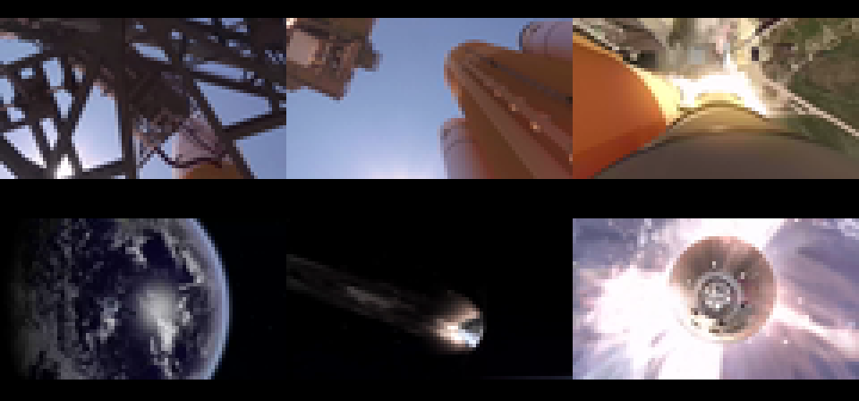

# Artemis I SVC1 benchmark

**Run:** 2026-07-31
**Status:** first real-source codec sweep; size results are measured, cycle figures remain estimates

## Sources and intervals

Both files came directly from [NASA SVS item 14191](https://svs.gsfc.nasa.gov/14191/). `ffprobe`
reports one VP8 video stream and no audio stream in each file.

| Segment | Official source | SHA-256 | Interval |
|---|---|---|---:|
| Launch | `Pre-launch_through_launch.webm` | `28f9e843111466b3ce1869975283d71a1779f593974f49d76a6da9683c769a3d` | 00:35–00:45 |
| Return | `Return_to_Earth.webm` | `bc0d89e9cf9ca33a3faa2fed6d653c9eddede0458d0ab010c228535621516dc8` | 00:56–01:06 |

The intervals contain no title card, captions, audio, or NASA logo slate. They are provisional
presentation selections pending the plan's complete item-level rights/identifier review.

Frames were retimed from 30000/1001 fps to 30 fps without optical flow, Lanczos-scaled to 80 × 45,
and padded with 5 black rows above and 6 below to form the 80 × 56 raster. The two segments produce
600 frames (20 seconds). One 223-color median-cut palette was learned over the complete corpus;
each frame was then Floyd–Steinberg dithered against that fixed palette. Encoded indices are
1–223; index 0 and 224–255 remain unused.

Derived benchmark hashes:

| Artifact | Size | SHA-256 |
|---|---:|---|
| RGB24 corpus | 8,064,000 bytes | `9794f29f6fe7c01e834694e7341041d1f91d8e60ddf9db78437753f51f3ebde5` |
| 224-entry BGR555 palette | 448 bytes | `9efba0c32e0f6ff74161c6f93081b95fa32ac98a43aaa763de641ca2adb2342d` |
| SVC1 stream, 60-frame interval | 1,581,592 bytes | `c08fc437e3bbbec33bb90b8d56b1cb1d0c3fc895c01f4f681db48bcefc66b9f0` |

## Results

Ratios include each format's packet overhead and a two-byte development-container length prefix.
Raw input is 2,688,000 indexed bytes. The cycle column is the conservative SVC1 comparison model,
not a measured 65816 result.

| Variant | Keyframe interval | Packed bytes | Raw ratio | Worst estimated cycles |
|---|---:|---:|---:|---:|
| scanline PackBits | independent frames | 1,676,088 | 62.35% | not yet measured |
| gallery LZSS — comparison only | independent frames | 1,527,674 | 56.83% | not yet measured |
| whole-frame XOR + PackBits (`SVX1`) | 15 / 30 / 60 / 120 | 1,503,585 / 1,497,055 / **1,494,441** / 1,493,884 | 55.94% / 55.69% / **55.60%** / 55.58% | not yet measured |
| raw blocks | any | 2,737,200 | 101.83% | 50,300 |
| changed blocks | 15 / 30 / 60 / 120 | 2,316,272 / 2,300,912 / 2,293,424 / 2,292,272 | 86.17% / 85.60% / 85.32% / 85.28% | 50,300 |
| changed blocks + motion copy | 15 / 30 / 60 / 120 | 2,305,184 / 2,289,572 / 2,282,021 / 2,280,869 | 85.76% / 85.18% / 84.90% / 84.85% | 50,300 |
| XOR + PackBits | 15 / 30 / 60 / 120 | 1,658,502 / 1,619,740 / 1,600,671 / 1,594,716 | 61.70% / 60.26% / 59.55% / 59.33% | 100,496 |
| full SVC1 | 15 / 30 / 60 / 120 | 1,615,302 / 1,592,412 / **1,581,592** / 1,576,875 | 60.09% / 59.24% / **58.84%** / 58.66% | 100,496 |

Among the original block-interframe candidates, full SVC1 was best. The whole-frame SVX1
optimization supersedes that result on size while retaining a 60-frame keyframe interval.

The required LZSS comparison contradicted the initial SVC1 size expectation: independent per-frame
gallery LZSS is 53,918 bytes smaller than 60-frame SVC1 over this corpus. LZSS remains
comparison-only. The subsequent whole-frame XOR + PackBits optimization (`SVX1`) is 33,233 bytes
smaller than LZSS and 87,151 bytes smaller than SVC1 at the 60-frame interval. SVX1 is therefore
the provisional size winner. Final selection remains open until:

1. the C decoder is compiled and timed on the 65816 target;
2. the SVX1 and comparison decoders have measured worst-frame and total-frame target costs; and
3. exact launch/return intervals pass the remaining source review.

## Optimization experiment: current-frame block copies

An experimental SVC1 opcode copied a complete 8 × 8 block already decoded earlier in the current
frame, adding limited intraframe reuse without an LZSS window. At a 60-frame keyframe interval it
reduced the stream from 1,581,592 to 1,581,299 bytes: **293 bytes (0.011% of raw)**. Only 25 of
42,000 blocks selected the command. The opcode was rejected and removed; that saving does not
justify another format command, decoder branch, and target-cycle verification case.

## Optimization result: whole-frame XOR + PackBits

SVC1's per-block PackBits streams reset compression state 70 times per frame. SVX1 instead encodes
one complete raw keyframe or one complete XOR delta, allowing zero and literal runs to cross tile
boundaries. At a 60-frame interval it produces **1,494,441 bytes (55.60% of raw)**. Its largest
packet is 3,780 bytes. Python and bounded callback-driven C decoders both verify the decoded-frame
CRC and match the same host oracle.

Extending SVX1 from 60 to 120 frames saves only 557 bytes, so the provisional interval remains 60
frames (two seconds) for bounded seek latency.
