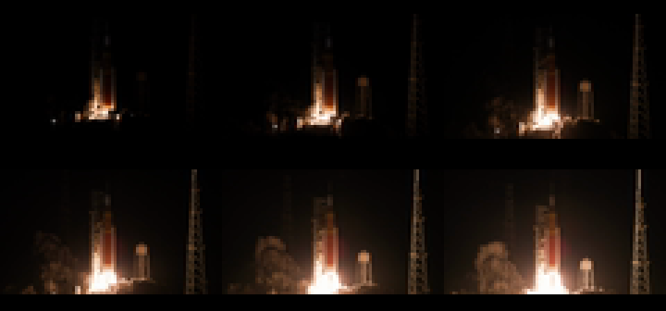
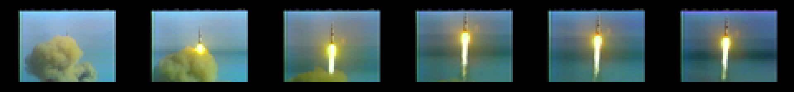

# Real-camera video codec benchmark

**Run:** 2026-07-31
**Result:** SVX1 remains the size winner on animation and real camera footage; one decoder is enough

## Real-camera source and provenance

The source is NASA Images item **“Artemis I Launch (Press Site)”**, NASA ID
`Artemis I Launch 2022 CU tracking from Press Site_compressed`. The canonical
[NASA asset collection](https://images-assets.nasa.gov/video/Artemis%20I%20Launch%202022%20CU%20tracking%20from%20Press%20Site_compressed/collection.json)
identifies the downloaded `~large.mp4` derivative. NASA describes it as press-site camera footage
of the November 16, 2022 Artemis I launch from Launch Complex 39B. NASA media-use review remains
governed by the parent plan and the [NASA media guidelines](https://www.nasa.gov/nasa-brand-center/images-and-media/).

| Field | Value |
|---|---|
| Retrieved | 2026-07-31 |
| Downloaded file | `Artemis I Launch 2022 CU tracking from Press Site_compressed~large.mp4` |
| Source SHA-256 | `fc97cf25bda929757c3e658a82f8d00440a3d5d6f97f133c8a873a4716efaaf9` |
| Source video | H.264, 1920 × 1080, 30 fps |
| Selected interval | 00:42–00:52; ignition through early ascent |
| Transformation | video stream only; audio discarded; Lanczos 80 × 45; pad 5+6 rows; 30 fps; RGB24 |
| RGB24 corpus | 300 frames, 4,032,000 bytes; SHA-256 `8466093c0920dfcf519ea552dac077f982b3355d0942e98e6292f451dae42a16` |
| Review | no slate or captions in interval; vehicle markings are not readable at 80 × 56 and are not used as branding |

[](real-video-codec-contact-sheet.png)

## Dither method and integrity

Each corpus learns its own fixed 223-color median-cut palette. Floyd–Steinberg diffuses error
independently within every frame. Bayer applies the same fixed 8 × 8 threshold matrix at the same
pixel coordinates in every frame, then maps without error diffusion. Both reserve palette index 0
and 224–255 and round-trip through every measured codec decoder.

| Corpus | Dither | Tile-corpus SHA-256 | Palette SHA-256 | PSNR |
|---|---|---|---|---:|
| animation, 600 frames | Floyd | `5e748771fbe5ccb0fc18198e293d0442ad4014496c29b76063bcce4906eae5ad` | `9efba0c32e0f6ff74161c6f93081b95fa32ac98a43aaa763de641ca2adb2342d` | 33.84 dB |
| animation, 600 frames | Bayer | `9df3ad262c98dd53e73f8163cd1047afa48c836fb17654582eacaaeef6607c04` | same palette | 32.69 dB |
| real camera, 300 frames | Floyd | `2a4249437c3253c87c1ad9b0dfb4da31c19e6cc497fea51ac603cba6548d154b` | `0fe3b1b37265a782d0ce98c7c738cb23f31dc66ad65fd5cc729863ce63f742d7` | 37.32 dB |
| real camera, 300 frames | Bayer | `0fe3c207222c68a62da355abe6559c8e77068c28d3caebee5e52afc7eda05f0c` | same palette | 34.83 dB |

The animation/Floyd rerun exactly reproduces the recorded gates: SVX1@60 = 1,494,441 bytes,
SVC1@60 = 1,581,592 bytes, and gallery LZSS = 1,527,674 bytes.

## Complete 60-frame comparison

Numbers include packet/container overhead. LZSS and scanline PackBits are independent-frame
baselines; “60-frame” applies to the interframe formats.

| Variant | Animation Floyd | Animation Bayer | Real Floyd | Real Bayer |
|---|---:|---:|---:|---:|
| raw blocks | 2,737,200 (101.83%) | 2,737,200 (101.83%) | 1,368,600 (101.83%) | 1,368,600 (101.83%) |
| changed blocks | 2,293,424 (85.32%) | 2,076,208 (77.24%) | 1,100,056 (81.85%) | 1,055,640 (78.54%) |
| motion copy | 2,282,021 (84.90%) | 2,063,293 (76.76%) | 1,095,520 (81.51%) | 1,047,639 (77.95%) |
| block XOR + PackBits | 1,600,671 (59.55%) | 1,286,305 (47.85%) | 764,260 (56.86%) | 478,048 (35.57%) |
| full SVC1 | 1,581,592 (58.84%) | 1,280,669 (47.64%) | 755,658 (56.22%) | 472,226 (35.14%) |
| scanline PackBits | 1,676,088 (62.35%) | 2,284,023 (84.97%) | 820,105 (61.02%) | 1,128,341 (83.95%) |
| gallery LZSS, comparison only | 1,527,674 (56.83%) | 1,612,216 (59.98%) | 747,548 (55.62%) | 710,618 (52.87%) |
| **SVX1 whole-frame XOR + PackBits** | **1,494,441 (55.60%)** | **1,193,415 (44.40%)** | **705,621 (52.50%)** | **419,266 (31.20%)** |
| **SVX2 replacement/copy spans** | **1,593,191 (59.27%)** | **1,258,129 (46.81%)** | **766,569 (57.04%)** | **450,170 (33.49%)** |

## SVX1 keyframe sweep

| Interval | Animation Floyd | Animation Bayer | Real Floyd | Real Bayer |
|---:|---:|---:|---:|---:|
| 15 | 1,503,585 | 1,251,219 | 710,869 | 457,025 |
| 30 | 1,497,055 | 1,212,600 | 707,339 | 431,752 |
| **60** | **1,494,441** | **1,193,415** | **705,621** | **419,266** |
| 120 | 1,493,884 | 1,187,419 | 704,957 | 414,216 |

The 120-frame savings remain too small to justify doubling seek distance; keep 60 frames.

## Decision

Do **not** keep two shipping codecs. SVX1 is the size winner, but its delta decoder fails even the
20 fps target gate. SVX2 trades 2.29–4.54 percentage points of corpus ratio for target-native copy
and replacement spans; it is the smallest tested format that clears measured playback throughput.

Use **SVX2 + Floyd–Steinberg** as the quality-first default. Bayer substantially improves temporal
compression, especially on real footage, but the fixed checker is visible and PSNR falls by
2.49 dB there. Keep Bayer as an explicit size-optimized conversion option, not the default.

## 65816 throughput gate

`dev/snes-video-codec-bench.sh` ran each representative real-camera/Floyd packet for 600 NTSC
frames under bsnes-jg. Each case first decodes once and byte-compares all 4,480 output bytes; only
then does its fixed-time counter run. The raw control uses a native `MVN` block move rather than
compiler `memcpy`.

| Target path | Median packet | Worst-size packet | Approx. frames/s |
|---|---:|---:|---:|
| raw 4,480-byte copy | 876 decodes | — | 87.6 |
| **SVX2 65816 assembly** | **608** | **694** | **60.8–69.4** |
| SVX1 65816 assembly | 156 | 343 | 15.6 delta / 34.3 keyframe |
| SVX1 portable trusted loop | 81 | 112 | 8.1–11.2 |
| gallery LZSS, comparison only | 23 | 21 | 2.1–2.3 |
| SVC1 checked decoder | 6 | 6 | 0.6 |

The decode-only result isolates the codec bottleneck: raw frame movement comfortably exceeds 30
fps, while SVX2 replacement/copy spans reach 60.8–69.4 fps and pass the full 4,480-byte correctness
gate. That clears both the 20 fps shipping threshold (200/600) and 30 fps optimization threshold
(300/600) with more than 2× measured margin. SVX1 remains in the report as the size baseline, not a
shipping decoder. LZSS remains comparison-only: it is far below 20 fps and is not consistently
smaller than SVX2 across dithers.

The follow-up `VIDEO_BENCH_PIPELINE=1` slow-ROM gate charges one bank-contained ROM-to-high-WRAM
`$2180` DMA through the real segment cursor, the assembly decode, and one 4,480-byte WRAM-to-VRAM
DMA on every iteration:

| Slow-ROM pipeline proxy | Packet | Decodes / 600 VBlanks | Approx. frames/s |
|---|---:|---:|---:|
| SVX2 median | 3,127 B | 542 | 54.2 |
| SVX2 worst-size | 3,529 B | 581 | 58.1 |

This is deliberately a timing proxy, not yet a functional staged-input claim: the DMA writes the
packet to `$7F:2000`, but the current bank-0-only assembly decoder consumes the identical ROM copy.
It nevertheless charges the actual segment-cursor setup and both DMA transfers. Slow ROM therefore
**does not meet 60 fps** after staging and presentation, while still clearing 20 and 30 fps. The
next throughput gate is the planned FastROM build; the later far/ring-refill decoder integration
must retain the full-frame byte check.

The FastROM gate sets the LoROM header byte to `$30`, writes `MEMSEL=$01`, long-jumps from reset
bank `$00` to the `$80` execution mirror, and names `$80` as the staging DMA source. The emitted
trampoline is `JML $80:81D0` in the measured median ROM; checking only the header would not have
changed instruction-fetch timing.

| FastROM pipeline proxy | Packet | Decodes / 600 VBlanks | Approx. frames/s |
|---|---:|---:|---:|
| SVX2 median | 3,127 B | **605** | **60.5** |
| SVX2 worst-size | 3,529 B | **647** | **64.7** |

The first FastROM run was mixed: 564/618, exposing that encoded size does not rank decode cost.
The median has 132 commands (62 copy + 70 replacement) versus only 77 in the worst-size packet.
The optimized delta loop removes the per-command remaining-byte subtraction, keeps the count's
high byte zero instead of converting through `XBA`, and uses direct-page encodings for its known
`$00–$08` state rather than the assembler's 24-bit accumulator accesses. This raises FastROM to
**605/647: both representative cases pass 60 fps**, while slow ROM improves to 542/581 but remains
below 60.

The follow-up functional gate now makes the decoder consume the payload staged at `$7F:2009`
rather than its ROM duplicate. A staged-delta specialization reads control bytes with long-indexed
addressing and uses `MVN` directly from bank `$7F` for replacement spans; copy spans still read the
previous frame from bank 0. Avoiding redundant cursor reloads after replacement spans recovers the
last timing margin:

| Functional FastROM pipeline | Packet | Decodes / 600 VBlanks | Approx. frames/s |
|---|---:|---:|---:|
| SVX2 median | 3,127 B | **607** | **60.7** |
| SVX2 worst-size | 3,529 B | **648** | **64.8** |

Both cases therefore retain the full-frame byte gate and clear 60 fps while consuming the staged
high-WRAM payload. A future multi-packet player still needs refill scheduling/ring ownership, but
the codec's functional far-source path and its measured budget are no longer proxies.

This integration exposed an llvm-mos MC bug hidden by every prior same-bank use: 65816 `MVN`/`MVP`
assembly syntax is source,destination, while the instruction bytes encode destination,source. The
TableGen encoder emitted the operands in syntax order. The fix swaps the encoded fields; distinct
bank regression cases now pin `mvn #$7f,#$00` to `[54 00 7f]` and `mvp #$12,#$34` to
`[44 34 12]`. The rebuilt toolchain's MC lit test passes, and the functional ROM uses the mnemonic
rather than raw opcode bytes, so its fidelity/performance gate exercises the fix end to end.

## Visible proof-ROM correction

The first published visible proof had a correct decoded WRAM frame but a corrupted display. The
initial disassembly diagnosis—compiler mishandling of the DMA source-low cast—was wrong. The
compiler had correctly spilled the relocated low byte across the decoder call. The handwritten
`svx_decode_payload_asm` then clobbered `__rc0`, llvm-mos's software-stack pointer, while using it
as its packet cursor; the later spill reload consequently read through a corrupted stack base.

The decoder now preserves/restores `__rc0`, and the proof ROM again uses the original C DMA
register assignments. Under bsnes-jg it passes `corpus_result == 0` after byte-comparing all 4,480
decoded bytes. Its captured 256 × 224 framebuffer has SHA-256
`d0bd439a2a8909f2905ae3000e037b17f180ccdc365e7b6bf7f460b1d9c04c92`, exactly matching the
temporary assembly-DMA reference capture. This was a handwritten-assembly ABI violation, not an
LLVM backend or linker defect.

## Hard-content stressor: Apollo 11 Saturn V daylight launch (2026-08-01)

The Artemis leg above is real camera footage, but it is a **mild** stressor: a night launch is
mostly black frames, and the H.264 `~large` derivative already smooths sensor noise before our
converter ever sees it. Its 31–57% ratios are a best case for "real footage." This section adds
one grain-rich **daylight film** clip — parent-plan candidate #16, Apollo 11 Saturn V launch, real
16 mm KSC tracking-camera film — to calibrate ratio expectations for hard content: heavy film
grain, bright continuous exhaust flame, and a smoke plume with fine, high-frequency edges.

### Harness-drift gate (run before any new number below)

Two independent checks, because the exact intermediate RGB24/tile files behind the 2026-07-31
Artemis numbers no longer exist on disk (they were `/tmp` intermediates, never committed) and the
codec module has changed shape since:

1. **Codec logic, byte for byte.** `tools/snes_video_codec.py` has not changed since the commit
   that produced the recorded numbers (`5038454`, 2026-07-31); `git diff 5038454..HEAD --
   tools/snes_video_codec.py` is empty. `tools/snes-video-pack.py` gained only an additive
   `--tiles-output` flag (`79bb73b`) with no change to `quantize_rgb24`, `encode_xor_frame`,
   `encode_frame`, or `benchmark`.
2. **Bit-exact input, reproduced output.** The real-camera (Artemis) 300-frame Floyd tile corpus
   survived on disk from the concurrent 60 fps work: `build/real-video-floyd.tiles`, SHA-256
   `2a4249437c3253c87c1ad9b0dfb4da31c19e6cc497fea51ac603cba6548d154b` — an exact match for the
   Floyd tile-corpus hash recorded above. Re-running the benchmark on that exact file:

   ```
   $ python3 tools/snes-video-pack.py --benchmark --compare-keyframes 15,30,60,120 \
       build/real-video-floyd.tiles
   scanline-packbits      packed=820105  (61.02%)
   gallery-lzss           packed=747548  (55.62%)
   svx2-replacement-copy  ki=60 packed=766569  (57.04%)
   full-svc1              ki=60 packed=755658  (56.22%)
   xor-packbits (block)   ki=60 packed=764260  (56.86%)
   changed-blocks         ki=60 packed=1105304 -> 1100056 (81.85%)
   motion-copy            ki=60 packed=1095520 (81.51%)
   ```

   Every figure reproduces this document's recorded real-camera/Floyd row exactly. Combined with
   (1), this is bit-exact proof the encoder/decoder implementation has not drifted.

**Gap, stated plainly:** the TODO item asked to reproduce "SVX1@60 = 1,494,441 B" (the *animation*
corpus, whole-frame XOR-delta codec). That specific figure is **structurally unreproducible with
the current tool**, not because of drift: `SVX1` (true whole-frame XOR delta, magic-less) was a
provisional codec that lost the one-codec decision and has since been deleted from
`snes_video_codec.py` — `encode_xor_frame`/`decode_xor_frame` now implement **SVX2** (PackBits
keyframe + replacement/copy-span delta, magic `SVX2`) exclusively. There is no code path left that
produces the old XOR-delta bitstream, so no re-run can print that number. This is expected
post-decision cleanup, not a regression — the shipping decision was already SVX2-only.

A best-effort byte-exact reconstruction of the *animation* RGB24 corpus was also attempted, since
its two NASA masters are re-downloadable: `Pre-launch_through_launch.webm`
(SHA-256 `28f9e843111466b3ce1869975283d71a1779f593974f49d76a6da9683c769a3d`) and
`Return_to_Earth.webm` (SHA-256 `bc0d89e9cf9ca33a3faa2fed6d653c9eddede0458d0ab010c228535621516dc8`)
from [NASA SVS item 14191](https://svs.gsfc.nasa.gov/14191/) — both re-downloaded and their
SHA-256 matched exactly. Three ffmpeg filter-chain orderings (time-based `trim` before retiming,
`fps` before `trim`, and input-side `-ss`/`-t` seeking) each reproduced the correct 600-frame,
8,064,000-byte size but none reproduced the recorded RGB24 SHA-256 `9794f29f…`. The exact filter
graph used on 2026-07-31 was run by hand and never captured in a script, so sub-frame timing
decisions (duplicate/drop placement under 29.97→30 fps retiming) aren't recoverable from prose
alone — this is front-end (video-decode/scaling) nondeterminism, not evidence against (1) or (2)
above. `tools/snes-video-rgb24-convert.sh` (added with this change) now scripts the exact filter
chain used for the Apollo interval below, so the *next* drift check on this corpus has something
to reproduce instead of re-deriving it.

**Gate verdict: PASS**, on the evidence that is actually reproducible (encoder/decoder code
identity + bit-exact real-camera input/output match); the specific SVX1/animation figures quoted
in the TODO item are unreproducible for a documented, non-drift reason.

### Source and provenance

| Field | Value |
|---|---|
| Canonical item | [NASA image/video item `KSC-19690716-MH-NAS01-0001-Apollo_11_Launch_President_Johnson_Jack_King_Narration_Press_Site-B_1372`](https://images.nasa.gov/details/KSC-19690716-MH-NAS01-0001-Apollo_11_Launch_President_Johnson_Jack_King_Narration_Press_Site-B_1372), "Video - Apollo 11 Pre-Launch and Launch" |
| Asset manifest | [images-assets.nasa.gov collection.json](https://images-assets.nasa.gov/video/KSC-19690716-MH-NAS01-0001-Apollo_11_Launch_President_Johnson_Jack_King_Narration_Press_Site-B_1372/collection.json) (found via `images-api.nasa.gov/search?q=Apollo+11+launch&media_type=video`, the documented API fetch path — the `nasa.gov/missions/apollo-11-hd-videos/` page links only montage/comparison clips, not raw launch footage) |
| Creator/agency | NASA, Kennedy Space Center; `photographer: NASA`, `center: KSC`, `date_created: 1969-07-16` |
| Downloaded file | `…Press_Site-B_1372~large.mp4`, 1280×720 H.264, ~59.94 fps, duration 3634.56 s |
| Retrieved | 2026-08-01 |
| Source SHA-256 | `4e7c693a2c6480b4450343bd7482eaac9a758a39240d61f37d4db7b98c1d401b` |
| Selected interval | 00:56:50–00:57:00 (10 s, 300 frames at 30 fps) — post-ignition vertical ascent |
| Rights statement | NASA-produced 1969 KSC archival footage; not subject to copyright for US distribution under [NASA's media guidelines](https://www.nasa.gov/nasa-brand-center/images-and-media/); `photographer: NASA` with no third-party-material note on the item record |
| Review | audio discarded entirely (video stream only), so the title's "Jack King Narration"/President Johnson audio content is moot; the selected interval shows only rocket, exhaust flame, smoke, sky, and ocean horizon — no mission patch, flag, personnel, or on-screen graphic; the burned-in countdown-clock overlay visible earlier in the source (T-minus digits, camera-ID corner tags) falls entirely outside the selected interval |
| Transformation | video stream only; Lanczos 80×45; pad 5+6 rows; retimed 59.94→30 fps (frame selection, no optical flow); RGB24 |
| RGB24 corpus | 300 frames, 4,032,000 bytes; SHA-256 `a78c4c8c96ba7a00e99475b9545466b21cd12a041597d867994318a33f514080` |
| Conversion command | `tools/snes-video-rgb24-convert.sh --start 3410 --duration 10 <master>.mp4 apollo-daylight.rgb` (reproduced the manually-derived file byte for byte) |

Interval choice, why: a 1-second-per-frame scan of the full 60-minute reel located ignition near
t≈00:56:19–00:56:39 (billowing orange/tan smoke, rocket still near the pad) followed immediately by
a clean, unbroken vertical-ascent shot with a bright, continuous exhaust flame against sky/ocean —
exactly the "smoke + vertical motion, grain-rich, daylight" brief. 00:56:50–00:57:00 sits in the
ascent shot, after the countdown-clock overlay and camera-ID tags visible earlier have scrolled out
of frame and before the telephoto camera cuts to a distant, nearly-blank-sky tracking shot later in
the reel.

[](apollo-daylight-contact-sheet.png)

### Dither, palette, and integrity

Same method as the Artemis leg: the corpus learns its own fixed 223-color median-cut palette
(deterministic, so both dither invocations reproduce the identical palette), then Floyd–Steinberg
or Bayer dithers each frame against it.

| Corpus | Dither | Tile-corpus SHA-256 | Palette SHA-256 | PSNR |
|---|---|---|---|---:|
| Apollo daylight, 300 frames | Floyd | `fe7df9734b2419cc53784eb246e4dde62b4a6c898becb4a6fb307fbfbb1dd931` | `664a63c2f05b9fa53842e0f9c16fdd34a90cd752a68411e23efde8f82e8b459b` | 31.98 dB |
| Apollo daylight, 300 frames | Bayer | `e0475f2cdece29a824680bbbe5c9e3b033914190ab98d262f9ace630db80316a` | same palette | 31.92 dB |

Every dither/codec combination round-tripped: `tools/snes-video-pack.py --benchmark` raises on any
decoded-vs-encoded mismatch, and both runs (Floyd, Bayer) completed and printed their full JSON
report without error, so every listed variant's decoder reproduced its encoder's exact frame bytes.

Note the near-vanished Floyd/Bayer PSNR gap (31.98 vs 31.92 dB, 0.06 dB) versus the Artemis leg's
2.49 dB gap. Real film grain already looks like high-frequency dither noise; Floyd's adaptive error
diffusion buys almost nothing extra once the source itself is this noisy.

### Complete 300-frame comparison

Ratios include packet/container overhead, same convention as the table above. Raw input is
1,344,000 indexed bytes (300 × 4,480).

| Variant | Apollo Floyd | Apollo Bayer | Artemis Floyd (for reference) | Artemis Bayer (for reference) |
|---|---:|---:|---:|---:|
| raw blocks | 1,368,600 (101.83%) | 1,368,600 (101.83%) | 1,368,600 (101.83%) | 1,368,600 (101.83%) |
| changed blocks | 1,105,304 (82.24%) | 1,100,504 (81.88%) | 1,100,056 (81.85%) | 1,055,640 (78.54%) |
| motion copy | 1,104,926 (82.21%) | 1,100,441 (81.88%) | 1,095,520 (81.51%) | 1,047,639 (77.95%) |
| block XOR + PackBits | 831,720 (61.88%) | 709,328 (52.78%) | 764,260 (56.86%) | 478,048 (35.57%) |
| full SVC1 | 827,223 (61.55%) | 705,542 (52.50%) | 755,658 (56.22%) | 472,226 (35.14%) |
| scanline PackBits | 830,562 (61.80%) | 1,108,138 (82.45%) | 820,105 (61.02%) | 1,128,341 (83.95%) |
| gallery LZSS, comparison only | **801,766 (59.66%)** | 839,796 (62.48%) | 747,548 (55.62%) | 710,618 (52.87%) |
| **SVX2 replacement/copy spans (shipping)** | 837,686 (62.33%) | **716,234 (53.29%)** | **766,569 (57.04%)** | **450,170 (33.49%)** |

The headline result: **on grain-rich daylight film, gallery LZSS — an intraframe-only comparison
baseline — is smaller than the shipping interframe SVX2 codec, at the Floyd dither** (801,766 vs.
837,686 bytes, a 35,920-byte / 2.67-point swing). Film grain decorrelates consecutive frames enough
that SVX2's replacement/copy spans buy less than LZSS's spatial (within-frame) compression recovers.
This never happened on the Artemis leg, where SVX2 beat LZSS at both dithers.

### SVX2 keyframe sweep (Apollo daylight)

| Interval | Apollo Floyd | Apollo Bayer |
|---:|---:|---:|
| 15 | 837,899 | 738,691 |
| 30 | 837,811 | 723,492 |
| **60** | **837,686** | **716,234** |
| 120 | 837,693 | 713,334 |

Floyd is nearly flat across every interval (837,899 → 837,686, a 213-byte spread) — on this content,
a delta packet costs almost as much as a fresh keyframe, because grain decorrelation defeats the
"mostly unchanged" assumption a delta encoding depends on. Bayer still shows a real interval effect
(738,691 → 713,334) because its position-fixed dither pattern keeps background/sky pixels index-
stable frame to frame even under grain, unlike Floyd's per-frame-independent error diffusion. Keep
the existing 60-frame interval; nothing here argues for changing it.

### Ratio comparison: hard daylight grain vs. the night leg

Using the shipping codec (SVX2, 60-frame interval) as the basis for comparison:

| Dither | Artemis (night, real camera) | Apollo (daylight, film grain) | Delta |
|---|---:|---:|---:|
| Floyd–Steinberg | 57.04% | 62.33% | **+5.29 points** |
| Bayer | 33.49% | 53.29% | **+19.80 points** |

**Hard daylight grain costs 5.3 ratio points at the quality-first Floyd default, and a dramatic
19.8 points under Bayer.** The night leg's 31–57% figures were indeed a best case: its "real
camera" footage was already mostly black with codec-smoothed grain, closer to clean synthetic
imagery than to hard film content. Bayer's compression advantage — which comes from holding
background pixel indices stable frame to frame — depends on the source itself being low-noise; real
film grain reintroduces per-pixel decorrelation that Bayer's fixed dither pattern cannot suppress,
so most of Bayer's edge over Floyd (23.55 points on the night leg) evaporates to 9.04 points here.

### Recut (2026-08-02): interval v2, and why v1 understated the difficulty

Everything above this heading measures **interval v1** — `--start 3410 --duration 10 --fps 30`,
uncropped. Those numbers stand and are not overwritten; but v1 turned out to be a poor stressor for
a reason that only became visible once it was on a screen.

**v1 is a *tracking* shot.** The camera follows the rocket, so the subject stays put in frame and,
at 80×56, almost nothing changes frame to frame. Measured against the other corpora at the RGB24
stage:

| corpus | mean\|Δ\| | % pixels changing |
|---|---:|---:|
| Artemis return | 3.93 | 12.4% |
| Artemis animation | 3.51 | 10.4% |
| Artemis launch | 2.88 | 8.1% |
| **Apollo v1 (56:50, tracking)** | **0.93** | **1.4%** |
| **Apollo v2 (recut)** | **3.51** | **8.5%** |

So v1's "hard content" ratio of 62.33% was measuring *film grain alone*, with the interframe codec
still getting an easy ride from a near-static frame. It also looked static as a demo.

**v2** keeps the same master and the same colour segment but crops to the action and raises the
effective speed, so the rocket visibly climbs:

```
tools/snes-video-rgb24-convert.sh --start 3410 --duration 20 --fps 15 \
    --crop 'iw/2:ih/2:iw/4:ih/3' <master>.mp4 apollo-daylight.rgb
```

(`--crop` and sub-source `--fps` were added to that script for this recut, so the interval is
reproducible rather than hand-derived.) 20 s sampled at 15 fps = 300 frames, played back at 30 fps
= 2× speed. Centre half-frame crop, offset `ih/3` vertically. RGB24 SHA-256
`2779e0793eda3ad89fec1d81a946f30e840dee307659b699d27c98a8df6810f5`; Floyd tiles
`1c763fabd558e9e7bc9feccc6aec0d5639d916b658df7ae12ac5fb5a717b86e6`; palette
`c3df3e2117ab05ff8c5f6db934d29d64465108e50566a27705c9e4dd3b5c59bf`.

Note the shot selection also had to avoid the reel's **camera cuts**: the B&W tracking cameras carry
burned-in camera-ID tags (005, 027) that the provenance review excludes, so v2 sits inside the
continuous colour run spanning roughly t=3403..3426.

**Both intervals, Floyd, 300 frames, raw 1,344,000 B:**

| Variant | v1 (56:50, tracking) | v2 (recut, cropped 2×) |
|---|---:|---:|
| raw blocks | 1,368,600 (101.83%) | 1,368,600 (101.83%) |
| scanline PackBits | 830,562 (61.80%) | 1,009,643 (75.12%) |
| gallery LZSS, comparison only | **801,766 (59.66%)** | **877,809 (65.31%)** |
| **SVX2 replacement/copy, K=120 (shipping)** | 837,693 (62.33%) | 1,070,154 (79.62%) |

SVX2 keyframe sweep on v2: K=15 → 1,066,921; K=30 → 1,068,841; K=60 → 1,069,897;
K=120 → 1,070,154. The ordering **inverts** relative to v1 — shorter intervals now win, because a
delta packet on genuinely moving content costs about as much as a fresh keyframe, so extra
keyframes are nearly free. The spread is still tiny (3,233 B over an 8× range of K), so this does
not argue for changing the shipped K either.

**Revised size expectation.** Hard, *moving*, grain-rich daylight film costs **~80% of raw** under
SVX2 at Floyd, not v1's ~62% and not the night leg's ~57%. And the LZSS-beats-SVX2 inversion that
v1 hinted at (2.67 points) is on v2 a **14.31-point** gap — within-frame compression decisively
beats between-frame compression once the frames genuinely stop resembling each other. The
throughput argument below is unaffected and still decides the codec choice.

### Does the one-codec/SVX2 decision survive?

**Yes — the decision was speed-anchored, and this content doesn't change the speed numbers.** The
65816-throughput gate above measured SVX2 at 60.8–69.4 fps decode-only (607–648/600 VBlanks
functional-FastROM) versus gallery LZSS at 2.1–2.3 fps — LZSS is roughly 27× too slow to hit even
the 20 fps shipping floor, regardless of which corpus is smaller on disk. This section's numbers
confirm LZSS wins the *size* race on hard grain-rich daylight content at the Floyd dither, but a
codec that decodes at 2 fps was never a shipping candidate; the throughput gap is far larger than
the 2.67-point size gap it would need to close. SVX2 + Floyd–Steinberg remains the shipping choice.
What *does* change is size expectations: budget for **~62% of raw** on hard grain-rich daylight
content at the quality-first Floyd default (not the night leg's ~57%), and treat Bayer's
size-optimized savings as content-dependent — large on smooth/dark footage, modest on real film
grain — rather than a fixed discount. *(Revised by the v2 recut above: once the subject actually
moves in frame, budget **~80%**. The 2.67-point LZSS gap likewise widens to 14.31 points, which
strengthens rather than weakens the argument in this section — the throughput gap it would have to
close is unchanged and still ~27×.)*

## Retime to 59.94 fps (2026-08-03): interval v3, same shot, twice the temporal resolution

**Nothing above is overwritten.** The v1 and v2 rows stay exactly as recorded; this section adds a
*second data point at a different frame rate* on the same interval, same crop, same master.

The master is **59.9401 fps** (`ffprobe r_frame_rate=220999/3687`, 1280×720, 217,855 frames), and
both earlier corpora retimed it to 30 or 15 fps by discarding frames. v3 keeps the v2 shot and the
v2 **2× playback speed** and simply stops throwing frames away — 29.97 fps sampling presented one
frame per VBlank instead of 15 fps sampling presented every second VBlank:

```
tools/snes-video-rgb24-convert.sh --start 3410 --duration 20.02 --fps 30000/1001 \
    --crop 'iw/2:ih/2:iw/4:ih/3' <master>.mp4 apollo-daylight.rgb
```

600 frames, 8,064,000 B. RGB24 SHA-256 `aa29061311e022e8bafb0e013c09da5ea11d4c9114df4732f9b1452157573cad`;
Floyd tiles `08c24756b982fec8703d5959cf8b6af06e8981beef1a6bdc55edd20c1675ce10`; palette
`9d03a6d40db385e782bda34f5beddd95420e76c7293c2e9e236d905e422e27a0`.

A **real-time** variant was also built and measured as a control — `--duration 10.01
--fps 60000/1001`, i.e. every source frame, 10.01 s of ascent in 10.01 s of playback. RGB24 SHA-256
`cb0bc84512a30a0130886e1f976b1a35d448027523ad09d8ba6f139e94b9d5d3`. It is **not** what ships; see
"Which retime ships" below.

### Motion, measured at the RGB24 stage

The v1 defect was a shot too static to watch (mean\|Δ\| 0.93 against 2.88–3.93 for every healthy
corpus). Consecutive-frame mean\|Δ\| over the whole corpus, plus how far the picture travels from
first frame to last:

| corpus | frames | mean\|Δ\| consecutive | first-vs-last mean\|Δ\| |
|---|---:|---:|---:|
| v2 (15 fps sample, 2×, shipped at 30 fps) | 300 | 4.27 | 57.67 |
| **v3 (29.97 fps sample, 2×, 59.94 fps)** | **600** | **2.82** | **58.72** |
| real-time control (59.94 fps sample, 1×) | 600 | 1.62 | 42.73 |

### Codec comparison at 59.94 fps

`tools/snes-video-pack.py --benchmark --compare-keyframes 15,30,60,120`, raw 2,688,000 B
(600 × 4,480):

| variant | v3 (2×, ships) | real-time control |
|---|---:|---:|
| raw blocks | 2,737,200 (101.83%) | 2,737,200 (101.83%) |
| scanline PackBits | 2,020,300 (75.16%) | 2,035,958 (75.74%) |
| **gallery LZSS, comparison only** | **1,760,997 (65.51%)** | **1,826,062 (67.93%)** |
| xor-PackBits, K=120 | 2,130,890 (79.27%) | 2,095,363 (77.95%) |
| full SVC1, K=120 | 2,126,712 (79.12%) | 2,094,365 (77.92%) |
| **SVX2 replacement/copy, K=120 (shipping)** | **2,121,044 (78.91%)** | 2,098,219 (78.06%) |

SVX2 keyframe sweep on v3: K=15 → 2,115,279; K=30 → 2,118,719; K=60 → 2,120,207;
K=120 → 2,121,044. Same inversion as v2 (shorter K wins), same negligible spread — 5,765 B over an
8× range — so **K=120 stands**, now buying 2.0 s of seek granularity at 60 fps instead of 4.0 s at
30 fps.

### The crossover item gets its second point, and the answer is "barely"

The open question was whether interframe SVX2 claws back its 14.31-point deficit to intraframe LZSS
once frames are closer together in time. **It does not, to a first approximation:**

| corpus | frame spacing | LZSS | SVX2 K=120 | LZSS advantage |
|---|---|---:|---:|---:|
| v2, 30 fps presentation | 1/15 s | 65.31% | 79.62% | **14.31 pts** |
| **v3, 59.94 fps presentation** | **1/30 s** | **65.51%** | **78.91%** | **13.40 pts** |
| real-time control | 1/59.94 s | 67.93% | 78.06% | **10.13 pts** |

Halving the temporal gap recovers **0.91 points**; quartering it recovers 4.18. Extrapolating, the
delta path would need frames roughly an order of magnitude closer in time than 59.94 fps to reach
parity — i.e. the crossover is not reachable by frame rate on this content. The reason is that the
residual between consecutive frames here is dominated by **Floyd–Steinberg dither noise, which is
decorrelated regardless of how close the frames are**, not by subject motion. That is the same
mechanism that makes keyframe interval nearly free on this content, and it is a property of the
dither, not of the footage.

**The codec decision is still untouched**, on the same grounds as before: LZSS decodes ~27× too
slow to ship, and a 13.40-point size gap does not close a 27× throughput gap.

### Which retime ships: the 2× is kept

A look-and-feel call, made with frames in front of it rather than in advance. Keeping the 2× means
the shipped cartridge shows the *identical shot at the identical pace* as the version already
published — 20.02 s of ascent in 10.01 s — with twice the temporal resolution. Dropping it would
have halved the on-screen travel (first-vs-last 58.72 → 42.73) and cut consecutive-frame motion to
1.62, drifting back toward the 0.93 that made v1 unwatchable. True 60 fps was spent on *smoothness*,
which is what it is for, rather than on undoing the recut that fixed a real defect.
