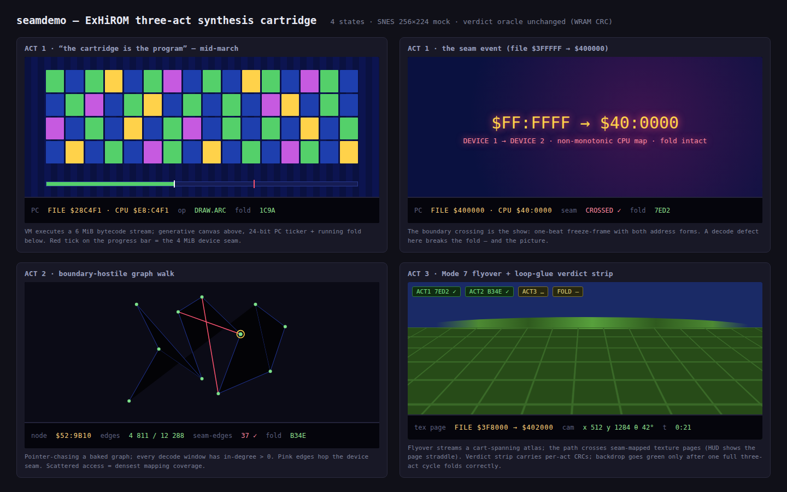

# ExHiROM Phase 2 — the three-act boundary synthesis cartridge

**Status:** PLANNED 2026-08-01 (user-approved shape: "all 3 in a loop")
**Supersedes:** the video-reel Phase 2 of
[2026-07-30-exhirom-video-boundary-test.md](2026-07-30-exhirom-video-boundary-test.md) —
resolving the plan-shape escalation from the 2026-08-01 display-defect investigation: that
phase predates main's SVX2 pipeline, and a second video path would duplicate what the reel
already proves. The Phase 0–1 deliverables (mapper model, canary ROMs, published pages) stand.

## Why synthesis beats streaming as the boundary test

Video reads the cartridge *sequentially*: a decode defect in one mirror or window is only hit
if the stream happens to pass through it. The three acts below read the same 6 MiB with three
*different* access patterns — a sequential program-counter march, adversarial scattered
pointer-chasing, and locality-heavy 2D streaming — so together they cover the decode far more
densely per minute than any stream, and each is individually watchable. The user's verdict on
the flat canary wash ("boring") is the other half of the motivation.

## The cartridge

One 48 Mbit (6 MiB) ExHiROM image — same configuration as the published
[cartsize-exhirom-6m](https://biohack.net/snes/cartsize-exhirom-6m/) canary (32 + 16 Mbit
mask-ROM pair, map mode `$25`) — whose payload is generated, seam-aware data. The demo loops
three acts forever; each act folds its traversal into a WRAM CRC, and the differential gate
asserts the fold exactly like every other demo.

### Act 1 — "The cartridge is the program" (sequential march)

A bytecode stream spans the whole image; a tiny VM (lineage: `turtle-vm`, `seqvm`) executes
it as a generative graphics piece. The 24-bit program counter is shown live; the act's
centerpiece is the counter rolling file `$3FFFFF → $400000` — CPU `$FF:FFFF → $40:0000`, the
non-monotonic device seam — as an on-screen event (flash + address freeze-frame beat).
Compiler stress: every opcode is a far fetch + jump-table dispatch (`JMP (abs,X)`) and the
ALU ops go through a function-pointer table — the heaviest sustained indirect-control-flow
load any demo has put on the #320/#321 codegen.

### Act 2 — the boundary-hostile graph walk (scattered access)

A pointer-linked graph baked across the image, edge targets deliberately placed to hop
banks, mirrors, and the device seam (generated adversarially from the mapper model — every
decode window gets in-degree > 0). The walk renders as a spreading web (2bpp bitmap canvas,
existing `bitmap_canvas.h`), edges lighting up as traversed, seam-crossing edges in the
accent colour. This is the maximum-coverage act: dozens of adversarial far dereferences per
frame.

### Act 3 — Mode 7 flyover over the baked world (streaming access)

A camera flyover (existing Mode 7 + `m7title.h`/`video_hud.h` infra) over a heightmap/texture
atlas spanning the image, with the flight path scripted to cross seam-mapped texture pages.
The HUD shows the current texture page's file address. Prettiest act; exercises DMA-paced
streaming reads.

### Loop glue

Acts run ~20–30 s each and hand off with a one-second verdict strip: per-act CRC so far,
cumulative fold, and the entropy-proof backdrop verdict (green once all three acts have
folded correctly at least once). Loop forever; `corpus_result` latches after the first full
cycle so the gate frame budget is one cycle + margin.

## Test semantics (house pattern, unchanged)

- `tools/` generator bakes all three payloads **from `tools/snes_cartmap.py`** (the
  authoritative model) so every address, segment list, and seam placement derives from the
  same source the canaries proved; the generator emits the host oracle alongside.
- Host oracle re-implements all three traversals; `corpus_result` = fold(act1, act2, act3).
  Per-act sub-CRCs in adjacent WRAM for discrimination when the fold mismatches.
- Differential: host == default(no-a16 leg where linkable) == `+mos-a16` @ bsnes-jg; MAME leg
  joins when the SPC700 IPL gap clears. `-verify-machineinstrs` clean.
- Display: `snes_ppu_reset_blank()` at boot (mandatory — the entropy lesson, `811c1f8`) and
  the gate carries the 6b-style entropy fingerprint (one picture hash across entropy
  None/Low/High × 2 boots).

## Dependencies / ordering

1. **`feature/exhirom-canaries` merge lands first** — this plan builds on the branch's
   ExHiROM platform + cartmap model. Merge is BLOCKED ×3; the substantive blocker is the
   `tools/snes-checksum.py` semantic conflict, whose correct resolution (a speed attribute in
   the cartmap model so `--fastrom` derives instead of ORs) is a small prerequisite work item,
   not a merge-time pick-a-side.
2. Acts are independent after the generator exists → P1–P3 can be built and gated one at a
   time, each shippable alone (Act 1 alone already replaces the boring wash).
3. Publication replaces nothing: new slug (e.g. `/snes/seamdemo/`), the cartsize canary pages
   stay as the minimal mapping tests.

## Phases

- **P0** — generator + host oracle (`tools/snes-seamdemo-gen.py` emitting bytecode stream,
  graph, heightmap, oracles from the mapper model); host structural gates.
- **P1** — Act 1 ROM (VM, PC ticker, seam event) + gate; publishable milestone.
- **P2** — Act 2 (graph walk + web render) folded in.
- **P3** — Act 3 (Mode 7 flyover) + loop glue + verdict strip; full-cycle gate.
- **P4** — publish via /snes-rom-page (data-driven registry).

## Mockups

Bundle: [2026-08-01-exhirom-three-act-synthesis-cart/](2026-08-01-exhirom-three-act-synthesis-cart/) —

(Act 1 mid-march, Act 1 seam-crossing event, Act 2 web, Act 3 flyover + verdict strip — the
four states that matter; boot/blank is the entropy-proof solid running blue already proven by
the canary work.)

## Verification (to be executed per phase; format per house rules)

1. P0: generator self-check — oracle reproduces a hand-computed fold on a 64 KiB miniature
   image; every decode window of the 6 MiB layout has in-degree > 0 in the Act 2 graph.
2. P1: Act 1 gate — `host == +mos-a16 @ bsnes-jg` fold; disasm shows jump-table dispatch +
   `__call_indir` + far fetches; seam event fires at the modeled file offset.
3. P2/P3: per-act sub-CRC gates + full-cycle `corpus_result` latch inside the frame budget.
4. All phases: entropy fingerprint (one picture hash across None/Low/High × 2).
5. P4: live-page WASM Verify fidelity == gate value.
