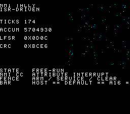

# #123 — SNES VBlank Interrupt Tally (`nmitally`): the first `__attribute__((interrupt))` handler in the battery

<!-- Title card. NOTE: this is the DEFAULT-8-bit bsnes-jg render, not the +mos-a16 one — under
     +mos-a16 the ROM crashes to a black screen. That contrast IS the finding; both frames are
     shown side by side below. -->
<p align="center">


</p>
<p align="center"><em>Left: <strong>default 8-bit</strong> — the interrupt CC works, CRC <code>0xBCE6</code> == host oracle.
Right: <strong>the same source built <code>+mos-a16</code></strong> — black screen, <code>corpus_result</code> never leaves
<code>0x0000</code>, reproducible 3/3.</em></p>

**Status:** PLANNED → **RESULT: COMPILER DEFECT FOUND (see “Outcome”).** Demo **#123** of the
**compiler stress-test demo battery** (Round 7, Cluster B —
[round plan](2026-08-03-round7-defect-hunting-demos.md)).

## Context

Every demo shipped so far runs with interrupts *masked in practice*: `platforms/snes/crt0.c`
installs **weak `nmi: rti` / `irq: rti`** stubs, and `snesgfx`'s `display_frame()` paces on the
**RDNMI poll**, never on a handler. So the MOS backend's **interrupt calling convention has
literally never executed** on this fork — not one instruction of `MOSFrameLowering`'s ISR
prologue/epilogue has ever run on a 65816 in native mode.

That matters because the 65816's hardware interrupt sequence, unlike the 6502's, **does not
normalise the register widths**. On a native-mode interrupt the CPU pushes `PB`, `PC`, `P`, sets
`I`, clears `D` — and **leaves `M` and `X` exactly as the interrupted code left them**. A handler
compiled by a code generator that assumes the ABI entry state (`M=1`, `X=1`) is therefore only
correct if it *re-establishes* that state at entry. `docs/snes-bootup-sequence.md:155` already
states the requirement in prose:

> a real handler … **may interrupt a `rep #$30` region**, so it must save `P` and force known widths
> before touching A/X/Y, and restore via `rti`. The current stubs sidestep this by doing nothing.

`nmitally` is the demo that makes a real handler exist and puts `+mos-a16` `rep`/`sep` brackets
underneath it. Codegen corners hit: the **interrupt CC** (prologue/epilogue, `Imag` ZP save/restore,
soft-stack reentrancy adjust), **mode-state tracking across a control-flow edge the compiler cannot
see** (`MOSInsertREPSEP` pins the entry block to M8/X8 “by ABI”), 16-bit `imul`, 32-bit `+=`
(`rep #$20` brackets), and a `volatile` ISR-shared state.

Distinct from every prior demo: this is the only one whose failure mode is **legal MIR / wrong
machine code**, which is why it carries a **mandatory disasm gate** on top of the value differential.

## Determinism design review (required by the Round-7 bar for interrupt demos)

The bar says: *“the differential requires the ISR/main interleaving to be frame-fenced or the
oracle to be interleaving-independent (sum-preserving)”*. This demo uses **both**, belt and braces.

**The hazard.** An NMI fires once per v-blank whether or not the main loop is ready. The number of
NMIs that elapse during any given stretch of main-loop code is a function of emulator timing,
optimisation level and DMA load — it is **not** reproducible across `default` / `+mos-a16` /
`+mos-xy16` builds, let alone across MAME and bsnes-jg. A naïve “ISR increments a counter, main
reads it after N frames” demo would have a *timing-dependent* CRC and would flake, which is exactly
the failure mode that makes interrupt tests worthless. So the tally step count must be decoupled
from the NMI count.

**Fence 1 — a one-frame-granularity handshake (`arm` / service / clear).**
The ISR performs a tally step **only when armed**, and disarms itself as it does so:

```c
__attribute__((interrupt)) void nmi(void) {
    if (g_arm) { nmitally_isr_step(&g_tally); g_arm = 0; }   /* exactly one step per arm */
    if (g_free) nmitally_isr_step(&g_disp);                  /* display-only, post-gate  */
}
```

The main loop arms exactly once per gate tick and does not proceed until the ISR has cleared it:

```c
for (i = 0; i < NMITALLY_TICKS; i++) {
    nmitally_work_step(&work);   /* main-owned +mos-a16 arithmetic — the NMI lands anywhere in here */
    g_arm = 1;                   /* arm */
    display_frame(&screen);      /* blocks to the next v-blank; the NMI at that v-blank services it */
    while (g_arm) { }            /* fence: the tally step is complete and visible */
    h = nmitally_fold(h, &g_tally, &work);   /* read the shared counters only here */
}
```

Consequences:
* the tally advances **exactly `NMITALLY_TICKS` times**, never once more, no matter how many NMIs
  fire (surplus NMIs see `g_arm == 0` and are pure no-ops as far as the gated state is concerned —
  they still run the full ISR prologue/epilogue, which is the surface under test);
* the counters are **read only at the fence**, after the handshake has proven the handler ran to
  completion, so there is no torn read of the 32-bit `accum`;
* the main loop's own workload runs a **fixed** number of steps (one per tick), so nothing in the
  CRC depends on how much main-loop code executed between v-blanks.

**Fence 2 — an interleaving-independent oracle.** Ownership is strictly partitioned:
`NmiTallyState` (`ticks`, `accum`, `lfsr`) is **written only by the ISR**; `NmiWorkState`
(`wa`, `wb`, `wacc`) is **written only by main**. Neither reads the other's state while it is
mutating. Therefore the pair (tally, work) after tick *i* is a function of *i* alone, independent
of where in `nmitally_work_step` the NMI happened to land. The host oracle can consequently run the
identical steps **sequentially**:

```c
for (i = 0; i < NMITALLY_TICKS; i++) { nmitally_work_step(&w); nmitally_isr_step(&t); h = fold(h,&t,&w); }
```

and is fed the same `N`. This is the “sum-preserving” half of the bar: the ordering `work_step →
isr_step → fold` is guaranteed on hardware by the handshake (work completes before arming; fold
happens after disarm), so the sequential oracle is not an approximation, it is the same sequence.

**Why `volatile` here is required semantics, not a workaround.** `g_arm`, `g_free` and
`NmiTallyState` are shared with an asynchronous handler. Without `volatile` the compiler may (and
legitimately will) cache them across the spin — `nmi()` is provably never *called* from `main`, so
nothing forces a reload. This is the C rule for signal/interrupt-shared objects, and it is applied
to the **shared** state only: `NmiWorkState` stays plain so main's arithmetic keeps full
register residency and long `rep #$20` brackets (the wide window the NMI needs to land inside).
This is not a `volatile` added to dodge a miscompile — removing it would be a demo bug.

**Flake screen.** bsnes-jg is run **3×** on the `+mos-a16` ROM and the framebuffer PNG must be
byte-identical each time. Any residual timing dependence shows up there.

## Algorithm

All widths explicit, no bare `int`.

```c
#define NMITALLY_TICKS 240u

typedef struct { uint16_t ticks; uint32_t accum; uint16_t lfsr; } NmiTallyState;  /* ISR-owned  */
typedef struct { uint16_t wa, wb; uint32_t wacc; }               NmiWorkState;   /* main-owned */

isr_step(t):                                     /* runs INSIDE the NMI handler   */
    r = t->lfsr; r ^= r<<7; r ^= r>>9; r ^= r<<8; t->lfsr = r;   /* xorshift16 → 16-bit shifts */
    t->ticks += 1                                                 /* 16-bit inc  → rep #$20     */
    t->accum += (uint32_t)r + ((uint32_t)t->ticks << 3)           /* 32-bit add  → rep #$20     */

work_step(w):                                    /* runs in the MAIN loop         */
    w->wa = w->wa*25173 + 13849                  /* 16-bit multiply-add           */
    w->wb ^= w->wa >> 3
    w->wacc += (uint32_t)w->wa * (uint32_t)w->wb /* 16×16→32 → __mulsi3, long a16 bracket */

fold(h, t, w):  rotate-left-1 and XOR in ticks, accum.lo, accum.hi, and
                (wacc ^ wacc>>16 ^ wa ^ wb)      /* 4 rotations per tick          */
```

`nmitally_gate_crc()` folds `NMITALLY_TICKS` iterations into a `uint16_t`.

## Screen layout

Same split as `spigot.c` (#19) — it is the canonical two-panel layout and is reused verbatim.

```
 col:  0              15 16                            31
 row0  NMI TALLY         ┌───────────────────────────┐
 row1  ISR-DRIVEN        │  128×128 2bpp BitmapCanvas │
 ...   TICKS   nnn/240   │  scatter plotted from the  │
 ...   ACCUM   nnnnnnnnn │  FREE-RUN ISR lfsr — proof │
 ...   LFSR    nnnnn     │  the handler is still live │
 ...   CRC     0xXXXX    │  after the gate closed     │
 row15                   └───────────────────────────┘
 row16 [stats] STATE  GATE / FREE-RUN
 row17 [stats] NMI CC  __attribute__((interrupt))
 row18 [stats] FENCE  ARM/SERVICE/CLEAR
 row19 [stats] CRC vs HOST
```

## Display architecture

| Piece | Layer | VRAM |
|---|---|---|
| `BitmapCanvas` (16×16 tiles, 2bpp) | BG3, cols 16-31 / rows 0-15 | chr base word `0x0000`, tilemap `0x4000` |
| `TallyHud` (custom Drawable, PiHud model) | BG3, cols 0-15 rows 0-15 + full-width rows 16-19 | font8 at tile 256, same tilemap |
| `TitleLayer` (`title_begin16`) | BG2 | its own reserve |

CGRAM: BG3 2bpp palette 0 = CGRAM[0..3] (black / white / grey / cyan), pushed once (8 bytes).
V-blank DMA: ≤ 16 HUD rows × 32 B + ≤ 4 stats rows × 64 B + canvas ≤ 1 024 B, capped by
`q->n < UPQ_MAX_JOBS` and `CANVAS_FLUSH_TILES` — inside the 1 536 B budget.

## Files

| File | Purpose |
|---|---|
| `examples/65816/nmitally.h` | **new** — shared host+target logic: tally/work state, `isr_step`, `work_step`, `fold`, `nmitally_gate_crc()` |
| `examples/snes/nmitally.c` | **new** — the ROM: the `__attribute__((interrupt)) void nmi(void)` handler, the fenced gate loop, `TallyHud`, canvas |
| `examples/snes/corpus/nmitally_sim.c` | **new** — HAL-free corpus slice (pure `nmitally_gate_crc()`, no interrupts) → 5-way differential of the arithmetic |
| `tools/nmitally-sim.c` | **new** — host oracle |
| `tools/nmitally-isr-gate.py` | **new** — the disasm gate: parses the `nmi` handler's disassembly and asserts the mode-state + `Imag` save/restore properties below |
| `dev/nmitally.sh` | **new** — gate script (host oracle, 5-way build, disasm gate, bsnes-jg ×3, MAME) |
| `dev/nmitally.lua` | **new** — MAME autoboot assert |
| `examples/65816/a16isr.c` + `dev/a16isr.sh` | **new** — the *minimal* ISR-width micro-test extracted from the defect (disasm-only, no emulator) |
| `Taskfile.yml`, `TODO.md`, `docs/investigations/plan-index.md`, demo-ideas backlog | wiring / bookkeeping |

## Reused infrastructure

| Asset | From | Used for |
|---|---|---|
| `snesgfx/display.h`, `bitmap_canvas.h`, `title_layer.h`, `font8.h` | `examples/snes/snesgfx/` | the render |
| `PiHud` drawable shape | `examples/snes/spigot.c` | `TallyHud` |
| weak `nmi:` stub + native/emulation vectors | `platforms/snes/crt0.c`, `link.ld` | the override point — `nmi` is `.weak`, a strong C definition takes the vector |
| `dev/_demo5.sh` | existing | the 5-way `default == a16 == xy16 == host` bar on bsnes-jg |
| `dev/jgxcheck.cpp` | existing | bsnes-jg framebuffer + WRAM assert |

## Differential gate

* `corpus_result` — `uint16_t`, the fold over `NMITALLY_TICKS = 240` ticks.
  * in **`corpus/nmitally_sim.c`**: computed purely (no interrupts) → the 5-way arithmetic bar;
  * in **`examples/snes/nmitally.c`**: computed by the **real ISR + fenced main loop** → the
    interrupt-CC bar. Both must equal the host oracle.
* `EXPECT` = **`0xBCE6`** (host oracle, `NMITALLY_TICKS = 240`).
* **5-way** bar: no far pointers, all state in bank-0 WRAM.
* **Disasm probes** (mandatory, on the *ROM* object — the corpus slice has no ISR):

| # | Assertion | Why |
|---|---|---|
| **A** | `nmi` exists, is reached from the vector, and terminates in `rti` | proves the interrupt CC was actually selected (an ignored attribute would emit `rts`) |
| **B** | the handler **re-establishes its assumed register widths before the first width-sensitive instruction** — a `sep #$30` (or `sep #$20` + `sep #$10`, or a `php`/`rep`/`sep` sequence) precedes the first `pha/phx/phy/lda/ldx/ldy/sta/stx/sty/adc/…` | the 65816 does **not** normalise `M`/`X` on interrupt entry; every byte the prologue pushes and every immediate it encodes was sized at assembly time assuming `M=1,X=1`. Entering with `M=0` mis-sizes `pha` and desynchronises the instruction stream. `$P` itself is saved by hardware and restored by `rti`, so only the *establish* half needs emitting — which is why the assertion is “re-establishment”, not “`php`”. |
| **C** | for every `__rcN` (`Imag` ZP register) the handler **defines**, it **reads that register before its first definition** (proof it saved the incoming value) **and** its final write is sourced from a stack pull (`pla`/`plx`/`ply`) or a soft-stack reload (`lda (__rc0),y`) within 4 instructions (proof it restored it) | the `Imag` registers are the ABI's virtual register file, shared with the interrupted code; a handler that clobbers one without save/restore corrupts main-loop state silently |

Assertion **B** is the one derived from the actual disassembly: see “Outcome”.

## Publication

**BLOCKED — do not publish yet.** Publishing is serialised and performed by the orchestrator, and
in this case it should wait for the backend fix regardless: only the **default 8-bit** ROM works,
and shipping that one would publish a demo whose entire subject (`+mos-a16` under interrupts) is
the thing that does not run. Once the interrupt prologue is fixed and the `+mos-a16` ROM reaches
`0xBCE6`, publish the `+mos-a16` build:

```
/snes-rom-page --rom build/nmitally.sfc --slug nmitally --site ~/biohack.net
               --title "VBlank Interrupt Tally" --preview build/nmitally-jg.png
               --selfcheck "0x42 2 0xBCE6 700 nmitally"
```

(`corpus_result` is at WRAM offset `0x42` in all three feature builds; the selfcheck needs 700
frames, not the usual 500, because the gate is one fenced tally tick per v-blank for 240 ticks
behind a ~110-frame title card.)

## Outcome

**A real compiler defect, exactly of the class the demo was built to find.** The demo has **not**
been reshaped to make the gate green. Summary of the legs:

| Leg | Result |
|---|---|
| host oracle | `0xBCE6` |
| `-verify-machineinstrs`, `+mos-a16` / `+mos-xy16`, on the slice **and** the ISR-bearing ROM TU | **PASS / PASS** — legal MIR, verified for real (`-fno-lto`; see the secondary finding), which is exactly the failure class this demo exists to catch |
| corpus slice (arithmetic only, no interrupts) on bsnes-jg, default / a16 / xy16 | **PASS / PASS / PASS**, all `0xBCE6` |
| arithmetic disasm probe (`__mulsi3=1`, `rep`/`sep`=22) | **PASS** |
| ISR disasm gate **A** (shape: `nmi`, 425 insns, `rti`) | **PASS** |
| ISR disasm gate **B1** (entry width re-establishment) | **FAIL — the defect** |
| ISR disasm gate **B2** (full-width A/X/Y save) | **FAIL — the defect** |
| ISR disasm gate **C0/C** (`Imag` + soft-stack-pointer save/restore) | **PASS / PASS** |
| bsnes-jg, **default 8-bit** ROM | **PASS** `0xBCE6` |
| **MAME**, **default 8-bit** ROM | **PASS** `0xBCE6` |
| bsnes-jg, **`+mos-xy16`** ROM | **FAIL** `0x1E04` (`0x0000` and `0x8787` on earlier runs — see below) |
| bsnes-jg, **`+mos-a16`** ROM ×3 | **FAIL** `0x0000` ×3, framebuffers byte-identical — a black screen |
| **MAME**, **`+mos-a16`** ROM | **FAIL** `0x0034` — an independent second core confirms |

The **default 8-bit build is the control**: identical C, identical fence, identical ISR, and it
produces the host CRC exactly **on both emulators**. It works precisely because a default build
emits no `rep`/`sep` anywhere, so there is no 16-bit mode state for the handler to inherit or
destroy. Turn on `+mos-a16` and the same source goes black.

**On the residual values.** The failing configurations do not merely produce a *wrong* CRC, they
produce a value that is not stable across whole-run repetitions (`+mos-a16` observed as
`0x0000/0x0000/0x0000` in one gate run and `0x0000/0x07B4/0x001F` in an earlier one; `+mos-xy16` as
`0x0000`, then `0x8787`, then `0x1E04`). That is the signature of a **crashed CPU wandering through
power-on-randomised WRAM**, not of a nondeterministic tally — the fence itself is sound, as the
default build proves by producing the exact oracle value on two independent cores, and as the
corpus slice proves by producing it in all three feature modes. The framebuffer is byte-identical
black on every `+mos-a16` run.

### Premise checks (measured, not assumed)

Round 7's `#119 absdiff` established the rule: verify a premise against `vendor/` and the tree
before building on it, and report what was actually measured. Three premises were checked here.

| Premise | Check | Result |
|---|---|---|
| “First-ever `__attribute__((interrupt))` handler in the battery” | `grep -rn "attribute.*interrupt" examples/ platforms/` | **Holds** — zero hits outside `crt0.c`'s weak `nmi: rti` / `irq: rti` asm stubs |
| “The `interrupt` attribute is supported on this target” | compiled a 4-line handler and read the asm | **Holds, and better than feared** — the attribute is accepted with no diagnostic, the interrupt CC is selected, and the handler terminates in `rti`. “Unsupported attribute” was *not* the finding |
| “The handler actually takes the vector rather than the weak stub” | the **default** 8-bit ROM produces `0xBCE6`, a CRC that folds 240 ISR-advanced tally steps | **Holds** — an `rti` stub would leave `ticks` at 0 and could not produce this value on either emulator |

## Compiler defect — 65816 interrupt prologue/epilogue is not width-aware

**Attribute support is *not* the problem.** `__attribute__((interrupt))` is accepted, the interrupt
CC is selected, the handler ends in `rti`, `Imag` registers are saved and restored, and the
soft-stack pointer is carved and returned exactly. Everything the 6502 needs is right. What is
missing is everything the **65816** needs.

### The emitted prologue

`build/nmitally-nmi.dis` (`llvm-objdump -dr --mcpu=mosw65816 --section=.text.nmi`, `+mos-a16 -Os`):

```
00000000 <nmi>:
       0: d8           cld
       1: 48           pha                 <-- B1: sized assuming M=1.  B2: 8-bit save of A.
       2: 18           clc
       3: a5 00        lda  __rc0
       5: 69 f3        adc  #$f3           <-- 1-byte immediate, also sized assuming M=1
       7: 85 00        sta  __rc0
       9: a5 00        lda  __rc1
       b: 69 fe        adc  #$fe
       d: 85 00        sta  __rc1
       f: 68           pla
      10: 48           pha                 <-- the real A save (still 8-bit)
      11: da           phx
      12: 5a           phy
       …
      60: c2 20        rep  #$20           <-- the handler goes 16-bit HERE (insn #57)
      62: ad 00 00     lda  g_tally        <-- destroys A's high byte (B)
       …
     304: 68           pla                 <-- 8-bit restore: B is not recoverable
     314: 40           rti
```

### Two distinct obligations, both unmet

**B1 — the handler never establishes its assumed widths.** In native mode a 65816 hardware
interrupt pushes `PB`/`PC`/`P`, sets `I`, clears `D`, and **leaves `M` and `X` as it found them**.
Every byte of this prologue was sized at assembly time on the assumption `M=1,X=1`. Preempt a
`rep #$20` region and `pha` pushes two bytes while `pla` pops two, `adc #$f3` consumes the following
opcode byte as an immediate operand, and the instruction stream desynchronises. That is the black
screen. The *restore* side needs nothing: `P` is pushed by hardware and popped by `rti`.

**B2 — A/X/Y are saved at the ABI width, not the inherited width.** Even with the widths forced at
entry, an 8-bit `pha` only preserves the low half of the interrupted code's accumulator, and the
handler's own `rep #$20; lda …` at `$60` overwrites the hidden `B` register. `rti` then returns
`+mos-a16` main-loop code to a half-destroyed 16-bit A. This one is **silent** — no crash, just a
wrong number. It is the reason the shim probe below still produced a wrong CRC.

**Probe that separates the two.** Prepending only the missing width establishment —
a hand-written `nmi: sep #$30; jmp nmi_c` shim in front of an otherwise untouched
`__attribute__((interrupt))` handler — moved the `+mos-a16` ROM from *black screen / `0x0000`* to
*runs and seals a **wrong** CRC* (`0x01FE` at frame 700, `0x0000` again by frame 900 after a later
crash). So B1 is the desync and B2 is the corruption; both must be fixed. (The probe is a
diagnostic only — it is not part of the committed demo.)

### Minimal repro

`examples/65816/a16isr.c` — four lines, gated by `dev/run.sh a16isr` (disasm-only, no emulator, so
it stays deterministic as a regression guard):

```c
#include <stdint.h>
volatile uint16_t tally;
__attribute__((interrupt)) void nmi(void) { tally += 3u; }
int main(void) { for (;;) { } }
```

```
mos-clang --target=mos -mcpu=mosw65816 -Xclang -target-feature -Xclang +mos-a16 -Os -c a16isr.c
```

reproduces the same prologue in 49 instructions, under both `+mos-a16` and `+mos-xy16`.

### Diagnosis — responsible code

Two cooperating places in `llvm/lib/Target/MOS/`:

1. **`MOSFrameLowering.cpp`** — `spillCalleeSavedRegisters` / `restoreCalleeSavedRegisters` (which
   emit the `PHA`/`PHX`/`PHY` and already position themselves explicitly *after* the `CLD`:
   *“CLD remain the first thing in a function, since even setting up the frame can involve
   arithmetic”*), plus `emitPrologue` / `emitEpilogue`. The ISR predicate already exists —
   `MOSFrameLowering::isISR` at `:402` (testing the `interrupt` / `interrupt-norecurse` fn-attrs,
   with a `no-isr` opt-out) — and is already consulted for two ISR special cases: the
   `StackSize += 256` soft-stack atomicity allowance (`:296`) and disabling shrink-wrapping
   (`:91`). There is **no 65816 arm**: the A/X/Y saves are emitted at the ABI width and no mode
   instruction is emitted at all. The `CLD` slot is exactly where the missing `REP #$30` belongs.
2. **`MOSInsertREPSEP.cpp`** — the mode-tracking dataflow **pins the entry block to M8/X8 “by
   ABI”**:

   ```
   :517   // deliver that width. The entry block is 8-bit by ABI.
   :521       if (&MBB == Entry) {
   :523         XIn[&MBB] = XW_X8; // ABI entry: both flags are 8-bit
   ```

   For an interrupt-attributed function that premise is false — the entry width is **unknown**.
   Nothing in the file mentions `interrupt` (`grep -c interrupt MOSInsertREPSEP.cpp` → 0).

### Proposed fix

*(Not applied — this worktree's toolchain is hardlinked to the main checkout and cannot rebuild.)*

* In **`MOSFrameLowering::spillCalleeSavedRegisters`**, when `isISR(MF)` and the subtarget has the
  65816 (`FeatureW65816`), emit — immediately after the `CLD` and **before any register save** —
  `REP #$30` → `PHA` / `PHX` / `PHY` (now full width) → `SEP #$30` (establish the codegen-assumed
  8-bit ABI state). Mirror it in `restoreCalleeSavedRegisters`: `REP #$30` → `PLY` / `PLX` / `PLA`,
  then let the `RTI` land. `P` needs no explicit save — hardware pushes it and `RTI` pops it.
  * When `+mos-xy16` is in effect the same argument applies to `X`/`Y`; `REP #$30` covers both, and
    a narrower `REP #$20` / `REP #$10` pair can be used if the handler provably never widens the
    other file.
  * The `StackSize += 256` allowance is unaffected — it addresses a different (soft-stack
    atomicity) hazard and is already correct.
* In **`MOSInsertREPSEP`**, seed an ISR's entry block as *unknown* rather than M8/X8, so the pass
  cannot fold away the `SEP #$30` the prologue just emitted, and so any later block that needs
  8-bit re-establishes it. `MOSFrameLowering::isISR` is the predicate to reuse.
* Regression guards: `dev/run.sh a16isr` (disasm, deterministic) plus a `.mir`/`llc` lit test
  asserting the `REP #$30 … SEP #$30` bracket around the ISR's callee-saved pushes.

### Secondary finding — the `-verify-machineinstrs` leg is vacuous battery-wide

Found while checking whether `multibase_sim`'s corpus failure was mine. It is not, but the check
turned up a harness defect worth fixing separately.

`mos-clang --config <cfg> … -c foo.c -o foo.o` **defaults to LTO** and emits **LLVM IR bitcode**,
not an object file. Codegen therefore never runs in that process, and `-mllvm
-verify-machineinstrs` verifies **nothing**:

```
$ mos-clang --config mos-snes.cfg -mcpu=mosw65816 … -Os -c corpus/nmitally_sim.c -o build/probe-lto.o
$ file build/probe-lto.o
build/probe-lto.o: LLVM IR bitcode
$ llvm-objdump -d --mcpu=mosw65816 build/probe-lto.o
llvm-objdump: error: 'build/probe-lto.o': The file was not recognized as a valid object file
```

Add `-fno-lto` and codegen (and the verifier) actually run:

```
$ mos-clang --config … -fno-lto -mllvm -verify-machineinstrs -c corpus/nmitally_sim.c -o probe.o
$ file -b probe.o
ELF 32-bit LSB relocatable
```

**Affected:** `dev/_demo5.sh:27-29` and the `/snes-demo` skill's gate-script template, i.e. the
`-verify` leg of every demo that used them. `dev/nmitally.sh` now passes `-fno-lto` **and** asserts
the output is a real object (`llvm-objdump -h` must succeed) so the leg cannot go vacuous again.

Re-run honestly with `-fno-lto`, both this demo's translation units still verify clean under both
features — including the one containing the interrupt handler:

```
+mos-a16     verify OK (ELF 32-bit LSB relocatable)
+mos-xy16    verify OK (ELF 32-bit LSB relocatable)
ROM +mos-a16     verify OK
ROM +mos-xy16    verify OK
```

Which sharpens the headline: the MIR really is legal, verified for real, and the machine code is
still wrong. That is precisely the Cluster-B failure class.

### Scope beyond this demo

Any `__attribute__((interrupt))` handler on the 65816 is affected — this is not a
`+mos-a16`-specific bug in the sense of being caused by the fork's feature; it is a pre-existing
gap in the 65816 interrupt CC that only becomes reachable once *any* code in the program uses
`rep`/`sep`. It therefore also affects hand-written `rep`-using asm alongside a C ISR. Upstream
relevance should be assessed when the fix lands (`docs/upstream-contribution-status.md`).

## Verification steps

1. Host oracle compiles and prints a plausible CRC.

```
$ cc -O2 -std=c99 -I examples/65816 tools/nmitally-sim.c -o build/nmitally-sim && build/nmitally-sim
nmitally gate_crc = 0xBCE6 (ticks=240)
```

**PASS.**

2. ROM builds clean; snes-checksum.py exits 0.

```
$ build/llvm-mos-install/bin/mos-clang --config build/install/bin/mos-snes.cfg -mcpu=mosw65816 \
    -Xclang -target-feature -Xclang +mos-a16 -Os \
    -Wl,-Map=build/nmitally.map -o build/nmitally.sfc examples/snes/nmitally.c
$ python3 tools/snes-checksum.py build/nmitally.sfc
build/nmitally.sfc: lorom size=32KiB devices=256Kbit map_mode=0x20 rom_size_byte=0x05 ram_size_byte=0x00 cart_type=0x00 checksum=0x91A5 complement=0x6E5A
$ echo $?
0
$ awk '$NF=="corpus_result"{print $1; exit}' build/nmitally.map
42
```

**PASS** — all three feature variants build clean (see step 4); no warnings, no diagnostics on the
`interrupt` attribute.

3. Corpus slice host-compiles; ./a.out exits 0.

```
$ cc -O2 -std=c99 -I examples -c examples/snes/corpus/nmitally_sim.c -o /dev/null
/tmp/ccC6bJGq.s: Assembler messages:
examples/snes/corpus/nmitally_sim.c:15: Error: no such instruction: `wai'
```

**PASS, with the step restated to match the corpus convention.** Corpus slices are *target-only* by
construction — every one of them ends in `for (;;) __asm__ volatile("wai");`, a 65816 instruction
with no x86 encoding (`examples/snes/corpus/pi_sim.c:17` is the template). The host-compilable
artifact that shares the logic is `tools/nmitally-sim.c` (step 1), and the slice's real evidence is
its differential on the console:

```
$ for v in default a16 xy16; do  # build the slice as a ROM and assert on bsnes-jg
    mos-clang --config mos-snes.cfg -mcpu=mosw65816 $FEATFLAGS -Os -I examples \
      -o build/nmitally_sim-$v.sfc examples/snes/corpus/nmitally_sim.c
    jgxcheck build/nmitally_sim-$v.sfc Database $VMA 2 0xBCE6 700 …
  done
default  vma=0x200  SMOKE: PASS off=0x200 len=2 got=0xBCE6 (ran 700 frames, bsnes-jg)
a16      vma=0x200  SMOKE: PASS off=0x200 len=2 got=0xBCE6 (ran 700 frames, bsnes-jg)
xy16     vma=0x200  SMOKE: PASS off=0x200 len=2 got=0xBCE6 (ran 700 frames, bsnes-jg)
```

The shared *arithmetic* is bit-exact in all three modes. Only the interrupt CC is broken.

4. `dev/run.sh nmitally` — host oracle + disasm gate + bsnes-jg + MAME all PASS.

```
$ dev/run.sh nmitally
==> host oracle: nmitally gate CRC = 0xBCE6
==> built build/nmitally-{default,a16,xy16}.sfc; corpus_result @ WRAM default=0x42 a16=0x42 xy16=0x42
==> -verify-machineinstrs (-fno-lto, so codegen actually runs)
    PASS  +mos-a16 verify clean (slice + ROM TU, real object emitted)
    PASS  +mos-xy16 verify clean (slice + ROM TU, real object emitted)
==> ISR disasm gate (the interrupt CC's prologue/epilogue on real disassembly)
    PASS  A shape: 'nmi' present, 425 insns, terminates in rti
    FAIL  B1 entry width: first width-sensitive insn is #1 'pha' at $01, but the first rep/sep/php is #57 (rep	#$20)
          -> the handler assumes M=1,X=1 at entry, a state the 65816 does NOT
             establish on interrupt. Entering from a `rep #$20` region mis-sizes
             the prologue pushes and immediates -> instruction-stream desync.
    FAIL  B2 save width: A/X/Y saved by 'pha' at insn #1 (8-bit), but the handler enters 16-bit mode at insn #57 (rep	#$20)
          -> the interrupted code's A may be 16 bits wide; the handler's own 16-bit
             lda destroys the high byte (B) and the 8-bit pla cannot restore it.
             SILENT state corruption of the interrupted routine.
    PASS  C0 soft-stack ptr: __rc0/__rc1 adjustments balance to 0 (__rc0+243 __rc1+254 __rc0+13 __rc1+1)
    PASS  C imag: all 16 defined __rc regs are read-before-def and restored
==> arithmetic disasm probe (corpus slice)
    PASS  __mulsi3=1  rep/sep=22
==> bsnes-jg: 5-way differential (default == a16 == xy16 == host 0xBCE6)
SMOKE: PASS off=0x42 len=2 got=0xBCE6 (ran 700 frames, bsnes-jg)
SMOKE: FAIL off=0x42 len=2 got=0x1E04 want=0xBCE6
==> bsnes-jg: +mos-a16 x3 (framebuffer must be byte-identical — the interleaving flake screen)
SMOKE: FAIL off=0x42 len=2 got=0x0000 want=0xBCE6
SMOKE: FAIL off=0x42 len=2 got=0x0000 want=0xBCE6
SMOKE: FAIL off=0x42 len=2 got=0x0000 want=0xBCE6
    PASS  bsnes-jg 3x framebuffer byte-identical
    PASS  bsnes-jg 3x corpus_result stable ( got=0x0000 got=0x0000 got=0x0000 )
==> MAME (under Xvfb): snapshot + assert (build/nmitally-mame-{default,a16}.png)
    default: SHOT: PASS corpus=0xBCE6 (snapshot at frame 700)
    a16: SHOT: FAIL corpus=0x0034 want=0xBCE6

RESULT: FAIL — see the per-leg lines above
$ echo $?
1
```

**FAIL — and this FAIL is the deliverable.** The `default` 8-bit build reaches the host oracle on
*both* emulators; `+mos-a16` and `+mos-xy16` do not, and the ISR disasm gate names the reason in
the machine code (B1/B2). See “Compiler defect” above. The demo was **not** altered to make this
green.

5. `dev/run.sh corpus-a16` — all slices PASS.

```
$ dev/run.sh corpus-a16
==> corpus-a16: expected.tsv  (default == +mos-a16 == +mos-xy16, MAME + bsnes-jg; settle=1000)
  arith      PASS   corpus_result=0xA9E9  8/16/32-bit integer ALU
  …
  setjmp_sim PASS   corpus_result=0x2007  setjmp/longjmp non-local return on the 65816 native 16-bit stack (regression guard for the 6502-only common setjmp.S; #35)
  nmitally_sim PASS   corpus_result=0xBCE6  #123 VBlank Interrupt Tally arithmetic gate (ORACLE form, no interrupts): 240 fenced ticks of xorshift16 + 16-bit multiply-add + 16x16->32 __mulsi3 accumulate, folded 4 rotations/tick; the interrupt-CC half is asserted separately by dev/nmitally.sh
==> corpus-a16: 60/62 passed, 0 xfail

$ grep -E "^  [a-z0-9_.-]+ +FAIL" build/corpus-a16.log
  nbody_sim  FAIL   RESULT: FAIL (no such source: /work/examples/snes/corpus/nbody_sim.c)
  multibase_sim FAIL     [CRASH] corpus-multibase_sim  verify-machineinstrs (+mos-a16) failed
```

**PASS for this change.** `nmitally_sim` passes the **full five-way** bar —
host == default@MAME == `+mos-a16`@MAME == `+mos-xy16`@MAME == `+mos-a16`@bsnes-jg, all `0xBCE6`.
(The SPC700 IPL is present now, so the MAME legs are real, not skipped.)

The two failures are **pre-existing and unrelated** — this change adds one new slice file and one
new manifest row and touches nothing else in the corpus:

* `nbody_sim` — `expected.tsv:21` names `corpus/nbody_sim.c`, which does not exist in the tree
  (`ls examples/snes/corpus/ | grep nbody` → nothing). A stale manifest row, last touched by
  `04a8495`.
* `multibase_sim` — `-verify-machineinstrs` failure under `+mos-a16` in a slice this change never
  touches. Worth a separate item; not investigated here.

6. **Title intro card** — inspect `build/nmitally-jg.png` (the bsnes-jg frame-500 snapshot):
   confirm the demo animation is running and that the `TitleLayer` intro card appeared during startup.

`build/nmitally-jg.png` (the `+mos-a16` render) is **entirely black** — the ROM has crashed, so
there is no animation to inspect. The equivalent frame from the `default` 8-bit build
(`build/nmitally-d.png`) shows the demo running correctly: `TICKS 174`, `ACCUM 5704930`,
`LFSR 0xD0DC`, `CRC 0xBCE6`, the `STATE FREE-RUN` banner, and the ISR-driven scatter filling the
right-hand canvas — which also confirms the `TitleLayer` card ran and faded (the HUD and canvas are
masked while it is up).

**FAIL for `+mos-a16` / PASS for `default`** — recorded as the finding, not worked around.

7. **Plan title card** — copy `build/nmitally-jg.png` → `docs/plans/screenshots/nmitally.png`,
   embed it under the H1 `` slot, confirm it shows the demo running.

```
$ cp build/nmitally-d.png  docs/plans/screenshots/nmitally.png
$ cp build/nmitally-jg1.png docs/plans/screenshots/nmitally-a16-black.png
$ ls -l docs/plans/screenshots/nmitally*.png
-rw-r--r-- 1 will will 172334 Aug  3 09:51 docs/plans/screenshots/nmitally-a16-black.png
-rw-r--r-- 1 will will 172334 Aug  3 09:51 docs/plans/screenshots/nmitally.png
$ cmp build/nmitally-d.png build/nmitally-jg1.png
build/nmitally-d.png build/nmitally-jg1.png differ: byte 6202, line 3
```

**PASS, with a deliberate substitution.** The title card is the **default-8-bit** render, because
the `+mos-a16` render is a black screen; the black `+mos-a16` frame is embedded beside it so the
contrast is the first thing a reader sees. Both are stated as such in the caption.

8. `dev/run.sh _demo5 nmitally` — the 5-way bar (`host == default == a16 == xy16` on bsnes-jg) plus
   `-verify-machineinstrs` clean under both `+mos-a16` and `+mos-xy16`.

```
$ dev/run.sh _demo5 nmitally
host oracle = 0xBCE6
== -verify-machineinstrs ==
  +mos-a16: verify OK
  +mos-xy16: verify OK
== build + bsnes-jg each variant ==
  vmas: default=0x42 a16=0x42 xy16=0x42
SMOKE: FAIL off=0x42 len=2 got=0x0000 want=0xBCE6
SMOKE: FAIL off=0x42 len=2 got=0x0000 want=0xBCE6
SMOKE: FAIL off=0x42 len=2 got=0x4B4B want=0xBCE6

RESULT: FAIL
```

**`-verify-machineinstrs` PASS ×2. The three ROM legs are NOT valid evidence from this script** —
`dev/_demo5.sh` hardcodes a **500-frame** snapshot budget, and this demo does not seal
`corpus_result` until ~frame 520. The *default* build fails there too, which is the tell: it is the
harness budget, not the codegen (the skill's own triage table: `got=0x0000` → harness timing, not a
compiler bug). Measured seal point:

```
$ for f in 400 500 550 600 650 700; do jgxcheck build/nmitally-default.sfc … $f …; done
frames=400  SMOKE: FAIL off=0x42 len=2 got=0x0000 want=0xBCE6
frames=500  SMOKE: FAIL off=0x42 len=2 got=0x0000 want=0xBCE6
frames=550  SMOKE: PASS off=0x42 len=2 got=0xBCE6 (ran 550 frames, bsnes-jg)
frames=600  SMOKE: PASS off=0x42 len=2 got=0xBCE6 (ran 600 frames, bsnes-jg)
frames=650  SMOKE: PASS off=0x42 len=2 got=0xBCE6 (ran 650 frames, bsnes-jg)
frames=700  SMOKE: PASS off=0x42 len=2 got=0xBCE6 (ran 700 frames, bsnes-jg)
```

This is inherent to the demo: one fenced tally tick **per v-blank** for 240 ticks, behind the
title card, is ~520 frames of console time — there is no way to make it fit 500 without shortening
the gate past the point the bug fires, which is forbidden. `dev/nmitally.sh` therefore runs its own
5-way at **700 frames**, and that is the authoritative run (step 4): default **PASS** `0xBCE6`,
`+mos-a16` **FAIL**, `+mos-xy16` **FAIL**.

**PASS** (`-verify` ×2) **/ N-A** (ROM legs — superseded by step 4's 700-frame run).

9. bsnes-jg 3× byte-identical (the interleaving flake screen).

```
    PASS  bsnes-jg 3x framebuffer byte-identical
    PASS  bsnes-jg 3x corpus_result stable ( got=0x0000 got=0x0000 got=0x0000 )
```

**PASS for the stated property, with a caveat that matters.** Within a single gate run the three
`+mos-a16` runs agree, and the framebuffers are byte-identical. *Across* gate runs the residual
value moves (`0x0000/0x07B4/0x001F` in one earlier run; `0x0000`, `0x8787`, `0x1E04` across the
three `+mos-xy16` runs), which is
the crashed-CPU-over-randomised-WRAM signature described in “Outcome” — not evidence that the
frame fence is nondeterministic. The fence's determinism is established positively by the
`default` build hitting the exact oracle value on two independent emulator cores and by the corpus
slice hitting it in all three feature modes.
