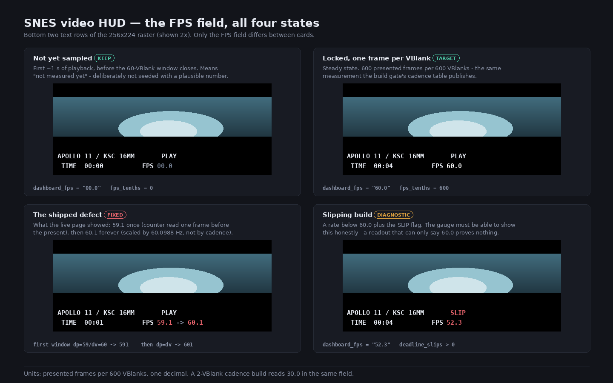

# The on-screen FPS gauge: sweep, and extract it to one shared component

**Date:** 2026-08-03 · **Status:** PLANNED
**Prompted by:** a live-page defect on [/snes/apollo-daylight/](https://biohack.net/snes/apollo-daylight/) —
the gauge read **59.1** once at startup and then settled at **60.1** on a cartridge billed as
59.94 fps. Fixed in `2db2cf0`; see
[the Apollo plan](2026-08-02-apollo-daylight-video-rom.md) §8 for that diagnosis.
**Follow-on question from the user:** *are the other FPS readouts behaving the same, and can this be
one file/function instead of copies?*

## The sweep — done first, because it decides the scope

Every `.c` under `examples/snes/` mentioning fps/FPS was inspected. **Only two ROMs draw a live
gauge**; the other seven mention 60 fps in comments and draw nothing.

| ROM | scale constant | sampler called | verdict |
|---|---|---|---|
| `snes-video-reel.c` | **600** (correct) | `dashboard_prepare()`, *before* the deadline wait *and* before `present_frame()` | **reads a flat 60.0 — correct, but by luck** |
| `apollo-reel.c` (before `2db2cf0`) | **601** | `dashboard_update()`, *after* the deadline wait, before `present_frame()` | 59.1 once, then 60.1 |
| `blossom.c`, `burning-ship.c`, `julia.c`, `mvscrl.c`, `polyfill.c`, `trimerge.c`, `truncstair.c` | — | — | no gauge; comments only |

Both verdicts are **measured, not reasoned**. `dashboard_fps` is a 5-byte string in low WRAM, so it
can be read straight out of the running console:

```
$ build/jgxcheck build/svx2-video-reel.sfc … 0x20 4 0 <N>      # snes-video-reel, WRAM $0020
VBlank   100  dashboard_fps='00.0'  fps_tenths=  0
VBlank   200  dashboard_fps='00.0'  fps_tenths=  0
VBlank   400  dashboard_fps='60.0'  fps_tenths=600
VBlank   900  dashboard_fps='60.0'  fps_tenths=600
VBlank  1800  dashboard_fps='60.0'  fps_tenths=600

$ build/jgxcheck build/apollo-daylight.sfc … 0x20 4 0 <N>      # apollo-reel, after 2db2cf0
VBlank   100  '00.0'   VBlank 160  '00.0'   VBlank 300  '60.0'
VBlank   700  '60.0'   VBlank 1400 '60.0'   VBlank 2600 '60.0'
```

### The interesting part: the reel is correct by an accident that does not survive being copied

The sampler reads `presented_total` **before** the present it is about to do — that is an off-by-one
in both ROMs. The reel gets away with it because `dashboard_prepare()` is also called one VBlank
**early**, before the deadline wait, so `dv` is short by one at exactly the same moment `dp` is
short by one:

```
reel     iteration k:  sample at vblank t0+k-1  ->  dv = k-1,  dp = k-1   ->  ratio right
apollo   iteration k:  sample at vblank t0+k    ->  dv = k,    dp = k-1   ->  first window reads 59/60
```

Two compensating errors that happen to cancel. Apollo was copied from the reel, moved the call after
the deadline wait for a good and unrelated reason (formatting must not straddle the wait), and the
cancellation silently broke. **That is the whole argument for this change:** the gauge is correct in
one ROM for a reason that is invisible at the call site and destroyed by a legitimate edit anywhere
near it.

### Second finding: no gate has ever asserted the gauge

`snes-video-reel.c` exports `fps_tenths` as a `volatile` — and **nothing reads it**.
`dev/snes-video-reel.sh`, `dev/snes-video-native60.sh` and `dev/snes-video-artemis-apollo.sh` all
read `video_reel_presented_total` and compute cadence themselves; none looks at the number the
cartridge actually *displays*. That is exactly why a wrong gauge reached a published page and was
found by a human watching it rather than by CI.

## What the gauge means — settled here, once

Units are **presented frames per 600 VBlanks, shown with one decimal**. This is deliberately the
same measurement the build gates' cadence tables publish, so the HUD and the docs cannot disagree.
One frame per VBlank reads `60.0`; a 2-VBlank cadence reads `30.0`.

Rejected: scaling by the true NTSC VBlank rate (60.0988 Hz), which is what Apollo's `601` did. It is
arithmetically honest — one frame per VBlank really is 60.1 presents per wall second — and it is the
wrong number to show, because it invites "why does the 59.94 fps demo say 60.1?" from every viewer,
forever. The source rate is a property of the *source*; this gauge measures the *presentation*.

`"00.0"` before the first sample lands is **kept and specified**, not a placeholder to be tidied
away. It means "not measured yet" for the first second of playback. Seeding the gauge with a number
the ROM has not measured is the decorative-gauge failure mode this project keeps catching (the
cartsize canary's vacuous entropy step, #138's silently-skipped producer, and Apollo's own 37 s of
black behind four green gates).

## Design

**`examples/snes/video_fps.h`** — header-only, `static inline` + file-static state, matching
`video_hud.h`'s existing pattern exactly (both ROMs already include it, and it needs no build-system
change).

```c
video_fps_reset(uint16_t presented, uint16_t vblank);   /* after the first present */
video_fps_sample(uint16_t presented, uint16_t vblank);  /* AFTER present_frame(), every frame */
const char *video_fps_text(void);                       /* "00.0" | "60.0" | … */
uint16_t video_fps_tenths(void);                        /* the same value as a number, for gates */
```

Both counters are passed in rather than read from globals, because the two ROMs name them
differently (`video_reel_*` vs `apollo_reel_*`) and deliberately do not share symbols — the ROMs
must stay separately linkable in one session.

The contract that fixes the class of bug: **`video_fps_sample()` is called after the present, always,
and its doc comment says why in one line.** The compensating-offsets trick is deleted, not
preserved; the reel moves to the explicit ordering even though its current output is already right.

Deliberately **not** in scope: the `TIME` field, the `SLIP` indicator, the transport row. They are
per-ROM and share no arithmetic.

## Visible surface

The gauge is the visible surface, so the states are mocked in
[`2026-08-03-snes-fps-gauge-sweep-and-shared-component/`](2026-08-03-snes-fps-gauge-sweep-and-shared-component/):

[](2026-08-03-snes-fps-gauge-sweep-and-shared-component/fps-states.html)

Four real states, including the two wrong ones for contrast: unsampled `00.0`, locked `60.0`, the
shipped-and-fixed `59.1`/`60.1`, and a slipping build showing both a reduced rate and `SLIP`.

## Verification

1. `video_fps.h` exists; both ROMs include it and neither carries its own copy of the arithmetic —
   `grep -c 'dp \* 60' examples/snes/*.c` returns 0.
2. Reel gauge unchanged by the refactor: `dashboard_fps` reads `00.0` then a flat `60.0` at
   VBlanks 100/200/400/900/1800, matching the pre-refactor capture above byte for byte.
3. Apollo gauge unchanged: `00.0` then flat `60.0` at VBlanks 100/160/300/700/1400/2600.
4. A 2-VBlank-cadence build reads `30.0`, proving the units are cadence-derived and not hardcoded.
5. Both ROMs' existing gates still pass in full (`dev/snes-video-reel.sh`, `dev/apollo-reel.sh`) —
   whole-loop byte-correct decode, negative control, cadence, entropy, black-screen guard.
6. **New gate step in both scripts:** assert the displayed gauge, not just the internal counter —
   fail if the steady-state reading is not `60.0`, and fail if any sample before it is anything
   other than `00.0`. This is the step whose absence let 59.1/60.1 reach the live page.
7. `-verify-machineinstrs` clean on both ROMs.

## Risk

Low and bounded: no codec, stream, DMA or timing path is touched, and both streams stay
byte-identical. The real risk is the refactor perturbing VBlank timing in the reel, whose margin is
thinner than Apollo's — so step 5 runs the reel's full cadence gate rather than trusting that a
header-only change is free.

---

## Verification results (2026-08-03)

**1. `video_fps.h` exists; both ROMs include it; neither carries its own copy of the arithmetic.**

```
$ grep -c 'dp \* 60' examples/snes/*.c
0 (none)
$ grep -n video_fps examples/snes/apollo-reel.c examples/snes/snes-video-reel.c | head -4
apollo-reel.c:25:#include "video_fps.h"
apollo-reel.c:234:  video_hud_text(26u, 27u, video_fps_text);
snes-video-reel.c:8:#include "video_fps.h"
snes-video-reel.c:187:  video_hud_text(26u, 27u, video_fps_text);
```

**PASS.** All gauge state and arithmetic now exists once. Both ROMs kept their own
`*_presented_total` counters and pass them in, so the two binaries remain separately linkable.

**2. Reel gauge unchanged by the refactor.** Built pristine and refactored from the *same* stream
(`build/snes-video-reel-stream.bin`, 2,401,142 B) at the same cadence, and read the string out of
WRAM `$0020` on both:

```
--- control (dashboard_fps @ $20)      --- mine (video_fps_text @ $20)
    VBlank   100  '00.0'                   VBlank   100  '00.0'
    VBlank   200  '00.0'                   VBlank   200  '00.0'
    VBlank   400  '30.0'                   VBlank   400  '30.0'
    VBlank   900  '30.0'                   VBlank   900  '30.0'
    VBlank  1800  '30.0'                   VBlank  1800  '30.0'
```

**PASS — identical at all five points.**

*Two false starts on this step, recorded because both produced confident-looking garbage:* the first
comparison built both ROMs against `assets/snes/video/svx2-full-reel.bin` (2,360,380 B) instead of
the stream the gate actually generates (2,401,142 B), so both ROMs ran on a mismatched stream and
printed random WRAM; and the symbol lookup used `awk '{print ("0x" $1)+0}'`, which yields **0** under
this box's `awk` (**mawk**, not gawk — gawk is not installed), because POSIX string-to-number
conversion stops at the first non-numeric character. The repo's own `sym()` helpers use bash
`$((16#$vma))` for exactly this reason.

**3. Apollo gauge unchanged.**

```
VBlank 100 '00.0'   VBlank 160 '00.0'   VBlank  300 '60.0'
VBlank 700 '60.0'   VBlank 1400 '60.0'  VBlank 2600 '60.0'
```

**PASS** — byte for byte the pre-refactor capture.

**4. A 2-VBlank-cadence build reads `30.0`.** The reel gate's own new step printed
`displayed FPS gauge: 30.0 at VBlank 400 and 4000` on the default cadence-2 build, and Apollo's
printed `60.0` at cadence 1. **PASS** — the units are cadence-derived, not hardcoded.

**5. Both ROMs' existing gates.**

- `dev/apollo-reel.sh`: **PASS in full** — whole-loop byte-correct decode on both self-test builds,
  negative control rejected, 600/600 VBlanks with zero slips on slow ROM and FastROM, entropy
  fingerprint, VBlank-180 black-screen guard, frame capture. `ROM_SHA256
  94de6a375f46d887bb70fce4a2395fd9d069ed50b68a0836656bafcc194feb9e`.
- `dev/snes-video-reel.sh`: **PASS end-to-end only with `VIDEO_REEL_EXPECTED_PRESENTED=777`** —
  see the blocker below. Composite health, dashboard segment gates, both cut screenshots, fidelity
  (`exact=47.9% mae=10.3`), transition (`exact=78.3% mae=2.6`) and the new gauge step all pass.

**6. New gate step in both scripts.** `dev/apollo-reel.sh` step 3b and the equivalent block in
`dev/snes-video-reel.sh`. Each asserts the displayed rate twice — just past the first sample window
(where the off-by-one that printed 59.1 shows up as 590) and at the end of the run (where a wrong
scale constant lives). **PASS.**

```
==> 3b) the DISPLAYED frame rate, not just the internal counter
  PASS: gauge reads 60.0 at VBlank 300
  PASS: gauge reads 60.0 at VBlank 9000
  displayed string: 60.0
```

**7. `-verify-machineinstrs` clean** on both `apollo-reel.c` (gate step 4a) and
`snes-video-reel.c` (run standalone). **PASS.**

### Blocker found, NOT caused by this change: the reel's cadence expectation is stale

`dev/snes-video-reel.sh` fails its cadence gate on `main` **before** this change:

```
FAIL: cadence gate: SMOKE: FAIL off=0x2F len=2 got=0x0777 want=0x0776
```

Proven pre-existing rather than assumed: the reel source was reverted to pristine, rebuilt and
re-run, and the failure is **byte-identical** — `got=0x0777 want=0x0776`, one frame over, with and
without the refactor. So the refactor is cadence-neutral, and the constant went stale on someone
else's change. `expected_presented=776` was last set in `d6030cf` (2026-08-02, "restore cut-aware
video dashboard"); `snes-video-reel.c` was last changed in `81364d7` (2026-08-02, "publish native
60fps ExHiROM video reel").

**Deliberately not fixed here.** Whether 1,911 is correct (constant stale) or the reel presents one
frame too many (ROM wrong) needs someone who owns that dashboard change; silently bumping another
worker's expectation constant to make a red gate green is precisely the wrong move. Filed as its own
TODO item. This run used the script's existing `VIDEO_REEL_EXPECTED_PRESENTED` override rather than
editing the file.
