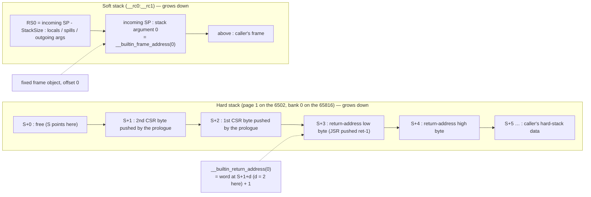
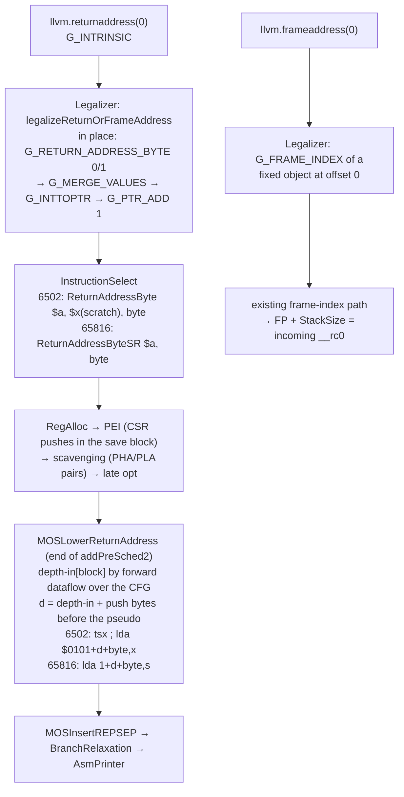

# `__builtin_return_address` / `__builtin_frame_address` on MOS (patch 0038)

**Date:** 2026‑09‑23 · **TODO:** M2 upstream item "return/frame-address builtins are unlegalized" ·
**Triage:** order 3 in [the c-torture backend triage](../upstream-pending-work.md#backend-failure-triage-gcc-c-torture-2026-09-23)
(15 compilations: `20010122-1`, `20030323-1`, `20030811-1`, `pr17377` for the return address;
`frame-address` for the frame address).

No visible surface (compiler backend change), so no mockups.

## Failure

```text
fatal error: error in backend: unable to legalize instruction:
  %0:_(p0) = G_INTRINSIC intrinsic(@llvm.returnaddress), 0 (in function: test2)
```

GlobalISel hands `llvm.returnaddress` and `llvm.frameaddress` to the target's
`legalizeIntrinsic`; MOS has no case for either, so any use aborts the backend.

## Stack semantics (the decision this item needed)

MOS has two stacks. The **hard stack** (`JSR`/`RTS`, `PHA`/`PLA`) holds return
addresses and the first four callee-saved pushes. The **soft stack** (`__rc0:__rc1`,
`RS0`) holds locals, spills and stack arguments; when a frame pointer is needed the
prologue copies the post-allocation `RS0` into `RS15`. There is no frame chain on
either stack, so only level 0 can be answered.

| Builtin | Level 0 | Level > 0 |
|---|---|---|
| `__builtin_frame_address` | the **incoming soft stack pointer**: the address just above this function's soft-stack frame (its stack arguments start there). A fixed frame object at offset 0, so it legalizes through the existing `G_FRAME_INDEX` path and needs no frame pointer. | `0` |
| `__builtin_return_address` | the **address the function returns to**: the 16-bit word `JSR`/`JSL` pushed, plus one (both push the address of their own last byte; `RTS`/`RTL` add one). SPC700 `CALL` pushes the return address itself, so no adjustment there. For a `JSL`-called (far) function the bank byte is not part of the 16-bit result. | `0` |

The two stacks at the point where the entry-block read runs (a function whose
prologue pushed two callee-saved bytes, called with one stack argument):



Interrupt handlers (`interrupt` attribute) return `0` for the return address: the
hardware stacks `P` above the interrupted `PC`, the value is not a return address in
the C sense, and the 65816 handler prologue pushes a further nine bytes.

`0` for the unsupported levels is what SelectionDAG's generic expansion of
`FRAMEADDR`/`RETURNADDR` produces, so it is the established LLVM answer.

## Design

**Frame address.** `legalizeIntrinsic`: `MFI.CreateFixedObject(1, 0, /*IsImmutable=*/true)`
and a `G_FRAME_INDEX` into the destination. `eliminateFrameIndex` already resolves a
fixed object as `FP + StackSize + offset`, i.e. the incoming `RS0`, with `RS15` in place
of `RS0` when the function has variable-sized objects.

**Return address.** How deep the pushed word sits below the stack pointer at the point
of the read is not known before frame lowering and scavenging (callee-saved pushes,
scavenger `PHA`/`PLA` pairs, `PHP`/`PLP`), so the read stays where it is as a pseudo
and is expanded **last**, with the depth computed over the final instruction stream:

1. `legalizeIntrinsic` emits two `G_RETURN_ADDRESS_BYTE` (byte 0 and 1) in place,
   merges them to `s16`, `G_INTTOPTR`, and `G_PTR_ADD 1` (not on SPC700). The generic
   opcode has `hasSideEffects` so nothing sinks, hoists or CSEs it.
2. The selector turns each into `ReturnAddressByte` (`Ac` result, `Xc` scratch) or, on
   the 65816, `ReturnAddressByteSR` (`Ac` result, no scratch). Register allocation
   handles the clobbers like any other instruction.
3. A new pass, **`MOSLowerReturnAddress`**, runs at the end of `addPreSched2`, after
   both scavenger passes and the late optimizer, before `MOSInsertREPSEP`. It computes
   the hard-stack depth at the start of every block by forward dataflow over the CFG
   (entry = 0; each block adds its net push bytes: `PH`/`PHA`/`PHX`/`PHY`/`PHP`/`PHB`/
   `PHK` +1, `PHD`/`PEA`/`PEI`/`PER` +2, pulls negative, calls 0; every path into a
   block must agree, which is also what `RTS` needs), adds the pushes that precede each
   pseudo inside its block, and expands it with that depth `d`:
   - 6502 family (8-bit `S`, stack in page 1; also SPC700 via the existing
     `TSX → MOV X,SP` and `LDA abs,X → MOV A,abs+X` mappings): `tsx` ;
     `lda $0101+d+byte,x`
   - 65816 (16-bit `S` anywhere in bank 0, native mode): `lda 1+d+byte,s`
     (stack-relative, width-bracketed by REP/SEP like any 8-bit load)

   Why last: every earlier pass may still insert pushes ahead of the pseudo, and the
   expansion is only exact once the instruction stream is final. (The first cut pinned
   the read to the entry block and walked only that block; `pr17377` showed that the
   entry block gets split by later lowering, so the per-block dataflow replaced it.)
   The `+mos-a16` `PHA16`/`PLA16` bracket is always a matched pair inside one
   frame-index expansion, so it cancels and needs no case.



**Flags.** `MFI.setReturnAddressIsTaken(true)` is recorded; the frame address needs
no frame pointer, so `setFrameAddressIsTaken` is not set (it would force `RS15`).

## Files

- `llvm/lib/Target/MOS/MOSInstrGISel.td` — `G_RETURN_ADDRESS_BYTE`
- `llvm/lib/Target/MOS/MOSInstrPseudos.td` — `ReturnAddressByte`, `ReturnAddressByteSR`
- `llvm/lib/Target/MOS/MOSLegalizerInfo.{h,cpp}` — `legalizeReturnOrFrameAddress`
- `llvm/lib/Target/MOS/MOSInstructionSelector.cpp` — `selectReturnAddressByte`
- `llvm/lib/Target/MOS/MOSLowerReturnAddress.{h,cpp}`, `CMakeLists.txt`, `MOS.h`,
  `MOSTargetMachine.cpp` — the pass
- `llvm/test/CodeGen/MOS/return-frame-address.ll`
- project: `patches/llvm-mos/0038-mos-return-frame-address.patch`, `dev/toolchain.sh`,
  `dev/regen-patch.sh`, `examples/65816/torture/{inscope,unsupported}.tsv`,
  `docs/upstream-return-frame-address-pr.md`,
  `docs/pr-preparations/2026-09-23/0038-validation.md`, trackers, `TODO.md`

## Verification

Evidence and artifacts: [0038-validation.md](../pr-preparations/2026-09-23/0038-validation.md).

1. The new lit test fails on `llc-final` (last binary without the change) and passes on
   `llc-0038`, every RUN line, with `-verify-machineinstrs`.

    ```text
    llc-final: LLVM ERROR: unable to legalize instruction: %0:_(p0) = G_INTRINSIC intrinsic(@llvm.returnaddress), 0 (in function: return_address)
    llc-0038:  PASS: LLVM :: CodeGen/MOS/return-address-spc700.ll (1 of 2)
               PASS: LLVM :: CodeGen/MOS/return-frame-address.ll (2 of 2)
    ```
    PASS (two test files, 3 + 1 RUN lines).
2. The five torture files compile at `-O0`, `-O2`, `-Os` as IR through `llc-0038` with the
   verifier (15/15), and directly with the rebuilt project `mos-clang` on `mos6502` and
   `mosw65816` with and without `+mos-a16`.

    ```text
    ok=15/15
    direct mos-clang: 45/45
    ```
    PASS.
3. c-torture corpus differential, `llc-final` vs `llc-0038` (`diff9.py`): 15 repaired,
   0 newly failing, every other ok/ok pair byte-identical.

    ```text
    repaired: 15   (20010122-1, 20030323-1, 20030811-1, frame-address, pr17377 × O0/O2/Os)
    newly failing: 0
    fail on both: 36 | ok/ok identical: 4119 | ok/ok DIFFERENT: 0
    ```
    PASS.
4. MOS CodeGen + MC lit suites on `llc-0038`: 0 failures.

    ```text
    Total Discovered Tests: 144
      Unsupported:   1 (0.69%)
      Passed     : 143 (99.31%)
    ```
    PASS.
5. Project toolchain rebuilt (`dev/run.sh toolchain`; `clang-23` mtime advanced) and the
   emulator gate `dev/run.sh corpus-a16` passes.

    ```text
    clang-23: 12:26:32 → 18:53:52, sha256 3ec66f254488e9f1…
    ==> corpus-a16: 79/79 passed, 0 xfail
    ```
    PASS (the run spanned a laptop suspend, 19:43–01:45; per-program cadence 23 s).
6. `tools/torture_filter.py` moves `20010122-1`, `frame-address`, `pr17377` into scope and
   `dev/run.sh torture --tests …` on the five files agrees host == default == +mos-a16 on
   MAME and bsnes-jg (the execution-level proof of the semantics).

    ```text
    inscope delta: +20010122-1.c +frame-address.c +pr17377.c (+builtin-prefetch-1..6, +20031012-1 from earlier patches; -20021120-1, -ashrdi-1)
         20010122-1.c           PASS  all variants PASS (0x600D)
         20030323-1.c           PASS  all variants PASS (0x600D)
         20030811-1.c           PASS  all variants PASS (0x600D)
      ·· pr17377.c              SKIP  default != PASS (got 0xDEAD) — target-inappropriate
      ·· frame-address.c        SKIP  default != PASS (got 0xDEAD) — target-inappropriate
    ==> torture-run: 3 PASS, 0 FAIL, 2 SKIP, 0 XFAIL (of 5)
    probe-pr17377      corpus_result=0xE002 probe_v=0x80A3 probe_y0=0x80CA probe_calls=5   (y: jmp f; jsr y at 0x80A0 and 0x80C7)
    probe-frame-address corpus_result=0xE000 probe_f=0x2000 probe_c=0x0020 probe_d=0x0021
    ```
    PASS with two documented skips: the two failing tests' premises (one call site; locals on
    the stack) do not hold under whole-program optimization and the static stack; the values
    the builtins return are verified correct in both (see the validation record).
7. Patch applies to `vendor/llvm-mos` and to the newer `~/llvm-mos` clone;
   `0002` regen is unaffected (`grep -c ReturnAddress patches/llvm-mos/0002-*.patch` = 0).

    ```text
    git -C vendor/llvm-mos apply --check -C1 …/0038-mos-return-frame-address.patch: OK
    dev/regen-patch.sh: RESULT: PASS — 0002 round-trips (MOS dir + focused tests == live vendor)
    grep -c ReturnAddress patches/llvm-mos/0002-321-accum16.patch: 0
    ```
    PASS for `vendor/` (with `-C1`, now what `dev/toolchain.sh` uses). The `~/llvm-mos` clone
    was not tried in this pass; the patch was generated against pristine upstream `742d554`.
