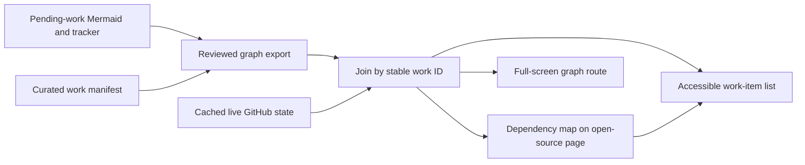
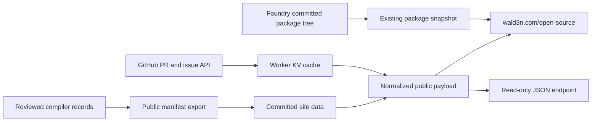
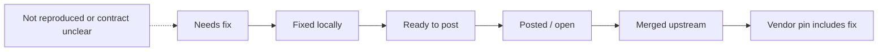

# Live upstream dashboard on wald3n.com

**Status:** dashboard released as site version `v0.0.432`; diagram and layout
update released as `v0.0.434` on 2026-09-26.
The public home is [wald3n.com/open-source](https://wald3n.com/open-source#compiler-upstream).
The reviewed compiler manifest remains a bundled site copy until the compiler
repository's export is published; the page labels that source separately from
its live GitHub check.

## Release record

- `../wald3n.com/src/components/CompilerDashboard.astro` adds the scrolling,
  filterable compiler section, evidence disclosures, dependency links, source
  timestamps, and local/upstream status labels. The page begins with compact,
  factual headings; the existing contribution and package inventory remains
  below it.
- `../wald3n.com/src/lib/compiler-dashboard.mjs` discovers authored PRs, reads
  GitHub PR/issue state and review/check rollups, and caches successful responses
  in site KV for ten minutes. The read-only
  [`/api/open-source/status`](https://wald3n.com/api/open-source/status) endpoint
  exposes the normalized public payload. A dated snapshot remains available if
  GitHub cannot be reached.
- `dev/export-upstream-dashboard.py` generates
  [`docs/upstream-dashboard.json`](../upstream-dashboard.json) from structured
  defect records and [curation](../upstream-dashboard-curation.json). The current
  export contains 49 work items. It includes links only for evidence present in
  the Git index, including records staged in the same publication commit;
  unstaged new evidence remains labeled as awaiting publication. Stage the
  evidence before regenerating, and publish the source commit with the export.
  The site bundles this reviewed export and will
  use the remote copy after it is published on the compiler repository's main
  branch.
- The `v0.0.434` site checkout passed 82 tests, and its production build passed. Desktop
  and narrow-screen browser previews showed the full page scrolling through the
  compiler section, contribution inventory, and packages. The live deployment
  and endpoint were checked after release.

Remaining follow-up: publish the compiler export with its dependent records,
then add automated candidate review and cache invalidation from GitHub events.
The site already refreshes GitHub state on requests after the cache interval;
these follow-ups do not block the released dashboard.

## Diagram release

The page now offers a track-based dependency map and a
[complete zoomable graph](https://wald3n.com/open-source/dependencies). The
graph comes from the Mermaid dependency structure maintained in this repository,
with reviewed work-item IDs joined to the dashboard's live GitHub status. Its
source date and the GitHub check time are shown separately. The site also links
each graph work node to its evidence row. The compiler manifest and graph remain
bundled site copies until the compiler exports are published together from the
compiler repository's main branch.

The release uses these maintained diagrams and status records:

| Existing source | What it contributes | Place on the published site |
|---|---|---|
| [Zoomable upstream flowchart](../mos-upstream-flowchart.html), generated from the [Mermaid source](../upstream-pending-work.md#flowchart) | The independent compiler fixes, #320 far ABI, #321 native-width work, SDK #415, validation, and reports needing decisions | A full-width **Dependency map** section after the summary cards, with a dedicated full-screen route for the complete graph |
| [Generated status overview](../mos-upstream-status-2026-09-21.html) | Detailed queue and submission context behind graph nodes | Context links from node details to the relevant tracker section; retain the dated overview as an engineering archive |
| [Pending-work chart](../upstream-pending-work.md#chart--other-pending-work) | Posting state, next action, and SNES dependency for each item | The existing work-item disclosures and filters, with the graph and list sharing item IDs |

The generated HTML is a dated snapshot and its source includes explicit
PR-state text. Do not embed it verbatim as a live panel or copy its `2026-09-25`
GitHub labels into a current view. Publish a reviewed graph export derived from
the Mermaid dependency structure and the curated work manifest. Resolve each
work node to a stable manifest ID; model review, merge, and prerequisite steps
as typed milestone nodes when they are not work items. The server joins that
graph to the same GitHub payload used by the PR table. A graph edge expresses a
reviewed dependency, never an inferred merge prerequisite.



### Page placement and interaction

```text
Summary counts and separate source timestamps
↓
Dependency map: [Independent fixes] [Far ABI #320] [Native widths #321] [SNES SDK #415]
  selected track → readable graph and short explanation → linked work item
  [Open complete graph] for zoom, pan, search, and all tracks
↓
Work queue: the same item IDs, evidence, next actions, and live PR state
↓
Authored contributions and package inventory
```

Use the page's normal vertical scroll. The map should take the width and height
its content needs, and the complete graph may occupy its own route rather than
compressing every node into one screen. On narrow screens, show a track selector
and an ordered dependency list first; opening a track reveals its graph below.
Every node must have a keyboard-operable link to its work-item disclosure, and
the list must remain usable if graph rendering or JavaScript fails. Preserve the
existing diagram's separate SNES platform lane and the distinction between
technical readiness to open a PR and the SDK maintainer's merge prerequisites.

### Implementation and remaining publication work

1. **Implemented locally:** Add a versioned graph export to this repository's document dependencies.
   Include the Mermaid source, renderer/exporter code, curated item-ID mapping,
   and generated output in its receipt. Fail generation on duplicate IDs,
   unresolved work-node links, invalid edges, or cycles in prerequisite edges.
   Editorial action/milestone nodes can remain without a work-item link when
   that absence is explicit.
2. **Implemented:** Review the existing graph against the current trackers before importing it.
   Remove outdated PR-state assertions from the live graph; preserve them only
   in the dated engineering view. Record any edge whose meaning is ambiguous
   for review rather than turning it into a new blocker.
3. **Pending:** Publish the graph and manifest together from a reviewed compiler revision.
   The site must show the graph's source revision and review date separately
   from GitHub's checked time. The current bundled manifest remains the fallback
   if the remote export is unavailable.
4. **Implemented in core; search remains pending:** Build the page map and a dedicated graph route from the normalized payload.
   Keep node labels and status colors consistent with the work list. Add search,
   track selection, zoom/pan, a readable default scale, and direct URLs for
   work items. Link to the generated historical flowchart for full engineering
   context, clearly marked with its snapshot date.
5. **Partly verified:** Verify desktop, mobile, keyboard, no-JavaScript, and stale-GitHub behavior.
   Check that a PR changing from open to merged updates both graph and list
   without changing reviewed dependency edges, and that #415 is still separate
   from #320/#321 compiler work. Re-run the document dependency workflow and
   site tests/build before publishing the expanded view.

## Goal

Make `/open-source` the current, navigable account of upstream compiler work:
what is fixed locally, what is prepared, what is posted, what has merged, and what
still needs a fix. Keep its existing software and Foundry package inventory. A
reader should be able to open an item, see its evidence and dependencies, and
tell when each status was last checked.

The dashboard must not infer that a local fix is an upstream PR, that a passing
reproduction closes a historical defect, or that PR readiness satisfies the
separate SNES platform merge prerequisites. Published SNES demos can support
compiler fixes; link to their actual public pages.

## Visual mockups

Open the [standalone dashboard mockup](2026-09-26-live-upstream-dashboard-mockup.html)
for a styled desktop and mobile preview. The labels and example rows illustrate
the information architecture; they are not a current GitHub status check.

### Desktop, scrolling page

```text
┌──────────────────────────────────────────────────────────────────────────────┐
│ wald3n      Open source                                                     │
├──────────────────────────────────────────────────────────────────────────────┤
│ Compiler upstream                                                            │
│ Local work: reviewed Sep 25  ·  GitHub: checked 10:42 UTC                     │
│                                                                              │
│ [Needs fix  2] [Fixed locally  17] [Open PRs  6] [Merged  7]                 │
│                         ↓ scroll                                             │
│ Dependencies                                                                 │
│ ┌──────────────────────────────────────────────────────────────────────────┐ │
│ │ #320 far ABI ──→ far codegen ──→ 0061 long,X                          │ │
│ │ #321 native widths ──→ 0062 far words ──→ SDK #415                    │ │
│ └──────────────────────────────────────────────────────────────────────────┘ │
│                         ↓ scroll                                             │
│ Compiler work queue                                                          │
│ [All] [Defects] [Optimizations]       [Needs fix] [Local] [Posted] [Merged]  │
│ ┌──────────────────────────────────────────────────────────────────────────┐ │
│ │ Runtime [dp],Y index    Pending    Range proof and scheduler blocker   │ │
│ │ 0061 far-global long,X  Fixed      Unposted · tests and dependency     │ │
│ │ #604 MVN/MVP bank order Fixed      Open PR · review and checks          │ │
│ └──────────────────────────────────────────────────────────────────────────┘ │
│                         ↓ scroll                                             │
│ Selected work item: evidence, tests, dependencies, linked demos, next step   │
│                         ↓ scroll                                             │
│ Upstream contributions  ·  Software we own  ·  Upstream packages             │
└──────────────────────────────────────────────────────────────────────────────┘
```

The two timestamps stay separate: refreshing GitHub must not make local
evidence appear newly reviewed. Counts are computed from the normalized data
contract and have visible definitions. The page uses full-width sections with
room for explanations and evidence; there is no requirement to fit the queue
and dependency chart above the fold. Selecting a dependency node filters and
focuses its row; the list remains complete without the diagram.

### Mobile, narrow viewport

```text
┌────────────────────────────┐
│ ☰ wald3n       Open source  │
│ Compiler upstream          │
│ GitHub checked 10:42 UTC   │
│ Local review Sep 25        │
├─────────────┬──────────────┤
│ Needs fix 2 │ Local fix 17 │
│ Open PRs 6  │ Merged 7     │
├────────────────────────────┤
│ [Defects v] [Status v]      │
│ ┌────────────────────────┐ │
│ │ [dp],Y runtime index   │ │
│ │ Pending · optimization │ │
│ │ Blocked by scheduler  │ │
│ │ View plan →            │ │
│ └────────────────────────┘ │
│ ┌────────────────────────┐ │
│ │ 0061 far-global long,X│ │
│ │ Fixed · unposted      │ │
│ │ Tests · Dependencies →│ │
│ └────────────────────────┘ │
│ [Show dependency list]     │
│        ↓ scroll            │
│ Evidence and next steps    │
│        ↓ scroll            │
│ Contributions + packages  │
└────────────────────────────┘
```

The chart becomes a disclosure after the cards on a narrow screen. The
evidence and package sections remain in the page's vertical flow. No
horizontal panning is required to read status or evidence links.

## Data and state diagrams



The manifest is published after review; GitHub facts refresh independently.
The existing package snapshot remains independent of a GitHub outage.



This is a typical path, not a forced single status field. A local patch can
remain carried after upstream merge, and a qualified defect need not enter the
fix path until its evidence or contract is settled.

## Existing implementation

- `../wald3n.com/src/pages/open-source.astro` is a server-rendered Astro route.
  It reads `../wald3n.com/src/data/open-source.json`, shows authored upstream PRs,
  and keeps the package inventory on the same page.
- `../wald3n.com/scripts/refresh-open-source-data.mjs` discovers PRs with `gh`
  and package sources from a committed Foundry tree. `task open-source:refresh`
  writes the checked-in snapshot; `task open-source:refresh:check` detects drift.
  The current snapshot has one `refreshedAt` date for both kinds of data and is
  updated only when that task runs and the site is deployed.
- The site's `/updates` feed already has a server-side GitHub fetch and KV cache
  pattern in `src/lib/status-feed.ts`, using the `STATUS_FEED` binding. Reuse the
  pattern, with a separate cache key and data contract, for public PR state.
- This repository's
  [contribution tracker](../upstream-contribution-status.md),
  [pending-work tracker](../upstream-pending-work.md), structured
  [defects](../defects/), and [generated flowchart](../mos-upstream-flowchart.html)
  contain the editorial statuses and dependency claims. The current HTML page
  renders dated Markdown; regenerating it does not fetch GitHub state.

## Data ownership and status contract

Use two explicit inputs, joined by stable GitHub URLs or repository item IDs:

| Input | Owns | Update path |
|---|---|---|
| GitHub API | PR/issue state, draft state, merge time, review decision, check rollup, latest activity | Server-side fetch, cached; webhook invalidation if configured |
| Reviewed project manifest | Local fix status, defect qualification, patch/plan/evidence links, submission readiness, dependencies, demo links | Edited with compiler work, reviewed, then published from a committed revision |

The manifest is a small versioned JSON export generated from **explicit curated
records**, not a parser for TODO prose or PR draft wording. Define one stable
`id` per work item; fields include `kind` (defect, optimization, platform,
submission), `localStatus`, `publicationStatus`, `upstreamUrl` (nullable),
`evidenceUrls`, `dependsOn`, `publicSummary`, and `reviewedAt`. Export only
public-safe claims and links. Preserve the underlying defect records and dated
investigations as evidence; the manifest is their current public summary.

Keep the statuses independent. In particular, `fixed locally` + `unposted`,
`posted` + `open`, and `merged` + `still carried in the fork` are valid
combinations. `not reproduced` and `contract clarification` are qualified
statuses, not closed defects. For PRs, the GitHub result overrides any cached
snapshot of remote state; the reviewed manifest never overwrites a live PR
state. If a PR is discovered but has no curated item, show it in the authored
contributions inventory and flag it for classification in the maintenance job.

Determine whether this compiler repository is publicly readable before using
repository-relative evidence links on the public page. For any private source,
link only to deliberately published artifacts or omit the link; never expose
private evidence through a Worker token or raw API response.

## Site design

Keep the existing `/open-source` route and package sections. Add a prominent
**Compiler upstream** section above the current contribution table. Let the
page scroll through generous full-width sections:

1. Summary counts for unresolved defects, implemented local fixes awaiting
   upstream, open PRs, merged PRs, and pending optimizations. Label each count's
   source and as-of time.
2. A compact dependency view using the manifest's `dependsOn` edges. Show
   compiler/ABI prerequisites and the SNES SDK platform track separately;
   selecting a node opens its detail row. Provide an accessible table/list view
   for keyboard and small-screen users. The chart is a navigation aid, not the
   only place a status is stated.
3. Filterable work list: `Needs fix`, `Fixed locally`, `Ready to post`, `Open
   upstream`, `Merged`, plus kind filters for defects and optimizations. Each row
   shows local and upstream state, blockers, evidence, and the relevant PR/issue
   link. Preserve an explicit `awaiting review` state for posted work.
4. Keep the current authored-PR inventory and package inventory below. Reuse
   the PR records in the compiler section rather than counting them twice.

Expose the normalized public payload at a read-only `/api/open-source/status`
endpoint for the page and other artifacts. Include schema version, generated
time, GitHub fetch time, manifest commit, per-source errors, and item IDs. The
HTML should render meaningful content without client-side JavaScript; chart
interaction and filters enhance it. Do not embed the current standalone HTML
overview as an iframe or present its dated PR text as live data.

## Refresh and failure behavior

Fetch GitHub on the server with the site's existing token configuration; never
send credentials to the browser. Cache successful results in Cloudflare KV for
about ten minutes and serve stale data while a refresh runs, following the
`/updates` pattern. PR and issue webhook events may invalidate the relevant
cache entry; a scheduled refresh provides recovery when a webhook is missed.
Use a scoped token where required and account for GitHub rate limits, pagination,
renamed repositories, and transient failures. Bound fetches to the curated IDs
plus authored-PR discovery in the configured llvm-mos repositories.

On failure, retain the last successful GitHub snapshot and label it visibly
`GitHub last checked <time>; live refresh failed`. Never stamp a failed fetch
with today's date or convert an unknown item into `closed`. Show the manifest's
own revision and review time separately. A successful GitHub refresh updates
remote facts without deploying the website; a manifest change still requires a
reviewed commit and site publication. Package metadata retains its existing
committed-source refresh workflow.

## Implementation sequence

1. **Define and validate the public manifest in this repository.** Map current
   items from the structured defects, TODO's active compiler optimizations, and
   upstream trackers. Add schema and integrity checks: unique IDs, valid state
   pairs, existing dependency targets, valid public links, and no `merged` claim
   without a matching GitHub PR. Register the manifest as a maintained summary
   under the document dependency workflow, with actual review receipts.
2. **Export a committed, public-safe manifest to the site.** Choose a stable
   source revision and an explicit import command in `../wald3n.com`; record
   source commit and schema version in the imported data. Do not read this
   workspace's uncommitted files in a production build. Make changed or missing
   fields fail validation before publication.
3. **Implement the site data layer.** Extend the current PR discovery and add a
   server-side GitHub state loader with KV caching. Normalize GitHub and manifest
   records into one typed payload. Keep the package census independent so a PR
   API outage cannot remove package rows.
4. **Build the page and dependency view.** Reuse the site's design system and
   current `/open-source` route. Provide source links, distinct timestamps,
   responsive list and chart, and an accessible no-JavaScript path.
5. **Automate observation, not editorial publication.** Schedule PR discovery,
   cache refresh, and drift checks. Report newly discovered or unclassified PRs,
   manifest validation failures, and stale review dates for human review. Do not
   automatically publish local fix or defect status changes without their
   evidence review.
6. **Reconcile the two repositories.** Keep this repository's Markdown trackers
   and generated browser views as engineering records. Point them to the live
   public dashboard and make their GitHub snapshot dates explicit; avoid
   duplicating mutable PR state in new maintained prose.

## Verification and publication gate

- Unit tests cover status combinations, GitHub normalization, pagination,
  partial API failure, stale-cache display, manifest integrity, and dependency
  cycles. Include a fixture where a PR merges while its local patch is still
  carried, and one where a defect is `not reproduced`.
- A site preview must show the known authored PR inventory including compiler
  #604 and SDK #450, with GitHub-derived state and a visible fetch timestamp;
  compare against `gh pr view` immediately before approval. Verify the defect
  and optimization counts against the reviewed manifest, not TODO text.
- Check keyboard navigation and narrow-screen chart/list behavior, run the
  site's existing tests and build, and confirm the package sections and counts
  still render. Exercise a failed GitHub fetch and verify the stale timestamp.
- Run this repository's document dependency impact/refresh checks for changed
  trackers and the new manifest. Publish only the reviewed site build and verify
  the live endpoint and page after deployment.

The first useful release can show a live PR table, explicit local statuses, and
the accessible dependency list. The interactive chart and scheduled candidate
review can follow without changing the data contract.
