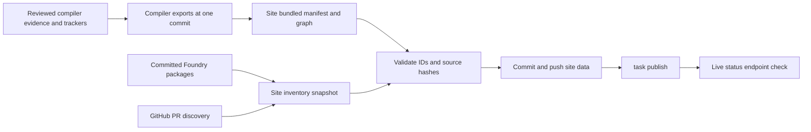

# One-command upstream dashboard publication

**Status:** implemented, 2026-09-26.

## Goal

Provide `task open-source:publish` in `../wald3n.com/` to refresh the public
dashboard's committed data and publish the site in one invocation. The task
must use reviewed compiler exports from one published compiler commit. It must
not infer or write defect status, publish uncommitted evidence, or open an
upstream compiler or SNES platform PR.

## Dependency chain

| Data | Authoritative input | Published copy | Update rule |
|---|---|---|---|
| Compiler work items | Structured defects and reviewed curation in this repository | `docs/upstream-dashboard.json` at `origin/main`; site fallback `src/data/compiler-upstream.json` | Generate and review here through `dev/docs-deps.py`; the site task reads the committed export. |
| Dependency graph | Pending-work Mermaid and reviewed ID map in this repository | `docs/upstream-dashboard-graph.json` at the same compiler commit; site bundle `src/data/compiler-upstream-graph.json` | Reject graph/manifest hash or work-ID mismatches. |
| Package inventory and fallback PR snapshot | Published Foundry package tree and GitHub discovery | Site `src/data/open-source.json` | Run the site's existing `open-source:refresh` and `open-source:verify` commands. |
| Live PR/issue state | GitHub API | Site KV cache and public status endpoint | Refreshes on requests; a site deployment does not certify an editorial status change. |

## Command contract

1. Require the canonical site and compiler origins. Clone site `main` into an
   isolated checkout beside the Foundry package repository, leaving the
   caller's site checkout untouched. Read the compiler repo's `origin/main`
   after a fetch, regardless of its dirty local worktree.
2. Fetch the manifest, graph, and document dependency receipts from one
   compiler commit. Validate both JSON schemas, graph links and track IDs,
   mapped Mermaid nodes, source hashes, and receipt hashes before replacing
   either site file. Record the compiler commit in task output and the data
   commit message.
3. Refresh the existing package and fallback PR snapshot and verify it. Keep
   the previous snapshot when the discovered inventory has not changed, so a
   timestamp alone does not trigger another site release.
4. Run the site's tests and production build. If the three data files are
   unchanged, report that the dashboard is current and stop without a version
   bump. Otherwise commit exactly those three files, push `main`, run the
   existing `task publish` pipeline, and check the live status endpoint for the
   expected manifest hash and graph match.
5. Stop with a clear error on a failed fetch, validation, test, build, commit,
   push, deployment, or live check. Do not create a release tag before those
   prerequisite checks pass. Keep the isolated checkout on failure for
   inspection. The existing publish pipeline retains its own clean-checkout
   and credential preflight.

The compiler repository's document dependency workflow stays attached to the
compiler export. The site command consumes only its published commit. Changes
to structured defects, pending-work claims, or the graph mapping are reviewed,
regenerated, and committed in this repository before the site task can use
them. This prevents a dirty compiler worktree from becoming a public status
source.

## Verification

**PASS, 2026-09-26.** The checks below ran against the published compiler
revision and the site's isolated publication checkout.

- Site tests passed: 88/88. The tests cover unchanged snapshot preservation,
  mismatched compiler hashes, unresolved work IDs, duplicate tracks, missing
  Mermaid nodes, stale dependency receipts, and KV cache invalidation after
  a bundled export changes.
- The site production build passed.
- `task open-source:publish -- --check` matched the site bundle against
  compiler `ec54b1c040936db62c9bbafabe96715309187292`: 49 work items,
  manifest hash `14453e3f09c18870ef38567bac6986db2372f5cb099a23a35de3ce22deeea293`.
- An isolated `--dry-run` refreshed the snapshot, verified 14 PRs and 57
  package sources, passed 88/88 tests and the production build, and identified
  only `src/data/open-source.json` for publication. It made no commit or tag.
- The live command committed the refreshed snapshot as site commit
  `09fdbda5081d684fe54bb298a4cc3df67f5c7a4d`, published site tag
  `v0.0.436`, and verified the live dashboard: 49 items, a matching compiler
  manifest and dependency graph, and successful page responses.
- A second live command detected unchanged inventory and stopped without a
  commit, tag, or deployment.
