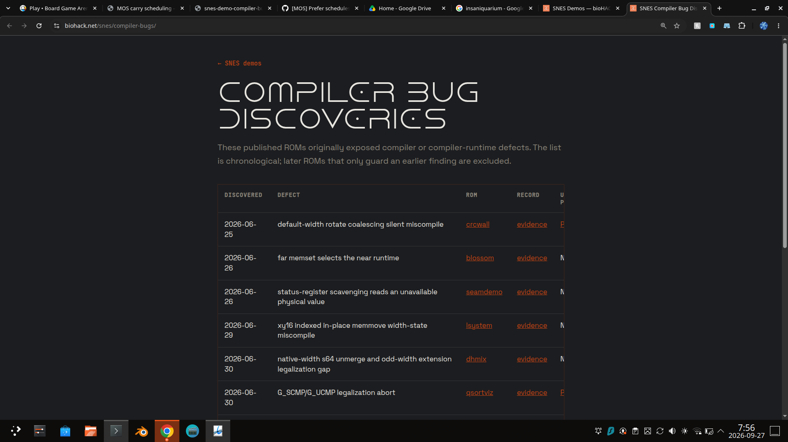
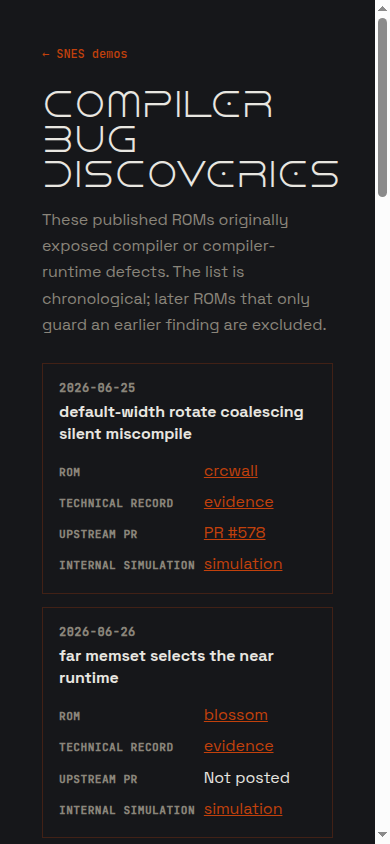

# Public SNES compiler-bug discovery map

## Goal

Publish the compiler-defect discovery map at `https://biohack.net/snes/compiler-bugs/` and link to it from the bottom of the SNES gallery. The public view must be derived from the compiler repository's canonical `docs/snes-demo-compiler-bug-pages.json`, not maintained as a second hand-authored table.

It is a provenance index, not a defect dashboard: each row identifies the original published ROM, the discovery date, the technical record, any upstream PR, and the internal simulated PR packet. Later ROMs that merely guard an earlier defect do not appear.

## Mockups

### Desktop

```text
┌────────────────────────────────────────────────────────────────────────────────────────────┐
│ ← SNES demos                                                                                │
│                                                                                            │
│ COMPILER BUG DISCOVERIES                                                                    │
│ Published SNES ROMs that originally exposed compiler or compiler-runtime defects.          │
│                                                                                            │
│ ┌────────────┬──────────────────────────────┬──────────────┬──────────┬────────┬─────────┐ │
│ │ DISCOVERED │ DEFECT                       │ ROM          │ RECORD   │ PR     │ SIM     │ │
│ ├────────────┼──────────────────────────────┼──────────────┼──────────┼────────┼─────────┤ │
│ │ 2026-06-25 │ rotate coalescing miscompile │ CRC Wall     │ evidence │ #578   │ packet  │ │
│ │ 2026-06-26 │ far memset picks near runtime│ Blossom      │ evidence │ —      │ packet  │ │
│ │ 2026-06-30 │ G_SCMP/G_UCMP abort          │ QSort Visual │ evidence │ #577   │ packet  │ │
│ └────────────┴──────────────────────────────┴──────────────┴──────────┴────────┴─────────┘ │
└────────────────────────────────────────────────────────────────────────────────────────────┘
```

### Mobile

```text
┌──────────────────────────────┐
│ ← SNES demos                 │
│                              │
│ COMPILER BUG DISCOVERIES     │
│ Published ROM discovery map. │
│                              │
│ ┌──────────────────────────┐ │
│ │ 2026-06-25               │ │
│ │ rotate coalescing         │ │
│ │ [CRC Wall]                │ │
│ │ [evidence] [PR #578]      │ │
│ │ [internal simulation]     │ │
│ └──────────────────────────┘ │
│                              │
│ ← horizontally scrollable    │
│   table is acceptable only   │
│   if cards become too dense. │
└──────────────────────────────┘
```

Use the initial responsive table implementation: it preserves a compact chronological comparison on desktop and permits horizontal scrolling on narrow screens. Revisit the card alternative if mobile testing shows the six columns are hard to scan.

## Rendered screenshots

Desktop capture:



390px mobile verification capture:



## Data and synchronization contract

1. Keep `docs/snes-demo-compiler-bug-pages.json` as the canonical source. Its required fields are `slug`, `page`, `discovered`, `defect`, `evidence`, `prs`, and `pr_simulations`.
2. Commit the generated public export at `biohack.net/src/data/snes-compiler-bug-pages.json`; the Astro route imports this copy at build time. The export contains a semantic SHA-256 of its canonical records.
3. Extend `dev/publish-snes-rom-both-sites.sh` to compare the compiler public export with the biohack copy before publication, fail with an actionable message when they differ, and copy/stage the export during `--publish`.
4. Keep `dev/render-snes-demo-compiler-bug-map.py` as the compiler-side Markdown renderer and make it validate dates, artifact paths, PR links, and the rule that a recorded upstream PR has an internal simulation.

## Page implementation

1. Add `src/pages/snes/compiler-bugs.astro` in biohack.net.
2. Sort records by `discovered`, then `slug`; never rely on JSON order for display order.
3. Link ROM names to their public `/snes/<slug>/` pages.
4. Link technical evidence and simulation artifacts to their paths on the public compiler repository; link PRs to their canonical upstream URLs.
5. Add one low-emphasis `Compiler bug discovery map` link to the gallery footer after the emulator-verification sentence. Do not add another gallery badge or filter.
6. Preserve normal site typography, keyboard focus styles, horizontal overflow containment, and a descriptive title/canonical URL.

## Verification and publication

1. Run the compiler renderer and `python3 dev/docs-deps.py --impact docs/snes-demo-compiler-bug-pages.json`, then refresh dependencies and review the affected publishing guidance.
2. Build and test biohack.net; assert that `/snes/compiler-bugs/index.html` is emitted and that the gallery HTML contains the footer link.
3. Run the paired publication script in read-only mode against a registered demo to prove the registry-copy check.
4. Commit compiler and site changes separately, push both, deploy biohack.net, and fetch both `/snes/` and `/snes/compiler-bugs/` to confirm the live footer link and table.

## Phase 2 — automatic cross-repository updates

Start this phase only after the public page above is deployed and its initial source-copy contract has been proven in a release.

1. Add a compiler-side exporter that emits a public registry copy and records the canonical records' semantic SHA-256 in that copy.
2. Make the compiler CI render both the Markdown map and public export, fail on stale generated output, and require the discovery registry to be reconciled whenever a structured defect record gains a discovery or a status change.
3. On a merge that changes the public export, create or update a biohack.net synchronization PR containing only the exported registry. It must name the compiler commit and source hash it represents.
4. Make biohack.net CI reject a records-hash mismatch before deployment. Its page continues to build from the committed copy, avoiding an availability dependency on another repository during site builds.
5. Keep `dev/publish-snes-rom-both-sites.sh` as a second, release-time check: it verifies the generated site copy for a ROM publication and stages the refreshed copy during `--publish`.
6. Treat a failed synchronization PR or a site-copy mismatch as a release blocker for a newly registered discovery, but do not block unrelated existing ROM publications merely because a later compiler-only status change awaits review.

This phase provides the ongoing update guarantee: a newly discovered or fixed defect changes the compiler source of truth, regenerates the public export, and receives a reviewable site-sync PR. It deliberately does not use a runtime `raw.githubusercontent.com` fetch.

### Recorded planning checks

- PASS — 2026-09-27: the registry renderer accepted the chronological registry and the documentation dependency refresh passed.
- PASS — 2026-09-27: the initial biohack.net page build emitted `/snes/compiler-bugs/index.html`; the site test suite passed 47 tests with one existing skip.
- PASS — 2026-09-27: release `v1.0.603` deployed successfully. Live `/snes/` contains the footer link and live `/snes/compiler-bugs/` contains the chronological table, PR #578, and simulation links.
- PASS — 2026-09-27: the exporter regenerated the public registry, its committed biohack copy compared equal, and the paired-publication helper passed shell syntax validation.

## Non-goals

- Do not expose `file://` URLs or local build paths.
- Do not imply that `Not posted` means a defect was rejected; it means no upstream PR URL is recorded.
- Do not treat internal PR simulations as upstream submissions.
