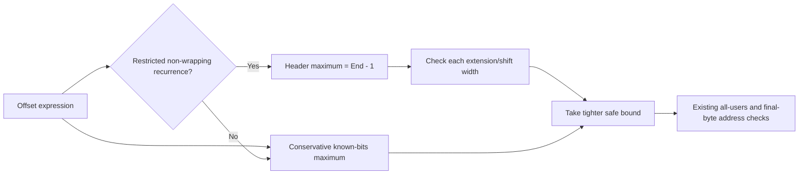

# [MOS] Prove bounded byte-loop offsets for far runtime indexing

Refine the unsigned known-bits bound for runtime far-pointer offsets using a restricted counting-loop proof. A byte PHI starts at a constant `Start`, increments by one, and returns to its single-block header while the next value differs from a larger constant `End`. The header values therefore lie in `[Start, End)`, and the recurrence reaches its endpoint before wrapping.

Match the two-input PHI, entry/self-edge, unit step, byte width, two successors, SBC zero-result with carry one, and complementary conditional/unconditional terminators. Follow zero extensions and constant left shifts only when the refined maximum fits the operation’s own integer width; bounded recursion and unsupported forms retain the independently sufficient known-bits result. The original offset expression is reused, preserving narrow wrapping semantics.

This change belongs after the [far/native prerequisites](upstream-series.md) for #320/#321. It does not admit native word loads itself; the following 0070 component adds that admission under a speed policy. Bank carry remains part of the existing 24-bit addressing operation. A proof failure means retaining known bits, not declaring every wrapping input unoptimizable.

The extracted candidate is based on llvm-mos `26d7c2c1eebf98ca194b92609ba4e7540bfc6ef6`. Its 26-case MIR regression covers branch polarity, flags, steps, wrapping, scaling, displacement and disabled-proof behavior; additional checks cover reversed PHI order, multiple external predecessors, a narrow valid shift and the expression-depth boundary. All opcode checks have explicit token boundaries. The retained sensitivity run rejects all 156 substitutions of a wrong byte-addressing opcode and accepts all three real outputs; the combined 0069/0070 check adds 72 word-policy mutations.

[Exact patches, build, and executed evidence](upstream-series.md) distinguish new extracted-backend checks from the [earlier downstream range-proof measurements](../../../investigations/2026-09-28-farblit-range-integration.md). Three separate downstream AI source reviews found no valid-input implementation defect; their scope does not extend to the whole extracted compiler/ABI series. The packet remains local pending that review and publicly resolvable evidence links. Published [Bank-Boundary Walk](https://biohack.net/snes/bankwalk/) supplies integration context, without making its ROM a new measurement of this patch.

Recorded 0069 integration attribution: OpenAI Codex CLI 0.157.1 (`codex-tui`), model `gpt-6-astra`, `xhigh` reasoning effort; verified session `01a0e61c-c24c-7053-aa56-a4a4e43f12ab`. Current extraction and preparation: OpenAI Codex CLI 0.157.1 (recorded session source `vscode`), model `gpt-6-astra`, `xhigh` reasoning effort; verified session `01a0e67f-298f-7a21-80af-06f867085f84`. Earlier experiment and review credits remain in their original records.
