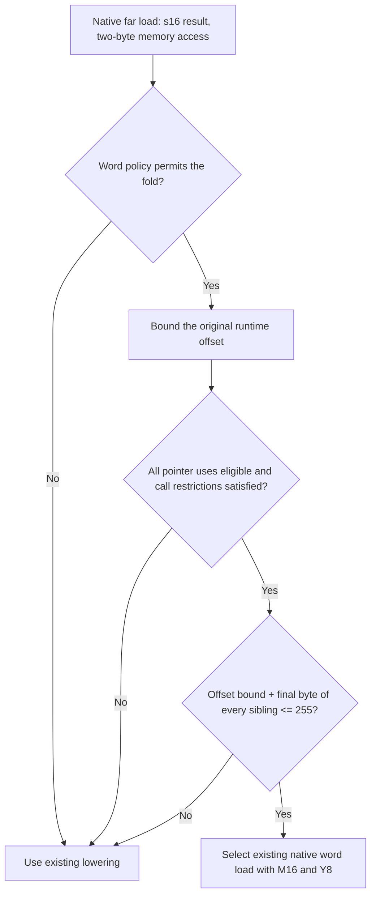

# [MOS] Fold bounded native far-word loads into Y8 indexing for speed

The 65816 can load a word through `[dp],Y` with a 16-bit accumulator and an 8-bit index. When a runtime far-pointer offset is bounded, this can remove an explicit wide pointer addition. Extend the existing runtime far-index fold to plain, non-atomic `s16` loads of exactly two bytes, using the existing `G_LOAD16_FAR_INDIR_IDX` pseudo. Enable this extension by default at code-generation optimization levels `Default` and `Aggressive` (`-O2`/`-O3`) in functions without `optsize`, `minsize`, or `optnone`.

This is a component of the far-addressing/native-width compiler series for [#320](https://github.com/llvm-mos/llvm-mos/issues/320) and [#321](https://github.com/llvm-mos/llvm-mos/issues/321). The downstream patch depends on the native far-word operations, runtime far-index folding, and bounded-loop proof already present in its baseline. The [destination audit](review.md#upstream-destination-and-series-placement) records the missing prerequisites on upstream `26d7c2c1eebf98ca194b92609ba4e7540bfc6ef6`. Building and testing the exact patch stack proposed for upstream remains pending: separate the required changes into ordered commits, apply them to that base, add 0069/0070, and repeat the relevant comparisons. The existing downstream results remain valid; those additional tests would cover the precise code reviewers receive. [Detailed steps](review.md#what-testing-the-proposed-upstream-patch-stack-means).

## Validity of the fold

Keep the original offset expression, including its integer width and wrapping behavior. Use known bits, refined by the existing bounded-loop proof where applicable. Require every use of the pointer addition to be an eligible access or a non-negative constant displacement leading to eligible accesses. Retain the existing escape, absolute-base, atomic, and call restrictions.

For a group containing a word, require `max(offset) + max(displacement + access_bytes - 1) <= 255` across **all** accesses. Track word membership even when a byte access is visited first in XY16 mode. This is a conservative bound for this fold; far-address bank carry remains part of `[dp],Y` addressing.

For example, `j = 0..63` and offset `2*j` give a maximum start offset of 126 and final byte of 127. The proof preserves the computation of `2*j`; it does not widen a wrapping byte expression to obtain a more favorable range.

## Why enable it for speed?

The full-LTO Farblit comparison below measures linked `main` bytes and bsnes master clocks attributed to `main` through result completion. The baseline already includes the bounded-loop proof (downstream 0069), isolating the additional word fold. A16 permits the wide accumulator; XY16 also permits wide index registers. The word fold itself uses Y8 in both modes. Clock reduction is `(baseline - candidate) / baseline`.

| Mode | Build | `main` bytes, baseline → enabled | Master clocks, baseline → enabled | Clock reduction | Default enables fold? |
| --- | --- | ---: | ---: | ---: | --- |
| A16 | `-O2` | 3,279 → 3,266 | 311,266 → 289,102 | 7.12% | Yes |
| XY16 | `-O2` | 3,235 → 3,197 | 292,108 → 269,494 | 7.74% | Yes |
| A16 | `-O3` | 14,662 → 14,708 | 376,006 → 348,590 | 7.29% | Yes |
| XY16 | `-O3` | 14,016 → 13,920 | 361,030 → 337,664 | 6.47% | Yes |
| A16 | `-Os`, forced | 1,949 → 2,011 | 308,814 → 289,658 | 6.20% | No |
| XY16 | `-Os`, forced | 1,921 → 1,893 | 284,774 → 262,336 | 7.88% | No |

The A16 `-Os` growth is a whole-function allocation effect: the word loop saves 27 bytes, surrounding code adds 89, the soft-stack frame grows from 10 to 17 bytes, and spill/reload instruction counts increase. Static `REP` and `SEP` counts remain 36 each. A local instruction saving therefore cannot predict final function size. The A16 `-O3` result explicitly accepts 46 additional bytes for fewer clocks when speed is requested. A favorable XY16 `-Os` sample is insufficient evidence for a separate size policy. [Measurements, trace, and controls](review.md#choices-and-their-evidence).

The hidden `-mos-far-word-index=off|speed|all` option supports ablation and further experiments; `speed` is the default. `all` bypasses the optimization-level and function-attribute policy gates, while retaining feature and fold-validity checks. For Clang LTO comparisons, forward an override to both compilation (`-mllvm`) and linking (`-Wl,--mllvm=…`).

## Validation and limits

- The 12-case MIR regression covers policies, function attributes, optimization levels, range boundaries, wrapping/non-unit recurrences, and mixed byte/word groups in both visitation orders. Four focused regression files pass on the final Release build; the separately attempted assertion-only observer test is unsupported there.
- The downstream census covers 16 fixtures × two modes × three optimization levels for each of five policies/builds. Default `-Os`/`-Oz` output matches the baseline exactly. Only Farblit and the boundary fixture change in this sample; the census is not 16 independent speed benchmarks.
- There are 58 ROM/configuration pairs passing both MAME and bsnes: 54 across three fixtures and four additional Farblit `-O3` configurations. Boundary checks exercise bank-straddling words, WRAM bank crossing, the 255/256 limit, wrapping, and call/register pressure. Repeated timing profiles agree exactly.

These results describe the retained downstream compiler stack and fixtures. Compile time, physical-hardware timing, and broad application profitability are unmeasured. The proposed upstream patch stack has not yet been built or tested. Padded ROM lengths are unchanged. Published [Bank-Boundary Walk](https://biohack.net/snes/bankwalk/) and [Bank/Direct-Page Windows](https://biohack.net/snes/dpbank/) demonstrate related far-address and ABI contracts; they are supporting integration context and were not rebuilt as measurements of this patch.

[Evidence and reproduction guide](review.md#evidence-and-reproduction). Independent review remains pending.

Word-policy implementation, measurements, and this preparation: OpenAI Codex CLI 0.157.1 (session source `vscode`), model `gpt-6-astra`, `xhigh` reasoning effort; verified session `01a0e67f-298f-7a21-80af-06f867085f84`. Earlier proof and experiment credits remain in their [original investigation](../../../investigations/2026-09-28-farblit-payoff.md).
