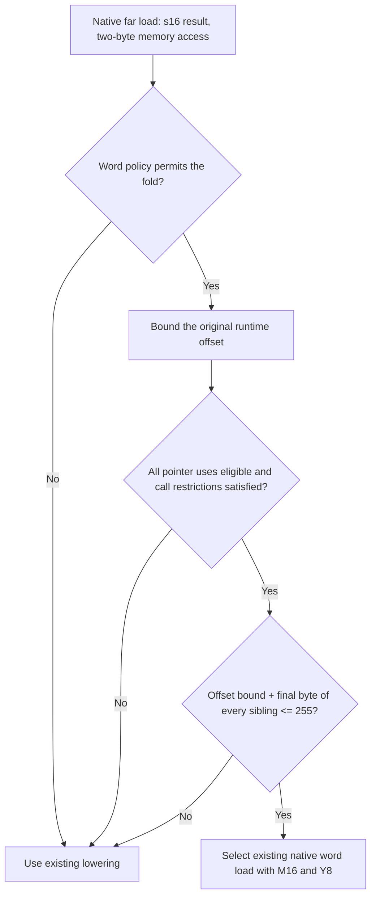

# [MOS] Fold bounded native far-word loads into Y8 indexing for speed

The 65816 can load a word through `[dp],Y` with a 16-bit accumulator and an 8-bit index. When a runtime far-pointer offset is bounded, this can remove an explicit wide pointer addition. Extend the existing runtime far-index fold to plain, non-atomic `s16` loads of exactly two bytes, using the existing `G_LOAD16_FAR_INDIR_IDX` pseudo. Enable this extension by default at code-generation optimization levels `Default` and `Aggressive` (`-O2`/`-O3`) in functions without `optsize`, `minsize`, or `optnone`.

This is a component of the far-addressing/native-width compiler series for [#320](https://github.com/llvm-mos/llvm-mos/issues/320) and [#321](https://github.com/llvm-mos/llvm-mos/issues/321). The downstream patch depends on the native far-word operations, runtime far-index folding, and bounded-loop proof already present in its baseline. The [destination audit](review.md#upstream-destination-and-series-placement) records the missing prerequisites on upstream `26d7c2c1eebf98ca194b92609ba4e7540bfc6ef6`. The [extracted candidate](upstream-series.md) now supplies ordered patches on that base, an assertions-enabled build, expanded regressions, and separately identified measurements from replaying frozen optimized IR. Its prerequisite discoveries and remaining ABI/review limits are explicit. The linked downstream full-LTO results retain their original compiler identity.

## Validity of the fold

Keep the original offset expression, including its integer width and wrapping behavior. Use known bits, refined by the existing bounded-loop proof where applicable. Require every use of the pointer addition to be an eligible access or a non-negative constant displacement leading to eligible accesses. Retain the existing escape, absolute-base, atomic, and call restrictions.

For a group containing a word, require `max(offset) + max(displacement + access_bytes - 1) <= 255` across **all** accesses. Track word membership even when a byte access is visited first in XY16 mode. This is a conservative bound for this fold; far-address bank carry remains part of `[dp],Y` addressing.

For example, `j = 0..63` and offset `2*j` give a maximum start offset of 126 and final byte of 127. The proof preserves the computation of `2*j`; it does not widen a wrapping byte expression to obtain a more favorable range.

## Why enable it for speed?

The extracted-backend replay below compiles identical captured post-LTO IR with separate pre-0070 and candidate builds, using the same prerequisite fixes and the existing driver’s `-disable-spill-hoist` setting. It links with the retained SDK and linker. This measures linked `main` bytes and bsnes master clocks through result completion; it is not a fresh frontend/LTO build of the upstream toolchain. A16 permits the wide accumulator; XY16 also permits wide index registers. The word fold itself uses Y8 in both modes. Clock reduction is `(baseline - candidate) / baseline`. [Exact identities and commands](upstream-series.md).

| Mode | Option | Main bytes: baseline → enabled | Master clocks: baseline → enabled | Fewer clocks | Default |
| --- | --- | ---: | ---: | ---: | --- |
| A16 | `-O2` | 3,279 → 3,168 | 308,350 → 284,374 | 7.78% | Enabled |
| XY16 | `-O2` | 3,214 → 3,185 | 289,654 → 267,036 | 7.81% | Enabled |
| A16 | `-O3` | 15,912 → 15,878 | 379,936 → 350,972 | 7.62% | Enabled |
| XY16 | `-O3` | 14,360 → 14,379 | 356,092 → 334,228 | 6.14% | Enabled |
| A16 | `-Os` forced | 1,960 → 2,024 | 308,862 → 289,722 | 6.20% | Baseline |
| XY16 | `-Os` forced | 1,934 → 1,908 | 284,878 → 262,416 | 7.88% | Baseline |
| A16 | `-Oz` forced | 2,153 → 2,153 | 387,408 → 387,408 | 0.00% | Baseline |
| XY16 | `-Oz` forced | 1,955 → 1,955 | 317,710 → 317,710 | 0.00% | Baseline |

These results support a speed-oriented default on the measured Farblit input while keeping the size policy conservative. A16 Os gains 64 bytes despite reducing clocks; O3 XY16 gains 19 bytes for 6.14% fewer clocks. The boundary control’s exclusive-main O2 count increases by 80 clocks in XY16 (A16 decreases by 160), and the pressure control is unchanged; these controls omit called work and establish no general speed guarantee.

The [earlier downstream full-LTO study](../../../investigations/2026-09-28-far-word-policy.md) remains separately identified. Its A16 Os growth was 62 bytes: the word loop saved 27 bytes, surrounding code added 89, the frame grew from 10 to 17 bytes, and spill/reload counts increased. That trace explains the original decision; it is not a new allocation trace of this extraction. The two compiler stacks’ absolute measurements are not interchangeable.

The hidden `-mos-far-word-index=off|speed|all` option supports ablation and further experiments; `speed` is the default. `all` bypasses the optimization-level and function-attribute policy gates, while retaining feature and fold-validity checks. For Clang LTO comparisons, forward an override to both compilation (`-mllvm`) and linking (`-Wl,--mllvm=…`).

## Validation and limits

- The assertions-enabled extracted build passes 160 MOS CodeGen/MC files, with one existing unsupported file. Both generic X86 0028 regression RUNs pass. Added tests cover exact word endpoints, operand/memory preservation, mixed users, rejection paths, recurrence boundaries and a live-consumer IR case.
- Six real legalizer outputs pass FileCheck; all 228 single-token wrong-opcode substitutions fail (156 byte-range and 72 word-policy checks).
- All 58 ROM/configuration pairs pass MAME and bsnes, with identical repeated timing profiles: 54 across three fixtures and four additional Farblit O3 configurations. Bank-straddling, wrapping and call/register-pressure controls are retained. This is three fixtures with repeated configurations, not 58 independent applications.

Compiler overhead, physical-hardware timing and broad application profitability are unmeasured. The whole extracted compiler/ABI series still requires independent review. The current far runtime has a 16-bit length domain, general A8 far-pointer support and ABI exhaustion remain separate contracts, and spill hoisting needs its separately prepared 0033 fix or the recorded disabled setting. Padded ROM lengths are unchanged. Published [Bank-Boundary Walk](https://biohack.net/snes/bankwalk/) and [Bank/Direct-Page Windows](https://biohack.net/snes/dpbank/) supply supporting integration context; their ROMs were not rebuilt for this comparison.

[Evidence and reproduction guide](review.md#evidence-and-reproduction). [Three separate AI source reviews](independent-review.md) found no valid-input compiler correctness defect. They identified a P2 weakness in prerequisite 0069's opcode assertions: FileCheck discards literal trailing spaces, so fallback and Y8 expectations could accept longer opcode names. [The executed correction](independent-review.md#correction-and-executed-sensitivity-checks) adds explicit boundaries to all 78 assertions. The preserved checks accept 104 of 156 wrong-opcode substitutions; the corrected checks reject all 156 and accept all three real outputs. The four focused regression files pass again. This resolves the assertion finding; compiler code and the retained benchmark evidence are unchanged. The reviewers used OpenAI Codex CLI 0.158.0 (`codex-tui`), model `gpt-6-astra`, `xhigh` reasoning effort. Human review and review of the eventual extracted stack remain separate.

Word-policy implementation, measurements, assertion correction, and this preparation: OpenAI Codex CLI 0.157.1 (session source `vscode`), model `gpt-6-astra`, `xhigh` reasoning effort; verified session `01a0e67f-298f-7a21-80af-06f867085f84`. Earlier proof and experiment credits remain in their [original investigation](../../../investigations/2026-09-28-farblit-payoff.md).
