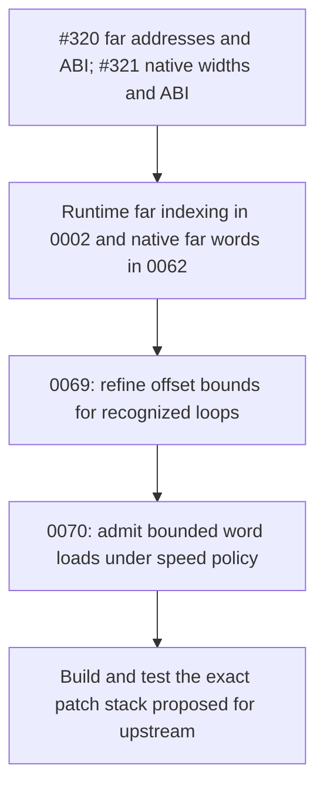

# Native far-word indexing: author review and evidence guide

**September 28, 2026 — local PR preparation.** The implementation and measurements are retained in the [0070 investigation](../../../investigations/2026-09-28-far-word-policy.md). This document audits their use in the [working PR body](pr-body.md), adds a pinned upstream source inspection, and records unresolved questions. It does not certify an upstream extraction or independent review.

Author preparation: OpenAI Codex CLI 0.157.1 (session source `vscode`), model `gpt-6-astra`, `xhigh` reasoning effort; verified session `01a0e67f-298f-7a21-80af-06f867085f84`. The original range-proof and payoff investigations retain their own verified credits.

## Choices and their evidence

| Choice | Evidence bearing on it | What that evidence permits us to conclude |
| --- | --- | --- |
| Enable native word indexing for speed at `-O2`/`-O3`. | Full-LTO Farblit, baseline including 0069: O2 A16/XY16 use 7.12%/7.74% fewer clocks and 13/38 fewer bytes. O3 A16 uses 7.29% fewer clocks with **46 extra bytes**; XY16 uses 6.47% fewer clocks and 96 fewer bytes. [Results](../../../defects/evidence/2026-09-28-far-word-policy/results.json). | A size increase is an acceptable tradeoff for the selected speed policy on these inputs. The measurements do not prove every admitted function benefits. |
| Keep the default off in size-oriented functions. | Forcing the fold at A16 Os grows `main` by **62 bytes** despite a 27-byte saving in the word loop. Default Os/Oz reproduce baseline objects and ROMs. [Policy controls](../../../defects/evidence/2026-09-28-far-word-policy/policy-control.json). | A local saving is insufficient to select a size default. The proposed policy preserves the measured size-mode outputs. |
| Use the same policy in A16 and XY16. | XY16 Os saves 28 bytes in Farblit, but only two of the 16 fixtures change code in the census. | Keep the common conservative size policy pending independent workloads; this is a design judgment, not evidence that XY16 size folding always loses. |
| Restrict the default to O2/O3 and honor function attributes. | MIR checks cover O0/O1/O3, size/minsize/optnone, and explicit policies. The runtime profitability study covers Os/Oz/O2 plus Farblit O3. | O0/O1 exclusion limits the optimization's scope. We have no O0/O1 profitability result. `Function::hasOptSize()` includes `minsize`. |
| Retain the all-users walk and require the entire mixed group to fit Y8. | Source checks every access's final byte; mixed-group MIR cases cover both visitation orders, including the 255/256 boundary. [Patch](../../../../patches/llvm-mos/0070-mos-far-word-index-policy.patch), [shape records](../../../defects/evidence/2026-09-28-far-word-policy/shape-checks.json). | The word pseudo's Y8 contract cannot be relaxed because the first visited access is a byte or because XY16 is available. |
| Preserve narrow arithmetic and fall back when the range cannot be proved. | 0069 follows zero extension and constant shifts only when the maximum fits that operation's width. Retained MIR/runtime controls include wrapping, full-byte cycles, non-unit increments, and out-of-range words. | Accepted offsets retain the original expression. Rejected loop patterns may still use an independently sufficient known-bits bound; rejection of the loop proof is not a blanket ban on wrapping expressions. |
| Keep explicit `off`/`all` controls. | `off` reproduces 96 baseline objects and 18 ROMs; final default reproduces explicit `speed`, and installed tools reproduce the default. [Disabled control](../../../defects/evidence/2026-09-28-far-word-policy/disabled-control.json), [default control](../../../defects/evidence/2026-09-28-far-word-policy/default-control.json), [installed control](../../../defects/evidence/2026-09-28-far-word-policy/installed-control.json). | These support attribution to the policy change and make further ablations possible. They do not establish a need for a permanent public tuning interface. |

### The 62-byte A16 result

The [trace archive](../../../defects/evidence/2026-09-28-far-word-policy/trace.tar.gz) replays the same captured pre-legalizer MIR against the rebased compiler. Its [region sizes](../../../defects/evidence/2026-09-28-far-word-policy/trace.json) account for the complete net change: `rdw` 103 → 76 bytes (**−27**), all other regions together **+89**, giving **+62**. The copy-setup region alone grows by 54 bytes. Soft-stack frame size changes 10 → 17 bytes; annotated folded-spill instructions change 10 → 18 and folded-reload instructions 10 → 18. Static `REP` and `SEP` counts remain 36 each.

This supports changed register allocation and spill traffic as the primary explanation. Equal switch counts do not prove identical switch placement or dynamic cost. We have not separately ablated each allocator decision. The whole-function measurement is the relevant observation for the size policy, even though the selected loop is smaller.

### Earlier loop timing and current function timing

The original **25.44%** A16 figure belongs to the `rdw` interval in the [earlier non-LTO experiment](../../../investigations/2026-09-28-farblit-payoff.md): 88,046 → 65,646 master clocks. The whole-main Os comparison is 308,814 → 289,658 clocks, a **6.20%** reduction. Neither number is the current O2 headline. Each result must retain its region, baseline, and build mode when cited.

Both Oz modes are unchanged even when forced: A16 stays at 2,085 bytes / 355,972 clocks; XY16 stays at 1,942 bytes / 311,650 clocks. This provides an unchanged-output control; it does not prove the transformation is impossible in every Oz program. Fixed cartridge padding means these code-size changes do not change the ROM file length.

## Correctness argument and review boundaries

1. **Entry and operation.** The native far load path in `legalizeLoadStore16` requires accumulator-width support and a 32-bit far-pointer representation. Existing absolute/global lowering is attempted separately. The new helper admits a plain `G_LOAD` with an `s16` result and an exact two-byte memory size; it does not add runtime word stores or extending-load forms.
2. **Policy.** `speed` requires codegen level at least `Default`, no size attribute, and no `optnone`. `all` explicitly bypasses these policy checks, including O0/O1 and `optnone`; it still requires native-width support and the same fold-validity checks. `off` disables this word admission, not every existing native-word addressing form.
3. **Offset bound.** Known bits supplies a conservative maximum. The 0069 refinement recognizes a single-block byte recurrence with constant `Start < End`, a unit increment, and a lowered next-value inequality controlling the backedge. That recurrence reaches the endpoint before wrap, giving a header maximum of `End - 1`. Recursion follows zero extension and constant left shift only when that maximum fits the operation's own width. The offset computation is reused, not reassociated.
4. **Group bound.** Walk all non-debug uses of the pointer addition, including bounded chains of non-negative constant displacements. Reject escapes, atomic accesses, unsupported consumers, and disallowed call paths. Let `M` be the proven maximum offset and `E = max(displacement + access_bytes - 1)`. A word anywhere in the group requires `M + E <= 255`, even when a byte consumer is considered first. This conservative final-byte limit is the implementation's admission rule; it is not a claim that the hardware cannot read a word beginning at Y=255.
5. **Memory operation.** Select the existing M16/Y8 word pseudo with the original memory operand. The 24-bit far effective address can carry into the next bank. A bounded index does not require the base pointer and loaded word to remain within one bank. Controls at `$C1FFFF` and `$C2FFFF` deliberately make one word straddle that boundary.
6. **Lifetime and cost restrictions.** A possible call between pointer formation and access rejects the fold. Multiple accesses additionally require a function without potential calls. Single-access cases can pass in a function with calls elsewhere. The user-walk and range recursion have depth limits; the whole-function potential-call scan still has a cost that is unmeasured here.

The regression inventory is **12 functions and nine RUN lines** in `far-word-policy.mir`, not 12 independent application benchmarks. The 26-case range regression belongs to prerequisite 0069. The final focused suite contains four passing files; this preparation reuses those recorded runs. Existing native-word tests and the [earlier 0062 review](../../2026-09-26/native-optimization-review.md) supply additional atomic/volatile/ABI context. That earlier review does not independently certify 0070, and the 0070 test is not claimed to add dedicated new volatile-ordering cases.

Before submission, review the proof against operand roles and control-flow guards rather than accepting the example alone. Check memory flags, mixed-group traversal after legalization mutates uses, call-producing generic instructions, bank carry, and feature-disabled behavior in the extracted series. Compiler overhead and richer loop forms need separate evidence if their claims or implementation scope expand.

## Measurement method and coverage

The [identity record](../../../defects/evidence/2026-09-28-far-word-policy/identity.json) pins vendor revision `8be0546128a55e78c63ca571d466aa72a782cd36` **plus the captured downstream changes**, SDK revision, source hashes, patch hashes, and individual compiler/linker binaries. The vendor SHA alone does not identify the tested compiler. The baseline includes installed 0069. An initial candidate supports explicit policy controls; the final binary changes the default and adds the codegen-level guard. Equality controls connect the explicit-speed, final-default, and installed results.

The captured identity field `emulators.bsnes_revision` is the enclosing project revision: `vendor/bsnes-jg` is not a separate Git checkout. Use the recorded probe SHA-256 and the [calibration source/hash record](../../../defects/evidence/2026-09-27-mos-carry-timing/emulator-identity.json) to identify the timing core. Their probe hashes match (`e294aed948506ab5b131afa983b6c82d838707949f84e1f6720e9cfea3e114ba`). This qualification preserves the original evidence without presenting a project commit as a bsnes commit.

The census has 16 distinct C fixtures, two feature configurations, and Os/Oz/O2: **96 object configurations per variant**, or 480 builds across baseline/all/speed/off/default. Object function-byte sums are separate from linked `main` sizes. At O2 those sums change 14,131 → 14,080 bytes in A16 and 13,842 → 13,766 in XY16. Only Farblit and the boundary fixture change. The unchanged outputs provide coverage of unaffected code; they are not additional performance wins.

The runtime subset has three fixtures × two modes × three optimization levels × three variants (baseline/all/speed): **54 configurations**, each passing both emulators. Four additional configurations compare baseline/default Farblit at O3. Thus **58** counts configurations including baselines and controls; it is not a count of independent programs, new optimizations, or hardware measurements. The final policy also has 144 recorded shape cases and installed-output equality checks.

The [calibrated bsnes method](../../../investigations/2026-09-27-mos-carry-timing.md) uses executed master clocks, including bus waits and refresh, with deterministic input. Each primary sample is repeated in an independent process and produces an identical result/profile. In the retained Farblit profiles, `exclusive_master_clocks` equals the main-entry-to-result sample, including the additional O3 comparison. Boundary and pressure measurements omit called functions in the exclusive total and are not used as complete-work speed claims. MAME provides an independent execution oracle; its results are not a second timing measurement of these clock counts.

Clock reductions are computed as `100 * (baseline_clocks - candidate_clocks) / baseline_clocks`. This packet uses that wording instead of an ambiguous percentage “faster.” Deterministic repeated emulator results do not provide a statistical estimate of performance across workloads, initial states, or physical consoles. The old `-Os` loop-only estimate and the current LTO function comparison remain separately identified.

## Upstream destination and series placement

Read-only GitHub inspection on September 28 pins llvm-mos `main` to [`26d7c2c1eebf98ca194b92609ba4e7540bfc6ef6`](https://github.com/llvm-mos/llvm-mos/commit/26d7c2c1eebf98ca194b92609ba4e7540bfc6ef6). [#320](https://github.com/llvm-mos/llvm-mos/issues/320) and [#321](https://github.com/llvm-mos/llvm-mos/issues/321) are open **feature issues**. Their state alone does not establish which code exists; the following source inspection supplies that evidence. [Snapshot, hashes, and audit scope](destination.json).

| Inspected entry point or artifact | Observation at the pinned revision |
| --- | --- |
| [`MOSLegalizerInfo.cpp`](https://github.com/llvm-mos/llvm-mos/blob/26d7c2c1eebf98ca194b92609ba4e7540bfc6ef6/llvm/lib/Target/MOS/MOSLegalizerInfo.cpp), constructor and memory rules | Pointer types are `p0:16` and `p1:8`; ordinary scalar loads/stores are narrowed to eight bits. |
| Same file, `legalizeCustom`, `legalizeLoad`, `legalizeStore`, `selectAddressingMode` | Loads/stores reach the ordinary address selector; it has 8- and 16-bit pointer cases. The native far-word caller and 32-bit pointer branch are absent. |
| [`MOSSubtarget.h`](https://github.com/llvm-mos/llvm-mos/blob/26d7c2c1eebf98ca194b92609ba4e7540bfc6ef6/llvm/lib/Target/MOS/MOSSubtarget.h), `MOSInstrInfo.td`, `MOSInstrGISel.td`, `MOSLegalizerInfo.h` | Existing 65816 instruction support does not provide the downstream `hasAccum16`/`hasIndex16` queries, far-fold helper declarations, or `G_LOAD16_FAR_INDIR_IDX` pseudo. |
| CodeGen/MOS directory inventory; pointer and memory/addressing cases in `legalizer.mir` and `legalizer-ir.mir` | The two inspected legalizer files exercise ordinary/zero-page addressing. The 87-entry directory inventory has no downstream far-word/range tests. This is a file inventory and focused test inspection, not a full-suite run. |
| Subjects of the ten most recent commits affecting `MOSLegalizerInfo.cpp` | Recent entries include three-way comparison lowering, 65CE02 pointer arithmetic, vector scalarization, and LLVM merges. The listing provides recent context for the source inspection; commit subjects alone do not establish absence of an equivalent change. |

The current 0070 delta therefore has no standalone native far-word entry path on that destination. Preserve its placement after the prerequisites when extracting the series:

This diagram is the relevant logical dependency chain, not a claim that four standalone patches reproduce the complete build. The [feature package tracker](../../2026-09-26/feature-held-packages.md) also records 0061 as a prerequisite of 0062. The current full downstream stack remains the measured baseline. This pass inspected upstream source and existing evidence; it did not build that destination, refresh the full MOS suite, or perform independent review.

### What testing the proposed upstream patch stack means

Our existing measurements cover the full downstream compiler, which already contains the far-pointer and native 16-bit support that 0070 needs. Upstream lacks those prerequisites. “Extracting the prerequisite series” means pulling the required changes out of the larger fork into focused, ordered commits that reviewers can examine.

The additional validation consists of these steps:

1. Identify and separate the required compiler/ABI changes, including far-pointer support, native register widths, runtime indexed addressing, and native far-word operations.
2. Apply those commits to a pinned upstream revision and record the exact resulting patch stack.
3. Add the bounded range proof in 0069 and the word-indexing policy in 0070.
4. Build that compiler and repeat the relevant correctness, code-size, and runtime comparisons, using the same inputs and identified baseline/candidate builds.

This checks whether splitting and rebasing the changes preserves their behavior and whether any dependency was missed. **The existing downstream results remain valid.** The additional measurements would cover the precise code reviewers receive. That build and comparison have not yet been performed.

**Opening readiness:** prepare a concrete compiler/ABI extraction with identified commits, relevant regression and measurement results, independent review, and publicly resolvable evidence links. **Merge order:** the prerequisite compiler/ABI series must supply the paths and contracts used here. Published SNES demonstrations may be cited during compiler review; SNES implementation/platform code follows its separate tracker.

## Evidence and reproduction

The [evidence manifest](../../../defects/evidence/2026-09-28-far-word-policy/manifest.json) hashes the retained artifacts. The preparation's [audit receipt](audit.json) records integrity checks and arithmetic/source reconciliation; it is not a new compiler validation run.

| Artifact | Purpose |
| --- | --- |
| [Prior work](../../../defects/evidence/2026-09-28-far-word-policy/prior-work.json) | Reconciles 0062, 0066, 0069, the original experiment, live source, and the canonical legalization defect. This optimization does not create or close a defect. |
| [Source archive](../../../defects/evidence/2026-09-28-far-word-policy/source.tar.gz) | Captured fixtures, final tracked/untracked vendor changes, baseline legalizer override, and trace input. |
| [Run archive](../../../defects/evidence/2026-09-28-far-word-policy/runs.tar.xz) | Objects, linked ELF/ROMs/maps, raw profiles, commands' outputs, and emulator logs. |
| [Sweep runner](../../../defects/evidence/2026-09-28-far-word-policy/sweep.py), [O3 runner](../../../defects/evidence/2026-09-28-far-word-policy/sweep-o3.py), compressed command/sweep JSON alongside them | Exact build and measurement configuration. These scripts expect the recorded workspace layout and tools; they are not a self-contained public compiler bootstrap. |
| [Shape archive](../../../defects/evidence/2026-09-28-far-word-policy/shapes.tar.gz), [shape summary](../../../defects/evidence/2026-09-28-far-word-policy/shape-checks.json) | Ensures runtime success is accompanied by the intended M16/Y8 addressing and negative-case behavior. |
| [Final lit results](../../../defects/evidence/2026-09-28-far-word-policy/final-lit.json), [integration receipt](../../../defects/evidence/2026-09-28-far-word-policy/receipt.json) | Identifies the completed focused checks, output controls, installation, and unsupported assertion-only check. |

For local replay, restore the recorded `.scratch/far-word-policy` layout and verify its binaries against `identity.json`. The existing runners accept `baseline`, `all`, `speed`, `off`, and `default`; the main runner uses the initial candidate for explicit policies and the final policy build for `default`. LTO overrides are forwarded to both Clang and lld. Consult the captured command JSON rather than substituting whatever compiler is installed later. Binaries remain local; rebuilding externally requires the captured vendor base and overlays, SDK/toolchain environment, and the separately retained calibrated probe. Public reproduction instructions must be completed for the eventual extraction.

## Remaining development and review questions

Current downstream correctness and performance results remain valid. These questions identify the independent assessment, missing measurements, and design decisions still needed for upstream preparation:

- **Correctness review:** does an independent reviewer agree with 0069's induction/branch proof and 0070's bounds for all pointer uses, including mixed byte/word groups after legalization changes the uses? Review bank carry, memory flags, and call handling against the exact proposed patch stack. The recorded tests pass; independent source review remains pending.

- **Broader performance:** do other applications with eligible loops benefit from the speed default? Most speed evidence comes from Farblit, O3 covers one fixture, and only two fixtures change code in the 16-fixture census. Additional workloads are needed to support broader profitability claims.

- **Compiler overhead:** how much compilation time do the extra scans cost, especially repeated scans of an entire function? Recursion depth is bounded, but compilation overhead has not been measured.

- **Option design:** should upstream retain the hidden `off|speed|all` switch? It supports the current controlled comparisons and experiments; retaining it as a permanent upstream option still needs a design decision.

- **Patch preparation:** does separating and rebasing the required changes preserve their behavior and include every dependency? Build and test the proposed upstream patch stack as described above. Remove incidental formatting changes where practical, and keep measurements for any substantive revision separately identified.

Use these questions to direct further work. Do not broaden the claims by accumulating repeated controls, suppressing a size regression, or promoting the source audit into a claim of destination validation.
