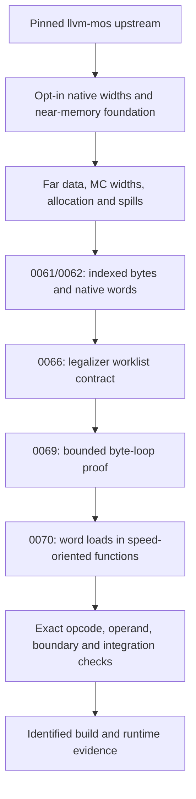

# Far-loop and native-word upstream candidate

**Local extraction for review, September 28, 2026.** The proposed compiler stack is based on exact llvm-mos revision `26d7c2c1eebf98ca194b92609ba4e7540bfc6ef6`. The ordered patches, source trees, binary identities, executed checks, and rebased measurements are retained in [the series packet](upstream-series/series.json). No upstream PR has been opened. The complete #320/#321 compiler and ABI contract still needs independent review; SNES platform code remains on its separate submission track.

## What reviewers receive

The packet separates the native foundation, MC address-width prerequisites (0039/0044), far-data addressing, absolute indexed bytes (0061), native words (0062), legalizer worklist handling (0066), bounded-loop proof (0069), allocation/spill prerequisites, speed policy (0070), and added regressions. Each patch has a recorded source commit and tree. The reconstruction check applies the patches in order to the exact base and compares the resulting trees; it does not depend on the dirty downstream checkout.

This extraction preserves current upstream vector scalarization, current value-tracking interfaces, the significant-bits arithmetic guard, and native register DWARF numbering. Far quads have no newly invented DWARF number. The packet excludes packed address-space-3 storage, far function calls/thunks, experimental calling-convention variants, near-pointer no-wrap recovery, Clang language extensions, and SNES target/runtime files. Existing far-memory runtime entry points are external dependencies, not implementations supplied here.

## Dependencies found by executing the candidate

The first extraction was incomplete. These failures and their corrections are retained rather than folded into a claim that the initial stack passed:

| Observation | Reconciliation and disposition |
| --- | --- |
| X16 allocation reaches `Unexpected physical register copy` in `copyCost`. | The legal equal-width X16/Y16 ↔ Imag16 edges already have physical-copy lowering, but lacked costs in both downstream and extracted source. [Canonical record](../../../defects/mos-native-index-copy-cost.json): unchanged inputs fail on the preserved assertions binary and pass with the four cost arms. The repair is in this candidate; no downstream installation is claimed. |
| Forced Os Farblit reaches the byte-only soft-stack assertion for an Imag32 quad. | Existing standalone 0018 was omitted from the first extraction. Its four-byte static/dynamic spill implementation and regression are included. This is an extraction correction, not a newly discovered repair. |
| The boundary fixture’s `word_pressure` function reports an undefined `rc4` after virtual-register rewriting. | The existing [0028 identity-copy repair](../../../investigations/2026-09-25-coalescing-0015-revalidation.md) is an explicit prerequisite. The pre-rewriter MIR and failure are retained. The historical 0015 workaround is not substituted for its root repair. |
| A later pressure path leaves an allocator scratch virtual register. | This is the separately documented 0033 spill-hoisting failure. Direct llc replay omitted the existing driver’s `-disable-spill-hoist` setting; matching that setting compiles all 58 configurations. The 0040 coalescing repair was tried, did not change this failure, and is excluded from the final series. Hoisting-enabled runtime support is not certified here. |
| General far-pointer fallback without A16 cannot legalize an s32/byte merge. | This is the documented [A16-gated far-pointer bridge limitation](../../../plans/2026-06-22-320-far-value-residuals.md), also measured in the [September completeness audit](../../../investigations/2026-09-24-mos24-far-addressing-completeness-audit.md). The feature-disabled regression checks a supported bounded byte path; it does not certify general A8 far-pointer support. |

## Validation scope

The assertions-enabled LLVM 24 build passes **160 MOS CodeGen/MC files**, with one pre-existing unsupported file; both retained generic X86 0028 regression RUNs also pass. The build exercises the extracted source. The MOS CodeGen/MC suite includes the added checks for word starts 254/255, original base/index/memory operands, mixed byte/word visitation order, atomic/escape/call rejection, reversed PHI inputs, multiple entry predecessors, narrow non-wrapping scale, recursion limits, and a compact IR load with a live arithmetic consumer. Literal opcode boundaries are explicit. The sensitivity runner checks real outputs and changes one opcode token at a time: all 228 wrong substitutions are rejected, and all six real outputs pass (156 byte-range mutations plus 72 word-policy mutations).

The earlier independent AI reviews remain reviews of the downstream implementation. They do not certify this larger extracted series, its new copy-cost prerequisite, or its ABI. The pre-existing `getchar-regression.ll` is unconditionally unsupported by its own directive and is reported separately from passing files.

## Rebased runtime and size evidence

The replay takes the **same captured post-LTO IR** from the earlier experiment and generates every fixture instruction with the identified extracted `llc`. It links those objects with the retained downstream linker/SDK and table assembly. This validates the proposed backend on frozen optimized inputs; it is not a fresh full Clang/LTO build of an entirely upstream toolchain. Both pre-0070 and candidate builds contain the same prerequisite fixes. Commands, input and binary hashes, object/ROM hashes, raw timing profiles and emulator logs are retained.

The whole-`main` Farblit results, including O3 and forced size-mode controls, are summarized below from the completed replay. Historical downstream numbers in [the original investigation](../../../investigations/2026-09-28-far-word-policy.md) remain unchanged. Each primary bsnes timing sample is repeated in an independent process; MAME provides a second execution oracle. The pressure and boundary fixtures are correctness controls; their exclusive-main counts omit called work and must not be used as whole-work performance claims.

| Mode | Option | Main bytes: baseline → enabled | Master clocks: baseline → enabled | Fewer clocks | Default |
| --- | --- | ---: | ---: | ---: | --- |
| A16 | `-O2` | 3,279 → 3,168 | 308,350 → 284,374 | 7.78% | Enabled |
| XY16 | `-O2` | 3,214 → 3,185 | 289,654 → 267,036 | 7.81% | Enabled |
| A16 | `-O3` | 15,912 → 15,878 | 379,936 → 350,972 | 7.62% | Enabled |
| XY16 | `-O3` | 14,360 → 14,379 | 356,092 → 334,228 | 6.14% | Enabled |
| A16 | `-Os` forced | 1,960 → 2,024 | 308,862 → 289,722 | 6.20% | Baseline |
| XY16 | `-Os` forced | 1,934 → 1,908 | 284,878 → 262,416 | 7.88% | Baseline |
| A16 | `-Oz` forced | 2,153 → 2,153 | 387,408 → 387,408 | 0.00% | Baseline |
| XY16 | `-Oz` forced | 1,955 → 1,955 | 317,710 → 317,710 | 0.00% | Baseline |

All **58/58** configurations pass both MAME and bsnes, with identical repeated profiles. The default preserves all recorded size-mode Farblit objects exactly. This does not mean every admitted function is faster: the boundary fixture’s exclusive-main O2 count increases by 80 clocks in XY16 (A16 decreases by 160); those counts exclude callees. The separate pressure fixture is unchanged. The measured O3 XY16 size cost remains visible. [Machine-readable results](upstream-series/validation/summary.json), [full matrix](upstream-series/validation/runtime-results.json).

## Reproduction

Use [the patch manifest](upstream-series/series.json) to verify patch hashes and order. The source commit IDs identify the local extraction history; the base is publicly available upstream. Apply the patches to a clean checkout at that base, then build an assertions-enabled Release `llc`, `llvm-mc`, `FileCheck`, `llvm-objdump`, `llvm-size`, and `opt`. [The replay guide](upstream-series/REPRODUCE.md) gives the commands and separates standalone LLVM regression checks from the project-specific SDK/emulator experiment.

## What remains before filing

- Independently review the complete extracted compiler/ABI series, including the native foundation and the new copy-cost case. Resolve feature scope and submission boundaries with #320/#321; this packet does not certify a complete implementation of either feature issue.
- Review far-pointer ABI register exhaustion, far-memory intrinsic lengths beyond the current 16-bit runtime length domain, the A8 far-pointer limitation, and debugger representation of far quads. Those contracts are not established by successful Farblit execution.
- Retain the documented spill-hoisting configuration requirement (0033). General far-pointer operation without A16 and the broader ABI/runtime contracts above are not covered by the successful replay.
- Measure compiler overhead and independent applications before claiming general profitability. Decide whether upstream should retain the hidden `off|speed|all` experiment switch.
- Publish this local evidence commit and replace remaining repository-relative PR evidence links with immutable URLs before posting. Recheck the destination revision immediately before submission.

Preparation, reconciliation, new copy-cost repair, and execution: OpenAI Codex CLI 0.157.1 (recorded session source `vscode`), model `gpt-6-astra`, `xhigh` reasoning effort; verified session `01a0e67f-298f-7a21-80af-06f867085f84`. Native foundation extraction reused from OpenAI Codex CLI 0.158.0 (`codex-tui`), model `gpt-6-astra`, `xhigh` reasoning effort, verified session `01a0e75a-a9ed-7372-9bac-b19b732a46a2`. Earlier authors and reviewers retain their credits in the patch messages and original preparation records.
