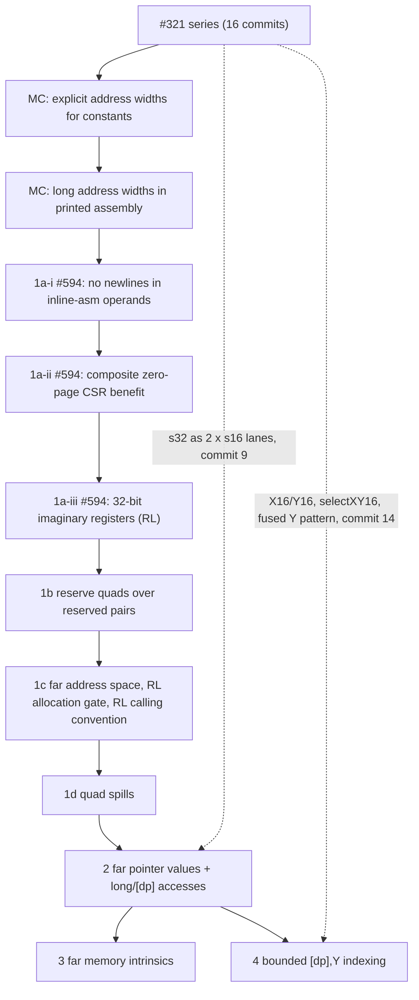

# Reviewer map: #320 far data as a 9‑commit series on #594

This series replaces the monolithic patch `11044c53d5fc` ("Extract far data addressing and bounded runtime indexing", 23 files, +1,660). It applies after the #321 series ([map](REVIEWER-MAP-321.md)) and the two unchanged MC address-width commits ([`patches-mc/`](patches-mc/)). Patches: [`patches-320/`](patches-320/). Series branch: `split-320-321-r2` in `build/split-320-321/source` (`ad7b2f4239a2`..`d19b7155d3c6`).

Two earlier states are kept for reference. The reviewed carry is branch `split-320-321-carry` (`abfb29168fca`..`59d98c37ab77`), which the [second independent review](../far-word-rebase/independent-review-2.md) examined. The pre-carry split is branch `split-320-321` (`42785c3bef21`..`1a616f08ea67`).

On 2026‑10‑01 the series was rebuilt ([plan](../../../plans/2026-10-01-far-prerequisite-split-carry.md#second-round-594-option-1-b8-b9-n10n16)). It carries the user's #594 decision (option 1), fixes the second review's B8 and B9, and applies N10 and N12–N16.

The end tree is the pressure-set reference `fa1928c8b9ca` plus the changes in [name-status](evidence/r2/320.invariant.txt): #594, the carried repairs and the second-round fixes in 16 library files, and 26 added test files, 18 of them from the split and carry. [`spec/r2-320.diff`](spec/r2-320.diff) is the delta from the reviewed carry.

Attribution:

- #594 commits: mlund (authorship and messages kept; the rebase note is below).
- Split: Claude Code 2.1.283 (t4-opus-high agent), model Claude Opus 5.5 (`claude-opus-5-5`), high reasoning effort.
- Carry and second round: Claude Code 2.1.285 (t4-opus-high agent `a7633adfeee82a4f5`), model Claude Opus 5.5 (`claude-opus-5-5`), high reasoning effort.
- The rebase-preparation credit of the monolithic patch (OpenAI Codex CLI 0.157.1, model gpt-6-astra, xhigh reasoning effort, session `01a0e67f-298f-7a21-80af-06f867085f84`) is kept in every commit message it applies to.

Per-commit logs are in `build/split-320-321/evidence/r2-320-*/` (build, suites, default-mode hashes); the summary is [`evidence/r2/stages.tsv`](evidence/r2/stages.tsv). The gates ran on run commits whose trees equal the final commits ([mapping](evidence/r2/message-update.tsv)).

## Dependency diagram

Far code needs `+mos-a16`: far pointers are s32 values, and s32 merges and unmerges are legal only with the #321 lane rules. Without `+mos-a16` far code fails to legalize, loudly (see [Loud unsupported far shapes](#loud-unsupported-far-shapes-n7-n16)).

## Summary

| # | Commit | Subject | Code | Tests | Focused tests | Default-mode effect |
|---|---|---|---|---|---|---|
| 1a‑i | `ad7b2f4239a2` | [MOS] Avoid newlines in inline asm operands (mlund, #594) | +1/‑1 | ‑2 | inline-asm-zp-csr.ll | identical |
| 1a‑ii | `f8a569b204c1` | [MOS] Accumulate composite zero-page CSR benefit (mlund, #594) | +2/‑2 | +26 | zp-alloc-composite-benefit.mir | identical |
| 1a‑iii | `fcb88211d861` | [MOS] Add nonallocatable 32-bit imaginary registers (mlund, #594) | +93/‑14 | +119 | #594's imag32 and copy tests | **4 inputs of the fixed set abort**; fixed by 1b |
| 1b | `733b59e025ee` | [MOS] Reserve Imag32 quads that overlap reserved pairs | +10 | +16 | imag32-reserved-pairs.ll | same as before 1a‑iii |
| 1c | `dcb9d3227be9` | [MOS] Add the far address space and allocate Imag32 quads on the 65816 | +58/‑10 | +105/‑17 | imag32-allocation-gate.mir, far-ptr-arg-exhaustion.ll | data layout string only |
| 1d | `cbbe9c70f520` | [MOS] Spill and reload Imag32 quads as four bytes | +88/‑4 | +26 | prologepilog.mir (quad cases) | identical |
| 2 | `3046c5754503` | [MOS] Legalize and select far pointer values and memory accesses | +484/‑26 | +317 | far-addressing.ll, far-phi.ll, far-quad-spill-call.ll, far-access-non-65816.ll, far-ptr-trunc.ll, far-fold-debug.ll | none for compiling inputs; non-65816 far accesses diagnosed |
| 3 | `8d9c0382db7c` | [MOS] Route far memory intrinsics to the far runtime | +99/‑3 | +168 | far-memset.ll, far-memop-length.ll | identical |
| 4 | `d19b7155d3c6` | [MOS] Select bounded runtime [dp],Y indexing for far byte accesses | +389/‑1 | +666 | far-indir-indexed.ll, far-index-fold-debug.ll, far-fold-debug.ll | identical |

**Default-mode evidence** (fixed input set, each commit against its parent, at O2).

- **Identical:** 1a‑i, 1a‑ii, 1c, 1d, 3 and 4.
- **1a‑iii:** #594 as posted aborts on four inputs (see 1b), and 1b returns the set to 1a‑ii's results exactly.
- **2:** identical for every input that compiles. The five corpus inputs that use address space 2 fail before and after it, with a different message. On mos6502, three of them stop at the far-access diagnostic.
- **The `trapguard` row:** each comparison lists one "asm differ" per mode for `trapguard`. It aborts with the same LoopStrengthReduce assertion everywhere, and its hashed first stderr line starts with the `llc` file name, so this is a harness artifact.

**By optimization level:** the whole #320 group against the MC top at O0, O1, O2, O3, Os and Oz is in [`evidence/r2/levels.txt`](evidence/r2/levels.txt).

## Commits

### 1a. llvm-mos#594, carried unchanged (`ad7b2f4239a2`, `f8a569b204c1`, `fcb88211d861`)

- **Purpose.** The shared RL foundation: RLk quads over RS(2k):RS(2k+1) with `sublo16`/`subhi16`, the Imag32 class (non-allocatable, as posted), quad copies, copy cost, MC operand lowering, and zero-page CSR grouping of quads. Also #594's two unrelated fixes: inline-asm operand printing, and composite zero-page CSR costing.
- **Rebase.** Carried from #594 head `7b80f7e18768` with mlund's authorship, dates and messages. The two unrelated commits apply with identical changed lines. The register commit needs one token: `MOSImagReg32<bits<16> num>` becomes `bits<32>`, because upstream #571 widened `MOSReg` numbers to 32 bits after #594 was written, and `0x30080` does not fit in 16. A bracketed note after mlund's message records this.
- **Numbering (B5, escalated).** The user chose #594's numbering, `Imag16RegsOffset + MaxImag16Regs`. On the current base it gives `0x30080 + K`, inside the RS "type 0x03" range of the MOS DWARF specification as #571 encodes it. The lldb MOS plugin knows only the RC and RS banks. The location is a well-formed single `DW_OP_regx`, so B5's malformed composite is gone, but no current consumer resolves the number. See the [carry plan](../../../plans/2026-10-01-far-prerequisite-split-carry.md#594-carry-one-mechanical-adaptation-one-escalation).
- **Defect in #594 as posted.** 1a‑iii makes every function with a call that passes stack arguments abort in the register coalescer, in every MOS mode ([record](../../../defects/mos-imag32-reserved-pair-units.json)). 1b fixes it. It reproduces on upstream `06bc967d2668` with only #594 applied.

### 1b. Reserve Imag32 quads that overlap reserved pairs (`733b59e025ee`)

- **Purpose.** Reserve an RL quad whenever either RS pair is reserved: the stack pointer, the scavenger slot, the frame pointer, or pairs outside the imaginary window. LLVM treats a register unit as reserved only when its root and all its super-registers are reserved. Without this rule, the stack pointer's byte units were not reserved, and live-range computation found uses of `$rs0` without a def ("Invalid global physical register").
- **Key hunks.** `MOSRegisterInfo.cpp` (`getReservedRegs`).
- **Tests.** imag32-reserved-pairs.ll, reduced with llvm-reduce from a SNES demo: a variadic call in mos6502 and mosw65816. It is red on 1a‑iii.
- **Why a separate commit.** #594 is carried unchanged, as the user asked. The fix is offered to mlund through the coordination draft.

### 1c. Add the far address space and allocate Imag32 quads on the 65816 (`dcb9d3227be9`)

- **Purpose.**
  - `p2:32:8` data layout and `AS_Far`.
  - Imag32 bank membership.
  - RL allocation behind one predicate, `MOSSubtarget::hasAllocatableImag32()`, which is the 65816 until an SDK contiguity contract exists. Elsewhere Imag32 has an empty alternative allocation order.
  - The RL calling convention (RL1‑RL3 where allocatable), with B1's 4-byte stack fallback, the i32 calling-convention type of far pointers, and incoming 32-bit values.
  - Strong copy hints outside the allocation order are no longer offered.
- **Why not reservation for the gate.** `MOSValueAssigner` marks every reserved register and all its aliases as used for arguments. Reserving every quad on mos6502 therefore moved byte and pointer arguments out of RS2–RS3 and RC4–RC7. Twelve MOS tests caught this during the rebuild; the empty order leaves the calling convention untouched.
- **Key hunks.** `MOSSubtarget.h` (`hasAllocatableImag32`); `MOSRegisterInfo.td` (`Imag32` `AltOrders`/`AltOrderSelect`); `MOSRegisterInfo.cpp` (`getRegAllocationHints`); `MOSCallingConv.td`/`.cpp`; `MOSISelLowering.cpp`; `MOSCallLowering.cpp`; `MOSRegisterBanks.td`; `MOSInstrInfo.h`; data layout in `TargetDataLayout.cpp` and `MOSTargetMachine.cpp`.
- **Tests.**
  - imag32-allocation-gate.mir: the 65816 allocates a quad; mos6502 reports that no register is available. It replaces #594's imag32-nonalloc.mir, whose contract this commit changes.
  - far-ptr-arg-exhaustion.ll: call lowering for a fourth far pointer and for near/far interleavings in plain mosw65816, +mos-a16 and +mos-a16,+mos-xy16, and every far pointer on the stack on mos6502.

### 1d. Spill and reload Imag32 quads as four bytes (`cbbe9c70f520`)

- **Purpose (B9).** An allocatable quad must be spillable. A static stack slot takes four byte accesses; LDStk/STStk expand into two Imag16 operations. This was far-word patch 10 (`0018`); it is moved here because every far commit after it can spill a quad.
- **Key hunks.** `MOSInstrInfo.cpp` (`loadStoreRegStackSlot`); `MOSRegisterInfo.cpp` (`expandLDSTStkImpl`).
- **Tests.** prologepilog.mir (quad load and store); #320‑2 adds the end-to-end case.

### 2. Legalize and select far pointer values and memory accesses (`3046c5754503`)

- **Purpose.**
  - p2 legality for globals, casts, pointer adds with bank carry, PHIs (via s32) and near→far casts.
  - Byte loads and stores through absolute-long (`lda $xxxxxx`) and `[dp]`, and far symbol addresses from ADDR24 relocation modifiers.
  - Imag32 REG_SEQUENCE merges and word unmerges.
  - B3's diagnostic for far loads, stores and memory intrinsics on CPUs without long addressing (once per access, N13).
  - B6's trunc pattern.
  - N12: a far memory intrinsic that is not inlined fails to legalize until #320‑3, instead of calling the near runtime.
  - B8's shared helper `dropDeadFarAddressDebugUses`, called by the absolute-long fold.
- **Key hunks.** `MOSInstrGISel.td`; `MOSInstrLogical.td` (long and `[dp]` forms, B6); `MOSInstrInfo.h` (MO_ADDR24_*); `MOSLegalizerInfo.cpp` (PF rules and the non-65816 custom rule, `rejectFarAccessWithoutLong`, `anyFarPointerOperand`, `legalizeMemOp`, `legalizePhi`, `legalizePtrAdd`, `legalizeAddrSpaceCast`, `selectAddressingMode` case 32, `isDeadFarAddressTree`, `dropDeadFarAddressDebugUses`, `tryFarAbsoluteAddressing`, `tryFarIndirectAddressing`); `MOSInstructionSelector.cpp`; `MOSMCInstLower.cpp`; `MOSRegisterInfo.cpp` (hint width filter); `MOSLateOptimization.cpp`.
- **Interim text.** The `selectGeneric` pin condition lists only the two non-indexed far opcodes until commit 4 adds the indexed ones.
- **Tests.**
  - far-addressing.ll and far-phi.ll.
  - far-ptr-arg-exhaustion.ll: adds full compilation.
  - far-quad-spill-call.ll (B9): four far pointers live across a call, at O0 and O2 in A16 and XY16.
  - far-access-non-65816.ll: one diagnostic per access, including i32 and memset.
  - far-ptr-trunc.ll (B6).
  - far-fold-debug.ll (B8): a `-g` far global plus a constant.

### 3. Route far memory intrinsics to the far runtime (`8d9c0382db7c`)

- **Purpose.** A non-inlined G_MEMSET, G_MEMCPY or G_MEMMOVE with any far pointer calls the far runtime, widening near pointers to far.
  - A provably 16-bit length calls `__memset_far`, `__memcpy_far` or `__memmove_far` with a size_t; any other length calls the `…_far32` entries with a uint32_t (B2).
  - With a near or direct-page operand, the IRTranslator has already narrowed the length. That is sound by LangRef's allocated-object bound, and the message now says so (N10).
  - The runtime entries are not in upstream llvm-mos-sdk (N11; [tracker](../../../upstream-contribution-status.md)).
- **Key hunks.** `MOSLegalizerInfo.cpp` (`createFarMemLibcall`, the `legalizeMemOp` route; `llvm/IR/CallingConv.h`).
- **Tests.** far-memset.ll; far-memop-length.ll (B2), with mixed-space cases that pin 40000 kept and 70000 narrowed to 4464 (N10).

### 4. Select bounded runtime [dp],Y indexing for far byte accesses (`d19b7155d3c6`)

- **Purpose.** Fold constant displacements 1‑3 and range-proven runtime offsets from a runtime far pointer into `lda/sta [dp],y`, with a 16-bit Y under `+mos-xy16` (fused `ldy zp` + access pseudo). Both fold paths call `dropDeadFarAddressDebugUses`, which replaces B4's dedicated walk and covers the displacement window (B8).
- **Key hunks.** `MOSInstrGISel.td`; `MOSInstrLogical.td`; `MOSAsmPrinter.cpp`; `MOSLegalizerInfo.cpp` (`kMaxFarIndirIdxDisp`, `mayBecomeCall`, `noCallBetween`, `allUsesAreFoldableFarAccesses`, `tryFarRuntimeIndexFold`, `tryFarIndirectIndexedAddressing`); `MOSLegalizerInfo.h`; `MOSInstructionSelector.cpp`.
- **Tests.** far-indir-indexed.ll; far-index-fold-debug.ll (B4); far-fold-debug.ll gains the displacement-window cases (load at +1, store at +3, runtime offset plus 1).

## Where the reviews' findings land

Red/green for every added or extended test: [`evidence/r2/red-green.tsv`](evidence/r2/red-green.tsv) (27 red runs fail, 143 green runs pass). The first-round table is [`evidence/carry/red-green.tsv`](evidence/carry/red-green.tsv).

| Finding | Summary | Status |
|---|---|---|
| B1 | Far-pointer argument exhaustion falls through to a 16-bit RS pair | Fixed in 1c (calling convention) with its call-lowering test; full compilation in #320‑2 |
| B2 | Far memory intrinsic lengths above 65535 truncated or deleted | Fixed in #320‑3 |
| B3 | Far accesses on non-65816 CPUs emit `[dp]` opcodes | Fixed in #320‑2 (loads, stores and memory intrinsics) |
| B4 | Undef DBG_VALUE after the far runtime-index fold | Fixed in #320‑4 (now through the shared helper); far-word patch 12 adds the word case |
| B5 | Far quad DWARF is a malformed composite | The composite is gone (RL has a number); the number's place in the specification is escalated |
| B6 | s32→s16 G_TRUNC asserts in `selectTrunc` | Fixed in #320‑2 |
| B7 | Imag32 collides with open #594 | Resolved by the user's option 1: #594 carried unchanged as 1a; allocation in 1c behind `hasAllocatableImag32()` |
| B8 | Dangling DBG_VALUE at the other far fold sites | Fixed: #320‑2 (absolute long), #320‑4 (window and runtime fold), far-word patch 5 (absolute indexed); [record](../../../defects/mos-far-fold-dangling-dbg-sites.json). The near shapes on upstream are a separate, unfixed [record](../../../defects/mos-legalizer-fold-dangling-dbg-upstream.json) |
| B9 | Quad spills arrive only in far-word patch 10 | Fixed: patch 10 is 1d; far-quad-spill-call.ll in #320‑2 |
| N3 | clang-format | 0 lines in each commit of ours; #594's register commit (mlund's code, unchanged) has 5 ([counts](evidence/r2/format-320.txt)). #321 unchanged (see the first-round table below) |
| N4 | History tags | None in #320 library code or tests |
| N10 | Mixed-space memop narrowing | #320‑3 message and mixed-space test |
| N11 | No SDK far runtime | Companion entry queued as future/blocked in the [tracker](../../../upstream-contribution-status.md) |
| N12 | #320‑2 far memop called the near runtime | Fails to legalize at #320‑2 instead |
| N13 | Diagnostic repeated per piece | One per access (custom rule for every far type without long addressing) |
| N14 | "Storing a far pointer stays legal on every CPU" | Message and comment corrected: far pointer values need quads, which only the 65816 allocates |
| N15 | Tags in tests, trailing blank line | Removed |
| N16 | Far atomicrmw/cmpxchg | Listed below |

First-round N3/N4 counts for #321 (unchanged): N3 1: 4, 4: 11, 5: 3, 6: 48, 7: 26, 8: 110, 9: 76, 10: 188, 11: 125, 12: 4, 14: 134, 15: 22, 16: 2; N4 ‑2: 4, ‑4: 4, ‑6: 1, ‑8: 13, ‑10: 8, ‑11: 14, ‑14: 7, ‑15: 1, including the broken "(Native widths: )" comment in #321‑8.

## Loud unsupported far shapes (N7, N16)

Measured on the far-word candidate `c275e191de52` (llc `c90f9648…`); each fails with an LLVM error rather than silently.

| Shape | Plain mosw65816 | +mos-a16 |
|---|---|---|
| Any far pointer value in memory or in s32 arithmetic (stacked argument, zero-extended runtime offset) | "unable to legalize … G_MERGE_VALUES s32" | compiles |
| `icmp eq ptr addrspace(2) %p, null` | "unable to legalize … G_CONSTANT p2 0" | same |
| far `select` | fails at O0 and O2 | fails at O0; compiles at O2 |
| far `atomicrmw`, `cmpxchg` | "unable to legalize … G_ATOMICRMW_ADD / G_ATOMIC_CMPXCHG" | same |
| atomic far `load` | compiles (`lda [dp]`) | compiles |
| Far pointer values on CPUs other than the 65816 | quads are not allocatable there; far accesses are diagnosed | — |
| A16 vector insert (`vector-scalarize.ll`) | — | "G_IMPLICIT_DEF s16 not legal" at O2/O3 (#321 foundation gap) |
