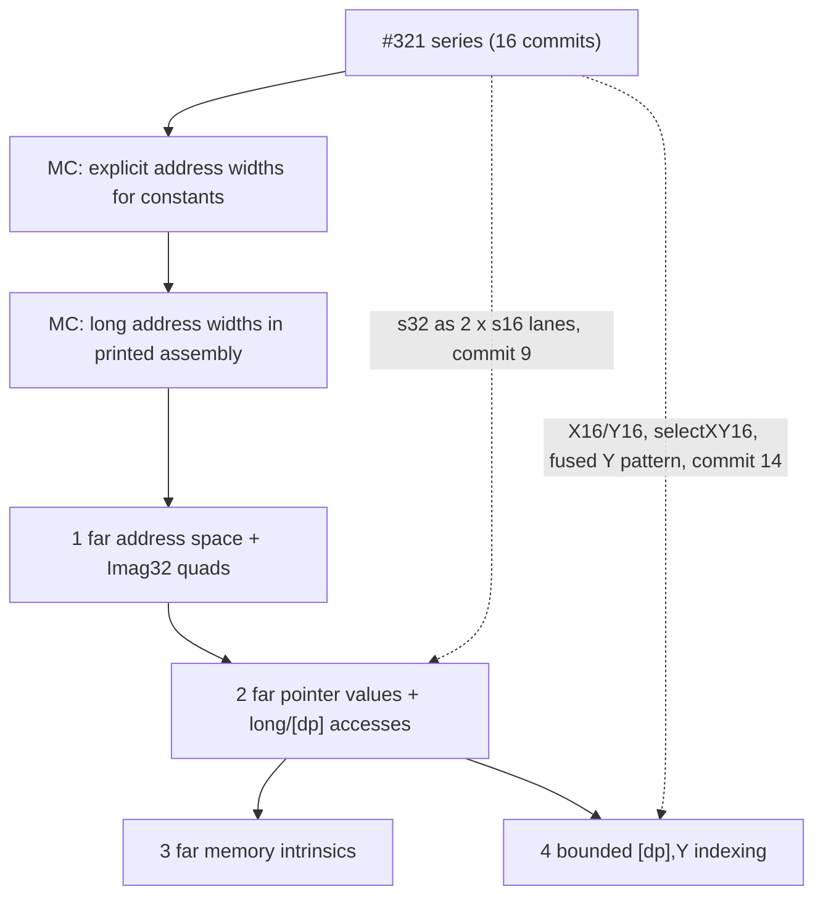

# Reviewer map: #320 far data as a 4‑commit series

This series replaces the monolithic patch `11044c53d5fc` ("Extract far data addressing and bounded runtime indexing", 23 files, +1,660). It applies after the #321 series ([map](REVIEWER-MAP-321.md)) and the two unchanged MC address-width commits ([`patches-mc/`](patches-mc/)), and ends at the tree of `11044c53d5fc` plus the [native-width pressure-set change](../../../plans/2026-09-30-native-register-pressure-sets.md#application) (reference commit `fa1928c8b9ca`, tree `deb630c2d43f`), plus the thirteen test files the split adds under `llvm/test/` (twelve in #321, one here); no other file differs. The #320 commits themselves do not touch the change. Patches: [`patches-320/`](patches-320/). Series branch: `split-320-321` in `build/split-320-321/source` (commits `42785c3bef21`..`1a616f08ea67`).

Attribution: split by Claude Code 2.1.283 (t4-opus-high agent), model Claude Opus 5.5 (`claude-opus-5-5`), high reasoning effort. The rebase-preparation credit of the monolithic patch (OpenAI Codex CLI 0.157.1, model gpt-6-astra, xhigh reasoning effort, session `01a0e67f-298f-7a21-80af-06f867085f84`) and its provenance pointer are kept in every commit message.

Validation and default-mode evidence follow the method in the [#321 map](REVIEWER-MAP-321.md#how-to-read-and-validate). Per-commit logs: `build/split-320-321/evidence/p-320-NN/` (build, suites and default-mode hashes; the first split's are `t-320-NN/` and `320-NN/`); the parent of commit 1 (`25c40909b44a`, the second MC commit) is `p-320-00`.

## Dependency diagram

All four far tests run with `+mos-a16`: far pointers are s32 values, and s32 merges and unmerges are legal only with the #321 lane rules. Without `+mos-a16` far code fails to legalize (see commit 2's default-mode note and the independent review's N7).

## Summary

| # | Commit | Subject | Code | Tests | Focused tests | Default-mode effect |
|---|---|---|---|---|---|---|
| 1 | `42785c3bef21` | Add the far address space and 32-bit imaginary pointer quads | +138/‑7 | +25 | imag32-copy.mir (added) | data layout string only |
| 2 | `df00169bd7b1` | Legalize and select far pointer values and memory accesses | +374/‑26 | +150 | far-addressing.ll, far-phi.ll | none for compiling inputs |
| 3 | `36f196cbf112` | Route far memory intrinsics to the far runtime | +96 | +32 | far-memset.ll | none |
| 4 | `1a616f08ea67` | Select bounded runtime [dp],Y indexing for far byte accesses | +360/‑1 | +511 | far-indir-indexed.ll | none |

Default-mode evidence (fixed input set, commit vs parent): commits 1, 3 and 4 give identical assembly and objects in mos6502 and mosw65816. Commit 2 gives identical output for every input that compiles; the five corpus inputs that use address space 2 fail in both default modes before and after it, with a different "unable to legalize" message (a p2 G_LOAD before; an s32 G_MERGE_VALUES or G_UNMERGE_VALUES after).

## Commits

### 1. Add the far address space and 32-bit imaginary pointer quads (`42785c3bef21`)

- **Purpose.** `p2:32:8` data layout and `AS_Far`; RLk quads over RS(2k):RS(2k+1) with `sublo16`/`subhi16`; Imag32 class and bank membership; quad naming, reservation, copies, copy cost, MC operand lowering and zero-page CSR placement.
- **Key hunks.** `TargetDataLayout.cpp`, `MOSTargetMachine.cpp` (data layout); `MOSInstrInfo.h` (`AS_Far`); `MOSRegisterInfo.td` (`sublo16`, `subhi16`, `MOSImagReg32`, `RL#K`, `MOSReg32Class`, `Imag32`); `MOSRegisterBanks.td`; `MOSRegisterInfo.cpp` (constructor naming, `getReservedRegs`, `copyCost`); `MOSInstrInfo.cpp` (`copyPhysRegImpl`); `MOSMCInstLower.cpp` (`lowerOperand`); `MOSZeroPageAlloc.cpp` (`runOnModule`, `collectCandidates`).
- **Tests.** imag32-copy.mir (added): a quad copy lowers to four byte copies in address order, with RL1 and RL2 naming `__rc4`–`__rc7` and `__rc8`–`__rc11`. Red on the parent: unknown register `rl2`. Nothing produces address-space-2 values until commit 2.
- **#594 reconciliation (blocking before submission).** Open upstream PR #594 (mlund, draft, head `7b80f7e1`) defines the same `sublo16`/`subhi16`, `MOSImagReg32`, `MaxImag32Regs`, `RL#K`, `MOSReg32Class` and `Imag32` family, with matching `copyPhysRegImpl`, `copyCost`, `MOSMCInstLower` and zero-page CSR changes. It differs in the register-number offset (this commit uses `Imag32RegsOffset = 0x600`; #594 derives numbers from `Imag16RegsOffset + MaxImag16Regs`) and in allocation policy (#594 keeps RL non-allocatable pending a linker contiguity contract). **This commit is the one a #594-based rebase replaces**: carry #594 unchanged in its place and move only this commit's remaining differences (data layout, `AS_Far`, bank membership, reservation, allocatability) into a follow-up. The content is unchanged here because the split must reproduce the monolithic tree.

### 2. Legalize and select far pointer values and memory accesses (`df00169bd7b1`)

- **Purpose.** Far pointer arguments in RL1‑RL3 (i32 calling-convention type); p2 legality for globals, casts, pointer adds with bank carry, PHIs (via s32) and near→far casts; byte loads and stores through absolute-long (`lda $xxxxxx`) and `[dp]`; far symbol addresses from ADDR24 relocation modifiers; Imag32 REG_SEQUENCE merges and word unmerges.
- **Key hunks.** `MOSCallingConv.td` (`CCIfPtrAddrSpace<2, …RL1..RL3>`); `MOSISelLowering.cpp`; `MOSCallLowering.cpp`; `MOSInstrGISel.td` (G_LOAD/STORE_FAR_ABS, G_LOAD/STORE_FAR_INDIR); `MOSInstrLogical.td` (LDAbsLong, STAbsLong, LDIndirLong, STIndirLong); `MOSInstrInfo.h` (MO_ADDR24_*); `MOSLegalizerInfo.cpp` (PF rules, `legalizePhi`, `legalizePtrAdd`, `legalizeAddrSpaceCast`, `selectAddressingMode` case 32, `tryFarAbsoluteAddressing`, `tryFarIndirectAddressing`); `MOSInstructionSelector.cpp` (`getRegClassForType`, `isFarSymbol`, `buildFarAddrWords`, `selectAddr`, `selectAddrLoHi`, `selectMergeValues`, `selectUnMergeValues`, `selectGeneric` Imag32 pin); `MOSMCInstLower.cpp` (LDCImm, ADDR24 symbol flags); `MOSRegisterInfo.cpp` (`getRegAllocationHints` width filter); `MOSLateOptimization.cpp` (`combineLdImm` GPR guard).
- **Interim text.** The `selectGeneric` pin condition lists only the two non-indexed far opcodes until commit 4 adds the indexed ones.
- **Tests.** far-addressing.ll, far-phi.ll.
- **Plan deviation.** The plan's commits 2 (legalize) and 3 (select) are one commit here: far-phi.ll's legalizer checks name the selected-form opcode G_LOAD_FAR_INDIR, and far-addressing.ll checks assembly and object bytes, so legalization alone has no observable test.

### 3. Route far memory intrinsics to the far runtime (`36f196cbf112`)

- **Purpose.** Non-inlined G_MEMSET/G_MEMCPY/G_MEMMOVE with any far pointer call `__memset_far`/`__memcpy_far`/`__memmove_far`, widening near pointers to far; the length argument is 16 bits (domain 0‑65535, stated in the message).
- **Key hunks.** `MOSLegalizerInfo.cpp` (`anyFarPointerOperand`, `createFarMemLibcall`, `legalizeMemOp` hook; `llvm/IR/CallingConv.h` include).
- **Tests.** far-memset.ll.

### 4. Select bounded runtime [dp],Y indexing for far byte accesses (`1a616f08ea67`)

- **Purpose.** Fold constant displacements 1‑3 and range-proven runtime offsets from a runtime far pointer into `lda/sta [dp],y`; 16-bit Y under `+mos-xy16` with a fused `ldy zp` + access pseudo.
- **Key hunks.** `MOSInstrGISel.td` (G_*_FAR_INDIR_IDX, G_*_FAR_INDIR_IDX16); `MOSInstrLogical.td` (LDIndirLongIdx, STIndirLongIdx, LDIndirLongYIdx, STIndirLongYIdx); `MOSAsmPrinter.cpp`; `MOSLegalizerInfo.cpp` (`kMaxFarIndirIdxDisp`, `mayBecomeCall`, `noCallBetween`, `allUsesAreFoldableFarAccesses`, `tryFarRuntimeIndexFold`, `tryFarIndirectIndexedAddressing`); `MOSLegalizerInfo.h`; `MOSInstructionSelector.cpp` (dispatch, `selectXY16` far case, `selectGeneric` cases and pin).
- **Tests.** far-indir-indexed.ll (26 functions, assembly, object bytes and post-selection MIR in two modes).

## Where the independent review's findings land

From [the far-word independent review](../far-word-rebase/independent-review.md). Findings will be fixed as follow-up commits on the split series, not folded into it. "Lands in" names the commit that introduces the code a fix changes.

| Finding | Summary | Lands in |
|---|---|---|
| B1 | Far-pointer argument exhaustion falls through to a 16-bit RS pair | #320‑2 `df00169bd7b1` (`MOSCallingConv.td` RL rule) |
| B2 | Far memory intrinsic lengths above 65535 truncated or deleted | #320‑3 `36f196cbf112` (`createFarMemLibcall`) |
| B3 | Far accesses on non-65816 CPUs emit `[dp]` opcodes | #320‑2 `df00169bd7b1` (`tryFarIndirectAddressing`, far legality); the triple-wide `p2` layout is #320‑1 |
| B4 | Undef DBG_VALUE after the far runtime-index fold | #320‑4 `1a616f08ea67` (`tryFarRuntimeIndexFold`) |
| B5 | Far quad DWARF is a malformed composite | #320‑1 `42785c3bef21` (`MOSImagReg32`, `DwarfNumbers = [-1]`) |
| B6 | Missing `Pat<(i16 (trunc Imag32:$s)), (EXTRACT_SUBREG Imag32:$s, sublo16)>`; s32→s16 G_TRUNC asserts in `selectTrunc` | #320‑2 `df00169bd7b1` (Imag32 register values and the far→near cast); the legal `{S16,S32}` G_TRUNC rule it relies on is #321‑9 `56e6c7f91e9e` |
| B7 | Imag32 collides with open #594 | #320‑1 `42785c3bef21` (replace on a #594 rebase, above) |
| N3 | clang-format lines (per commit, C++ hunks) | #320: 1: 19, 2: 16, 3: 11, 4: 60. #321: 1: 4, 4: 11, 5: 3, 6: 48, 7: 26, 8: 110, 9: 76, 10: 188, 11: 125, 12: 4, 14: 134, 15: 22, 16: 2 (others 0). The review's `MOSTargetMachine.cpp` include order and long comment are in #321‑4 `c5dfebbfbf55`. |
| N4 | History-tag comment lines (`#321`, "Increment", "Phase", `B1:`) | 60 added lib lines: #320‑1: 1, #320‑4: 7; #321‑2: 4, ‑4: 4, ‑6: 1, ‑8: 13, ‑10: 8, ‑11: 14, ‑14: 7, ‑15: 1. The broken "(Native widths: )" comment is in #321‑8 `c6337b5af878` (`legalizeLoadStore16`). Line list: `build/split-320-321/evidence/history-tag-lines.txt`. |

N3 counts come from `clang-format-diff.py` with the container's `/opt/llvm-mos/bin/clang-format` on each commit's C++ hunks (`build/split-320-321/spec/format-count.sh`); they count reformatted output lines, so they are comparable across commits but not identical to the review's per-patch blame totals.
