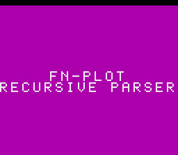
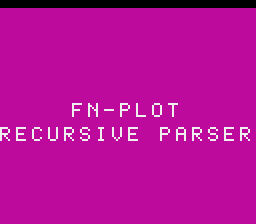
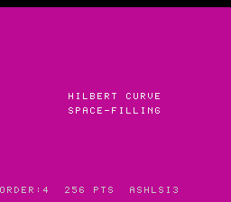

# SNES Title Screen Sequence

Reference doc for the `TitleLayer` intro card used by all snesgfx battery demos, plus the `splash` fallback for Mode 7 demos.

**Source:** [`examples/snes/snesgfx/title_layer.h`](../examples/snes/snesgfx/title_layer.h)
**Integration example:** [`examples/snes/fn-plot.c`](../examples/snes/fn-plot.c) (8×8), [`examples/snes/hilbert.c`](../examples/snes/hilbert.c) (16×16)

---

## Architecture

The title card is a `Drawable` called `TitleLayer` that lives on **BG2 (4bpp)**. Every snesgfx demo already occupies BG1 (newton/rdiff) or BG3 (canvas/text), leaving BG2 universally free. The layer is completely **gate-neutral**: once `title_end()` sets `active = 0`, `emit()` becomes a no-op and the demo's corpus hash and HDMA are unaffected.

### Font modes

Two font sizes are available, selected per title card:

```c
title_begin(d, &t, line0, line1);    // 8×8 — default, all existing demos
title_begin16(d, &t, line0, line1);  // 16×16 pixel-doubled — short strings (≤16 chars)
title_end(d, &t, frames);            // shared teardown for both
```

**8×8 mode:** 64 glyphs × 1 tile × 16 words = 1024 words. Max 32 chars/line. HDMA channel 3 used for sub-tile pixel centring (odd-length strings get a −4 px nudge).

**16×16 mode:** each 8×8 glyph is pixel-doubled at load time into 4 tiles arranged 2×2 (TL/TR/BL/BR = tiles `4g+0..4g+3`). 64 glyphs × 4 tiles × 16 words = 4096 words. Max 16 chars/line. Centering is exact at the 16 px tile boundary — no HDMA needed, channel 3 stays free for demos.

```
VRAM layout (BG2 only; demo layers left untouched)
─────────────────────────────────────────────────
0x0000  demo BG1 / BG3 char data
0x1000  TitleLayer BG2 char data
          8×8 mode:   1024 words (0x1000–0x13FF)
          16×16 mode: 4096 words (0x1000–0x1FFF)
0x4000  demo BG1 / BG3 tilemaps
0x5000  TitleLayer BG2 tilemap  (32×32 × 1 word = 1 K words)
```

**CGRAM palette 7** (entries 112–127) is reserved by the title. Colour 0 = transparent, colour 1 = the animated ink. `CGRAM[0]` is the hardware backdrop; the title cycles it as a rainbow.

**Font source:** 8×8 2bpp ASCII 0x20–0x5F from `font8.h`, promoted to 4bpp at load (planes 2–3 = 0, so ink = colour 1). In 16×16 mode the promotion and doubling happen together in `_title_reserve()`.

---

## Full Lifecycle

```
title_begin()                                    title_end()
    │                                                │
    ▼                                                ▼
[1] reserve     [2] fade in    [3] fly in    [4] dwell    [5] fade out   [6] demo fade in
 ─────────      ───────────    ──────────    ─────────    ────────────   ──────────────
 VRAM/CGRAM     brightness     lines move    shimmer +    brightness     brightness
 written in     0→15           from edges    rainbow      15→0           0→15
 force-blank    (~15 frames)   to centre     cycle        (~15 frames)   (~15 frames)
                               (~70 frames)  (110 frames)
```

---

## Phase 1 — Reserve (force-blank, t = 0)

`display_add()` calls `_title_reserve()` under force-blank:

- Writes `REG_BG2SC` and `REG_BG12NBA` for BG2 character + tilemap base.
- Loads CGRAM palette 7: colour 0 = black, colour 1 = white `(0x7FFF)`.
- Loads font into VRAM at `0x1000` (8×8: 1024 words; 16×16: 4096 words).
- Clears the 32×32 tilemap to spaces.
- Parks lines at the screen edges (see table below).
- Pre-builds row buffers `rbuf0`, `rbuf1`, `rblank` for fast DMA during fly-in.
- **8×8 only:** arms HDMA channel 3 on `BG2HOFS` for sub-tile pixel centring.

| Mode | line0 parks at | line1 parks at | Buffer width |
|---|---|---|---|
| 8×8 | row 0 (top edge, visible) | row 27 (bottom edge) | 32 words |
| 16×16 | rows 0–1 (top edge) | rows 28–29 (off-screen) | 64 words (top + bottom tile row) |

```
8×8 tilemap at reserve (32 columns, schematic)
──────────────────────────────────────────────
row  0  ████ FN-PLOT ████   ← line0 parked (visible at top)
     …  (empty rows)
row 27  ██ RECURSIVE PARSER ██  ← line1 parked (visible at bottom)

16×16 tilemap at reserve
──────────────────────────────────────────────
rows  0-1  ████ HILBERT CURVE ████   ← line0 parked (visible at top)
      …    (empty rows)
rows 28-29 ██ SPACE-FILLING ██        ← line1 parked (off-screen)
```

---

## Phase 2 — Fade In (≈ 15 frames)

With lines parked at the edges, master brightness ramps 0 → 15 via `display_fade(d, INIDISP_ON)`.

```
Brightness ramp (INIDISP $2100)
 0 ████░░░░░░░░░░░
 …  ░░░░████░░░░░
 F  ░░░░░░░░░░████  ← full brightness, text visible at top+bottom edges
```

```
Screen at full brightness, before fly-in
┌──────────────────────────────────┐
│ ·········  FN-PLOT  ············ │  ← row 0 (line0, top edge)
│ ································ │
│ ································ │
│ ································ │
│ ································ │  (black — demo layer not visible yet)
│ ································ │
│ ··· RECURSIVE PARSER ·········· │  ← row 27 (line1, bottom edge)
└──────────────────────────────────┘
  (background: rainbow cycling from CGRAM[0])
```

---

## Phase 3 — Fly In (≈ 70 frames, ~1.15 s)

`t->flyin = 1` enables vertical easing in `_title_emit()`. Lines move at **constant velocity** `TITLE_FLY_STEP = 3` Q4 units/frame (~0.1875 rows/frame). The integer tilemap row only changes every ~5 frames, so VRAM DMA fires sparsely.

- `line0` descends: row 0 → **row 12** (Q4 target `12 << 4 = 192`)
- `line1` ascends: row 27 → **row 14** (Q4 target `14 << 4 = 224`)

On each integer-row change, `emit()` queues two VRAM DMA jobs via `UploadQueue`: erase the old row (write `rblank`), draw the new row (write `rbuf0`/`rbuf1`). All writes flush in v-blank.

```
Fly-in progression (vertical, row numbers)
                     line0   line1
   t=  0 frames      r0      r27     (parked at edges, fade up)
   t= 20 frames      r4      r23
   t= 40 frames      r8      r19
   t= 60 frames      r11     r15
   t= 70 frames      r12     r14     (arrived at centre — fly-in complete)
```

```
Screen at fly-in complete
┌──────────────────────────────────┐
│ ································ │
│ ································ │
│ ································ │
│ ································ │
│ ████████████ FN-PLOT ███████████ │  ← row 12 (TITLE_ROW0)
│ ████████████████████████████████ │  ← row 13 (gap)
│ ████ RECURSIVE PARSER ██████████ │  ← row 14 (TITLE_ROW0+2)
│ ································ │
│ ································ │
└──────────────────────────────────┘
  (rainbow backdrop visible where text is transparent)
```

### Pixel-perfect centring

**8×8 mode — HDMA:** Tile placement floors to the 8 px grid. Odd-length strings land 4 px left of true centre. A static 2-band HDMA table on `BG2HOFS` (channel 3) corrects this:

```
HDMA stream (channel 3, BG2HOFS) — 8×8 mode only
  scanlines   0–111 : hofs for line0  (−4 if odd len, 0 if even)
  scanlines 112–223 : hofs for line1

hofs formula: 8·col + 4·len − 128
  "FN-PLOT"           len=7 (odd)  → hofs = −4   (shift right 4 px)
  "RECURSIVE PARSER"  len=16 (even)→ hofs =  0   (no shift needed)
```

The split scanline (112) sits in the blank gap between the lines; parking the split there hides the 1-scanline HDMA settle artefact.

**16×16 mode — exact, no HDMA:** col_start = (32 − 2·len) / 2, pixel_start = 8·col_start = 128 − 8·len, which equals (256 − 16·len) / 2 — the true pixel centre — for every integer len 0..16. HDMA channel 3 stays free for demos.

---

## Phase 4 — Dwell (≈ 110 frames, ~1.8 s)

`display_hold(d, 110)` waits 110 v-blanks. Every frame `_title_emit()` runs two animations:

### Ink shimmer

```c
uint8_t lvl = 24 + (_title_tri(phase << 1) >> 4);   /* 24..31 */
t->ink = SNES_RGB(lvl, lvl, lvl);
```

Triangle wave over `phase`, period 128 frames. Brightness oscillates 24–31, giving white text a subtle breathing pulse. Queued to CGRAM palette-7 colour 1 via `upq_push_cgram()`.

```
Ink brightness over time (24..31 range)
31 ▁▂▃▄▅▆▇█▇▆▅▄▃▂▁▂▃▄▅▆▇█▇▆▅▄▃▂▁ …
24 █▇▆▅▄▃▂▁▂▃▄▅▆▇█▇▆▅▄▃▂▁▂▃▄▅▆▇█ …
     0                64             128 frames
```

### Rainbow backdrop

```c
uint8_t h = phase << 1;
t->back = SNES_RGB(tri(h)       >> 2,   /* R */
                   tri(h + 85)  >> 2,   /* G, +120° */
                   tri(h + 170) >> 2);  /* B, +240° */
```

Three triangle waves 120° apart sweep through RGB hue space. Full cycle ≈ 128 frames (≈ 2.1 s). Queued to `CGRAM[0]` (hardware backdrop).

```
Hue cycle (approximate channel values over time)
R ▄▄▄▄▄▄▄▄▄▄▄▄▄▄▄▄▄▄▄▄▄▄▄▄▄▄▄▄▄▄▄▄▄▄▄▄▄▄▄▄▄▄▄▄
G          ▄▄▄▄▄▄▄▄▄▄▄▄▄▄▄▄▄▄▄▄▄▄▄▄▄▄▄▄▄▄▄▄▄▄▄
B                    ▄▄▄▄▄▄▄▄▄▄▄▄▄▄▄▄▄▄▄▄▄▄▄▄▄
  0         42        85       128       170  frames
  red → yellow → green → cyan → blue → magenta → red
```

```
Title card during dwell (representative frame)
┌──────────────────────────────────┐
│                                  │
│      ░░░ rainbow backdrop ░░░   │  ← CGRAM[0] cycling hue
│                                  │
│                                  │
│         F N - P L O T            │  ← white ink, shimmer 24..31
│                                  │
│      R E C U R S I V E           │
│      P A R S E R                 │  ← pixel-centred via HDMA
│                                  │
└──────────────────────────────────┘
```

---

## Phase 5 — Fade Out (≈ 15 frames)

`t->restore = 1` switches `emit()` to fade-out mode: ink held at `SNES_RGB(28,28,28)`, backdrop driven back to black (`0u`). Then `display_fade(d, 0)` ramps master brightness 15 → 0.

`display_hide_layer()` clears `TM_BG2` from `REG_TM`. HDMA channel 3 is cleared (`REG_HDMAEN = 0`) and `BG2HOFS` latch is reset (written twice).

---

## Phase 6 — Demo Fade In (≈ 15 frames)

`display_fade_to(d, INIDISP_ON)` ramps brightness 0 → 15. The demo's own layer (which was rendered black during the title) now becomes visible. This is the first time the user sees the demo content.

---

## Timing Summary

| Phase | Duration | Trigger |
|---|---|---|
| Reserve | 0 frames (force-blank) | `display_add()` |
| Fade in | ~15 frames | `display_fade()` |
| Fly in | ~70 frames | `t->flyin = 1` |
| Dwell | 110 frames (typical) | `display_hold()` |
| Fade out | ~15 frames | `display_fade(d, 0)` |
| Demo fade in | ~15 frames | `display_fade_to()` |
| **Total intro** | **~225 frames (~3.75 s)** | |

---

## Integration Pattern

```c
// 8×8 — fn-plot.c (long subtitle fits 32-char limit)
static TitleLayer title;
title_begin(&a.screen, &title, "FN-PLOT", "RECURSIVE PARSER");
corpus_result = fn_gate_crc();       // heavy compute runs DURING the title
title_end(&a.screen, &title, 90);

// 16×16 — hilbert.c (short strings, max 16 chars each)
static TitleLayer title;
title_begin16(&a.screen, &title, "HILBERT CURVE", "SPACE-FILLING");
corpus_result = hilbert_gate_crc();
title_end(&a.screen, &title, 110);
```

Key ordering rules (both modes):
1. Add demo drawables first (`display_add()` for each demo layer).
2. Call `title_begin[16]()` **last** — `reserve()` writes `REG_BG12NBA` and must not clobber BG1's char-base nibble.
3. Run gate compute between `title_begin[16]` and `title_end` — the PPU holds the lit card.

**Choosing the mode:** use 16×16 when both strings are ≤16 chars and you want a logo-weight title card. Use 8×8 for longer strings or subtitles where readability matters over visual impact.

---

## Screenshots

8×8 title card (fn-plot, mid-dwell, native 256×224):



16×16 title card (fn-plot with `title_begin16`, same timing):



16×16 on biohack.net (hilbert, bsnes-jg WASM player, native resolution):



---

## Mode 7 Alternative: `splash.h`

Mode 7 uses only one BG, so `TitleLayer` (which requires BG2) is unavailable. Mode 7 demos (`blossom`, `mandel-display`) use `splash_show()` instead:

```c
// blocking: sets up BGMODE_1 BG3 temporarily, shows two lines for `frames` v-blanks,
// then restores force-blank and ZEROES the VRAM footprint for Mode 7 setup.
splash_show("BLOSSOM", "BLOOM AUTOMATON", 120);
```

**Differences from `TitleLayer`:**

| | `TitleLayer` | `splash_show()` |
|---|---|---|
| Layer | BG2 (4bpp, palette 7) | BG3 (2bpp, palette 0) |
| Centring | HDMA pixel-exact | Tile-grid only |
| Animation | Rainbow + shimmer + fly-in | None (static) |
| Fade | Master brightness via Display | Static on/off |
| Gate-neutral | Yes (`active = 0` no-op) | Yes (self-contained, exits clean) |
| VRAM cleanup | Hidden via `TM_BG2 = 0` | Zeroes full footprint (Mode 7 safety) |
| Corpus gate | Compute overlaps title hold | Adds `frames` v-blanks before render |

**Source:** [`examples/snes/snesgfx/splash.h`](../examples/snes/snesgfx/splash.h)

---

## Key Constants Reference

| Symbol | Value | Meaning |
|---|---|---|
| `TITLE_ROW0` | 12 | Centre row for line0 (top of block in both modes) |
| `TITLE_ROW0 + 2` | 14 | Centre row for line1 (top of block) |
| `TITLE_FLY_STEP` | 3 | Fly-in speed, Q4 units/frame (both modes) |
| `TITLE_HDMA_CHAN` | 3 | HDMA channel for BG2HOFS pixel-centre (8×8 only) |
| `TITLE_MAX_CHARS` | 16 | Max chars per line in 16×16 mode |
| `TITLE_CHR_WORD` | `0x1000` | BG2 char data base (VRAM word address) |
| `TITLE_MAP_WORD` | `0x5000` | BG2 tilemap base |
| `TITLE_PAL` | 7 | CGRAM palette (entries 112–127) |
| `TITLE_INK_IDX` | 113 | CGRAM entry for text ink (palette 7, colour 1) |
