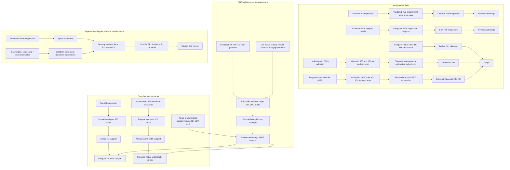

# Pending upstream work and dependencies

**PR status last verified 2026-09-21; patch 0028 revalidated September 21;
patch 0029 validated on MOS and a focused X86/ARM/AArch64 selection September 22.
Other implementation readiness follows the dated validation records and local
drafts.** This is the actionable view of the
[contribution tracker](upstream-contribution-status.md). Status describes the work,
not whether its GitHub container is called an issue or a pull request.

Use the [saved unpatched upstream reference](upstream-reference-build.md) for new
reproduction checks; keep candidate patches in separate builds.

## What remains to post

**Feature-independent submissions prepared September 22:**

1. [Mixed-width pointer/call register exhaustion](upstream-mixed-width-call-regalloc-issue.md):
   [fix PR prepared](upstream-twoaddr-physreg-reschedule-pr.md), with patch 0029
   and plain-6502 IR/MIR tests. The two-address pass must preserve an available
   register for constrained virtual operands when hoisting physical definitions.
   [Validation](pr-preparations/2026-09-22/0029-validation.md): MOS CodeGen/MC
   131 pass / one unsupported; a separate assertion-enabled build passes 169 X86,
   29 ARM, and 33 AArch64 tests, plus both bundled MOS tests. No failures or skips
   in that focused run. The [coverage inventory](pr-preparations/2026-09-22/0029-cross-target-validation.md#backend-coverage-at-the-pinned-revision)
   lists the 22 remaining untested backends.
2. [Newton `-O0` post-RA verifier failure](upstream-newton-6502-postra-issue.md):
   separate stock-6502 C failure; normal compilation succeeds, and no runtime
   miscompile is claimed.
3. [Reentrant-attribute contract](upstream-reentrant-soft-stack-issue.md):
   semantics question, now verified with the stock upstream frontend and `opt`.

These are unposted contributions and do not require #320/#321. The register
exhaustion fix is implemented and validated. Diagnosis and implementation remain
work for the Newton failure; the attribute report needs agreement on semantics
before selecting a change.

Patch 0029 submission status:

- [x] Reproduce the failure with stock `mos6502` C and validate the standalone fix.
- [x] Complete the simulated review, including both liveness-analysis paths.
- [x] Run focused X86/ARM/AArch64 regressions with assertions enabled.
- [ ] Review the final submission bundle and publish the standalone fix PR.

**Prepared but held: patch `0028`, the `VirtRegRewriter` undef-lane fix.**
The stock-upstream reproducer, fix, regression, and
[PR description](upstream-virtregrewriter-undef-lane-identity-copy-pr.md) are prepared.
Per the September 22 user decision, defer publication until we are ready to open
the #320/#321 series. Its stock-MOS regression has no native-width dependency;
the hold concerns presenting the downstream C triggers in context. The choice
between the smaller boolean-parameter fix and the current refactor remains open:
[comparison and recommendation](plans/2026-09-21-0028-local-identity-copy-state.md#publication-hold-and-implementation-choice--2026-09-22).
The refactor now keeps lane state inside `rewriteInstruction`, without a boolean
parameter to a separate cleanup helper. [Validation](pr-preparations/2026-09-21/0028-validation.md):
upstream CodeGen 85 pass / one unsupported, downstream verifier gate 34/34,
and 24 corpus inputs with identical MIR/assembly to the prior patch.
[PR simulation](pr-preparations/2026-09-21/0028-pr-preview.html).
Provenance: the trigger occurred in downstream native-width C torture tests; stock
upstream is covered by a constructed MIR reproducer. Stock-upstream C-to-MIR
reachability has not been established. [Evidence](pr-preparations/2026-09-21/0028-validation.md#reproducer-provenance).
The [September 22 plain-6502 search](investigations/2026-09-22-0028-plain-6502-reachability.md)
found no 0028 C trigger; it did expose a separate `-O0` Newton post-RA expansion
failure with the stock upstream frontend and backend.

| Unposted contribution | Readiness and remaining work |
|---|---|
| Undef-lane identity-copy fix (`0028`) | Validated; publication held until #320/#321 are ready to open; choose implementation and revalidate the exact submission |
| #320 far-pointer series | Refresh drafted [design note](320-upstream-far-pointer-note.md) and [calling-convention evidence](320-upstream-far-cc-measurement-note.md); agree ABI, extract coherent commits, and validate |
| #321 native-width series | Extract native-only commits, document ABI/interrupt contracts, validate, and prepare one complete draft PR; [frame-ABI evidence note](321-upstream-cc-frame-abi-note.md) is drafted |
| SNES SDK contribution around #415 | Baseline checkout and [file inventory](415-snes-reconciliation-inventory.md) prepared; resolve provenance/review requirements, implement and validate the reconciled native platform and runtime |
| 65816 simulator discussion | Separate [discussion draft](pr-preparations/2026-09-20/65816-simulator-discussion-body.md) prepared; unposted |
| Reentrant attribute semantics | Report drafted; agree the intended contract before selecting a fix or documentation change |
| Register exhaustion across calls | [Fix PR prepared](upstream-twoaddr-physreg-reschedule-pr.md), patch 0029; MOS suite and 231 focused X86/ARM/AArch64 tests pass; final submission review and publication remain |
| Newton `-O0` post-RA expansion | [Issue body prepared](upstream-newton-6502-postra-issue.md); stock Clang C reproduction; unaffected by 0028; no fix yet |
| Scavenger live-P (`0011`) | Establish a valid upstream producer, reduce the test, rebase, and validate |
| Call-clobbered coalescing guard (`0015`) | Revalidate diagnosis and upstream reachability; prefer a root-cause fix |
| Trunc-selection fallback (`0023`) | Establish a real upstream producer for the independent Imag8-to-i1 portion; retain fork-specific content with its feature series |

The ABI notes are discussion contributions, separate from publishing the compiler
series. The far calling-convention evidence follows the #320 design discussion.
Older notes need a current-content review before publication.

**Already posted:** six compiler PRs (#578, #584, #586, #588, #589, #604) and SDK
#450. No new merges or reviews since September 20; all seven have no merge conflicts.
#604 now has verified Ubuntu/macOS passes and a Windows failure; SDK #450 reports
no checks. #589 still carries `CHANGES_REQUESTED` despite the published revision.
See the [live-status snapshot](upstream-contribution-status.md#current-pr-progress)
for the complete CI table. Job failure causes were not re-audited September 21.

## Recommended order

1. Review the final patch 0029 submission and publish its prepared standalone PR.
   The fix and focused validation are complete; it has no #320/#321 dependency.
2. Prepare the #320/#321 presentation before publishing `0028`; retain both fix
   implementations for the submission decision.
3. Follow review/CI of the six posted compiler fixes and SDK #450; request re-review
   of the published #589 revision when following up with maintainers.
4. In parallel, make **SNES platform reconciliation with SDK #415** the platform
   priority. Prepare a coherent contribution including the runtime requirements of
   whichever CPU mode it enables.
5. Prepare the #320/#321 compiler feature series and investigate the remaining
   allocator/scavenger reports independently of the SDK platform's merge timing.

## SNES — separate platform track

**Upload/review next; do not wait for it to merge before posting independent fixes.**
There is already an upstream [SNES target PR #415](https://github.com/llvm-mos/llvm-mos-sdk/pull/415).
It is open, **not currently marked draft**, at `e6a5c17cab52`. Our reconciliation and
native-runtime additions are not posted. Work with that proposal instead of opening
a competing duplicate target.

| SNES deliverable | What exists | What remains | Dependency |
|---|---|---|---|
| Basic SDK SNES target | Existing #415; our downstream platform and emulator harness; isolated baseline and [file inventory](415-snes-reconciliation-inventory.md) prepared | Resolve reviewed startup, vector provenance, interrupt and config requirements; implement and validate the reconciled patch | Technically possible with existing codegen; maintainer requires proper 65816 support before merge (see below) |
| Native-mode startup and stack contract | Working downstream XCE/startup and runtime | Specify M/X, DBR/DP and hardware-stack assumptions; validate the reconciled platform | Must ship with the runtime support required by native mode |
| Native-mode setjmp/longjmp | Working page-1-specific downstream override | Integrate and test with the native platform; agree buffer/stack contract | Same platform change or a dependent PR; no reason to merge an incomplete native runtime first |
| Native 16-bit codegen integration | Downstream `+mos-a16`/`+mos-xy16` implementation | SDK opt-in configuration/examples after compiler support is accepted | Compiler #321 series; baseline SNES target need not wait |
| Far-pointer/banked-C integration | Downstream far runtime and layouts | Reconcile SDK support after address-space/calling-convention agreement | Compiler #320 series; baseline SNES target need not wait |

**Acceptance dependency:** [the #415 maintainer review](https://github.com/llvm-mos/llvm-mos-sdk/pull/415#issuecomment-3463891415)
requires proper 65816 support before merging the platform. Our earlier statement
that a baseline target need not wait described technical feasibility, not the stated
merge policy. Reconcile in parallel; agree the required compiler/ABI scope before
expecting a platform merge. Independent MC fixes remain independent.

The SDK platform and compiler backend are different repositories and review tracks.
Current #320 and #321 remain open design/feature issues, not posted PRs for our
implementation. #321 also has another contributor's accumulator-only experiment;
coordinate and cite that work when presenting our broader series.
A SNES platform can run existing 8-bit codegen. Conversely, the compiler changes
support 65816 users beyond SNES and can be submitted without an SDK SNES merge.
See [reconciliation strategy](415-snes-target-reconciliation.md) and the
[native setjmp assessment](upstream-sdk-setjmp-issue.md).

## Chart — other pending work

| Work | Fix / implementation exists? | Posting state | Next work | Must wait for SNES? |
|---|---|---|---|---|
| #578 MOSCopyOpt loop liveness | Yes; root-cause revision published | **Awaiting review/merge** | Maintainer review of revised fix | No |
| #584 non-GPR immediate loads | Yes; simplified revision published | **Awaiting review/merge** | Maintainer review | No |
| #586 BRK signature operand | Yes; requested tests published | **Awaiting review/merge** | Maintainer review | No |
| #588 COP mnemonic | Yes; reserved-range tests published | **Awaiting review/merge** | Maintainer review; completed Ubuntu CI run | No |
| #589 CmpZero terminator | Yes; requested revision published | **Awaiting re-review/merge** | Clear outstanding change request | No |
| MVN/MVP bank order (`0020`) | Complete fix validated, including symbolic relocations | **Posted: [compiler #604](https://github.com/llvm-mos/llvm-mos/pull/604)** | Maintainer review / CI follow-up | No |
| Common SDK `longjmp(env, 0)` | **Fix tested**, 20/20 simulator cases | **Posted: [SDK PR #450](https://github.com/llvm-mos/llvm-mos-sdk/pull/450)** | Maintainer review / CI follow-up | **No; plain 6502 bug** |
| Reentrant attribute contract | Source behavior confirmed; no agreed semantic fix | **Unposted question/report** | Decide whether attribute only cancels `-fnonreentrant` or must force reentrant allocation; then fix/docs + tests | No |
| Undef register-lane verifier failure | Constructed stock-MOS MIR reproducer; generic fix and regression validated | **Held until #320/#321 are ready to open** | Choose smaller fix or refactor; revalidate exact submission before publication | No technical SDK dependency; publication timing tied to feature presentation |
| Scavenger live-P (`0011`) | Downstream fix/draft exists | **Not ready to post** | Establish a valid upstream producer, reduce test, rebase and validate | No SDK dependency; otherwise include with native compiler feature |
| Call-clobbered coalescing guard (`0015`) | Downstream workaround/draft exists | **Not ready to post** | Revalidate diagnosis and stock-upstream reachability; prefer root-cause fix | No SDK dependency; currently triggered by fork features |
| Mixed-width pointer across call: RA exhausts registers | Patch 0029, MOS suite, and 231 focused X86/ARM/AArch64 regressions validated | **Fix PR prepared, unposted** | Review final submission bundle and publish | No |
| #320 far-address-space series (`0001` and related content) | Substantial downstream implementation exists | **Series not posted** | Agree ABI, extract coherent compiler commits and validate standalone | No; SDK integration follows agreed compiler/runtime ABI |
| #321 native-width series (`0002` and related content) | Substantial downstream implementation exists | **Series not posted** | Extract native-only commits from mixed aggregate, document ABI/interrupt contract, validate and post one complete draft PR | No; native runtime required to execute examples |
| `0023` trunc-selection fallback | Downstream patch exists; includes fork-specific content | **Unassessed standalone candidate** | Prove a real upstream producer for the Imag8→i1 half; keep Imag32/a16 half with its feature | No; not ready for a standalone PR |

**Already merged upstream:** #562, #563, #577, #579, #587, #590 and #591.
These need no new PR. Downstream housekeeping is separate: audit the vendor revision
and retire each carried patch only once that revision contains its fix.

**Removed from the active queue:** BRL gate extension (no demonstrated 65816 size
win; BRL costs more cycles than the absolute JMP it replaces), `0012` LDCImm
(noncanonical input without a real upstream producer), rotate-Ac RA companion
(misdiagnosis resolved by #578), and the retracted bitmask-loop report.

## Flowchart

Solid arrows show work/dependencies. The independent tracks can proceed in parallel.

## Independent simulator discussion

The MVN/MVP PR is focused on the bank encoding fix and existing regression results.
The emulator proposal has been removed from its description and mockup.

A [separate discussion draft](pr-preparations/2026-09-20/65816-simulator-discussion-body.md)
([preview](pr-preparations/2026-09-20/65816-simulator-discussion-preview.html)) covers
prior work, 65816 runner choice, CI setup and test conventions. It is prepared but
unposted; execution coverage remains proposed, not implemented. This is a separate
work item, with no dependency on or merge condition for the MVN/MVP fix.

## What “issue” means here

An issue is a discussion/tracking artifact, not a category of incomplete code.
A fix PR can contain the reproducer and close a bug without a separately filed
issue. The three reports have different actual readiness:

| Report | Is a fix missing? | Why called an issue? | Best next deliverable |
|---|---|---|---|
| Reentrant | An agreed contract and validated implementation are missing | Maintainers must decide what the attribute promises | Small semantics report with source/IR evidence; fix or documentation follows |
| Undef-lane verifier | **No** | Stock-upstream reproducer and tested `VirtRegRewriter` fix are ready | Post the prepared PR |
| Native SDK setjmp | **No**, for our page-1 SNES contract | Fix needs an accepted native platform/ABI home | Platform PR including the override, optionally preceded by a support-gap issue |

Treat all as work items; distinguish them by evidence, implementation readiness and
dependencies. “Issue filed” is not “bug fixed,” and “no issue filed” does not mean
no fix can be submitted.

## Research notes and evidence

**Reentrant:** current clang `Reentrant` is marked `Undocumented`; lowering merely
suppresses the global `nonreentrant` attribute. MOSNonReentrant can then infer
`nonreentrant` for a `norecurse` function. [Issue #248](https://github.com/llvm-mos/llvm-mos/issues/248)
records the original opt-out motivation. A fresh upstream `opt` confirmed both functions gain the same `nonreentrant`
attribute set. The draft now avoids claiming an ordinary
C miscompile or using `longjmp` as evidence of simultaneous activations.
[Focused report](upstream-reentrant-soft-stack-issue.md).

**Undef lane:** an eight-instruction MIR reproducer fails on current upstream HEAD
without 65816 features. The failure is an identity copy removed by
`VirtRegRewriter` even though it carries an undef-lane definition. Patch `0028`
retains it as a zero-code `KILL`; the lit regression and downstream witnesses pass.
[Focused report](upstream-rc-undef-ra-pure-virtual-issue.md) ·
[PR body](upstream-virtregrewriter-undef-lane-identity-copy-pr.md).

**Native setjmp:** current SDK revision `3f6968bbc156ff9a63102a8e158db868819bd61c`
still has the common 6502 implementation and no SNES directory. #415 remains open.
The existing downstream runtime evidence is preserved; no new native emulator run
is claimed here. [Focused report](upstream-sdk-setjmp-issue.md).

**New zero-value bug:** compiled current upstream `setjmp.S` explicitly into the
existing 6502 simulator harness, using the local MOS clang and installed SDK support
libraries (`-fno-lto`). All four optimization levels (`-O0/-O1/-O2/-Os`) return the
failure sentinel 42 for value 0; values 1, 7, 256 and -1 pass. The candidate assembly
normalization passes all 20 combinations. This is isolated current-source runtime
evidence, not a from-scratch build of the entire latest SDK. The
[POSIX.1-2024 longjmp specification](https://pubs.opengroup.org/onlinepubs/9799919799/functions/longjmp.html)
requires zero to become one. [Repro](investigations/repro/upstream-issues-2026-09-20/longjmp-zero.c),
[candidate patch](pr-preparations/2026-09-20/sdk-longjmp-zero.patch),
[matrix](pr-preparations/2026-09-20/sdk-longjmp-matrix.txt).

GitHub searches of both repositories found no matching open issue for these three
report topics or the zero-value bug. Search results are not proof that no related
report exists. No issues, comments, PRs or branches were published by this research.

**SDK test integration completed:** fresh current-SDK libraries and simulator now
run the 20 cases through `test-sim`/CTest: baseline 16 pass / four zero failures;
fixed 20 pass. The compiler remains the local installed MOS compiler.
[Commands and evidence](pr-preparations/2026-09-20/sdk-longjmp-validation.md).

**Publication update:** [SDK PR #450](https://github.com/llvm-mos/llvm-mos-sdk/pull/450) is open, head `0f8ad11589f5`;
the submitted description and commit match the reviewed bundle. Earlier no-publication
statements describe the research stage. MVN/MVP is now also published as [compiler #604](https://github.com/llvm-mos/llvm-mos/pull/604), head `ae3108c31890`.
