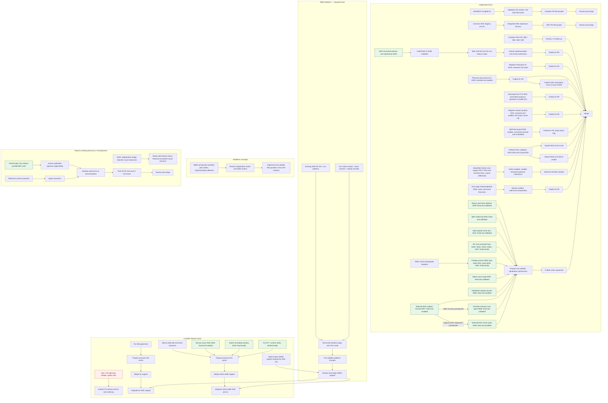

# Pending upstream work and dependencies

The inherited [XY16 gallery / near-Y failure](defects/mos-xy16-near-indirect-y-clobber.json)
is now recorded with a preserved failing committed-main baseline. The full
benchmark returns `0xA50F` instead of `0x5CF0`; the precise LTO cause remains
qualified. Existing X-index repairs do not repair the split near-Y sequence.
This remains open within the downstream native-width series; increment 2's
far-pointer fold does not fix or submit it.

The [runtime `[dp],Y` increment 2](plans/2026-09-25-dpy-indexed-phase2-increment2.md)
is implemented and verified locally on top of `8c19c703`. Its new checks and
runtime gates pass; the three full-lit failures reproduce on the exact baseline.
It is a component of the complete #321 native-width ABI feature and should be
prepared with that series, not sent as a standalone PR.

The [live upstream dashboard](https://wald3n.com/open-source#compiler-upstream)
combines current GitHub PR state with a separately dated local-work manifest.
This tracker retains the detailed compiler, ABI, and SNES dependency rationale.

**Local preparation updated 2026-09-26.** Independent reviews and validation
for 0032–0037 remain linked below. The `mos16(constant)` parser-width defect is
fixed in 0039. The [September 25 batch review](pr-preparations/2026-09-25/claude-batch-review.md)
revises 0043, 0046, and 0047 and updates their PR drafts; integrated tests and
pinned-base applicability are checked, with isolated revision validation and
submission branches still to prepare. Patch 0044 still needs its PR draft/bundle.
The [contribution tracker](upstream-contribution-status.md#current-pr-progress)
retains its dated GitHub snapshot; this local review does not reverify remote
PR or CI state. Status describes the work, not whether its GitHub container is
called an issue or a pull request.

Use the [saved unpatched upstream reference](upstream-reference-build.md) for new
reproduction checks; keep candidate patches in separate builds.

The [original far-memset wrong-bank report](defects/mos-far-memset-wrong-bank.json)
is revalidated as fixed by existing `a81874d` / 0013, with matching-input backend
comparison and physical WRAM checks. Its stale discovery status is corrected;
this creates no new independent fix submission. Compiler/ABI and far-runtime
integration remain with the #320/#321 feature work.

The [historical baseline recovery](investigations/2026-09-25-historical-baseline-recovery.md)
captured a narrow-count s64 shift legalization failure in the fork's a16/xy16
modes, now repaired by 0055. Both recovered C inputs pass supported configurations on the
saved unpatched upstream revision `742d554bf080`; upstream does not support
those native-width features. Existing patch 0028 causally repairs the recovered
inline-bitboard verifier failure. Recovery and validation: OpenAI Codex CLI
0.157.0 (`codex-tui`), model `gpt-6-astra`, `xhigh` reasoning effort.

The [follow-up fixes](investigations/2026-09-25-shift-inlineasm-fixes.md) also
repair generic GlobalISel physical-register inline-asm exhaustion (0056), using
an independent AArch64 IR trigger. Both fixes are implemented and validated
locally; submission preparation remains. The generic bounds helper matches
unpatched upstream source, but the captured AArch64 baseline includes prior
patches through 0041; it is not a clean upstream binary.

The [SelectionDAG follow-up](investigations/2026-09-25-selectiondag-inlineasm.md)
repairs the corresponding physical-register bounds and `callbr` error-recovery
paths in 0057. It is validated and installed. Its complete affected source file
matches the saved published upstream revision; its baseline binary has the same
prior-patch qualification. The separate nonstandard-integer abort is now
repaired by [0058](investigations/2026-09-25-aarch64-inlineasm-unknown-type.md)'s
AArch64 unknown-type guards; its full regression uses 0057's `callbr` recovery.
The [vector conversion assertions](investigations/2026-09-25-selectiondag-vector-parts.md)
are repaired by 0059's generic split/join diagnostics; supported conversions are
preserved. The original input requires 0057's virtual-allocation repair. MOS
Clang/LLD are rebuilt and installed. Independent review and submission preparation
remain, with the failing baseline retained unchanged.

The [exhaustive 65816 opcode roundtrip plan](plans/2026-09-25-65816-all-opcode-roundtrip.md)
is written. Implementation is deferred at the user's request. It requires all
256 opcodes in four M/X contexts, independently checked bytes and instruction
boundaries, and an explicit assessment of the existing BRK signature contract.
This is a coverage task; no new compiler failure has been captured by it.

The [0015 revalidation](investigations/2026-09-25-coalescing-0015-revalidation.md) identifies the
recovered C failure as an identity-copy lane-definition defect already repaired
by 0028. Its separate allocator diagnosis is superseded for this witness. A new
[parallel MIR reducer crash](defects/llvm-reduce-parallel-mir-crash.json) was
captured during reduction. [Patch 0060](investigations/2026-09-25-llvm-reduce-parallel-mir-fix.md)
fixes it locally with matching-input red/green evidence; published-upstream
applicability remains to be assessed.

## What remains to post

**Feature-independent submissions prepared September 22–23:**

1. [Mixed-width pointer/call register exhaustion](upstream-mixed-width-call-regalloc-issue.md):
   [fix PR prepared](upstream-twoaddr-physreg-reschedule-pr.md), with patch 0029
   and plain-6502 IR/MIR tests. The two-address pass must preserve an available
   register for constrained virtual operands when hoisting physical definitions.
   [Validation](pr-preparations/2026-09-22/0029-validation.md): MOS CodeGen/MC
   131 pass / one unsupported; a separate assertion-enabled build passes 169 X86,
   29 ARM, and 33 AArch64 tests, plus both bundled MOS tests. No failures or skips
   in that focused run. The [coverage inventory](pr-preparations/2026-09-22/0029-cross-target-validation.md#backend-coverage-at-the-pinned-revision)
   lists the 22 remaining untested backends.
2. [Newton `-O0` post-RA verifier failure](upstream-newton-6502-postra-issue.md):
   [fix PR prepared](upstream-copy-phys-reg-liveness-pr.md), with patch 0030.
   Copy expansion reuses Y without clearing an earlier kill. The fix passes
   six focused MIR cases and 84 MOS CodeGen tests, with one unsupported;
   all 46 MOS MC tests pass in the standalone audit.
   The original input verifies at all six optimization levels, with identical
   assembly before and after the fix. The local compiler is rebuilt and installed,
   with 24 integration compilations passing.
   [Validation](pr-preparations/2026-09-22/0030-validation.md) ·
   [PR preview](pr-preparations/2026-09-22/0030-pr-preview.html).
3. [Register-named assembly symbols](upstream-register-named-symbols-pr.md):
   patch 0032 preserves quotes around symbols such as `s`, `x`, `y`, and `a`.
   It fixes both rejected assembly and a silent memory-to-accumulator opcode
   change. [Validation](pr-preparations/2026-09-23/0032-validation.md): standalone
   MOS suites pass; all 61 recorded corpus failures now assemble with unchanged
   direct objects. The compatible local patch is installed. The
   [independent review audit](pr-preparations/2026-09-23/0032-review-audit.md)
   confirms the implementation and measures 821 assembler failures repaired
   across the full set of 4,091 emitted files (79 backend failures excluded).
   Applies to current upstream; branch preparation and publication remain.
4. [Scavenger live-`$p`](upstream-scavenger-live-p-pr.md): patch 0011, held since
   June for lack of a stock producer; gcc torture `strlen-4.c` at `-O0` on
   `mos6502` is one. Upstream-runnable test added, a liveness-tracking guard
   fixed the regression the existing `scavenger.mir` exposed on assertion builds.
   [Record](pr-preparations/2026-09-22/0011-stock-6502-reachability.md).
5. [Copy-destination reuse](upstream-copy-phys-reg-reuse-dst-pr.md): patch 0031,
   on top of 0030 (second PR on its branch, or second commit). The second reuse
   path in `getRegWithVal` was dead code; `.text` −2,530 bytes over 374 changed
   corpus pairs. [Validation](pr-preparations/2026-09-22/0031-validation.md) ·
   [audit](pr-preparations/2026-09-22/0031-review-audit.md).
6. [Spill hoisting versus scratch vregs](upstream-spill-hoist-scratch-vregs-pr.md):
   patch 0033, generic `hoistAllSpills` guard plus removal of the driver's
   blanket `-disable-spill-hoist`. The [independent audit](pr-preparations/2026-09-23/0033-review-audit.md)
   confirmed the crash fix and found the rollback statistic decremented per
   instruction; corrected and revalidated 2026-09-23. Its provenance finding was
   a container mount alias ([response](pr-preparations/2026-09-23/0033-validation.md)).
   Ready to post.
7. [`__builtin_prefetch`](upstream-prefetch-legalize-pr.md): patch 0034 drops
   `G_PREFETCH` (the backend aborted on any prefetch); companion
   [Clang fix 0035](upstream-clang-prefetch-int16-pr.md) emits the intrinsic's
   rw/locality operands as `i32` regardless of the promoted C expression type.
   Together they fix six MOS torture files at three optimization levels.
   [0034's audit](pr-preparations/2026-09-23/0034-review-audit.md) finds no code
   defect; its standalone suites and all-CPU legalization checks pass.
   [0035's audit](pr-preparations/2026-09-23/0035-review-audit.md) confirms the
   casts also fix wider arguments on x86-64; the committed test now covers
   `long`, `long long` and the two-argument form. Ready to post.
8. [Zero-page indexed globals](upstream-zero-page-indexed-globals-pr.md): patch
   0036 makes opcode selection recognize zero-page sections and checks the address
   operand for indexed stores. Standalone suites: 132 pass / one unsupported;
   27 C round-trip mismatches repaired, 18 ordinary-section controls unchanged.
   Installed locally; [review audit complete](pr-preparations/2026-09-23/0036-review-audit.md).
   Submission preparation remains.
   [Validation](pr-preparations/2026-09-23/0036-validation.md).
9. [Reentrant-attribute contract](upstream-reentrant-soft-stack-issue.md):
   semantics question, now verified with the stock upstream frontend and `opt`.
10. [GlobalISel indirect inline-asm outputs](upstream-gisel-inline-asm-indirect-output-pr.md):
    patch 0037, generic `InlineAsmLowering` stores `"=*r"` register defs (Clang's
    `+g`) through their pointer; 10 c-torture compilations repaired, corpus
    otherwise identical; AArch64 GlobalISel test included. For llvm/llvm-project.
    [Validation](pr-preparations/2026-09-23/0037-validation.md) ·
    [audit](pr-preparations/2026-09-23/0037-review-audit.md): no implementation defect;
    915 standalone suite passes, one unsupported. Submission variant prepared.

## Backend failure triage (gcc c-torture, 2026-09-23)

Of 4,170 backend compilations of the 1,390 files the pinned Clang accepts
(`-O0`, `-O2`, `-Os`, IR through `llc`), 79 failed on every build. Patch 0033
repairs 18 (12 files). What remains, by class, with the assessment behind the
rank in `TODO.md`:

| Order | Tier | Compilations | Class | Assessment |
|---:|---|---:|---|---|
| 1 | done | 18 | `G_PREFETCH` never legalized, plus Clang emitting `i16` prefetch operands on 16-bit-`int` targets | **fixed 2026-09-23**: [0034](upstream-prefetch-legalize-pr.md) (MOS) and [0035](upstream-clang-prefetch-int16-pr.md) (Clang, for llvm/llvm-project); [validation](pr-preparations/2026-09-23/0034-0035-validation.md) |
| 2 | done | 10 | `asm("" : "+g"(x))`: "unable to translate instruction: call" | **fixed 2026-09-23**: generic `InlineAsmLowering` never stored indirect register outputs (`"=*imr,0"`) through their pointer; [0037](upstream-gisel-inline-asm-indirect-output-pr.md) (for llvm/llvm-project); [validation](pr-preparations/2026-09-23/0037-validation.md) |
| 3 | done | 12 + 3 | `llvm.returnaddress` / `llvm.frameaddress` unlegalized | **fixed 2026-09-23**: frame address = incoming soft stack pointer (fixed frame object), return address read from the hard stack by a late-expanded pseudo with a CFG dataflow for the depth; [0038](upstream-return-frame-address-pr.md); [validation](pr-preparations/2026-09-23/0038-validation.md) |
| 4 | done | 6 | GlobalISel `InlineAsmLowering` assertion: multi-register tied operand (`"=r"(i) : "0"(x)` in `20030222-1.c`, `pr52286.c`) | **fixed 2026-09-24**: generic `InlineAsmLowering` assumed every register operand fits in one register — MOS needs four for a `long`, and the tied form asserted while the plain input and the output were rejected outright. All three now split/merge least significant piece first, as SelectionDAG's `RegsForValue` does; [0041](upstream-gisel-inline-asm-multi-register-pr.md) (for llvm/llvm-project); [validation](pr-preparations/2026-09-24/0041-validation.md) |
| 5 | done | 6 + 2 | `<4 x float>` / `<2 x double>` FADD/FDIV unlegalized | **fixed 2026-09-25**: `0049` backports generic vector prerequisites at this pin; `0050` scalarizes floating arithmetic. All 36 targeted C-derived IR configurations pass, including the separately repaired O0 a16/xy16 scavenger abort (`0054`). [Evidence](plans/2026-09-25-mos-correctness-queue.md), [float defect](defects/mos-float-vector-legalization.json), [scavenger defect](defects/mos-vector-o0-status-scavenge.json). |
| — | — | 4 | "Stack pointer decrement too large" (frames over 32 KiB) | a hard limit reported cleanly; not a defect |

Orders 1 through 5 are implemented. The September 25 targeted recheck also
repairs the byte-index truncation (`0051`), out-of-bank section-offset relaxation
(`0052`), and status-save range extension (`0054`); the MOS lit suite now has
171 passes, two unsupported tests, and zero failures. This is a targeted result,
not a rerun of the entire 4,170-compilation survey. The numeric `mos16(constant)`
width defect found during the 0036 review is already repaired by `0039`.
The original [diagnosis](pr-preparations/2026-09-23/0036-validation.md#separate-constant-modifier-defect)
and [new matching-input evidence](plans/2026-09-25-mos-correctness-queue.md)
remain available. Submission preparation and historical qualified reports remain
in the pending queue; local correctness fixes do not establish upstream PR readiness.

These are unposted contributions and do not require #320/#321. The register
exhaustion and physical-copy liveness fixes are implemented and validated. The
attribute report needs agreement on semantics before selecting a change.

Patch 0029 submission status:

- [x] Reproduce the failure with stock `mos6502` C and validate the standalone fix.
- [x] Complete the simulated review, including both liveness-analysis paths.
- [x] Run focused X86/ARM/AArch64 regressions with assertions enabled.
- [x] Review the final submission bundle; [no actionable defect found](pr-preparations/2026-09-22/0029-simulated-review.md#final-submission-review--september-22).
- [x] Independent review: guard refined for reserved class members, comment reworded,
  complete X86/ARM/AArch64/MOS suites pass on the revised patch; [record](pr-preparations/2026-09-22/0029-claude-review.md).
- [x] Current upstream applicability: llvm-mos `main` is identical to the pinned base (`gh api …/compare`).
- [ ] Check current upstream applicability and prepare the standalone branch.
- [ ] Publish the standalone fix PR.

Patch 0030 submission status:

- [x] Reproduce the C failure and isolate copy expansion's stale kill flag.
- [x] Implement the fix and test register reuse, aliases, and clobber handling.
- [x] Pass the MOS CodeGen suite and compare original-input assembly at six levels.
- [x] Rebuild and install the local compiler; pass 24 integration compilations
  and all five MIR cases.
- [x] Independent review: sixth MIR case, c-torture differential (20 repaired, 4,070 identical), upstream `main` identical to the pinned base; [record](pr-preparations/2026-09-22/0030-claude-review.md).
- [x] Audit the independent review: correct corpus accounting and confirm six
  cases plus both MOS suites with the saved 0030-only binary;
  [record](pr-preparations/2026-09-22/0030-review-audit.md).
- [x] Prepare the [browser preview](pr-preparations/2026-09-22/0030-pr-preview.html)
  with the exact patch and AI attribution, including tool version, model, and effort.
- [x] Review the 0030 code and corrected validation claims.
- [x] Claude's updated attribution records CLI `2.1.278`, model
  `claude-fable-5-1`, and `high` reasoning effort.
- [x] Current upstream applicability: llvm-mos `main` identical to the pinned base (2026-09-22); both 0030 and 0031 also apply on the newer local clone.
- [ ] Prepare the standalone branch and publish the fix PR.

Patch 0036 submission status:

- [x] Establish the whole-object zero-page contract and select the compact form.
- [x] Fix section classification and the indexed-store address operand.
- [x] Verify all three regressions fail the object comparison on pristine upstream
  and pass with 0036 alone; MOS suites: 132 pass, one unsupported.
- [x] Compare 45 upstream C cases: 27 mismatches repaired, 18 ordinary-section
  controls unchanged; rebuild/install locally and pass 36 width-mode cases.
- [x] Prepare the [patch](../patches/llvm-mos/0036-mos-zero-page-indexed-globals.patch),
  [PR draft](upstream-zero-page-indexed-globals-pr.md), and
  [validation record](pr-preparations/2026-09-23/0036-validation.md), with AI
  tool version, model, and reasoning effort in the attribution.
- [x] Complete independent review and [audit](pr-preparations/2026-09-23/0036-review-audit.md).
- [ ] Check current upstream applicability and prepare the standalone branch.
- [ ] Publish the fix PR when requested.

**Prepared but held: patch `0028`, the `VirtRegRewriter` undef-lane fix.**
The stock-upstream reproducer, fix, regression, and
[PR description](upstream-virtregrewriter-undef-lane-identity-copy-pr.md) are prepared.
Per the September 22 user decision, defer publication until we are ready to open
the #320/#321 series. Its stock-MOS regression has no native-width dependency;
the hold concerns presenting the downstream C triggers in context. The choice
between the smaller boolean-parameter fix and the current refactor remains open:
[comparison and recommendation](plans/2026-09-21-0028-local-identity-copy-state.md#publication-hold-and-implementation-choice--2026-09-22).
The refactor now keeps lane state inside `rewriteInstruction`, without a boolean
parameter to a separate cleanup helper. [Validation](pr-preparations/2026-09-21/0028-validation.md):
upstream CodeGen 85 pass / one unsupported, downstream verifier gate 34/34,
and 24 corpus inputs with identical MIR/assembly to the prior patch.
[PR simulation](pr-preparations/2026-09-21/0028-pr-preview.html).
Provenance: the trigger occurred in downstream native-width C torture tests; stock
upstream is covered by a constructed MIR reproducer. Stock-upstream C-to-MIR
reachability has not been established. [Evidence](pr-preparations/2026-09-21/0028-validation.md#reproducer-provenance).
The [September 22 plain-6502 search](investigations/2026-09-22-0028-plain-6502-reachability.md)
found no 0028 C trigger; it did expose a separate `-O0` Newton post-RA expansion
failure with the stock upstream frontend and backend.

| Unposted contribution | Readiness and remaining work |
|---|---|
| Undef-lane identity-copy fix (`0028`) | Validated; publication held until #320/#321 are ready to open; choose implementation and revalidate the exact submission |
| #320 far-pointer series | Refresh drafted [design note](320-upstream-far-pointer-note.md) and [calling-convention evidence](320-upstream-far-cc-measurement-note.md); agree ABI, extract coherent commits, and validate |
| #321 native-width series | Extract native-only commits, document ABI/interrupt contracts, validate, and prepare one complete draft PR; [frame-ABI evidence note](321-upstream-cc-frame-abi-note.md) is drafted |
| SNES SDK contribution around #415 | Baseline checkout and [file inventory](415-snes-reconciliation-inventory.md) prepared; resolve provenance/review requirements, implement and validate the reconciled native platform and runtime |
| 65816 simulator discussion | Separate [discussion draft](pr-preparations/2026-09-20/65816-simulator-discussion-body.md) prepared; unposted |
| Reentrant attribute semantics | Report drafted; agree the intended contract before selecting a fix or documentation change |
| Register exhaustion across calls | [Fix PR prepared](upstream-twoaddr-physreg-reschedule-pr.md), patch 0029; MOS suite and complete X86/ARM/AArch64 CodeGen suites pass; final and independent reviews complete; current-upstream applicability, branch preparation, and publication remain |
| Newton `-O0` post-RA expansion | [Fix PR prepared](upstream-copy-phys-reg-liveness-pr.md), patch 0030; six focused cases and MOS CodeGen/MC pass; review audited and attribution complete; check upstream applicability, prepare branch, and publish |
| Physical-copy destination reuse | [Fix PR reviewed](pr-preparations/2026-09-22/0031-review-audit.md), patch 0031 on top of 0030; five regression cases, six extra probes, and MOS suites pass; prepare its submission after 0030 |
| Spill-hoisting scratch vregs (`0033`) | [Audited](pr-preparations/2026-09-23/0033-review-audit.md); rollback statistic corrected and revalidated; [response](pr-preparations/2026-09-23/0033-validation.md); ready to post |
| Register-named assembly symbols (`0032`) | [Review audited](pr-preparations/2026-09-23/0032-review-audit.md); no code defect found; standalone suites pass; full-corpus assembler failures fall from 821 to zero across 4,091 emitted files; compatible local patch installed; check current upstream, prepare branch, and publish |
| MOS prefetch legalization (`0034`) | [Audit complete](pr-preparations/2026-09-23/0034-review-audit.md), no code defect found; 130 standalone suite passes and 28 all-CPU legalization checks; prepare submission to llvm-mos |
| Clang prefetch operand types (`0035`) | [Casts confirmed](pr-preparations/2026-09-23/0035-review-audit.md), including wider options on x86-64; committed test now covers `long`/`long long`/two-argument forms; submit to llvm/llvm-project |
| GlobalISel indirect inline-asm outputs (`0037`) | [Fix prepared](upstream-gisel-inline-asm-indirect-output-pr.md): `"=*r"` defs stored through their pointer; 10 c-torture compilations repaired, MOS and AArch64 tests; [validation](pr-preparations/2026-09-23/0037-validation.md); [review complete](pr-preparations/2026-09-23/0037-review-audit.md); check and validate the extracted llvm/llvm-project submission against current upstream |
| Zero-page indexed globals (`0036`) | [Fix prepared](upstream-zero-page-indexed-globals-pr.md), standalone suites and C round trips pass, installed locally; [review audited](pr-preparations/2026-09-23/0036-review-audit.md); submission preparation remains |
| Explicit constant address width | Fixed locally by `0039`; the [original diagnosis](pr-preparations/2026-09-23/0036-validation.md#separate-constant-modifier-defect) is retained, with [matching-input validation](plans/2026-09-25-mos-correctness-queue.md) |
| Scavenger live-P (`0011`) | Producer established (gcc torture `strlen-4.c`, stock `mos6502` `-O0`); test replaced by an upstream-runnable one; validated; post |
| Call-clobbered coalescing guard (`0015`) | [Revalidated](investigations/2026-09-25-coalescing-0015-revalidation.md): recovered witness repaired by existing 0028; stock MIR reproduces, stock C reachability unproven; retain guard/evidence, route root fix through 0028 |
| Trunc-selection fallback (`0023`) | [Independent Imag8 rejection cause disproved](investigations/2026-09-26-trunc-imag8-i1-contract.md): the matcher checks the shared bank and inserts an Ac copy; retain 0023 with its feature series, with the original far-pointer observation still qualified |
| Native-width s64 extension (`0055`) | Fixed and installed; retained original-input failure/success evidence and SNES runtime validation; carry with the native-width series |
| GlobalISel inline-asm register bounds (`0056`) | Fixed and installed; independent AArch64 diagnostic regression and assertion-enabled cross-target suites pass; prepare the generic submission separately |
| SelectionDAG inline-asm register bounds (`0057`) | Fixed and installed; 14 matching-input diagnostic checks and cross-target inline-asm/callbr suites pass; generic submission preparation remains |
| AArch64 unknown inline-asm types (`0058`) | [Nonstandard integer abort](defects/selectiondag-inline-asm-nonstandard-integer.json) fixed; 32 clean diagnostic cases and 277 suite passes; retained AArch64 candidate; full regression requires 0057's `callbr` recovery; prepare llvm/llvm-project submission |
| SelectionDAG vector inline-asm parts (`0059`) | [Vector conversion assertions](defects/selectiondag-inline-asm-vector-parts.json) fixed; 30 crashing configurations now diagnose, 278 cross-target and 173 MOS passes; original regression requires 0057; installed locally, submission preparation remains |

The ABI notes are discussion contributions, separate from publishing the compiler
series. The far calling-convention evidence follows the #320 design discussion.
Older notes need a current-content review before publication.

**Already posted, from the September 25 recorded snapshot:** six compiler PRs
(#578, #584, #586, #588, #589, #604) and SDK #450. The contribution tracker records
no new merges or reviews; #589 still carries `CHANGES_REQUESTED` despite the
published revision. #604 has Ubuntu/macOS passes and a Windows failure, whose
unrelated baseline test mismatch was checked September 25. SDK #450 reports no
checks. See the [dated status snapshot](upstream-contribution-status.md#current-pr-progress)
for the full table and the scope of each CI diagnosis.

## Recommended order

1. Prepare the standalone branch for patch 0029 and publish its PR. The fix,
   full-suite validation, final review and independent review are complete, and
   upstream `main` is identical to the pinned base; it has no #320/#321 dependency.
2. Check upstream applicability, prepare the branch, and publish
   [patch 0030](pr-preparations/2026-09-22/0030-pr-preview.html), whose code and
   evidence have been reviewed. Patch 0031's
   [separate review](pr-preparations/2026-09-22/0031-review-audit.md) is complete;
   prepare its submission after 0030.
3. Prepare the #320/#321 presentation before publishing `0028`; retain both fix
   implementations for the submission decision.
4. Follow review/CI of the six posted compiler fixes and SDK #450; request re-review
   of the published #589 revision when following up with maintainers.
5. In parallel, make **SNES platform reconciliation with SDK #415** the platform
   priority. Prepare a coherent contribution including the runtime requirements of
   whichever CPU mode it enables.
6. Prepare the #320/#321 compiler feature series and investigate the remaining
   allocator/scavenger reports independently of the SDK platform's merge timing.

## SNES — separate platform track

**Submission scope clarified by Will, September 23:** published SNES ROM demos
are welcome as supporting evidence in independent compiler-fix PRs; link the
actual demo pages. This is distinct from submitting SNES code or configs.
Those submissions must follow the compiler/ABI and platform dependencies below.
For example, 0036 cites [By-Value Boundary Trio](https://biohack.net/snes/byvaledge/)
and [Newton's Fractal](https://biohack.net/snes/newton/) as integration coverage;
the standalone regression tests establish the fix itself.

**Upload/review next; do not wait for it to merge before posting independent fixes.**
There is already an upstream [SNES target PR #415](https://github.com/llvm-mos/llvm-mos-sdk/pull/415).
It is open, **not currently marked draft**, at `e6a5c17cab52`. Our reconciliation and
native-runtime additions are not posted. Work with that proposal instead of opening
a competing duplicate target.

| SNES deliverable | What exists | What remains | Dependency |
|---|---|---|---|
| Basic SDK SNES target | Existing #415; our downstream platform and emulator harness; isolated baseline and [file inventory](415-snes-reconciliation-inventory.md) prepared | Resolve reviewed startup, vector provenance, interrupt and config requirements; implement and validate the reconciled patch | Technically possible with existing codegen; maintainer requires proper 65816 support before merge (see below) |
| Native-mode startup and stack contract | Working downstream XCE/startup and runtime | Specify M/X, DBR/DP and hardware-stack assumptions; validate the reconciled platform | Must ship with the runtime support required by native mode |
| Native-mode setjmp/longjmp | Working page-1-specific downstream override | Integrate and test with the native platform; agree buffer/stack contract | Same platform change or a dependent PR; no reason to merge an incomplete native runtime first |
| Native 16-bit codegen integration | Downstream `+mos-a16`/`+mos-xy16` implementation | SDK opt-in configuration/examples after compiler support is accepted | Compiler #321 series; baseline SNES target need not wait |
| Far-pointer/banked-C integration | Downstream far runtime and layouts | Reconcile SDK support after address-space/calling-convention agreement | Compiler #320 series; baseline SNES target need not wait |

**Acceptance dependency:** [the #415 maintainer review](https://github.com/llvm-mos/llvm-mos-sdk/pull/415#issuecomment-3463891415)
requires proper 65816 support before merging the platform. Our earlier statement
that a baseline target need not wait described technical feasibility, not the stated
merge policy. Reconcile in parallel; agree the required compiler/ABI scope before
expecting a platform merge. Independent MC fixes remain independent.

The SDK platform and compiler backend are different repositories and review tracks.
Current #320 and #321 remain open design/feature issues, not posted PRs for our
implementation. #321 also has another contributor's accumulator-only experiment;
coordinate and cite that work when presenting our broader series.
A SNES platform can run existing 8-bit codegen. Conversely, the compiler changes
support 65816 users beyond SNES and can be submitted without an SDK SNES merge.
See [reconciliation strategy](415-snes-target-reconciliation.md) and the
[native setjmp assessment](upstream-sdk-setjmp-issue.md).

## Chart — other pending work

| Work | Fix / implementation exists? | Posting state | Next work | Must wait for SNES? |
|---|---|---|---|---|
| #578 MOSCopyOpt loop liveness | Yes; root-cause revision published | **Awaiting review/merge** | Maintainer review of revised fix | No |
| #584 non-GPR immediate loads | Yes; simplified revision published | **Awaiting review/merge** | Maintainer review | No |
| #586 BRK signature operand | Yes; requested tests published | **Awaiting review/merge** | Maintainer review | No |
| #588 COP mnemonic | Yes; reserved-range tests published | **Awaiting review/merge** | Maintainer review; completed Ubuntu CI run | No |
| #589 CmpZero terminator | Yes; requested revision published | **Awaiting re-review/merge** | Clear outstanding change request | No |
| MVN/MVP bank order (`0020`) | Complete fix validated, including symbolic relocations | **Posted: [compiler #604](https://github.com/llvm-mos/llvm-mos/pull/604)** | Maintainer review / CI follow-up | No |
| Common SDK `longjmp(env, 0)` | **Fix tested**, 20/20 simulator cases | **Posted: [SDK PR #450](https://github.com/llvm-mos/llvm-mos-sdk/pull/450)** | Maintainer review / CI follow-up | **No; plain 6502 bug** |
| Reentrant attribute contract | Source behavior confirmed; no agreed semantic fix | **Unposted question/report** | Decide whether attribute only cancels `-fnonreentrant` or must force reentrant allocation; then fix/docs + tests | No |
| Undef register-lane verifier failure | Constructed stock-MOS MIR reproducer; generic fix and regression validated | **Held until #320/#321 are ready to open** | Choose smaller fix or refactor; revalidate exact submission before publication | No technical SDK dependency; publication timing tied to feature presentation |
| Scavenger live-P (`0011`) | Fix, draft, stock-6502 producer and upstream-runnable test | **Ready to post** | [Reachability record](pr-preparations/2026-09-22/0011-stock-6502-reachability.md) | No SDK dependency; otherwise include with native compiler feature |
| Call-clobbered coalescing guard (`0015`) | Recovered witness has matching-input 0028 red/green evidence; 0015 avoids its trigger | **Root fix already installed; standalone 0015 diagnosis superseded for this witness** | Route through 0028; stock MIR reproduces, ordinary stock C reachability remains unproven; [evidence](investigations/2026-09-25-coalescing-0015-revalidation.md) | Follow 0028's existing publication prerequisites |
| Mixed-width pointer across call: RA exhausts registers | Patch 0029 validated, final and independent reviews complete; MOS suite and complete X86/ARM/AArch64 CodeGen suites pass | **Fix PR prepared, unposted** | Check current upstream applicability, prepare branch, and publish | No |
| Post-RA physical-copy reuse: stale Y kill | Patch 0030 validated and review audited; six focused cases and MOS CodeGen/MC pass; original assembly unchanged at six levels | **Fix PR prepared, unposted** | Check current upstream applicability, prepare branch, and publish | No |
| Physical-copy destination reuse | Patch 0031 independently reviewed against 0030 alone; MOS CodeGen 85 pass / one unsupported, MC 46 pass; net size saving with six small increases | **Fix PR prepared, unposted; depends on 0030** | Prepare submission after 0030 | No |
| Register-named assembly symbols (`0032`) | Fix validated and review audited; full-corpus assembly failures repaired | **Fix PR prepared, unposted** | Prepare branch and publish | No |
| Spill-hoisting scratch vregs (`0033`) | Crash fix confirmed; rollback accounting corrected and revalidated | **Fix PR prepared, unposted** | Prepare branch and publish | No |
| MOS prefetch legalization (`0034`) | Standalone suites and all-CPU legalization checks pass; no code defect found | **Audited, unposted** | Prepare submission to llvm-mos | No |
| Clang prefetch operand types (`0035`) | Casts fix narrower and wider integer options; committed test covers both | **Fix PR prepared, unposted** | Submit to llvm/llvm-project | No |
| GlobalISel indirect inline-asm outputs (`0037`) | Indirect register defs stored through their pointer; 10 compilations repaired, corpus otherwise identical | **Audited, unposted** | Check and validate extracted submission against current llvm/llvm-project | No |
| Zero-page indexed globals (`0036`) | Compact opcodes selected consistently; 132 suite passes and 45 upstream C round trips | **Review audited, unposted** | Check upstream applicability, prepare branch | No |
| Explicit constant address width (`0039`) | Parser fix validated; matching-input evidence retained | **Fixed locally, unposted** | Complete the standalone submission checks in the [PR draft](upstream-asm-modifier-width-pr.md) | No |
| Return/frame address (`0038`), spill coalescing (`0040`), multi-register inline asm (`0041`) | Fixes and regression validation exist | **PR drafts prepared, unposted** | Finish submission preparation and publish when requested | No |
| MOS physical-register constraint width (`0043`), 24-bit assembly printing (`0044`), fixup metadata/directive output (`0046`, `0047`) | Fixes implemented; September 25 audit covers 0043/0046/0047 | **Fixed locally, unposted** | Refresh isolated checks and branches; prepare 0044's draft/bundle | No |
| Floating vectors (`0050`, with `0049` prerequisites), byte index (`0051`), section-offset bank relaxation (`0052`) | Same-input evidence and relevant compile/runtime checks retained | **Fixed locally, unposted** | Extract applicable submissions and verify upstream scope; 0049 is a backport prerequisite | No |
| Scavenger status-save range (`0054`) | Backend range contract repaired; original vector cases and focused MIR/runtime pass | **Fixed locally, unposted** | Prepare generic change with its target-hook trigger and regression evidence | No; captured native-width trigger must be explained |
| GlobalISel / SelectionDAG physical-register bounds (`0056`, `0057`) | Independent AArch64 triggers, clean diagnostics, and cross-target tests pass | **Fixed locally, unposted** | Prepare separate generic submissions; baselines are patched builds with affected source matching saved upstream | No |
| Narrow-count native s64 shifts (`0055`) | Exact recovered caller and backend input pass; SNES runtime checks pass | **Fixed locally, installed** | Carry the native-width legalization change with the #321 series | No SDK merge dependency; requires native compiler features |
| AArch64 unknown inline-asm types (`0058`) | Same-input red/green evidence; 32 diagnostic cases and 277 suite passes | **Fixed locally, unposted** | Prepare target-specific submission; full `callbr` regression requires generic 0057 error recovery; [evidence](investigations/2026-09-25-aarch64-inlineasm-unknown-type.md) | No |
| SelectionDAG vector parts (`0059`) | Same-input red/green evidence; supported vector conversions preserved | **Fixed locally, installed, unposted** | Prepare generic submission and independent review; original regression requires 0057 virtual allocation; [evidence](investigations/2026-09-25-selectiondag-vector-parts.md) | No |
| #320 far-address-space series (`0001` and related content) | Substantial downstream implementation exists | **Series not posted** | Agree ABI, extract coherent compiler commits and validate standalone | No; SDK integration follows agreed compiler/runtime ABI |
| #321 native-width series (`0002` and related content) | Substantial downstream implementation exists | **Series not posted** | Extract native-only commits from mixed aggregate, document ABI/interrupt contract, validate and post one complete draft PR | No; native runtime required to execute examples |
| Far-global `long,X` byte accesses (`0061`) | [Separate patch](../patches/llvm-mos/0061-mos-far-global-long-x.patch) selects indexed absolute-long loads/stores for unsigned X8 or proven X16 offsets; far-index runtime and focused lit checks pass | **Implemented locally, unposted** | Validate an isolated submission on its #320 compiler prerequisites and prepare its own PR | Compiler #320 far address space; no SDK platform merge dependency |
| Native 16-bit far accesses (`0062`) | [Separate patch](../patches/llvm-mos/0062-mos-native-far-word.patch) selects `M=0` long absolute and indirect loads/stores, including indexed forms; far-index/far-bank emulator gates and lit checks pass | **Implemented locally, unposted** | Validate an isolated submission after its #320/#321 compiler prerequisites and prepare its own PR | Compiler #320 far address space and #321 native accumulator; no SDK platform merge dependency |
| Near-store value shared with unit arithmetic (`0063`) | [Separate patch](../patches/llvm-mos/0063-mos-near-shared-store.patch) keeps an ABI A:X value in byte stores before a local increment/decrement; A16 store emulator gate and lit checks pass | **Implemented locally, unposted** | Validate an isolated submission with the #321 native-width series and prepare its own PR; broader indirect/shared-value cases remain | Compiler #321 native-width support; no SDK platform merge dependency |
| `0023` trunc-selection fallback | [Matcher-contract audit](investigations/2026-09-26-trunc-imag8-i1-contract.md) disproves Imag8-only rejection; 72 compiler runs and 48 selection checks pass | **Independent diagnosis invalid; historical far-pointer cause unknown** | Retain patch and tests with the feature series; historical recovery requires the original input and failing compiler | No independent fix PR; no red baseline or fix claimed |

**Already merged upstream:** #562, #563, #577, #579, #587, #590 and #591.
These need no new PR. Downstream housekeeping is separate: audit the vendor revision
and retire each carried patch only once that revision contains its fix.

**Removed from the active queue:** BRL gate extension (no demonstrated 65816 size
win; BRL costs more cycles than the absolute JMP it replaces), `0012` LDCImm
(noncanonical input without a real upstream producer), rotate-Ac RA companion
(misdiagnosis resolved by #578), and the retracted bitmask-loop report.

## Flowchart

Solid arrows show work/dependencies. The independent tracks can proceed in parallel.
Green nodes are locally fixed work; red nodes still need a compiler repair.
A local fix is not a published PR. The remote PR/CI state remains the dated
snapshot in [the contribution tracker](upstream-contribution-status.md).

[Open the zoomable flowchart](mos-upstream-flowchart.html). Its source is the
Mermaid block below. Regenerate it after changing this block:

```sh
python3 dev/docs-deps.py --refresh
python3 dev/docs-deps.py
```

This also refreshes the [status overview](mos-upstream-status-2026-09-21.html).
The registered generator updates the two original `/tmp/llvm-mos-upstream-*.html`
browser copies as well as the tracked pages. The repository-wide
[document dependency inventory](document-dependencies.md) tracks affected
documents; source/output fingerprints detect stale renderings. Synchronization and renderer: OpenAI Codex CLI
0.157.0 (`codex-tui`), model `gpt-6-astra`, `xhigh` reasoning effort.



## Independent simulator discussion

The MVN/MVP PR is focused on the bank encoding fix and existing regression results.
The emulator proposal has been removed from its description and mockup.

A [separate discussion draft](pr-preparations/2026-09-20/65816-simulator-discussion-body.md)
([preview](pr-preparations/2026-09-20/65816-simulator-discussion-preview.html)) covers
prior work, 65816 runner choice, CI setup and test conventions. It is prepared but
unposted; execution coverage remains proposed, not implemented. This is a separate
work item, with no dependency on or merge condition for the MVN/MVP fix.

## What “issue” means here

An issue is a discussion/tracking artifact, not a category of incomplete code.
A fix PR can contain the reproducer and close a bug without a separately filed
issue. The three reports have different actual readiness:

| Report | Is a fix missing? | Why called an issue? | Best next deliverable |
|---|---|---|---|
| Reentrant | An agreed contract and validated implementation are missing | Maintainers must decide what the attribute promises | Small semantics report with source/IR evidence; fix or documentation follows |
| Undef-lane verifier | **No** | Stock-upstream reproducer and tested `VirtRegRewriter` fix are ready | Post the prepared PR |
| Native SDK setjmp | **No**, for our page-1 SNES contract | Fix needs an accepted native platform/ABI home | Platform PR including the override, optionally preceded by a support-gap issue |

Treat all as work items; distinguish them by evidence, implementation readiness and
dependencies. “Issue filed” is not “bug fixed,” and “no issue filed” does not mean
no fix can be submitted.

## Research notes and evidence

**Reentrant:** current clang `Reentrant` is marked `Undocumented`; lowering merely
suppresses the global `nonreentrant` attribute. MOSNonReentrant can then infer
`nonreentrant` for a `norecurse` function. [Issue #248](https://github.com/llvm-mos/llvm-mos/issues/248)
records the original opt-out motivation. A fresh upstream `opt` confirmed both functions gain the same `nonreentrant`
attribute set. The draft now avoids claiming an ordinary
C miscompile or using `longjmp` as evidence of simultaneous activations.
[Focused report](upstream-reentrant-soft-stack-issue.md).

**Undef lane:** an eight-instruction MIR reproducer fails on current upstream HEAD
without 65816 features. The failure is an identity copy removed by
`VirtRegRewriter` even though it carries an undef-lane definition. Patch `0028`
retains it as a zero-code `KILL`; the lit regression and downstream witnesses pass.
[Focused report](upstream-rc-undef-ra-pure-virtual-issue.md) ·
[PR body](upstream-virtregrewriter-undef-lane-identity-copy-pr.md).

**Native setjmp:** current SDK revision `3f6968bbc156ff9a63102a8e158db868819bd61c`
still has the common 6502 implementation and no SNES directory. #415 remains open.
The existing downstream runtime evidence is preserved; no new native emulator run
is claimed here. [Focused report](upstream-sdk-setjmp-issue.md).

**New zero-value bug:** compiled current upstream `setjmp.S` explicitly into the
existing 6502 simulator harness, using the local MOS clang and installed SDK support
libraries (`-fno-lto`). All four optimization levels (`-O0/-O1/-O2/-Os`) return the
failure sentinel 42 for value 0; values 1, 7, 256 and -1 pass. The candidate assembly
normalization passes all 20 combinations. This is isolated current-source runtime
evidence, not a from-scratch build of the entire latest SDK. The
[POSIX.1-2024 longjmp specification](https://pubs.opengroup.org/onlinepubs/9799919799/functions/longjmp.html)
requires zero to become one. [Repro](investigations/repro/upstream-issues-2026-09-20/longjmp-zero.c),
[candidate patch](pr-preparations/2026-09-20/sdk-longjmp-zero.patch),
[matrix](pr-preparations/2026-09-20/sdk-longjmp-matrix.txt).

GitHub searches of both repositories found no matching open issue for these three
report topics or the zero-value bug. Search results are not proof that no related
report exists. No issues, comments, PRs or branches were published by this research.

**SDK test integration completed:** fresh current-SDK libraries and simulator now
run the 20 cases through `test-sim`/CTest: baseline 16 pass / four zero failures;
fixed 20 pass. The compiler remains the local installed MOS compiler.
[Commands and evidence](pr-preparations/2026-09-20/sdk-longjmp-validation.md).

**Publication update:** [SDK PR #450](https://github.com/llvm-mos/llvm-mos-sdk/pull/450) is open, head `0f8ad11589f5`;
the submitted description and commit match the reviewed bundle. Earlier no-publication
statements describe the research stage. MVN/MVP is now also published as [compiler #604](https://github.com/llvm-mos/llvm-mos/pull/604), head `ae3108c31890`.
